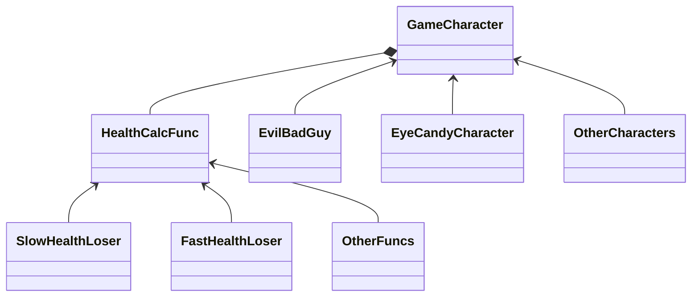
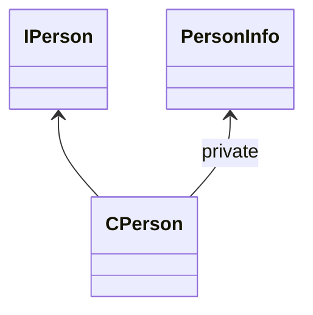
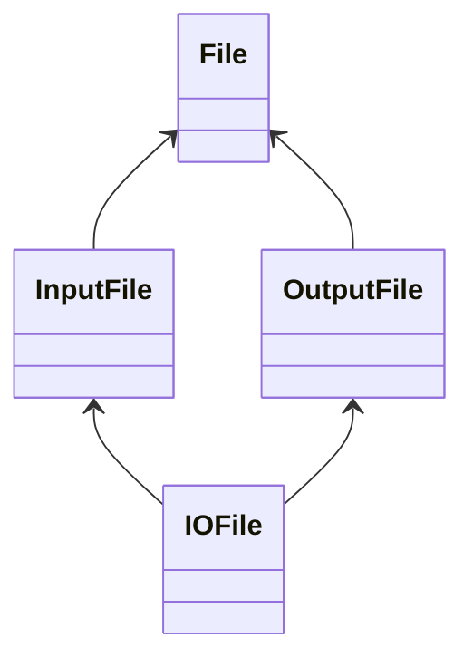
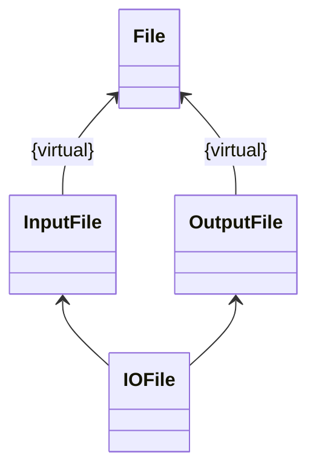

# 6 | 继承与面型对象设计

Inheritance and Object-Oriented Design

<!-- @import "[TOC]" {cmd="toc" depthFrom=3 depthTo=6 orderedList=false} -->

<!-- code_chunk_output -->

- [32 | 确定你的 public 继承塑模出 is-a 关系](#32-确定你的-public-继承塑模出-is-a-关系)
- [33 | 避免遮掩继承而来的名称](#33-避免遮掩继承而来的名称)
  - [子类的名称会遮掩基类的名称](#子类的名称会遮掩基类的名称)
  - [使用 using 声明或者转交函数 forwarding functions 可以让名称取消遮掩](#使用-using-声明或者转交函数-forwarding-functions-可以让名称取消遮掩)
- [34 | 区分接口继承和实现继承](#34-区分接口继承和实现继承)
- [35 | 考虑 virtual 函数以外的其他选择](#35-考虑-virtual-函数以外的其他选择)
  - [基类中最常规的 virtual 方法](#基类中最常规的-virtual-方法)
  - [非虚接口实现 Template Method 模式](#非虚接口实现-template-method-模式)
  - [由 Function Pointers 实现 Strategy 模式](#由-function-pointers-实现-strategy-模式)
  - [由 tr1::function 完成 Strategy 模式](#由-tr1function-完成-strategy-模式)
  - [古典的 Strategy 模式](#古典的-strategy-模式)
- [36 | 绝不重新定义继承而来的 non-virtual 函数](#36-绝不重新定义继承而来的-non-virtual-函数)
  - [non-virtual 函数带来静态绑定 statically bound](#non-virtual-函数带来静态绑定-statically-bound)
- [37 | 绝不重新定义继承而来的缺省参数值](#37-绝不重新定义继承而来的缺省参数值)
  - [虽然 virtual 函数是动态绑定 dynamically bound ，但是参数值却是静态绑定](#虽然-virtual-函数是动态绑定-dynamically-bound-但是参数值却是静态绑定)
- [38 | 通过复合塑模出 has-a 或“根据某物实现出”](#38-通过复合塑模出-has-a-或根据某物实现出)
- [39 | 明智而审慎地使用 private 继承](#39-明智而审慎地使用-private-继承)
  - [为什么宁用符合也不用 private 继承](#为什么宁用符合也不用-private-继承)
  - [什么时候用 private ？ EBO empty base optimization](#什么时候用-private-ebo-empty-base-optimization)
- [40 | 明智而审慎地使用多重继承](#40-明智而审慎地使用多重继承)
  - [多重继承可能导致歧义](#多重继承可能导致歧义)
  - [virtual 继承](#virtual-继承)

<!-- /code_chunk_output -->

### 32 | 确定你的 public 继承塑模出 is-a 关系

Make sure public inheritance models "is-a."

"public 继承"意味 is-a 。适用于 base classes 身上的每一件事情也适用于 derived classes 身上，因为每一个 derived class 对象也都是一个 base class 对象。

### 33 | 避免遮掩继承而来的名称

Avoid hiding inherited names.

#### 子类的名称会遮掩基类的名称

```cpp
class Base {
private:
    int x;
public:
    virtual void mf1() = 0;
    virtual void mf1(int);
    virtual void mf2();
    void mf3();
    void mf3(double);
    ...
};
class Derived: public Base {
public:
    virtual void mf1();
    void mf3();
    void mf4();
    ...
};

Derived d;
int x;
...
d.mf1();  // 没问题，调用 Derived::mf1
d.mf1(x); // 错误，因为 Derived::mf1 遮掩了 Base::mf1
d.mf2();  // 没问题 调用 Base::mf2
d.mf3();  // 没问题 调用 Derived::mf3
d.mf3(x); // 错误， Derived::mf3 遮掩了 Base::mf3
```

#### 使用 using 声明或者转交函数 forwarding functions 可以让名称取消遮掩

使用 using 如下。

```cpp
class Base {
private:
    int x;
public:
    virtual void mf1() = 0;
    virtual void mf1(int);
    virtual void mf2();
    void mf3();
    void mf3(double);
    ...
};
class Derived: public Base {
public:
    using Base::mf1;  // 让 Base 内的东西在 Derived 作用域可见
    using Base::mf3;
    virtual void mf1();
    void mf3();
    void mf4();
    ...
};
```

假设 Derived 以 private 形式继承 Base ，而 Derived 唯一想继承的 mf1 是那个无参数版本。 using 声明式在这里排不上用场，因为 using 声明式会令继承而来的某给定名称之所有同名函数在 derived class 中都可见。

此时使用转交函数 forwarding function ：

```cpp
class Base {
public:
    virtual void mf1() = 0;
    virtual void mf1(int);
    ...
};
class Derived: private Base {
public:
    virtual void mf1()
    { Base::mf1(); }  // 转交函数暗自成为 inline
}

// 可以调用 d.mf1() ，调用 d.mf1() 是错误的
```

### 34 | 区分接口继承和实现继承

Differentiate between inheritance of interface and inheritance of implementation.

可以用 protected 实现接口的提供和缺省的实现：

```cpp
class Airplane {
public:
  virtual void fly(const Airport& destination) = 0;
  ...
protected:
  void defaultFly(const Airport& destination);
};
void Airplane::defaultFly(const Airport& destination)
{
  // default code for flying an airplane to the given destination
}
class ModelA: public Airplane {
public:
  virtual void fly(const Airport& destination)
  { defaultFly(destination); }
  ...
};
class ModelB: public Airplane {
public:
  virtual void fly(const Airport& destination)
  { // ModelX's special implementation }
  ...
};
```

纯虚函数也是可以定义的，体现如下。

```cpp
class Airplane {
public:
  virtual void fly(const Airport& destination) = 0;
  ...
};
void Airplane::fly(const Airport& destination)
{
  // default code for flying an airplane to the given destination
}
class ModelA: public Airplane {
public:
  virtual void fly(const Airport& destination)
  { Airplane::fly(destination); }
  ...
};
class ModelB: public Airplane {
public:
  virtual void fly(const Airport& destination)
  { // ModelX's special implementation }
  ...
};
```

上述两个设计是差不多的，后者中声明表现的是接口，定义部分表现出缺省行为。但是合并了 fly 和 defaultFly 丧失了“让两个函数享有不同保护级别”的机会。

### 35 | 考虑 virtual 函数以外的其他选择

Consider alternatives to virtual functions.

#### 基类中最常规的 virtual 方法

```cpp
class GameCharacter {
public:
    virtual int healthValue() const;
};
```

如上，我们将制作一个游戏。其中要求游戏角色可以返回血量，这里：
- 声明为 virtual 是因为不同人物可能返回不同健康指数
- 并未声明为 pure virtual 是暗示将会有个计算健康指数的缺省算法

#### 非虚接口实现 Template Method 模式

```cpp
class GameCharacter {
public:
    int healthValue() const  // 子类并不需要重新定义 healthValue
    {
        ...
        int retVal = doHealthValue();
        ...
        return retVal;
    }
private:
    virtual int doHealthValue() const  // 可以被子类重新定义
    {
        ...
    }
};
```


如上设计，就是“令客户通过 public non-virtual 成员函数间接调用 private virtual 函数”，称为 non-virtual interface （NVI）手法。这是 Template Method 设计模式的一个独特表现形式。

这里这个 healthValue 可以成为 virtual 函数的 wrapper 。

NVI 的优点是什么呢？ wrapper 里可以做很多事，比如 locking a mutex 、 log entry 等。

#### 由 Function Pointers 实现 Strategy 模式

```cpp
class GameCharacter;  // 前置声明（ forward declaration ）
int defaultHealthCalc(const GameCharacter& gc);  // 缺省算法
class GameCharacter {
public:
    typedef int (*HealthCalcFunc)(const GameCharacter&);
    explicit GameCharacter(HealthCalcFunc hcf = defaultHealthCalc)
        : healthFunc(hcf) { }
    int healthValue() const
    {
        return healthFunc(*this);
    }
private:
    HealthCalcFunc healthFunc;
};
```

这能提供更多弹性。

用户可以使用如下：

```cpp
class EvilBadGuy: public GameCharacter {
public:
    explicit EvilBadGuy(HealthCalcFunc hcf = defaultHealthCalc)
        : GameCharacter(hcf) { }
}

int loseHealthQuickly(const GameCharacter&);  // 健康指数计算函数 1
int loseHealthSlowly(const GameCharacter&);  // 健康指数计算函数 1

EvilBadGuy ebg1(loseHealthQuickly);
EvilBadGuy ebg2(loseHealthSlowly);
```

#### 由 tr1::function 完成 Strategy 模式

```cpp
class GameCharacter;  // 前置声明（ forward declaration ）
int defaultHealthCalc(const GameCharacter& gc);  // 缺省算法
class GameCharacter {
public:
    typedef std::function<int (const GameCharacter&)> HealthCalcFunc;
    explicit GameCharacter(HealthCalcFunc hcf = defaultHealthCalc)
        : healthFunc(hcf) { }
    int healthValue() const
    {
        return healthFunc(*this);
    }
private:
    HealthCalcFunc healthFunc;
};
```

这将带来惊人的弹性， HealthCalcFunc 的对象将是任何可调用物（ call entity ）。

```cpp
short calcHealth(const GameCharacter&);  // 注意是 non-int

struct HealthCalculator {
    int operator() (const GameCharacter&) const { ... }
};

class GameLevel {
public:
    float health(const GameCharacter&) const;  // 注意返回 float
    ...
};

class EvilBadGuy: public GameCharacter {
    ...
};

class EyeCandyCharacter: public GameCharacter {
    ...
};

EvilBadGuy ebg1(calcHealth);
EyeCandyCharacter ecc1(HealthCalculator());
GameLevel currentLevel;
EvilBadGuy ebg2(
    std::tr1::bind(&GameLevel::health, currentLevel, _1);
);
```

#### 古典的 Strategy 模式



```cpp
class GameCharacter;  // forward declaration
class HealthCalcFunc {
public:
    ...
    virtual int calc(const GameCharacter& gc) const
    { ... }
    ...
};

HealthCalcFunc defaultHealthCalc;
class GameCharacter {
public:
    explicit GameCharacter(HealthCalcFunc* phcf = &defaultHealthCalc)
        : pHealthCalc(phcf) { }
    int healthValue() const
    { return pHealthCalc->calc(*this); }
private:
    HealthCalcFunc* pHealthCalc;
};
```

### 36 | 绝不重新定义继承而来的 non-virtual 函数

Never redefine an inherited non-virtual function.

#### non-virtual 函数带来静态绑定 statically bound

```cpp
class B {
public:
    void mf();  // 非虚函数
};
class D: public B {
public:
    void mf();  // 危险的行为！
};
D x;
B* pB = &x;
D* pD = &x;
pB->mf();  // 调用 B::mf
pD->mf();  // 调用 D::mf
```

如上，问题是， pB 和 pD 都是指向的 D 对象，怎么会 pB 调用 B 的 mf 呢？

**这是因为， non-virtual 函数如 B::mf 和 D::mf 都是静态绑定 statically bound 。** 具体来讲， pB 被声明为一个 pointer-to-B ，因此调用的 non-virtual 函数永远是 B 所定义的版本。

还要注意 public 继承代表 is-a 关系，如果你在子类里修改 non-virtual 函数，则打破了 is-a 关系，这在设计上出现了矛盾。

### 37 | 绝不重新定义继承而来的缺省参数值

Never redefine a function's inherited default parameter value.

#### 虽然 virtual 函数是动态绑定 dynamically bound ，但是参数值却是静态绑定

**虽然 virtual 函数是动态绑定 dynamically bound ，但是参数值却是静态绑定
。**

```cpp
class Shape {
public:
  enum ShapeColor { Red, Green, Blue };
  virtual void draw(ShapeColor color = Red) const = 0;
  ...
};
class Rectangle: public Shape {
public:
  virtual void draw(ShapeColor color = Green) const;
  ...
};
class Circle: public Shape {
public:
  virtual void draw(ShapeColor color) const;
  ...
};

Shape *pc = new Circle;
Shape *pr = new Rectangle;
pc->draw(); // calls Circle::draw(Shape::Red)
pr->draw(); // calls Rectangle::draw(Shape::Red)!
```

如上， pr 并没有如我们愿调用 pr 的默认 Green 参数。

那么什么才是一个好实现呢？

```cpp
class Shape {
public:
  enum ShapeColor { Red, Green, Blue };
  void draw(ShapeColor color = Red) const
  {
    doDraw(color);
  }
  ...
private:
  virtual void doDraw(ShapeColor color) const = 0;
};
class Rectangle: public Shape {
public:
  ...
private:
  virtual void doDraw(ShapeColor color) const;
  ...
};
```

如上，讲虚函数与缺省参数解耦。

### 38 | 通过复合塑模出 has-a 或“根据某物实现出”

Model "has-a" or "is-implemented-in-terms-of" though composition.

比如我们可以用 list 去实现一个 Set ，但是 list 有些属性又不被 Set 在设计上所接受，因此这里用的是复合的关系。

```cpp
template<class T>
class Set {
public:
  bool member(const T& item) const;
  void insert(const T& item);
  void remove(const T& item);
  std::size_t size() const;
private:
  std::list<T> rep;
};
```

### 39 | 明智而审慎地使用 private 继承

Use private inheritance judiciously.

Private 继承意味着 is-implemented-in-terms-of （根据某物实现出）。它通常比（ composition ）的级别低。但是当 derived class 需要访问 protected base class 的成员，或需要重新定义继承而来的 virtual 函数时，这么设计是合理的。

和符合（ composition ）不同， private 继承可以造成 empty base 最优化。这对致力于“对象尺寸最小化”的程序库开发者，可能很重要。

#### 为什么宁用符合也不用 private 继承

现在希望，有个 Timer 给 Widget 及其子类内部调用。

```cpp
// private 继承
class Timer {
public:
   ...
   virtual void onTick() const;
   ...
};
class Widget: private Timer {
private:
  ...
  virtual void onTick() const; // implement widget specific ticking logic
  ...
};
```

我们可以用复合取代上述方法：

```cpp
class Widget {
  ...
private:
  class WidgetTimer: public Timer {
    public:
      virtual void onTick() const;
      ...
    };
  WidgetTimer timer;
  ...
};
```

如上设计比 private 有两个好处：
- Widget 的子类将被禁止修改 onTick 方法，原因很简单，因为 onTick 不是 Widget 的，而是 Timer 的
- Widget 的编译依存性将被降低

#### 什么时候用 private ？ EBO empty base optimization

```cpp
class Empty { };
class HoldsAnInt {
private:
  int x;
  Empty e;
};
```

如上， sizeof(HoldsAnInt) 会大于 sizeof(int) 。我们如下修改：

```cpp
class HoldsAnInt: private Empty {
private:
  int x;
};
```

可以确定 sizeof(HoldsAnInt) == sizeof(int) ，这就是所谓的 EBO （ empty base optimization )。

当面对“并不存在 is-a 关系”的两个 classes ，其中一个需要访问另一个的 protected 成员，或需要重新定义其一或多个 virtual 函数， private 继承极有可能成为正统设计策略。

### 40 | 明智而审慎地使用多重继承

Use multiple inheritance judiciously.

多重继承可以体现在接口与实现方面。



```cpp
class CPerson:
  public IPerson,  // 接口
  private PersonInfo  // 实现
{ ... };

```

#### 多重继承可能导致歧义

```cpp
class B {
public:
  void a();
};
class E {
private:
  bool a() const;
};
class M:
  public B,
  public E
{ ... };
M m;
m.a();  // 歧义！不知道是那个 a
```

如果不歧义？

```cpp
m.B::a();
```

#### virtual 继承



```cpp
class File { ... };
class InputFile: public File { ... };
class OutputFile: public File { ... };
class IOFile: public InputFile,
              public OutputFile
{ ... };
```

如上， File 中的数据将被在 IOFile 中复制两次。

解决方法就是使用 virtual 继承，如下。



```cpp
class File { ... };
class InputFile: virtual public File { ... };
class OutputFile: virtual public File { ... };
class IOFile: public InputFile,
              public OutputFile
{ ... };
```

按理说，任何 public 都应该是 virtual public 继承，但是你能要在速度上付出代价。

