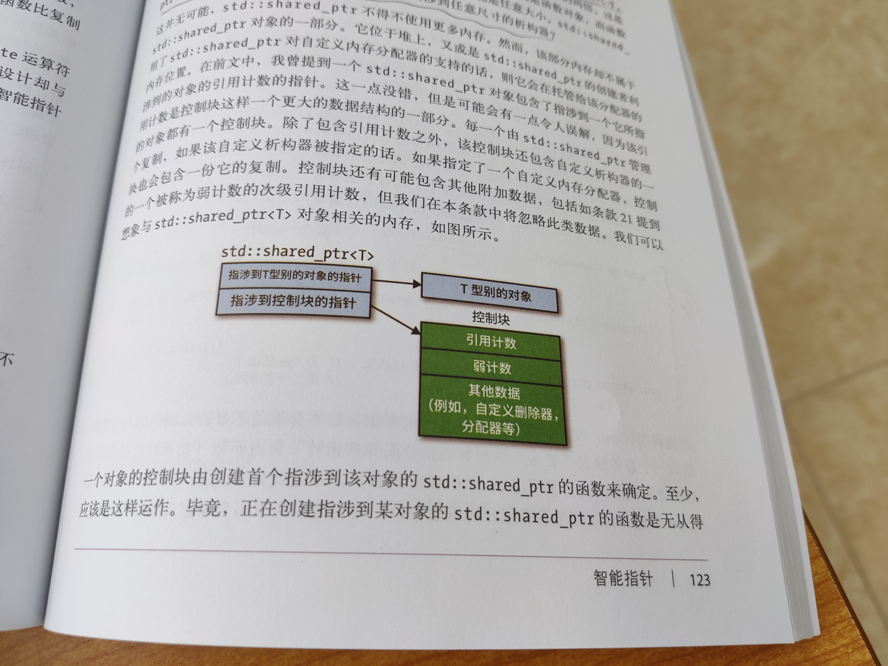

# 4 | 智能指针

<!-- @import "[TOC]" {cmd="toc" depthFrom=3 depthTo=6 orderedList=false} -->

<!-- code_chunk_output -->

- [18 | 使用 std::unique_ptr 管理具备专属所有权的资源](#18-使用-stdunique_ptr-管理具备专属所有权的资源)
  - [只移型别 unique_ptr 应用：工厂函数返回型别](#只移型别-unique_ptr-应用工厂函数返回型别)
  - [析构型别是 unique_ptr 型别的一部分，影响 unique_ptr 尺寸](#析构型别是-unique_ptr-型别的一部分影响-unique_ptr-尺寸)
  - [std::unique_ptr 数组不常用；可隐式转为 std::shared_ptr](#stdunique_ptr-数组不常用可隐式转为-stdshared_ptr)
- [19 | 使用 std::shared_ptr 管理具备共享所有权的资源](#19-使用-stdshared_ptr-管理具备共享所有权的资源)
  - [std::shared_ptr 结构（与 std::unique_ptr 不同，析构器不是型别一部分）](#stdshared_ptr-结构与-stdunique_ptr-不同析构器不是型别一部分)
  - [std::shared_ptr 控制块的讨论](#stdshared_ptr-控制块的讨论)
  - [enable_shared_from_this 和奇妙递归模板模式 The Curiously Recurring Template Pattern, CRTP](#enable_shared_from_this-和奇妙递归模板模式-the-curiously-recurring-template-pattern-crtp)
- [20 | 对于类似 std::shared_ptr 但有可能空悬的指针使用 std::weak_ptr](#20-对于类似-stdshared_ptr-但有可能空悬的指针使用-stdweak_ptr)
  - [API 如 expired() 和 lock() 等](#api-如-expired-和-lock-等)
  - [std::weak_ptr 用例与观察者设计模式 Observer design pattern](#stdweak_ptr-用例与观察者设计模式-observer-design-pattern)
- [21 | 优先选用 std::make_unique 和 std::make_shared ，而非直接使用 new](#21-优先选用-stdmake_unique-和-stdmake_shared-而非直接使用-new)
  - [make 系列好处：异常安全性，速度更快（动态分配内存次数少)](#make-系列好处异常安全性速度更快动态分配内存次数少)
  - [不能使用 make 系列的情形（使用其的劣势）](#不能使用-make-系列的情形使用其的劣势)
- [22 | 使用 Pimpl 习惯用法时，将特殊成员函数的定义放到实现文件中](#22-使用-pimpl-习惯用法时将特殊成员函数的定义放到实现文件中)
  - [非完整型别与 pImpl 的样例](#非完整型别与-pimpl-的样例)
  - [unique_ptr 实现 pImpl 挑战](#unique_ptr-实现-pimpl-挑战)

<!-- /code_chunk_output -->

没什么正规方式能检测出指针是否空悬（ dangle ），这也是其他书中提到的 C++ 原生指针的一种顽疾。

### 18 | 使用 std::unique_ptr 管理具备专属所有权的资源

#### 只移型别 unique_ptr 应用：工厂函数返回型别

常见用法是在对象继承谱系中作为工厂函数的返回型别。

在这种设计模式中，调用者需要对工厂函数返回的资源负责（即，对该资源拥有专属所有权），而这与 `std::unique_ptr` 完美匹配。

现在的对象继承关系如下。

```cpp
class Investment { ... };

class Stock:
    public Investment { ... };

class Bond:
    public Investment { ... };

class RealEstate:
    public Investment { ... };

// 工厂函数定义如下
template<typename... Ts>
std::unique_ptr<Investment>
makeInvestment(Ts&&... params);

// 单个作用域内使用如下
{
    auto pInvestment = 
        makeInvestment(arguments);
}   // PInvestment 在此析构
```

#### 析构型别是 unique_ptr 型别的一部分，影响 unique_ptr 尺寸

如果我们需要自定义析构函数，如下做。

```cpp
auto delInvmt = [](Investment* pInvestment) {
    makeLogEntry(pInvestment);
    delete pInvestment;
};

template<typename... Ts>
std::unique_ptr<Investment, decltype(delInvmt)>
makeInvestment(Ts&&... params)  // C++ 14 可以直接写作 auto 返回类型
{
    std::unique_ptr<Investment, decltype(delInvmt)>
        pInv(nullptr, delInvmt);
    if ( /* 应创建一个 Stock 型别的对象 */ )
        pInv.reset(new Stock(std::forward<Ts>(params)...));
    else if ( /* 应创建一个 Bond 型别的对象 */ )
        pInv.reset(new Bond(std::forward<Ts>(params)...));
    else if ( /* 应创建一个 RealEstate 型别的对象 */ )
        pInv.reset(new RealEstate(std::forward<Ts>(params)...));
    else
        throw std::runtime_error("Unknown investment type");
    return pInv;
}
```

注意到上面用到了 `reset` ，这是因为， `pInv = new Investment()` （将裸指针赋给 `unique` 对象）会导致裸指针到智能指针的隐式类型转换，这是被 C++ 编译器禁止的行为。这就是为什么用 `reset` 。

接下来讨论一点析构器的内容。

上面的样例中，不管继承类是什么，自定义的析构器必须接受一个型别为 `Investment*` 的形参，因此基类必须有一个虚析构函数。

```cpp
class Investment {
public:
    virtual ~Investment();  // 必备的设计组件
};
```

**在使用默认析构器（`delete`运算符）前提下，可以合理地认为 `std::unique_ptr` 和裸指针尺寸相同。** 但是，如果析构器是函数指针，尺寸会增加一到两个字长。若析构器是函数对象，则带来的尺寸变化取决于该函数对象中存储了多少状态。无状态的函数对象（如无捕获的 lambda 表达式）不会浪费任何存储尺寸。

> 为什么函数指针会导致 `std::unique_ptr` 尺寸的增加？为什么无状态函数对象反而不会？我这里推测一下：因为析构函数的型别是 `std::unique_ptr` 型别（模板）的一部分，如果不是一个指针、不是一个有状态的函数，则会编译出来一个专用的 `std::unique_ptr` 类，其对象就是这个类的一个对象罢了，且这个对象中只有其代理的指针的信息，无需包含别的内容，因为其析构器都是类的静态信息，无需保存在对象中。而如果是有状态的或者指针对象，则 `std::unique_ptr` 对象还会包含一个指向析构器的指针，或者一些保存状态的变量，这些信息都会被保存在对象中，因此 `std::unique_ptr` 对象的尺寸会增加。

也正因如此，使用无捕获的 lambda 表达式自定义析构器是一个好的选择。

```cpp
auto delInvmt1 = [](Investment* pInvestment)  // [] 无捕获
{
    makeLogEntry(pInvestment);
    delete pInvestment;
};
template<typename... Ts>
std::unique_ptr<Investment, decltype(delInvmt1)>
makeInvestment(Ts&&... args);  // 返回值尺寸与 Investment* 相同

void delInvmt2(Investment* pInvestment)  // 函数
{
    makeLogEntry(pInvestment);
    delete pInvestment;
}
template<typename... Ts>
std::unique_ptr<Investment, void(*)(Investment*)>  // 函数指针
makeInvestment(Ts&&... args);  // 返回值尺寸与 Investment* 尺寸至少加上函数指针尺寸
```

#### std::unique_ptr 数组不常用；可隐式转为 std::shared_ptr

```cpp
std::unique_ptr<T>
std::unique_ptr<T[]>

// 实际上传入数组并不常用
// 因为 std::array std::vector std::string 显然是更好的选择
// 使用 std::unique_ptr 数组的场景几乎只有一个：提供 C 风格 API
```

此外， `std::unique_ptr` 可以转为 `std::shared_ptr` ，可以这样写：

```cpp
std::shared_ptr<Investment> sp = makeInvestment(arguments);
```

### 19 | 使用 std::shared_ptr 管理具备共享所有权的资源

#### std::shared_ptr 结构（与 std::unique_ptr 不同，析构器不是型别一部分）

`std::shared_ptr` 大小是裸指针两倍。



注意以下对比。

```cpp
auto loggingDel = [](Widget *pw)
{
    makeLogEntry(pw);
    delete pw;
};

std::unique_ptr<Widget, decltype(loggingDel)>
    upw(new Widget, loggingDel);
std::shared_ptr<Widget>  // 不用放入析构器型别
    spw(upw.release(), loggingDel);
```

不用放型别了，可能导致智能指针对象尺寸变大了，但是更加灵活了。比如你可以让不同析构器的智能指针一个型别（这个 `std::unique_prt` 做不到）。

```cpp
auto customDeleter1 = [](Widget *pw) { ... };
auto customDeleter2 = [](Widget *pw) { ... };

std::shared_ptr<Widget> spw1(new Widget, customDeleter1);
std::shared_ptr<Widget> spw2(new Widget, customDeleter2);
std::vector<std::shared_ptr<Widget>> vspw{ spw1, spw2 };
```

#### std::shared_ptr 控制块的讨论

以下三种情况创建控制块：
- `std::make_shared`
- 从 `std::unique_ptr` 和 `std::auto_ptr` 这些具备专属所有权的指针创建 `std::shared_ptr` 会创建控制块
- 当 `std::shared_ptr` 构造函数使用裸指针作为实参来调用

以下的情况很危险。

```cpp
auto pw = new Widget;
std::shared_ptr<Widget> spw1(pw, loggingDel);  // 为 *pw 创建了第一个控制块
std::shared_ptr<Widget> spw2(pw, loggingDel);  // 为 *pw 创建了第二个控制块
```

上述情况可能导致 `*pw` 被析构两次！第二次析构将导致未定义行为。

那该怎么做呢？

```cpp
std::shared_ptr<Widget> spw1(new Widget, loggingDel);
std::shared_ptr<Widget> spw2(spw1);  // 与 spw1 是同一个控制块
```

#### enable_shared_from_this 和奇妙递归模板模式 The Curiously Recurring Template Pattern, CRTP

考虑下列情况：

```cpp
std::vector<std::shared_ptr<Widget>> processedWidgets;

class Widget {
public:
    ...
    void process();
    ...
};
void Widget::process()
{
    ...
    processedWidgets.emplace_back(this);  // 错误！不应把裸指针传入智能指针容器！
}
```

正确的做法应该如下。

```cpp
class Widget: public std::enable_shared_from_this<Widget> {
public:
    ...
    void process();
    ...
};
void Widget::process()
{
    ...
    processedWidgets.emplace_back(shared_from_this());
}
```

最后说一点，就是 `shared_ptr` 不能处理数组。

### 20 | 对于类似 std::shared_ptr 但有可能空悬的指针使用 std::weak_ptr

#### API 如 expired() 和 lock() 等

```cpp
auto spw = std::make_shared<Widget>();

std::weak_ptr<Widget> wpw(spw);  // 引用计数保持 1

spw = nullptr;  // 引用计数变为 0 ，对象析构 wpw 空悬
```

可以用 `expired()` 来检查空悬。

```cpp
if (wpw.expired()) {
    // 这里 wpw 不再指涉任何对象
}
```

但注意，上面的 `expired()` 检查并不是线程安全的检测方法，线程安全的检测方法有二，如下。

```cpp
std::shared_ptr<Widget> spw1 = wpw.lock();  // 若 wpw 失效，则 spw1 为空
std::shared_ptr<Widget> spw2(wpw);  // 若 wpw 失效，则抛出 std::bad_weak_ptr 异常
```

#### std::weak_ptr 用例与观察者设计模式 Observer design pattern

```cpp
std::unique_ptr<const Widget> loadWidget(Widget id);

std::shared_ptr<Widget> fastLoadWidget(Widget id)
{
    // 注意是 weak_ptr
    static std::unoredered_map<WidgetID, std::weak_ptr<Widget>> cache;
    auto obj = cache[id].lock();  // objPtr 是 shared_ptr
    if (!objPtr) {                // 如果对象不在缓存中，则加载并换存之
        objPtr = loadWidget(id);
        cache[id] = objPtr;
    }
    return objPtr;
}
```

如上很棒地结合了 `std::weak_ptr` 和 `std::unoredered_map` 缓存，但是有个问题：缓存中失效的 `std::weak_ptr` 可能会不断积累。

观察者设计模式 Observer design pattern 可以加之考虑。书中对其进行了简单的介绍，我这里摘录一下（陈硕的《Linux 多线程服务》中更加详细地讨论了）。

该模式的主要组件是主题 subject （可以改变状态的对象）和观察者 observer （对象状态发生改变后通知的对象）。在多数实现中，每个主题包含了一个数据成员，该成员持有指涉其观察者的指针，这使得主题能够很容易地在其发生状态改变时发出通知。主题不会控制其观察者的生存期（即，不关心它们何时被析构），但需要确认的话当一个观察者被析构以后，主题不会去访问它。一种合理的设计就是让每个主题持有一个容器来放置指涉到其观察者的 `std::weak_ptr` ，以便主题在使用某个指针之前，能够先确定它是否空悬。

另外，如果出现 A 是 B 的基类， A 和 B 需要相互持有对方的指针，那么 A 持有 B 的 shared_ptr ， B 持有 A 的 shared_ptr 是一个主流设计，防止“死锁”，无法析构。

### 21 | 优先选用 std::make_unique 和 std::make_shared ，而非直接使用 new

C++ 14 中才有的 `std::make_unique` ，如果在 C++ 11 中，如下可以实现一个简易版的 `make_unique` 。

```cpp
// 这个简易实现不支持数组和自定义析构器
template <typename T, typename... Ts>
std::unique_ptr<T> make_unique(Ts&&... params)
{
    return std::unique_ptr<T>(new T(std::forward<Ts>(params)...));
}
```

#### make 系列好处：异常安全性，速度更快（动态分配内存次数少)

观察如下用例：

```cpp
processWidget(std::shared_ptr<Widget>(new Widget), computePriority());
```

我们期望的执行顺序是：
- `new Widget`
- `std::shared_ptr` 构造函数
- `computePriority()`

但是，编译器也有可能优化成如下执行顺序：
- `new Widget`
- `computePriority()`
- `std::shared_ptr` 构造函数

如果 `computePriority()` 发生异常，那么 `new Widget` 的空指针将被泄露。

因此，使用 `make_shared` 是一个好的选择。

```cpp
processWidget(std::make_shared<Widget>(), computePriority());
```

此外， `make_shared` 只会分配单块 single chunck 内存，既保存 Widget 对象又保存与其相关联的控制块。如果是 `std::shared_ptr<Widget>(new Widget)` ，则会引发两次内存分配。

#### 不能使用 make 系列的情形（使用其的劣势）

所有 make 系列函数都不允许使用自定义析构器。

上面提到，`make_shared` 只会分配单块 single chunck 内存，既保存 Widget 对象又保存与其相关联的控制块。这将导致， **托管对象与其关联的控制块也被析构时才会被释放，因为同一动态分配的内存同时包含了两者。**

而 `weak_ptr` 是含有弱引用计数的，因此对于一个同时控制着 `shared_ptr` 和 `weak_ptr` 的控制块来讲，除非 `weak_ptr` 的引用计数也为 0 ，否则其不会被析构。

因此，看如下样例。

```cpp
class ReallyBigType { ... };

auto pBigObj1 = std::make_shared<ReallyBigType>();
/**
 * 可能有别的 shared_ptr 和 weak_ptr 指向 pBigObj1
 * 在 shared_ptr 为 0 时， pBigObj1 中 ReallyBigType 对象不会析构
 * 因为 weak_ptr 中的弱引用计数不为 0 ，控制块无法析构
 */

std::shared_ptr<ReallyBigType> pBigObj2(new ReallyBigType);
/**
 * 可能有别的 shared_ptr 和 weak_ptr 指向 pBigObj2
 * 在 shared_ptr 为 0 时， pBigObj2 中 ReallyBigType 对象会析构
 */
```

最后，既然 `make` 系列无法自定义析构器，那该怎么办呢？

```cpp
void processWidget(std::shared_ptr<Widget> spw, int priority);
void cusDel(Widget *ptr);  // 析构器

// 如下写法将不能保证异常安全性（见上文）
processWidget(std::shared_ptr<Widget>(new Widget, cusDel), computePriority());

// 因此可以优化如下
std::shared_ptr<Widget> spw(new Widget, cusDel);
processWidget(spw, computePriority());

// 但是上面不是最优的，我们希望传入右值，而非左值
// std::shared_ptr<Widget>(new Widget, cusDel) 是右值，传入只需要一次移动
// spw 是左值，传入一个按值传递的形参需要调用一次赋值
// 因此如下写法最佳
processWidget(std::move(spw), computePriority());
```

### 22 | 使用 Pimpl 习惯用法时，将特殊成员函数的定义放到实现文件中

Effective C++ 中就讲过 Pimpl （pointer to implementation 指涉到实现的指针）了。

#### 非完整型别与 pImpl 的样例

如果你是如下定义的 widget.h 的，那使用 widget.h 的人将遇到麻烦。

```cpp
// widget.h
class Widget {
public:
    Widget();
private:
    std::string name;
    std::vector<double> data;
    Gadget g1, g2, g3;
};
```

如果你的用户想要使用 `Widget` ，那么他们单单 `#include "widget.h"` 无法通过编译，必须先 `#include <string>` 、 `#include <vector>` 、 `#include "gadget.h"` 。

很麻烦，因此我们可以用一个指针指涉一个非完整型别。

```cpp
// widget.h
class Widget {
public:
    Widget();
    ~Widget();
private:
    struct Impl;  // 非完整型别，定义在 .cpp 里
    Impl *pImpl;
};
// widget.cpp
#include "widget.h"
#include "gadget.h"
#include <string>
#include <vector>

struct Widget::Impl {
    std::string name;
    std::vector<double> data;
    Gadget g1, g2, g3;
};

Widget::Widget()
    : pImpl(new Impl)
{}

Widget::~Widget()
{ delete pImpl; }
```

**上面是 C++ 98 的标准做法。换做现代 C++ ？则结合智能指针我们不必手动析构指针。**

#### unique_ptr 实现 pImpl 挑战

```cpp
// widget.h
class Widget {
public:
    Widget();
private:
    struct Impl;  // 非完整型别，定义在 .cpp 里
    std::unique_ptr<Impl> pImpl;
};
// widget.cpp
#include "widget.h"
#include "gadget.h"
#include <string>
#include <vector>

struct Widget::Impl {
    std::string name;
    std::vector<double> data;
    Gadget g1, g2, g3;
};

Widget::Widget()
    : pImpl(std::make_unique<Impl>())
{}

// 用户使用
#include "widget.h"
Widget w;  // 用户将在这行得到报错
```

**注意，上述代码将不会通过编译！！** 原因如下：默认析构器在 `std::unique_ptr` 内部使用 `delete` 运算符针对裸指针实施析构。而 C++ 11 中，实施 `delete` 之前，会使用 `static_assert` 确保裸指针未指涉到完整型别。 **因此需要保证，生成析构 `std::unique<Widget::Impl>` 代码处， `Widget::Impl` 是个完整型别即可。** 如下代码。

```cpp
// widget.h
class Widget {
public:
    Widget();
    ~Widget();  // 仅声明
private:
    struct Impl;  // 非完整型别，定义在 .cpp 里
    std::unique_ptr<Impl> pImpl;
};
// widget.cpp
#include "widget.h"
#include "gadget.h"
#include <string>
#include <vector>

struct Widget::Impl {
    std::string name;
    std::vector<double> data;
    Gadget g1, g2, g3;
};

Widget::Widget()
    : pImpl(std::make_unique<Impl>())
{}

// 注意！一定要将 ~Widget 写在 struct Widget::Impl 定义后
Widget::~Widget()
{}

// 用户使用
#include "widget.h"
Widget w;  // 用户将在这行得到报错
```

上面将 `~Widget` 定义写在 `struct Widget::Impl` 定义后是因为 `~Widget` 负责生成析构 `unique_ptr` 代码，在这里编译器已经看过了 `struct Widget::Impl` 定义了，认为其是一个完整型别。

由于我们声明了析构函数，因此编译器不会自动帮我们实现移动构造函数等等，因此这里还需要根据需求自己做一些 `...=default` 等等，不再赘述。

最后，注意，如果使用 `shared_ptr` 则不存在上述一切问题，因为析构器型别不再是指针型别一部分，则不要求指涉的型别是完整型别。
