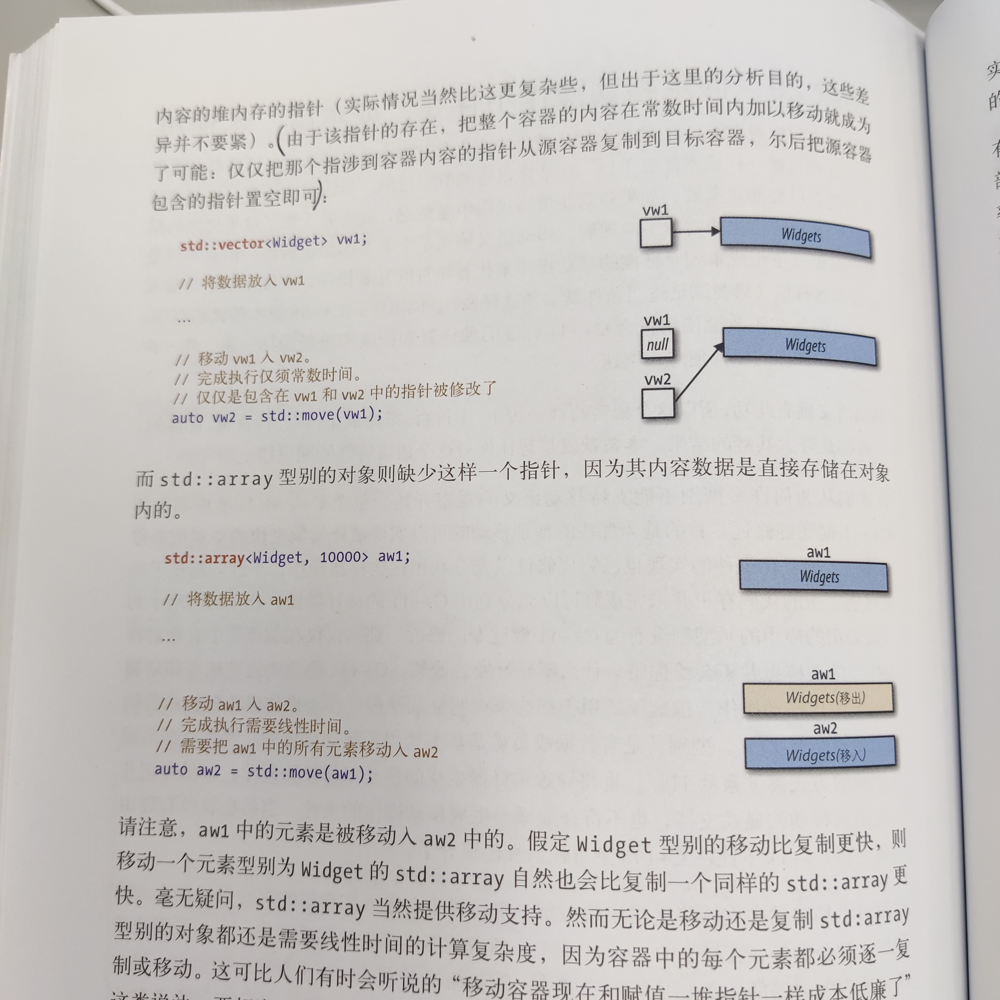

# 5 | 右值引用、移动语义和完美转发

<!-- @import "[TOC]" {cmd="toc" depthFrom=3 depthTo=6 orderedList=false} -->

<!-- code_chunk_output -->

- [23 | 理解 std::move 和 std::forward](#23-理解-stdmove-和-stdforward)
  - [move 基本原理与 move “失效”的场景（move 会保留 const 特性）](#move-基本原理与-move-失效的场景move-会保留-const-特性)
  - [forward 用处的概括](#forward-用处的概括)
- [24 | 区分万能引用和右值引用](#24-区分万能引用和右值引用)
  - [是万能引用（转发引用）的情形](#是万能引用转发引用的情形)
  - [是右值引用的情形](#是右值引用的情形)
  - [vector 中的案例与 auto&& 都是万能引用](#vector-中的案例与-auto-都是万能引用)
- [25 | 针对右值引用实施 std::move ，针对万能引用实施 std::forward](#25-针对右值引用实施-stdmove-针对万能引用实施-stdforward)
  - [针对右值引用实施 std::move](#针对右值引用实施-stdmove)
  - [针对万能引用实施 std::forward（为何不用 move）](#针对万能引用实施-stdforward为何不用-move)
  - [返回值优化 return value optimization, RVO](#返回值优化-return-value-optimization-rvo)
- [26 | 避免依万能引用型别进行重载](#26-避免依万能引用型别进行重载)
  - [万能引用与完美转发提高效率的例子](#万能引用与完美转发提高效率的例子)
  - [不要重载万能引用（万能引用匹配的贪婪性，优先匹配非模板函数）](#不要重载万能引用万能引用匹配的贪婪性优先匹配非模板函数)
- [27 | 熟悉依万能引用型别进行重载的替代方案](#27-熟悉依万能引用型别进行重载的替代方案)
  - [舍弃重载、传递 const T& 型别的形参或传值](#舍弃重载-传递-const-t-型别的形参或传值)
  - [标签分派（ std::is_ 系函数与 std::false_type ）](#标签分派-stdis_-系函数与-stdfalse_type)
  - [对接受万能引用的模板施加限制（ std::enable_if 、 std::decay 与 is_same 等）](#对接受万能引用的模板施加限制-stdenable_if-stddecay-与-is_same-等)
  - [使用 static_assert 以及 is_constructible 防止报错信息让我们摸不到头脑](#使用-static_assert-以及-is_constructible-防止报错信息让我们摸不到头脑)
- [28 | 理解引用折叠](#28-理解引用折叠)
  - [C++ 中引用的引用是非法的，但编译器中合法](#c-中引用的引用是非法的但编译器中合法)
  - [引用折叠以及 forward 原理](#引用折叠以及-forward-原理)
  - [引用折叠及其四种语境](#引用折叠及其四种语境)
- [29 | 假定移动操作不存在、成本高、未使用](#29-假定移动操作不存在-成本高-未使用)
  - [std::array 的移动需要线性时间（vector 基于指针则常数时间）， string 的小型字符串优化 small string optimization, SSO](#stdarray-的移动需要线性时间vector-基于指针则常数时间-string-的小型字符串优化-small-string-optimization-sso)
  - [移动语义不会带来好处的例子](#移动语义不会带来好处的例子)
- [30 | 熟悉完美转发的失败情形](#30-熟悉完美转发的失败情形)
  - [什么是完美转发（用一个例子概括）](#什么是完美转发用一个例子概括)
  - [大括号初始化物](#大括号初始化物)
  - [0 和 NULL 用作空指针](#0-和-null-用作空指针)
  - [仅有声明的整形 static const 成员变量](#仅有声明的整形-static-const-成员变量)
  - [重载的函数名字和模板名字](#重载的函数名字和模板名字)
  - [位域](#位域)

<!-- /code_chunk_output -->

请先记住，形参总是左值，即使其型别是右值引用。即，给定函数形如 `void f(Widget&& w)` 形参 `w` 是个左值。

### 23 | 理解 std::move 和 std::forward

要注意， **`std::move` 并不进行任何移动， `std::forward` 也不进行任何转发。二者在运行期都什么也不会做，只不过是一个强制型别转换的函数（其实是函数模板）。** `std::move` 无条件地将实参强制转换成右值，而 `std::forward` 则仅在某个特定条件满足时才执行同一个强制转换。

#### move 基本原理与 move “失效”的场景（move 会保留 const 特性）

下面算是标准但是简易的 `move` 实现。

```cpp
// C++ 11
template<typename T>  // 位于 std namespace 内
typename remove_reference<T>::type&&
move(T&& param)
{
    using ReturnType = typename remove_reference<T>::type&&;
    return static_cast<ReturnType>(param);
}

// C++ 14
template<typename T>  // 位于 std namespace 内
decltype(auto)
move(T&& param)
{
    using ReturnType = remove_reference_t<T>&&;
    return static_cast<ReturnType>(param);
}
```

如果 `T` 是个左值引用，那么 `T&&` 由于是个万能引用，因此 `T&&` 就成了左值引用。 `remove_reference` 就可以将引用型别取消。

虽然 `move` 强制转为右值（右值代表实施移动），但并不是一定能保证移动会产生而非复制。

```cpp
class Annotation {
public:
    explicit Annotation(const std::string& text)
    : text_(std::move(text)) {}
private:
    std::string text_;
};
```

注意，虽然在初始化时，把 `text` 转换为右值，但是 `text_` 并非是 `text` 的移动，而是 `text` 的复制。

为什么？注意观察 `std::string` 的构造函数如下。

```cpp
class string {
public:
    string(const string& rhs);  // 复制构造函数
    string(string&& rhs);       // 移动构造函数
}
```

注意，在我们的 `Annotation` 中， `text` 本身是个 `const` 引用，就算 `move` 后也是个 `const` 右值。编译器在考察 `string` 的构造函数时，无法调用移动构造函数，因为移动构造函数没有用于接收 `const` 的参数的。而指涉到的常量的左值引用允许绑定到一个常量右值型别的形参，因此最后会调用复制构造函数。

所以总结一下：
- 如果想取得对某个对象执行移动操作能力，则不要将其声明为常量
- `std::move` 不仅不实际移动任何东西，甚至不保证经过其强制型别转换后的对象具备可移动的能力

#### forward 用处的概括

```cpp
void process(const Widget& lvalArg);  // 处理左值
void process(Widget&& rvalArg);       // 处理右值

template<typename T>
void logAndProcess(T&& param)  // 万能引用，保存 param 各自性质
{
    auto now = std::chrono::system_clock::now();
    makeLogEntry("Calling 'process'", now);
    process(std::forward<T>(param));
}

Widget w;
logAndProcess(w);             // 调用时传入左值
logAndProcess(std::move(w));  // 调用时传入右值
```

注意，我们为什么要使用 `std::forward` ？如果直接把 `param` 传入 `process` ，那么 `process` 就会接收一个左值，而不是一个右值。 **因为所有函数形参皆为左值。** 而 `std::forward` 可以将 `T` 的性质完美地保留下来，传给 `process` 。其原理将在条款 28 讨论。

### 24 | 区分万能引用和右值引用

`T&&` 有两种不同含义：
- 右值引用，用于识别出可移对象
- 万能引用 universal reference ，也被称为转发引用 forwarding reference

#### 是万能引用（转发引用）的情形

参考第一章，一般而言，遇到形如 `T&&` ，有型别推导，为万能引用。

```cpp
template<typename T>
void f(T&& param);  // param 是万能引用

template<typename MyTemplateType>
void f(MyTemplateType&& param);  // param 是万能引用

auto&& var2 = var1;  // var2 是万能引用
```

#### 是右值引用的情形

如果是 `T&&` 却没有型别推导，那么是右值引用。

```cpp
void f(Widget&& param);  // param 是右值引用（不涉及型别推导）
```

注意，万能引用仅能是 `T&&` ，加了一个 `const` 或者部分已知的模板类型都是右值引用。

```cpp
template<typename T>
void f(std::vector<T>&& param);  // param 是右值引用

std::vector<int> v;
f(v);  // 报错，因为要求传入右值

template<typename T>
void f(const T&& param);  // param 是右值引用
```

#### vector 中的案例与 auto&& 都是万能引用

以下来自 C++ 标准。

```cpp
template<class T, class Allocator = allocator<T>>
class vector {
public:
    void push_back(T&& x);  // 注意！是右值引用
};
```

`push_back` 中的 `T` 实际上不需要型别推导，完全是跟着类的 `T` 模板编译走的。比如 `std::vector<Widget> v` 会导致模板具现化如下。

```cpp
class vector<Widget, allocator<Widget>> {
public:
    void push_back(Widget&& x);  // 右值引用
};
```

而 `emplace_back` 却是涉及了型别推导，是万能引用。

```cpp
template<class T, class Allocator = allocator<T>>
class vector {
public:
    template<class... Args>
    void emplace_back(Args&&... args);  // 注意！是万能引用
};
```

最后，在 C++ 14 中我们可以更好地万能引用（`auto&&`）。比如下面这个计算任意函数调用时长的函数。

```cpp
auto timeFuncInvocation = 
    [](auto&& func, auto&&... params)
    {
        // 计时器启动
        std::foward<decltype(func)>(func)(
            std::forward<decltype(params)>(params)...
            );
        // 计时器停止，记录花费时间
    }
```

### 25 | 针对右值引用实施 std::move ，针对万能引用实施 std::forward

#### 针对右值引用实施 std::move

针对右值引用实施 `std::move` 实际上是右值引用被发明的缘由。

```cpp
class Widget {
public:
    Widget(Widget&& rhs)
    : name(std::move(rhs.name)),
      p(std::move(rhs.p))
    {}
private:
    std::string name;
    std::shared_ptr<SomeDataStructure> p;
};
```

此外再看一个例子。

```cpp
// 按值返回
Matrix
operator+(Matrix&& lhs, const Matrix& rhs)
{
    lhs += rhs;
    return std::move(lhs);  // 将 lhs 移入返回值
}  // 如果直接 return lhs ，则会将左值 lhs 拷贝到返回值存储位置
```

#### 针对万能引用实施 std::forward（为何不用 move）

```cpp
template<typename T>
Fraction
reduceAndCopy(T&& f)
{
    frac.reduce();
    // 对于右值，是移入返回值
    // 对于左值，是复制入返回值
    return std::forward<T>(f);
}
```

如下是一个万能引用配上 `std::move` 的糟糕例子。

```cpp
class Widget {
public:
    template<typename T>
    void setName(T&& newName)
    { name = std::move(newName); }  // 很糟糕
private:
    std::string name;
    std::shared_ptr<SomeDataStructure> p;
};

std::string getWidgetName();  // 工厂函数

Widget w;
auto n = getWidgetName();  // n 是个局部变量
w.setName(n);  // n 移入了 w ！ n 的值将变得未知
```

好，那么不用万能引用，为常量左值和右值实现出不同的重载就可以用 move 了。

```cpp
class Widget {
public:
    void setName(const std::string& newName)
    { name = newName; }  // 从常量左值取得赋值
    void setName(std::string&& newName)
    { name = std::move(newName); }  // 从右值取得赋值
};
```

好，来看一个例子： `w.setName("Adela Novak");` 。如果没有万能转发，没有万能引用，那么会执行以下内容：一次 `std::string` 构造函数（以创建临时对象），一次 `std::string` 的移动赋值运算符（以移动 `newName` 到 `w.name` ），还有一次 `std::string` 的析构函数（以销毁临时对象）。

但是如果使用万能引用呢？ `void setName(T&& newName) { name = std::foward<T>(newName); }` 将会把字面值 `"Adela Novak"` 移入 `w.name` ，只会仅调用一次 `std::string` 赋值运算符，不会创建一个临时对象。

#### 返回值优化 return value optimization, RVO

```cpp
Widget makeWidget()
{
    Widget w;  // 局部变量
    return w;  // 不要写成 std::move(w) ！
}
```

明明是局部变量，为什么不需要写成 `std::move(w)` 呢？移动岂不是比复制对象效率更高？

实际上，标准化委员已经想到了， `makeWidget` 的“复制”版本可以通过直接在为函数返回值分配的内存上创建局部变量 `w` 来避免复制之，这就是“返回值优化” return value optimization, RVO 。 **这是 C++ 标准一问世就有的。**

RVO 要满足两个条件：
- 局部对象型别和函数返回值型别相同
- 返回的就是局部对象本身

因此在可以 RVO 时不要使用 `std::move` ，这反而可能限制了编译器的优化项。

### 26 | 避免依万能引用型别进行重载

#### 万能引用与完美转发提高效率的例子

如下是一个正确但是低效的实现。

```cpp
std::multiset<std::string> names;

void logAndAdd(const std::string& name)
{
    auto now = std::chrono::system_clock::now();
    log(now, "logAndAdd");
    names.emplace(name);
}

std::string petName("Darla");
logAndAdd(petName);  // 传递左值 std::string
logAndAdd(std::string("Persephone"));  // 传递右值 std::string
logAndAdd("Patty Dog");  // 传递字符串字面量
```

为什么说上面的实现是低效率的呢？
- 第一个调用中传入左值，将在 `emplace` 中复制一份进入集合
- 第二个调用中传入右值，但是 `name` 自身是个左值，因此本可以通过移动进入集合，但是最后还是复制进去了
- 第三个调用中传入字符字面量，按理说直接在 `emplace` 中构造就行，都不用移动，但是因为形参要求传入左值，所以甚至得构造一个临时变量

所以高效版本如下。

```cpp
templace<typename T>
void logAndAdd(T&& name)
{
    auto now = std::chrono::system_clock::now();
    log(now, "logAndAdd");
    names.emplace(std::forward<T>(name));
}
```

这样效率就达到极致了。

#### 不要重载万能引用（万能引用匹配的贪婪性，优先匹配非模板函数）

还是上面的例子，如果我们重载 `logAndAdd` 的 `int` 参数类型如下。

```cpp
std::string nameFromIdx(int idx);

void logAndAdd(int idx)
{
    auto now = std::chrono::system_clock::now();
    log(now, "logAndAdd");
    names.emplace(nameFromIdx(idx));
}

logAndAdd(22);  // 没问题

short nameIdx;
logAndAdd(nameIdx);  // 编译错误
```

如上，我们有两个函数 `void logAndAdd(T&& name)` 和 `void logAndAdd(int idx)` ，但是 `logAndAdd(int idx)` 只能匹配 `int` 参数，如果是 `short` 则会去匹配 `void logAndAdd(T&& name)` ，这就是万能引用的贪婪性。而 `names.emplace(int)` 会报错，因为没有接收 `int` 的 `string` 构造函数。

另外，对于常量性、编译器自己生产的特种函数也是同理。

```cpp
class Person {
public:
    template<typename T>
    explicit Person(T&& n)
    : name(std::forward<T>(n)) {}  // 完美转发构造函数

    explicit Person(int idx);

    Person(const Person& rhs);  // 编译器生成的复制构造函数
    Person(Person&& rhs);  // 编译器生成的移动构造函数
}

Person p("Nancy");
auto cloneOf(p);  // 注意，这里调用的是完美转发函数，编译无法通过！
```

注意， `auto cloneOf(p);` 中的 `p` 因为并没有 `const` ，所以调用的是 `explicit Person(T&& n)` ，而 `name` 无法把 `Person` 对象作为构造函数参数，因此编译报错。再详细一点，如果有 `auto cloneOf(p);` 这句话，将导致编译器生成如下代码。

```cpp
class Person {
public:
    explicit Person(Person& n)  // 完美转发生成的模板实例化代码
    : name(std::forward<Person&>(n)) {}

    explicit Person(int idx);

    Person(const Person& rhs);  // 编译器生成的复制构造函数
    Person(Person&& rhs);  // 编译器生成的移动构造函数
}
```

那么，把常量性加上变为 `const Person cp("Nancy");` 就，调用的就是复制构造函数了。

```cpp
// 编译器生成的代码如下
class Person {
public:
    explicit Person(const Person& n);  // 模板实例化的构造函数
    Person(const Person& rhs);  // 编译器生成的复制构造函数
}
```

最终， `auto cloneOf(cp);` 将调用复制构造函数，而非模板实例化的函数。这是因为 C++ 的重载决议规则： **一个模板实例化函数和一个非函数模板（一个“常规”函数），具备相等的匹配程度，则优先选用常规函数。**

### 27 | 熟悉依万能引用型别进行重载的替代方案

#### 舍弃重载、传递 const T& 型别的形参或传值

在之前的条款中我们讨论过传递 `const T&` 型别的形参，总之，与舍弃重载一样都是简单又粗暴的选择。

至于传值，可以和 `std::move` 一起使用，“当你知道肯定需要复制形参时，考虑按值传递对象”的具体细节我们放在条款 41 中讨论。

```cpp
class Person {
public:
    explicit Person(std::string n)  // 替换掉 T&&
    : name(std::move(n)) {}
    explicit Person(int idx)
    : name(nameFromIdx(idx)) {}
private:
    std::string name;
}
```

#### 标签分派（ std::is_ 系函数与 std::false_type ）

把具体调用哪个模板函数的逻辑同样还是放在编译器判断，只不过带上了类型判断的标签。

```cpp
std::multiset<std::string> names;

template<typename T>
void logAndAdd(T&& name)
{
    auto now = std::chrono::system_clock::now();
    log(now, "logAndAdd");
    names.emplace(std::forward<T>(name));
}
```

如上只能默认 `name` 可以被转换为 `string` 相关类型，如果传入 `int` 编译器则报错。

这里我们书写两层函数，其中内部的层 `logAndAddImpl` 作为函数的具体实现，并且根据外层调用的标签分派重载了两个版本。

```cpp
template<typename T>
void logAndAdd(T&& name)
{   // 外层函数调用内层的函数
    logAndAddImpl(
        std::forward<T>(name),
        std::is_integral<typename std::remove_reference<T>::type>()
    );
}

// logAndAddImpl 的非 int 版
template<typename T>
void logAndAddImpl(T&& name, std::false_type)
{
    auto now = std::chrono::system_clock::now();
    log(now, "logAndAdd");
    names.emplace(std::forward<T>(name));
}

// logAndAddImpl 的 int 版
std::string nameFromIdx(int idx);
void logAndAddImpl(int idx, std::true_type)
{
    logAndAdd(nameFromIdx(idx));  // 防止重复书写逻辑
}
```

注意 `std::true_type` 和 `std::false_type` 这些形参甚至没有名字，它们在运行期不起任何作用，我们希望编译器能够识别并优化掉。

#### 对接受万能引用的模板施加限制（ std::enable_if 、 std::decay 与 is_same 等）

这里有些模板编程的意味了，会在模板里添加一些条件判断。

这里有些用法比如 `std::enable_if` 作者并未讲述原理，而是推荐去查阅 `SFINAE` 等相关资料。我这里也不再纠结。

此外，这里再补充一下， `std::decay<T>::type` 的作用是，将 `T` 的引用和 cv 饰词（ `const` 和 `volatile` ）去除；此外它还可以把数组和函数型别强制转型成指针型别。

这里用到 `std::decay<T>::type` 的原因是， `std::is_same<Person, Person&>::value` 值是 `false` 。

```cpp
class Person {
public:
    templace<
        typename T,
        typename = typename std::enable_if<
            !std::is_same<Person,
                          typename std::decay<T>::type
                         >::value
                   >::type
    >
    explicit Person(T&& n);
    // 即，要求这里 T 不是 Person 相关的型别，而是别的，比如字符串
}
```

但是 `is_same` 在这里并不是很好用，看如下的例子。

```cpp
class SpecialPerson: public Person {
public:
    SpecialPerson(const SpecialPerson& rhs)
    : Person(rhs) {}  // 复制构造函数调用了基类的完美转发构造函数
    SpecialPerson(SpecialPerson&& rhs)
    : Person(std::move(rhs)) {}  // 移动构造函数调用了基类的完美转发构造函数
};
```

如上，注意，如果我们写子类时，使用的是基类的构造函数，就算编译器帮基类自动声明了 `Person(const Person& rhs)` 构造函数，这里也会优先调用完美转发函数，因为完美转发函数相比基类的构造函数更加精确地匹配了形参 `const SpecialPerson&` 。

为了防止 `const SpecialPerson&` 被基类的完美转发函数调用，我们使用 `std::is_base_of` 判断。

```cpp
// C++ 11
class Person {
public:
    templace<
        typename T,
        typename = typename std::enable_if<
            !std::is_base_of<Person,
                          typename std::decay<T>::type
                         >::value
                   >::type
    >
    explicit Person(T&& n);
}

// C++ 14
class Person {
public:
    templace<
        typename T,
        typename = std::enable_if_t<
            !std::is_base_of<Person,
                          std::decay_t<T>
                         >::value
                   >
    >
    explicit Person(T&& n);
}
```

甚至，我们可以在模板中加入“与”运算，如下。

```cpp
class Person {
public:
    templace<
        typename T,
        typename = std::enable_if_t<
            !std::is_base_of<Person, std::decay_t<T>>::value
            &&
            !std::is_integral<std::remove_reference_t<T>>::value
        >
    >
    explicit Person(T&& n)
    : name(std::forward<T>(n))
    {}  // 接受 std::string 型别以及可以强制转换到 std::string 的实参型别
}
```

#### 使用 static_assert 以及 is_constructible 防止报错信息让我们摸不到头脑

```cpp
class Person {
public:
    templace<
        typename T,
        typename = std::enable_if_t<
            !std::is_base_of<Person, std::decay_t<T>>::value
            &&
            !std::is_integral<std::remove_reference_t<T>>::value
        >
    >
    explicit Person(T&& n)
    : name(std::forward<T>(n))
    {
        static_assert(
            std::is_constructible<std::string, T>::value,
            "Parameter n can't be used to construct a std::string"
        );
    }
}
```

如上，由于系统可能很复杂，如果我们不进行这层判断，那么将一个型别强制转换为 `std::string` 就会报错，而由于层层调用关系，我们很可能摸不到头脑。

### 28 | 理解引用折叠

#### C++ 中引用的引用是非法的，但编译器中合法

```cpp
int x;
auto& & rx = x;  // 非法
```

但是对于编译器来说，如果产生了引用的引用，就是会造成引用折叠。

```cpp
template<typename T>
void func(T&& param);

func(w);  // 传入一个左值
```

实际上，上述代码将得到如下结果。

```cpp
// 将被推导为
void func(Widget& && param);
// 引用折叠（只要两者中含有一个 & （比如 & &, && &, && &））就折叠成 &
void func(Widget& param);
```

#### 引用折叠以及 forward 原理

有两种引用（左值和右值），所以就有四种可能的引用：引用组合（左值左值，左值右值，右值左值，右值右值）。如果引用的引用出现在允许的语境（例如，在模板实例化过程中），该双重引用会折叠成单个引用，规则如下：
- 如果任一引用为左值引用，则结果为左值引用。否则，结果为右值引用。

如下是一种简易版的 `forward` 实现。

```cpp
// C++ 11
template<typename T>
T&& forward(typename std::remove_reference<T>::type& param) {
    return static_cast<T&&>(param);
}

// C++ 14
template<typename T>
T&& forward(remove_reference_t<T>& param) {
    return static_cast<T&&>(param);
}
```

对于 `std::forward<Widget&>` ，将产生如下推导过程。

```cpp
// 推导为
Widget& && forward(typename std::remove_reference<Widget&>::type& param) {
    return static_cast<Widget& &&>(param);
}

// 简化为
Widget& forward(Widget& param) {
    return static_cast<Widget&>(param);
}
```

对于传入了一个右值的实参 `std::forward<Widget>` ，推导过程如下。

```cpp
// 推导为
Widget && forward(typename std::remove_reference<Widget>::type& param) {
    return static_cast<Widget &&>(param);
}

// 简化为
Widget&& forward(Widget& param) {
    return static_cast<Widget&&>(param);
}
```

#### 引用折叠及其四种语境

引用折叠会出现的四种语境：
- 模板实例化
- `auto` 变量的型别生成
- 生成和使用 `typedef` 和别名生成
- `decltype`

注意 `auto` 推导与模板推导本质上是一样的。

```cpp
auto&& w1 = w;  // w 是个左值
// 推导为
Widget& && w1 = w;
// 引用折叠为
Widget& w1 = w;
```

再看一个右值初始化的例子如下。

```cpp
auto&& w2 = widgetFactory();
// 推导为
Widget&& w2 = widgetFactory();
```

这里并无引用的引用，所以到此结束， `w2` 是右值引用。

万能引用并非一种新的引用型别，其实就是满足了下面两个条件的语境中的右值引用：
- 型别推导的过程会区别左值和右值。 `T` 型别的左值推到结果为 `T&` ，而 `T` 型别的右值推到结果为 `T&&` 。
- 会发生引用折叠。

在 `typedef` 中的引用折叠如下例。

```cpp
template<typename T>
class Widget {
public:
    typedef T&& RvalueRefToT;
};

Widget<int&> w;
// 将被推导为
typedef int& && RvalueRefToT;
// 引用折叠为
typedef int& RvalueRefToT;
```

### 29 | 假定移动操作不存在、成本高、未使用

#### std::array 的移动需要线性时间（vector 基于指针则常数时间）， string 的小型字符串优化 small string optimization, SSO



上图中， `vector` 的移动操作是常数时间的，而 `std::array` 的移动操作是线性时间的。

再来看一个例子，比如 `std::string` 常数时间移动和线性时间复制。 **但是因为小型字符串优化 small string optimization, SSO 的存在，移动未必比复制快。**

“小型”字符串（如长度不超过 15 个字符串），会存储在 `std::string` 对象内的某个缓冲区中，而不去使用在堆上分配的内存（消弭了动态分配内存的成本）。

#### 移动语义不会带来好处的例子

在以下几个场景中， C++ 11 移动语义不会带来好处：
- 没有移动操作：待移动的对象未能提供移动操作。因此，移动请求就变成了复制请求。
- 移动未能更快：待移动的对象虽然有移动操作，但并不比其复制操作更快
- 移动不可用：移动本可以发生的语境下，要求移动操作不可发射异常，但该操作未加上 `noexcept` 声明。

此外，还有一种场景：移动是个左值，也无法带来效率增益。

除了极少数例外（如条款 25 的例子），只有右值可以作为移动操作的源。

### 30 | 熟悉完美转发的失败情形

#### 什么是完美转发（用一个例子概括）

```cpp
template<typename T>
void fwd(T&& param)
{
    f(std::forward<T>(param));
}
// 多参数版本 fwd
template<typename... Ts>
void fwd(Ts&&... params)
{
    f(std::forward<Ts>(params)...);
}
```

如下，以某特定实参调用 `f` 会执行某操作，而用同一实参调用 `fwd` 会执行不同的操作，则称完美转发失败。

```cpp
f(expression);   // 如果本语句执行了某操作
fwd(expression); // 而这条语句执行了不同的操作，则 fwd 完美转发 expression 到 f 失败
```

#### 大括号初始化物

假设 `f` 声明如下。

```cpp
void f(const std::vector<int>& v);

f({1, 2, 3});  // 没问题

fwd({{1, 2, 3}}); // 编译失败
```

`fwd({1, 2, 3})` 中，未声明为 `std::initializer_list` 型别的函数模板形参传递了大括号初始化物，委员会称之为“非推导语境”。由于 `fwd` 的形参未声明为 `std::initializer_list` 型别，所以编译器被禁止在 `fwd` 的调用过程中从 `{1, 2, 3}` 出发来推导型别。

但是使用 `auto` 配合之则没问题。

```cpp
auto il = {1, 2, 3};  // il 被推导为 std::initializer_list<int>
fwd(il);  // 没问题
```

#### 0 和 NULL 用作空指针

不要用 0 和 NULL ，因为这样推导结果会是整形（一般情况下会是 `int`），而非所传递实参的指针型别。

#### 仅有声明的整形 static const 成员变量

有这么个普适规定： **不需要给出类中的整型 `static const` 成员变量的定义，仅需声明之。因为编译器会根据这些成员的值实施常数传播，从而就不必再为它们保留内存。**

```cpp
class Widget {
public:
    static const std::size_t MinVals = 28;  // 仅有声明
}

// Widget 的 .cpp 文件
// const std::size_t Widget::MinVals;  // 没有定义（内存上没有）

std::vector<int> widgetData;
widgetData.reserve(Widget::MinVals);  // 没问题
```

如上，相当于调用了 `widgetData.reserve(28)` 。

但是下例中，能够通过编译，却不能完成链接。

```cpp
void f(std::size_t val);
f(Widget::MinVals);  // 没问题，相当于 f(28)
fwd(Widget::MinVals); // 错误！无法通过链接
```

为什么会错误？因为 **引用不过是提领的指针罢了，本质上还是指针。** 因为是指针，没有定义（内存上没有相应的地址），就会导致无法使用指针。

#### 重载的函数名字和模板名字

```cpp
// f 可以声明如下（传入一个函数指针）
void f(int (*pf)(int));
// f 也可以用平凡的非指针语法来声明
void f(int pf(int));
```

上面两种都没问题。重点是如下的重载函数。

```cpp
int processVal(int value);
int processVal(int value, int priority);
```

注意， `processVal` 即非函数指针，连函数都不是，是两个不同函数的名字。

```cpp
f(processVal);  // 没问题
```

如上没问题，因为编译器可以直接推导。

```cpp
fwd(processVal);  // 错误！不清楚哪个 processVal
```

如上则无法推导到底传入哪个 `processVal` 。

此外，同样无法向 `fwd` 中传入函数模板。

```cpp
template<typename T>
T workOnVal(T param) { ... }

fwd(workOnVal);  // 错误！不知道是哪个 workOnVal 实例
```

可以用如下方法正确传入万能引用。

```cpp
using ProcessFuncType = int (*)(int);

ProcessFuncType processValPtr = processVal;  // 指定了需要的签名
fwd(processValPtr);  // 没问题
fwd(static_cast<ProcessFuncType>(workOnVal));  // 没问题
```

#### 位域

以下是 IPv4 的头部模型（这里假定了位域的内存布局方式是从最低有效位向最高有效位， C++ 并不保证一定如此布局，但编译器常常会给软件工程师提供某种机制以控制位域的内存布局）。

```cpp
struct IPv4Header {
    std::uint32_t version: 4,
                  IHL: 4,
                  DSCP: 6,
                  ECN: 2,
                  totalLength: 16;
    ...
};
```

考虑如下例子。

```cpp
void f(std::size_t sz);

IPv4Header h;
...
f(h.totalLength);  // 没问题

fwd(h.totalLength);  // 错误！
```

C++ 标准对非 `const` 位域的引用严加禁止： **非 `const` 引用不得绑定到位域。**

原因还是： **在硬件层次，引用和指针本是同一事物。这么一来，既然没有办法创建指涉到任意比特的指针（ C++ 硬性规定，可以指涉的最小实体是单个 `char` ），那自然也就没办法把引用绑定到任意比特了。**

可以用如下方法。

```cpp
// 复制位域值，初始化形式参见条款 6
auto length = static_cast<std::uint16_t>(h.totalLength);
fwd(length);  // 转发该副本
```
