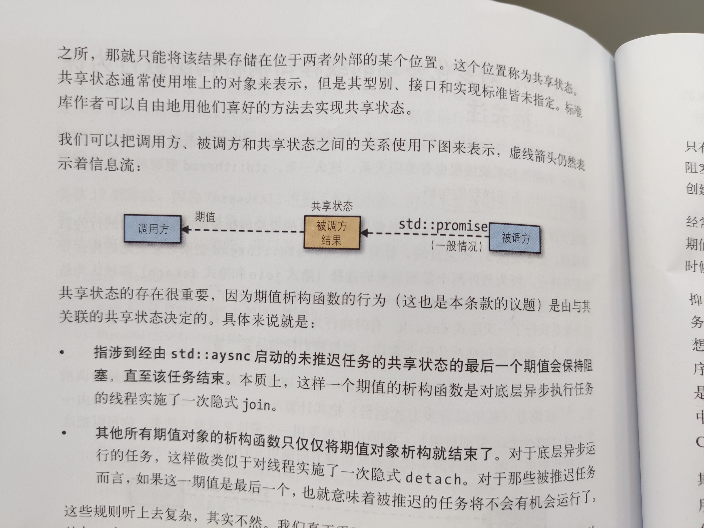

# 7 | 并发 API

<!-- @import "[TOC]" {cmd="toc" depthFrom=3 depthTo=6 orderedList=false} -->

<!-- code_chunk_output -->

- [35 | 优先选用基于任务而非基于线程的程序设计](#35-优先选用基于任务而非基于线程的程序设计)
  - [三个层面的线程以及线程超订 oversubscription](#三个层面的线程以及线程超订-oversubscription)
  - [基于任务相比基于线程的好处](#基于任务相比基于线程的好处)
- [36 | 如果异步是必要的，则指定 std::launch::async](#36-如果异步是必要的则指定-stdlaunchasync)
  - [std::async 默认启动策略](#stdasync-默认启动策略)
  - [std::async 状态判断与封装一个默认异步的 async 模板函数（配合 std::result_of<>::type ）](#stdasync-状态判断与封装一个默认异步的-async-模板函数配合-stdresult_oftype)
- [37 | 使 std::thread 型别对象在所有路径皆不可联结](#37-使-stdthread-型别对象在所有路径皆不可联结)
  - [可联结 joinable 与不可联结](#可联结-joinable-与不可联结)
  - [为什么 std::thread 对象 joinable 时，析构将导致程序终止](#为什么-stdthread-对象-joinable-时析构将导致程序终止)
- [38 | 对变化多端的线程句柄析构函数行为保持关注](#38-对变化多端的线程句柄析构函数行为保持关注)
  - [关于期值 future 、 promise 、 packaged_task](#关于期值-future-promise-packaged_task)
  - [期值 future 和 promise 间存在一个共享状态](#期值-future-和-promise-间存在一个共享状态)
  - [期值析构函数行为的常规与例外](#期值析构函数行为的常规与例外)
  - [使用 packaged_task 也可以创建共享状态与期值，并且析构行为是常规的](#使用-packaged_task-也可以创建共享状态与期值并且析构行为是常规的)
- [39 | 考虑针对一次性事件通信使用以 void 为模板型别实参的期值](#39-考虑针对一次性事件通信使用以-void-为模板型别实参的期值)
  - [使用条件变量进行线程通信，用 lambda 解决代码异味 code smell](#使用条件变量进行线程通信用-lambda-解决代码异味-code-smell)
  - [使用共享布尔标志位来控制线程通信](#使用共享布尔标志位来控制线程通信)
  - [通过 promise 和 future 实现一次通信](#通过-promise-和-future-实现一次通信)
  - [通过 promise 让线程暂停一次](#通过-promise-让线程暂停一次)
- [40 | 对并发使用 std::atomic ，对特种内存使用 volatile](#40-对并发使用-stdatomic-对特种内存使用-volatile)
  - [C++ 的 volatile 与并发无关，与 Java 或 C# 不同](#c-的-volatile-与并发无关与-java-或-c-不同)
  - [atomic 防止代码重排，并禁用了复制或移动构造函数，应使用 load 与 store](#atomic-防止代码重排并禁用了复制或移动构造函数应使用-load-与-store)

<!-- /code_chunk_output -->

C++ 11 提供了并发支持，对于跨平台来讲，是好事；但是功能可能没有已有线程 API 库（例如， pthread 或 Windows 线程库）功能强大。

C++ 的线程 `std::thread` 一经创建就会启动。与 Java 需要 `start` 不同。

这里再额外说一下 `std::future` 和 `std::shared_future` ，我们管这个单词叫做“期望”。 `std::future` 型别对象支持移动操作，也可以用以构造 `std::shared_future` 型别对象，而 `std::shared_future` 型别对象又可以复制。

### 35 | 优先选用基于任务而非基于线程的程序设计

```cpp
int doAsyncWork();

// 线程
std::thread t(doAsyncWork);
// fut 是期望的缩写
// 传递给 std::async 的函数对象（如 doAsynWork ）被看作任务 task
auto fut = std::async(doAsyncWork);
```

#### 三个层面的线程以及线程超订 oversubscription

“线程”在 C++ 软件中的三种意义：
- 硬件线程（实际执行计算的线程）
- 软件线程（又称操作系统线程或系统线程），操作系统用以实施跨进程的管理
- `std::thread` 是 C++ 进程里的对象，用作底层软件线程的句柄

有些 `std::thread` 对象表示为 `null` 句柄，对应于“无软件线程”，可能的原因有：
- 它们处于默认构造状态（因此没有待执行的函数）
- 或者被移动了（作为移动目的的 `std::thread` 对象成为了底层线程的句柄）
- 被 `join` 了（待运行函数已结束）
- 被分离了（ `std::thread` 对象与其底层软件线程的连接被切断了）

接下来讨论一下，什么是线程超订（ thread oversubscription ）？

线程超订（ thread oversubscription ）是就绪状态（非阻塞）的软件线程超过了硬件线程数量的时候。这种情况下，线程调度器（通常是操作系统的一部分）会为软件线程在硬件线程之上分配 CPU 时间片。（疑问一下：这种情况应该很常见？）

书中认为超定带来的线程切换，将导致：
- 软件线程通常不会命中 CPU 缓存（即，几乎不会包含对于那软件线程有用的任何数据和指令）
- CPU 内核运行的的“新”软件线程还会“污染” CPU 缓存上为“旧”线程所准备的数据

书中的意思是，虽然避免超订极其困难，但是开发者可以把“是否开一个新线程”这种难题留给 `std::async` 来解决，没准，它会帮你避免一些超订。

#### 基于任务相比基于线程的好处

首先， `auto fut = std::async(doAsyncWork);` 可以通过 `fut.get()` 很方便地获取 `doAsyncWork` 返回值。

另外，基于线程的程序设计要求手动管理线程耗尽、超订、负载均衡，以及新平台适配。

但是，线程有更大的灵活性，更能贴近底层。

### 36 | 如果异步是必要的，则指定 std::launch::async

#### std::async 默认启动策略

```cpp
auto fut1 = std::async(f);
auto fut2 = std::async(std::launch::async |
                       std::launch::deferred, f);
```

上述两句话效果完全相同。

使用默认启动策略，则：
- 无法预知 `f` 会与 `t` 并发运行
- 无法预知 `f` 是否运行在与调用 `fut` 的 `get` 或 `wait` 函数的线程不同的线程上
- 连 `f` 是否会运行这件事都是无法预知的

#### std::async 状态判断与封装一个默认异步的 async 模板函数（配合 std::result_of<>::type ）

如下的实现是有问题的。

```cpp
using namespace std::literals;  // C++ 14 后缀
void f()
{
    std::this_thread::sleep_for(1s);
}

auto fut = std::async(f);

while (fut.wait_for(100ms) !=      // 企图循环至 f 完成
       std::future_status::ready)  // 但 f 可能不会开始执行，一直返回 deferred
{
    // ...
}
```

如下是 `wait_for` 。

```cpp
template <class Rep, class Period>
  future_status wait_for (const chrono::duration<Rep,Period>& rel_time) const;
```

**Wait for ready during time span**

Waits for the shared state to be ready for up to the time specified by rel_time.

If the shared state is not yet ready (i.e., the provider has not yet set its value or exception), the function blocks the calling thread and waits until it is ready or until `rel_time` has elapsed, whichever happens first.

When the function returns because its shared state is made ready, the value or exception set on the shared state is not read, but all visible side effects are synchronized between the point the provider makes the shared state ready and the return of this function.

If the shared state contains a deferred function (such as future objects returned by async), the function does not block, returning immediately with a value of `future_status::deferred`.

因此，显然，正确的写法应该如下。

```cpp
auto fut = std::async(f);

if (fut.wait_for(0s) ==
    std::future_status::deferred)
{
    // 这里可以用 fut 的 get 或 wait 函数来等待 f 完成（以异步的方式调用 f ）
} else {
    while (fut.wait_for(100ms) !=
           std::future_status::ready)
    {
        // 这里只要 f 没问题（本身函数不是死循环）
        // 那么就在这个作用域里做一些与 f 并行的工作
        // 这个作用域中会持续 100ms ，或 f 还在运行
    }
}
```

因此如上，以默认策略启动 `std::async` 是有危险的。

这里封装一下以 `std::launch::async` 为默认启动策略的 `async` 函数。

```cpp
// C++ 11
template <class F, class... Ts>
inline
std::future<typename std::result_of<F(Ts...)>::type>
reallyAsync(F&& f, Ts&&... params)
{
    return std::async(std::launch::async,
                      std::forward<F>(f),
                      std::forward<Ts>(params)...);
}

// C++ 14
template <class F, class... Ts>
inline
auto
reallyAsync(F&& f, Ts&&... params)
{
    return std::async(std::launch::async,
                      std::forward<F>(f),
                      std::forward<Ts>(params)...);
}
```

### 37 | 使 std::thread 型别对象在所有路径皆不可联结

#### 可联结 joinable 与不可联结

`std::thread` 对象皆处于两种状态之一：可联结或不可联结。

可联结对应底层以异步方式已运行或可运行的线程：
- 线程对象对应的底层线程若处于阻塞或等待调度
- 对应的底层线程已运行至结束，也是认为可联结

不可联结的 `std::thread` 对象包括：
- 默认构造的 `std::thread` ，即没有一个可执行的函数
- 已移动的 `std::thread` ，一个 `std::thread` 所对应的底层执行线程（若有）被对应到另一个 `std::thread` 上
- 已联结的 `std::thread`
- 已分离的 `std::thread`

#### 为什么 std::thread 对象 joinable 时，析构将导致程序终止

`std::thread` 对象 joinable 时，析构将导致程序终止 `std::terminate()` 。换言之， `std::thread` 对象析构时不能是 `joinable` 的。

如下程序，实现得有问题。

```cpp
constexpr auto tenMillion = 10'000'000;  // C++ 14

bool doWork(std::function<bool(int)> filter,
            int maxVal = tenMillion)
{
    std::vector<int> goodVals;
    std::thread t([&filter, maxVal, &goodVals]
                  {
                      for (auto i = 0; i <= maxVal; ++ i)
                        { if (filter(i)) goodVals.push_back(i); }
                  });
    
    // 使用 t 的低值句柄设定 t 的优先级
    // 这也是为什么用 std::thread 而非 std::async
    auto nh = t.native_handle();

    if (conditionsAreSatisfied()) {
        t.join();
        preformComputation(goodVals);
        return true;
    }
    return false;
    // 程序将中止！因为 t 未 join 就遭到析构！
}
```

如上，我们不允许 `t` 在未 `join` 时就遭到析构。

为什么这么设计呢？很简单，如果一个线程是 joinable 的，而其还被析构了，不强行终止程序的话，那么将有两条路可走：
- 隐式 `join` ，这种情况下 `std::thread` 析构函数会等待底层异步执行的线程完成，在上面的代码中，在 `return false` 后仍然会等待 `t` 的执行结束，这是与逻辑不符的
- 隐式 `detach` 。底层线程会继续执行（ `t` 对象与底层执行线程直接的连接被分离了），但是 `t` 已经析构了。在上面的代码中 `doWork` 的栈帧会被弹出，但是但是 lambda 表达式仍然在运行，仍然在 `doWork` 的调用方继续运行着；之后， `doWork` 调用方如果调用了其他函数，则会使用之前 `doWork` 所用的内存，而此时由于 lambda 表达式仍然在运行，所以你的新函数可能莫名其妙崩溃或者内存莫名其妙被改变

所以，绝不可以有隐式的 `detach` 。

如果你想要让程序正常运行，那么自己封装一个线程，并且在析构中明确你要如何处理线程（ `join` 还是 `detach` ）。

```cpp
class ThreadRAII {
public:
    enum class DtorAction { join, detach };

    ThreadRAII(std::thread&& t, DtorAction a)
    : action(a), t(std::move(t)) {}

    ~ThreadRAII()
    {
        if (t.joinable()) {
            if (action == DtorAction::join)
                t.join();
            else
                t.detach();
        }
    }

    // 声明了析构函数，不会有编译器生成的移动操作
    // 因此需要自己这里点出
    ThreadRAII(ThreadRAII&&) = default;
    ThreadRAII& operator=(ThreadRAII&&) = default;

    std::thread& get() { return t; }

private:
    DtorAction action;
    std::thread t;
};
```

因此， `doWork` 实现如下。

```cpp
bool doWork(std::function<bool(int)> filter,
            int maxVal = tenMillion)
{
    std::vector<int> goodVals;
    ThreadRAII t(
    std::thread([&filter, maxVal, &goodVals]
                {
                    for (auto i = 0; i <= maxVal; ++ i)
                    { if (filter(i)) goodVals.push_back(i); }
                }),
                ThreadRAII::DtorAction::join
    );
    
    auto nh = t.get().native_handle();

    if (conditionsAreSatisfied()) {
        t.get().join();
        preformComputation(goodVals);
        return true;
    }
    return false;

    // 这里会 t.join （我依然认为这不是一个很妥当的实现）
}
```

### 38 | 对变化多端的线程句柄析构函数行为保持关注

#### 关于期值 future 、 promise 、 packaged_task

我们可以通过 `promise` 得到期值， `promise` 与期值之间持续建立着某种连接。如下例子来自 https://www.cplusplus.com/reference/future/promise/

```cpp
// promise example
#include <iostream>       // std::cout
#include <functional>     // std::ref
#include <thread>         // std::thread
#include <future>         // std::promise, std::future

void print_int (std::future<int>& fut) {
  int x = fut.get();
  std::cout << "value: " << x << '\n';
}

int main ()
{
  std::promise<int> prom;                      // create promise

  std::future<int> fut = prom.get_future();    // engagement with future

  std::thread th1 (print_int, std::ref(fut));  // send future to new thread

  prom.set_value (10);                         // fulfill promise
                                               // (synchronizes with getting the future)
  th1.join();
  return 0;
}
```

如下的例子来自 https://www.cplusplus.com/reference/future/packaged_task/

```cpp
// packaged_task example
#include <iostream>     // std::cout
#include <future>       // std::packaged_task, std::future
#include <chrono>       // std::chrono::seconds
#include <thread>       // std::thread, std::this_thread::sleep_for

// count down taking a second for each value:
int countdown (int from, int to) {
  for (int i=from; i!=to; --i) {
    std::cout << i << '\n';
    std::this_thread::sleep_for(std::chrono::seconds(1));
  }
  std::cout << "Lift off!\n";
  return from-to;
}

int main ()
{
  std::packaged_task<int(int,int)> tsk (countdown);   // set up packaged_task
  std::future<int> ret = tsk.get_future();            // get future

  std::thread th (std::move(tsk),10,0);   // spawn thread to count down from 10 to 0

  // ...

  int value = ret.get();                  // wait for the task to finish and get result

  std::cout << "The countdown lasted for " << value << " seconds.\n";

  th.join();

  return 0;
}
```

#### 期值 future 和 promise 间存在一个共享状态



如上图，为什么要这么设计？
- 如果把期值放在被调用方，被调用方析构了，那么调用方就不能获取期值了
- 如果把期值放在调用方，而调用方通过 `std::future` 对象创建出多个 `std::shared_future` 对象（ `std::shared_future` 被复制多次 ），此时，若被调用方的结果 `X` 是只移型别，而这个结果对象 `X` 的生存期应该至少延至最后一个指涉到它的期值；而 `X` 只能存在于一个期值对象中（因为 `X` 是个可移型别，不能复制），那么，把 `X` 放在哪个期值对象里呢？自然是无法判断，这么设计不合理

因此才引入的共享状态。

#### 期值析构函数行为的常规与例外

一般而言，期值的析构函数仅会析构期值对象，并针对共享状态里的引用计数实施了一次自减。

期值析构函数还有个例外，只有在期值满足以下全部条件时，才会发挥作用：
- 期值所指涉的共享状态是由于调用了 `std::async` 才创建的
- 该任务的启动策略是 `std::launch::async` （可能是运行时系统的选择）
- 该期值是指涉到该共享状态的最后一个期值，对于 `std::future` 型别对象而言，这一点总成立；对于 `shared_future` 而言则未必

这个“例外”的析构行为会做什么事呢？ **阻塞直到异步运行的任务结束。** 因此，经常有人观察到，并且得出一个不严谨的结论：来自 `std::async` 的期值会在其析构函数里被阻塞。

为什么这么设计？还是 C++ 委员会的妥协：为了避免隐式的 `detach` 。

#### 使用 packaged_task 也可以创建共享状态与期值，并且析构行为是常规的

如果你想避免 `std::async` 带来的麻烦，但还是想获得期值、共享状态，那么考虑一下 `packaged_task` 。

```cpp
{
    int calcValue();  // 待运行函数

    std::packaged_task<int()>
        pt(calcValue);
    
    auto fut = pt.get_future();  // 取得 pt 期值
    std::thread th(std::move(pt));

    // ...
    // t 析构
}
```

注意，此时 `fut` 析构都会仅仅析构自己而已，并不会让 `th` 阻塞（隐式 `join` ）。这样设计的合理之处在于，我们并不需要从期值的角度考虑异步任务是否需要隐式 `join` 或 `detach` ，因为这个难题被留给了 `thread` 对象。

### 39 | 考虑针对一次性事件通信使用以 void 为模板型别实参的期值

这节中，我们管负责 `notify` 的、或者说生产者叫做“检测任务”，管负责执行的、 `wait` 的消费者线程叫做“反应任务”。

#### 使用条件变量进行线程通信，用 lambda 解决代码异味 code smell

```cpp
...
{
    // unique_lock 比 lock_guard 成本更高
    // 但是比 lock_guard 更灵活，比如
    // unique_lock 可以设置 try_to_lock 参数等
    std::unique_lock<std::mutex> lk(m);  // 为互斥量加锁
    cv.wait(lk);  // 等待通知到来
    // ... 针对事件作出反应（m 被 lock）
}   // 临界区结束，通过 lk 析构为 m 解锁
```

上面是反应任务的代码，要注意，上面的实现存在一些代码异味 code smell ：即代码能够运作，但是有些东西似乎也不太对劲。
- 在本例中，异味源于互斥体，但是检测和反应任务之间似乎不太需要这种介质，毕竟反应任务并没有想要跟检测任务抢某个变量的读写权（但是，使用条件变量必须配合互斥量）

此外，还有两个问题更加致命：
- 如果检测任务在反应任务调用 wait 之前就通知了条件变量，则反应任务将失去响应
- 反应任务的 wait 语句无法应对虚假唤醒（即没有通知条件变量，但针对该条件变量的代码也可能被唤醒）

针对虚假唤醒，我们可以使用 lambda 表达式来加一层检验，如下。

```cpp
cv.wait(lk,
        []{ return 事件是否确已发生 ; });
```

#### 使用共享布尔标志位来控制线程通信

一个不适用条件变量的方法是使用布尔标志位。

```cpp
/**
 * 检测任务
 */
std::atomic<bool> flag(false);
...
flag = true;  // 检测事件通知反应任务

/**
 * 反应任务
 */
...  // 准备反应
while(!flag);  // 等待事件
...  // 针对事件作出反应
```

如上，很明显看出， `while(!flag);` 成本过于高昂。一直在轮询。

因此，一个综合的通信方法如下。

```cpp
/**
 * 检测任务
 */
std::condition_variable cv;
std::mutex m;

// 因为现在有了 mutex
// 所以不需要 atomic 了
bool flag = false;
...
{
    std::lock_guard<std::mutex> g(m);
    flag = true;
}
cv.notify_one();

/**
 * 反应任务
 */
...  // 准备反应
{
    std::unique_lock<std::mutex> lk(m);
    cv.wait(lk,
            []{ return flag; });
    ...  // 针对事件作出反应（m 被 lock）
}
...  // m 已解锁
```

#### 通过 promise 和 future 实现一次通信

通过期值和信道，有一种更加简单的实现方法，但坏处是只能实现一次通信。

检测任务有一个 `std::promise` 型别对象（即，信道的写入端），反应任务有对应的期值。当检测任务发现它正在查找的事件已经发生时，它会设置 `std::promise` 型别对象（向信道写入）。与此同时，反应任务调用 `wait` 以等待它的期值。该 `wait` 调用会阻塞反应任务，直至 `std::promise` 型别对象被设置。

注意， `std::promise` 和期值（ `std::future` 和 `std::shared_future` ）都是需要型别的形参模板。形参表示要通过信道发送数据的型别。在本例中，并没有要发送的数据，所以用 `void` 。

```cpp
std::promise<void> p;

/**
 * 检测任务
 */
p.set_value();  // 通知反应任务

/**
 * 反应任务
 */
p.get_future().wait();  // 等待事件
```

注意， `std::promise` 和 `std::future` 之前是共享状态，需要在堆上动态分配内存。

#### 通过 promise 让线程暂停一次

```cpp
std::promise<void> p;

void react();  // 反应任务函数

void detect()
{
    std::thread t([]
                  {
                      p.get_future().wait();  // 暂停 t
                      // 直到期值被设置
                      react();
                  });
    ...  // 检测任务，做一些 react 之前的准备活动
    p.set_value();
    ...  // 其他工作
    t.join();
}
```

注意，这里不可以直接替换成我们之前实现过的 `ThreadRAII` 如下。

```cpp
void detect()
{
    ThreadRAII tr(
        std::thread([]
                    {
                        p.get_future().wait();  // 暂停 t
                        react();
                    }),
        ThreadRAII::DtorAction::Join
    );
    ...  // 检测任务，做一些 react 之前的准备活动
    // 注意！如果这里发生异常，则 set_value 不会被调用
    // 则 tr 析构永远不会完成
    p.set_value();
    ...  // 其他工作
}
```

此外，可以针对多个反应任务实施先暂停再取消暂停的功能。

```cpp
std::promise<void> p;

void detect()
{
    // sf 是 std::shared_future<void>
    auto sf = p.get_future().share();

    std::vector<std::thread> vt;

    for (int i = 0; i < threadsToRun; ++ i) {
        vt.emplace_back([sf]  // 注意，这里是 sf 副本
                        {
                            sf.wait();  // 暂停 t
                            react();
                        });
    }

    // ... 若此处抛出异常，则 detect 会失去响应

    p.set_value();  // 取消所有线程的暂停

    for (auto& t : vt) {
        t.join();
    }
}
```

### 40 | 对并发使用 std::atomic ，对特种内存使用 volatile

#### C++ 的 volatile 与并发无关，与 Java 或 C# 不同

在 Java 中 `volatile` 似乎可以控制变量可见性、防止代码重排，但是 C++ 只是告诉编译器不要优化变量。

C++ 的 `volatile` 往深了说，就是告诉编译器，正在处理的内存不具备常规行为。

```cpp
int x;
auto y = x;
y = x;
x = 10;
x = 20;
```

会被编译器优化如下。

```cpp
auto y = x;
x = 20;
```

但是如果 `x` 在一些特种内存上，比如 `x` 对应硬件检测的温度，则上代码不可以进行优化。

```cpp
auto y = x;
// 硬件会修改 x 的值（如温度检测）
y = x;

x = 10;
// 硬件会发射 x 的值（如无线电发射）
x = 20;
```

因此，我们把 `x` 声明如下，告诉编译器不要优化

```cpp
volatile int x;

// 参考条款 2 ，这里 y 是 int 而非 volatile int
auto y = x;
```

#### atomic 防止代码重排，并禁用了复制或移动构造函数，应使用 load 与 store

```cpp
a = b;
x = y;
// 可能被编译器编译如下
x = y;
a = b;
```

代码重拍对于并行任务来说十分危险，因此可以使用 `atomic` 如下。

```cpp
std::atomic<bool> valAvailable(false);

auto imptValue = computeImportantValue();

valAvailable = true;  /// 通知其他任务值可用
```

另外， `atomic` 也需要保证 read-modify-write, RMW 操作的原子性。

此外还应注意， `atomic` 为了保证原子性，因此不支持复制构造、移动构造、移动赋值运算符。

```cpp
std::atomic<int> x;

auto y = x;  // 错误！（因为 y 会被推导为 atomic<int>）
y = x;       // 错误！

// 一个好的方法如下
std::atomic<int> y(x.load());
y.store(x.load());
```
