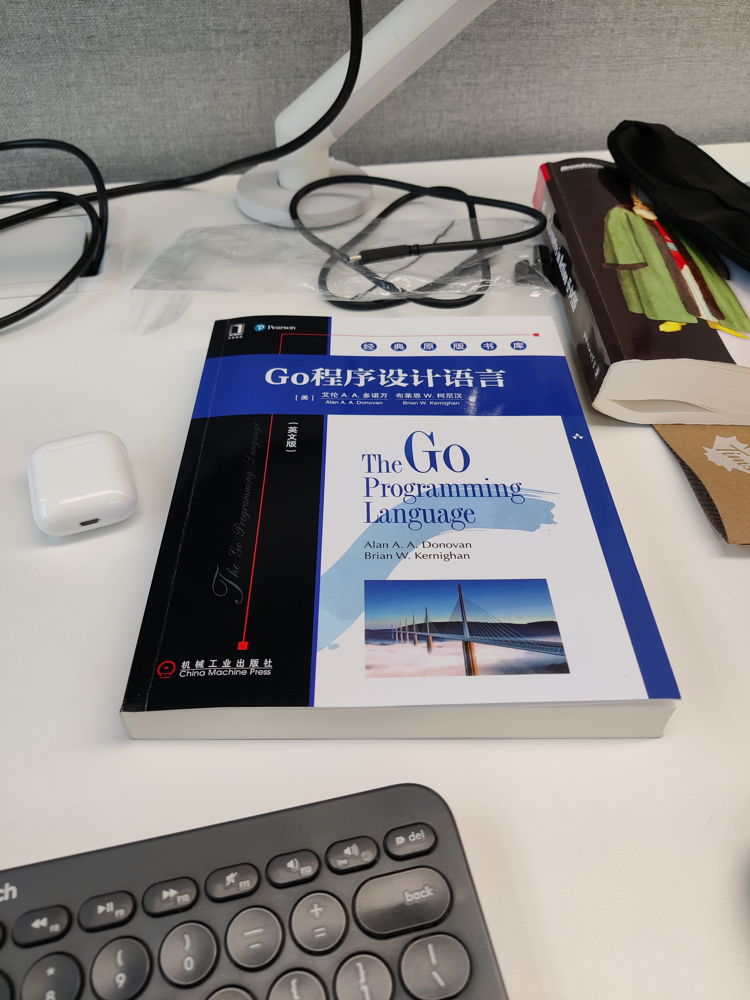
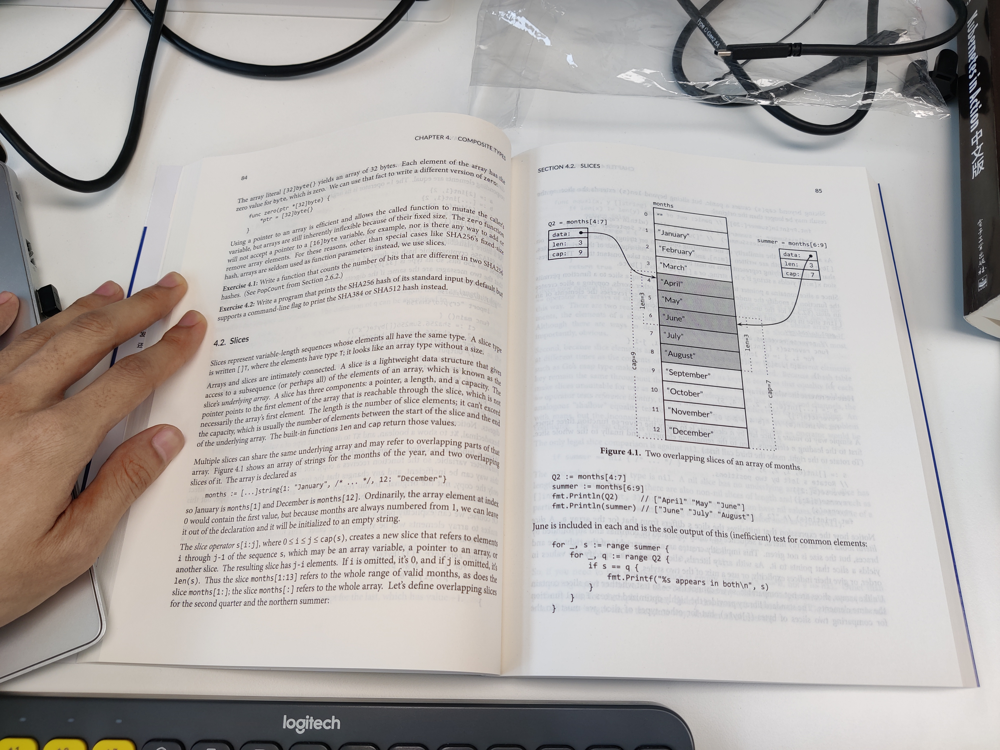

# Go 语言程序设计（英文版）

Alan A.A.Donovan. Brian W.Kemighan. Go 语言程序设计（英文版）. 电子工业出版社. 第一版

夯实一下 go ，找这本书再合适不过了。已经是读的第三本 Kemighan 的书了。在公司的书架上找到的，纯英文版，值得挑战一下。

- 本书的代码 https://github.com/adonovan/gopl.io/
- 本书的网站 http://www.gopl.io/

<!-- @import "[TOC]" {cmd="toc" depthFrom=3 depthTo=6 orderedList=false} -->

<!-- code_chunk_output -->

- [Tutorial](#tutorial)

<!-- /code_chunk_output -->

### Tutorial

[./drafts/go.01.tutorial.md](./drafts/go.01.tutorial.md)

- [1.1 Hello, World](./drafts/go.01.tutorial.md#11-hello-world)
- [1.2 Command-Line Arguments](./drafts/go.01.tutorial.md#12-command-line-arguments)
- [1.3 Finding Duplicate Lines](./drafts/go.01.tutorial.md#13-finding-duplicate-lines)
- [1.4 Animated GIFs](./drafts/go.01.tutorial.md#14-animated-gifs)
- [1.5 Fetching a URL](./drafts/go.01.tutorial.md#15-fetching-a-url)
- [1.6 Fetching URLs Concurrently](./drafts/go.01.tutorial.md#16-fetching-urls-concurrently)
- [1.7 A Web Server](./drafts/go.01.tutorial.md#17-a-web-server)
- [1.8 Loose Ends](./drafts/go.01.tutorial.md#18-loose-ends)
