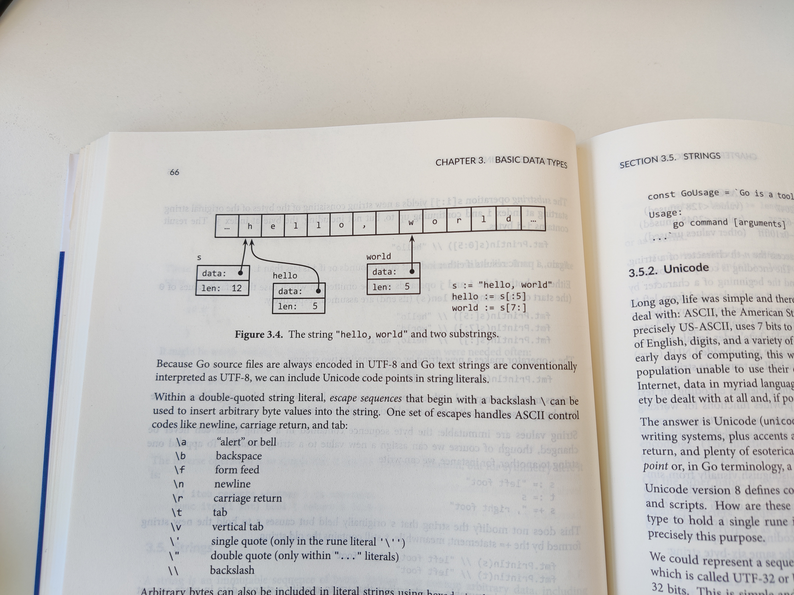
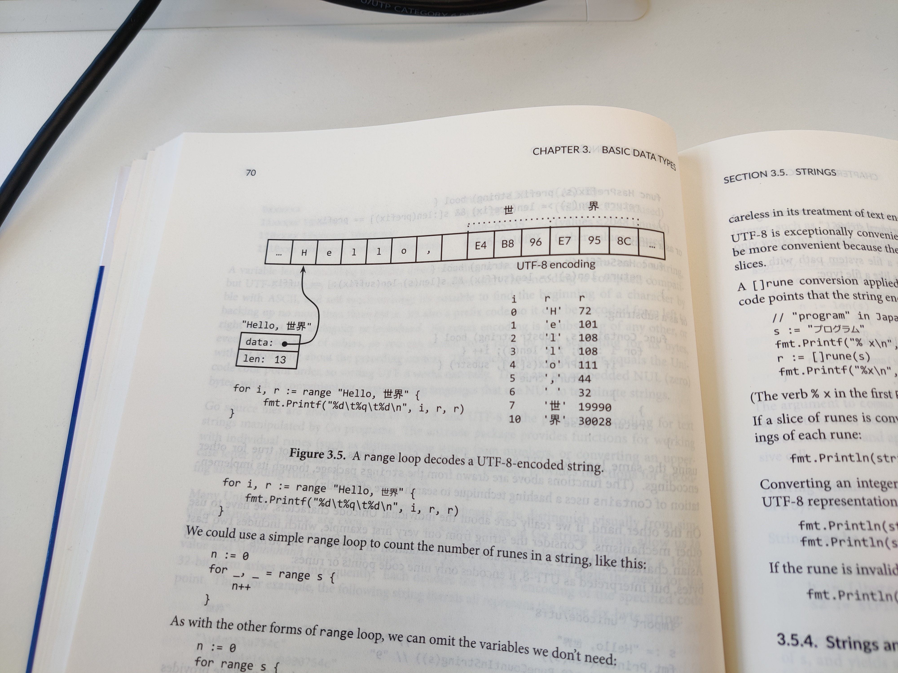

# 3. Basic Data Types

"It's all bits at the bottom"

<!-- @import "[TOC]" {cmd="toc" depthFrom=3 depthTo=6 orderedList=false} -->

<!-- code_chunk_output -->

- [3.1 Integers](#31-integers)
- [3.2 Floating-Point Numbers](#32-floating-point-numbers)
- [3.3 Complex Numbers](#33-complex-numbers)
- [3.4 Booleans](#34-booleans)
- [3.5 Strings （博弈：可变性与内存共享）](#35-strings-博弈可变性与内存共享)
  - [3.5.1 String Literals](#351-string-literals)
  - [3.5.2 Unicode （引出 rune ）](#352-unicode-引出-rune)
  - [3.5.3 UTF-8](#353-utf-8)
  - [3.5.4 Strings and Byte Slices](#354-strings-and-byte-slices)
  - [3.5.5 Conversions between Strings and Numbers](#355-conversions-between-strings-and-numbers)
- [3.6 Constants](#36-constants)
  - [3.6.1 The Constant Generator iota](#361-the-constant-generator-iota)
  - [3.6.2 Untyped Constants](#362-untyped-constants)

<!-- /code_chunk_output -->

### 3.1 Integers

这里记录一下 `&^` bit clear (AND NOT) 操作。

```go
var x uint8 = 1<<1 | 1<<5   // "00100010"
var y uint8 = 1<<1 | 1<<2   // "00000110"

fmt.Printf("%08b\n, x&^y")  // "00100000"
```

### 3.2 Floating-Point Numbers

这里生成 3D SVG 的逻辑很有趣：一张 matlab 风格的三维网格图片，实际上也确实由多个平面组成，这里是一个一个 `corner` （ `fmt.Fprintf(w, "<polygon points='%g,%g %g,%g %g,%g %g,%g'/>\n", 				ax, ay, bx, by, cx, cy, dx, dy)` ）地放给到 `<svg>` 里。代码见 [ch3/surface](../gopl.io/ch3/surface/main.go) 。

### 3.3 Complex Numbers

我没注意过 Python 或者其他语言是否天然支持复数计算。

没准 Go 能在科学计算或者计算机图形学分得一杯羹？

### 3.4 Booleans

### 3.5 Strings （博弈：可变性与内存共享）

没想到首先接触到 Slice 是在 String 这里。



好了，这里我收获了一个很重要的思想： **快速完成 `substr` （切片）的前提是底层内存共享，因此一个 `string` 当然就是不可变的了，否则切片值存在不可确定性。** 引用原文： `s[0] = 'L'  // compile error: cannot assign to s[0]` Immutability means that it is safe for two copies of a string to share the same underlying memory, making it cheap to copy strings of any length.

因此估计 `python` 字符串切片效率也很高： `TypeError: 'str' object does not support item assignment` 。反面例子就是 C++ ： `substr` 返回一个新 `string` 对象，调用了构造函数开销定不必多说。

#### 3.5.1 String Literals

#### 3.5.2 Unicode （引出 rune ）

Unicode collects all of the characters and assigns each one a standard number called a Unicode code point or, in Go terminology, a `rune` .

#### 3.5.3 UTF-8

UTF-8 是一种节省空间的 Unicode 表达存储方法。

```
0xxxxxxx                              // runes 0-127    (ASCII)
11xxxxxx 10xxxxxx                     // 128-2047       (values < 128 unused)
110xxxxx 10xxxxxx 10xxxxxx            // 2048-65535     (values < 2048 unused)
1110xxxx 10xxxxxx 10xxxxxx 10xxxxxx   // 65536-0x10ffff (other values unused)
```

`\uhhhh` for a 16-bit value and `\Uhhhhhhhh` for a 32-bit value, where each `h` is a hexadecimal digit.

以下四种字符串完全等效，都表示 `six-byte string`:

```
"世界"
"\xe4\xb8\x96\xe7\x95\x8c"
"\u4e16\u754c"
"\U00004e16\U0000754c"
```

这里还有个很好的例子，讲解 UTF-8 字符串的迭代，如下。



#### 3.5.4 Strings and Byte Slices

#### 3.5.5 Conversions between Strings and Numbers

### 3.6 Constants

#### 3.6.1 The Constant Generator iota

这里有个很棒的技巧。

```go
const (
    _ = 1 << (10 * iota)
    KiB  // 1024
    MiB  // 1048576
    GiB  // 1073741824
    TiB  // 1099511627776     (exceeds 1 << 32)
    PiB  // 1125899906846976
    EiB
    ZiB  //                   (exceeds 1 << 64)
    YiB
)
```

#### 3.6.2 Untyped Constants
