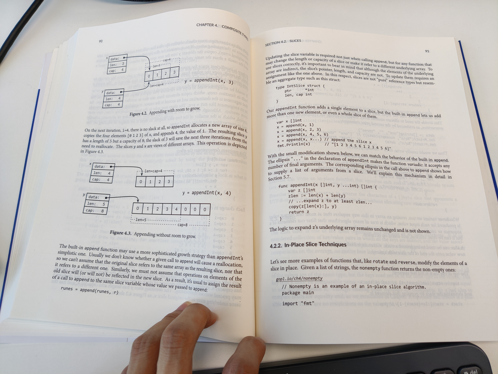

# 4. Composite Types

"It's all bits at the bottom"

<!-- @import "[TOC]" {cmd="toc" depthFrom=3 depthTo=6 orderedList=false} -->

<!-- code_chunk_output -->

- [4.1 Arrays](#41-arrays)
- [4.2 Slices](#42-slices)
  - [4.2.1 The append Function](#421-the-append-function)
  - [4.2.2 In-Place Slice Techniques](#422-in-place-slice-techniques)
- [4.3 Maps](#43-maps)
- [4.4 Structs](#44-structs)
  - [4.4.1 Struct Literals](#441-struct-literals)
  - [4.4.2 Comparing Structs](#442-comparing-structs)
  - [4.4.3 Struct Embedding and Anonymous Fields](#443-struct-embedding-and-anonymous-fields)
- [4.5 JSON](#45-json)
- [4.6 Text and HTML Templates](#46-text-and-html-templates)

<!-- /code_chunk_output -->

### 4.1 Arrays

An arrays is a fixed-length sequence.

### 4.2 Slices

如上，一图胜千言。

#### 4.2.1 The append Function

关于 Slice 的扩容，或许类似于 C++ 的 `vector<>` ？中文互联网中“[幼麟实验室](https://space.bilibili.com/567195437)”讲得非常好。

#### 4.2.2 In-Place Slice Techniques

### 4.3 Maps

### 4.4 Structs

#### 4.4.1 Struct Literals

#### 4.4.2 Comparing Structs

#### 4.4.3 Struct Embedding and Anonymous Fields

### 4.5 JSON

我最近在处理 Yaml ，这里的 Json 的处理和 Yaml 很像，都是把 key-value 结构用 Struct 定义好同名结构，再 `data, err := json.Marshal([]Structs{...})` 或者 `Unmarshal` 一下。

### 4.6 Text and HTML Templates

在写 Scala 的时候也发现自带处理文本的模板，没记错的话也是用 `{{ variables }}` ？在 Go 里似乎没有那么直观，但也天生在 `text/template` 中支持。

关于 [../gopl.io/ch4/github/](../gopl.io/ch4/github/) 中的代码值得看一看。

此外还有 `html/template` 。

终于不需要 java 中那些奇怪的、没有 IDE 解析器的第三方注入语法了。
