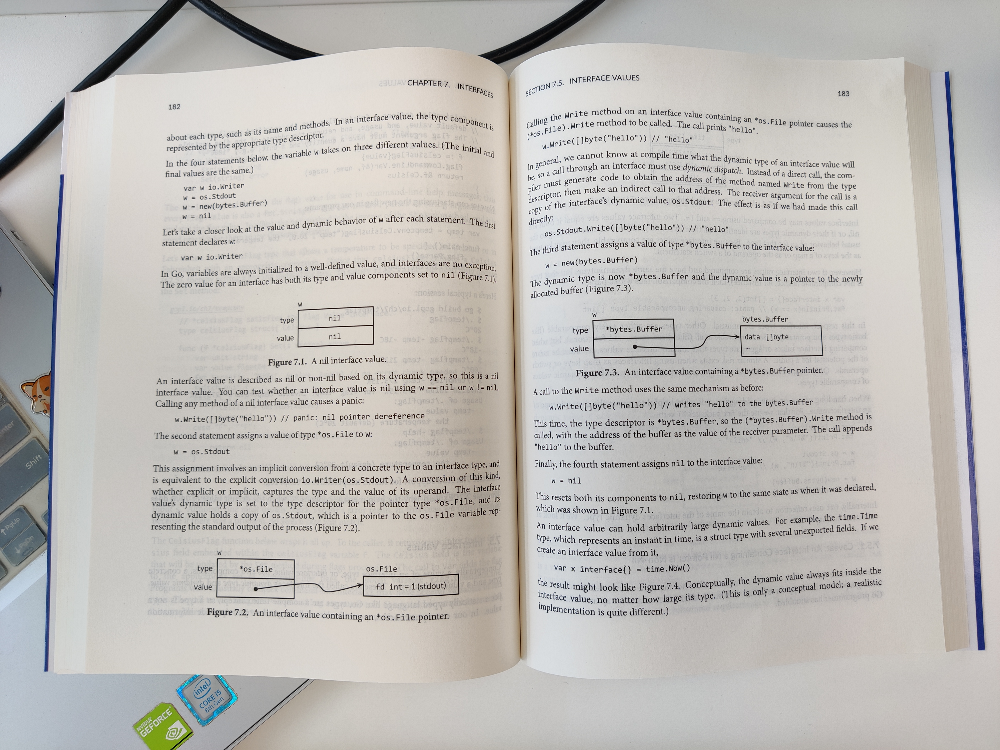

# 7. Interfaces

Interface types express generalizations or abstractions about the behaviors of other types. By generalizing, interfaces let us write functions that are more flexible and adaptable because they are not tied to the details of one particular implementation.

Many object-oriented languages have some notion of interfaces, but what makes Go's interfaces so distinctive is that they are *satisfied implicitly*. In other words, there's no need to declare all the interfaces that a given concrete type satisfies; simply possessing the necessary methods is enough. This is design lets you create new interfaces that are satisfied by existing concrete types without changing the existing types, which is particularly useful for types defined in packages that you don't control.

<!-- @import "[TOC]" {cmd="toc" depthFrom=3 depthTo=6 orderedList=false} -->

<!-- code_chunk_output -->

- [7.1 Interfaces as Contracts](#71-interfaces-as-contracts)
- [7.2 Interface Types](#72-interface-types)
- [7.3 Interface Satisfaction](#73-interface-satisfaction)
- [7.4 Parsing Flags with flag.Value](#74-parsing-flags-with-flagvalue)
- [7.5 Interface Values](#75-interface-values)
  - [7.5.1 Caveat: An Interface Containing a Nil Pointer Is Non-Nil](#751-caveat-an-interface-containing-a-nil-pointer-is-non-nil)
- [7.6 Sorting with sort.Interface](#76-sorting-with-sortinterface)
- [7.7 The http.Handler Interface](#77-the-httphandler-interface)
- [7.8 The error Interface](#78-the-error-interface)
- [7.9 Example: Expression Evaluator （很实用：手写 ast 以及 eval ）](#79-example-expression-evaluator-很实用手写-ast-以及-eval)
- [7.10 Type Assertions](#710-type-assertions)
- [7.11 Discriminating Errors with Type Assertions](#711-discriminating-errors-with-type-assertions)
- [7.12 Querying Behaviors with Interface Type Assertions](#712-querying-behaviors-with-interface-type-assertions)
- [7.13 Type Switches （使用 x.(type) ）](#713-type-switches-使用-xtype)
- [7.14 Example: Token-Based XML Decoding](#714-example-token-based-xml-decoding)
- [7.15 A Few Words of Advice](#715-a-few-words-of-advice)

<!-- /code_chunk_output -->

### 7.1 Interfaces as Contracts

### 7.2 Interface Types

### 7.3 Interface Satisfaction

### 7.4 Parsing Flags with flag.Value

### 7.5 Interface Values



#### 7.5.1 Caveat: An Interface Containing a Nil Pointer Is Non-Nil

### 7.6 Sorting with sort.Interface

```go
package sort

type Interface interface {
    Len() int
    Less(i, j int) bool // i, j are indices of sequence elements
    Swap(i, j int)
}

// 下面是一个隐式实现
type byArtist []*Track
func (x byArtist) Len() int           { return len(x) }
func (x byArtist) Less(i, j int) bool { return x[i].Artist < x[j].Artist }
func (x byArtist) Swap(i, j int)      { x[i], [j] = x[j], x[i] }

// 这个显式的“类型转换”很优雅
// 也不需要让 tracks 数组一直持有 byArtist 作为“抽象类”
sort.Sort(byArtist(tracks))
// 逆序排序
sort.Sort(sort.Reverse(byArtist(tracks)))
```

这里的 Reverse 有点反直觉，按理说，不应该先排序，再 Reverse 吗？其实这里是把 `sort.Interface` 转为 `sort.reverse` 的“类”，其中 `Less` 被反向调用了。如下。

```go
package sort

type reverse struct{ Interface }  // that is, sort.Interface
func (r reverse) Less(i, j int) bool { return r.Interface.Less(j, i) }
func Reverse(data Interface) Interface { return reverse{data} }
```

这里有个小疑问， go 会为 `r.Less` 添加 inline 吗？要不然每次比较都额外增加一次栈开销？（我猜测会）

### 7.7 The http.Handler Interface

[../gopl.io/ch7/](../gopl.io/ch7/) 中有很多优秀的例子。

### 7.8 The error Interface

`error` 实际上就是 `string` 。

### 7.9 Example: Expression Evaluator （很实用：手写 ast 以及 eval ）

所有的数据类型都是 `float64` ，要求最后能处理如下表达式：

```go
-x
+x
sqrt(A / pi)
pow(x, 3) + pow(y, 3)
(F - 32) * 5 / 9
```

首先设计数据类型，见 [../gopl.io/ch7/eval/ast.go](../gopl.io/ch7/eval/ast.go) 中针对不同类型的表达式组成单位设计的不同 `type` 。

所有这些 `type` 实际上都要实现 `Expr` 这个 `interface` ：

```go
type Expr interface {
    Eval(env Env) float64
    // Check(vars map[Var]bool) error
}
```

而 `Env` 又是 `map[Var]float64` 。关于 `Eval` 的实现见 [../gopl.io/ch7/eval/eval.go](../gopl.io/ch7/eval/eval.go) 。

最后书里介绍了 `check` ，没有对解析器 `parse` 介绍（估计是担心喧宾夺主）。

其良好的应用可以参考 [../gopl.io/ch7/surface/surface.go](../gopl.io/ch7/surface/surface.go) 。

简单描述一下其应用：

```go
// 首先写好我们的表达式
s := "sin(x / y * 10)"
// 然后交给解析器解析
expr, err := eval.Parse(s)

// 如果我们想看看哪些被解析器解析成变量
vars := make(map[eval.Var]bool)
err := expr.Check(vars)
// 此时 vars 应该是 {"x"： true, "y": true}

// 如何使用 Eval 呢？
expr.Eval(eval.Env{"x": 10, "y": 20})
```

### 7.10 Type Assertions

可以通过 `.(具体type)` 获取 interface 实际类型。（有种多态的感觉了？）

```go
var w io.Writer = os.Stdout
f, ok := w.(*os.File)       // success:  ok, f == os.Stdout
b, ok := w.(*bytes.Buffer)  // failure: !ok, b == nil
```

### 7.11 Discriminating Errors with Type Assertions

书中举了个例子，说白了就是判断一下 `error` 的具体 `type` 。

```go
import (
    "errors"
    "syscall"
)

var ErrNotExist = errors.New("file does not exist")

func IsNotExist(err error) bool {
    if pe, ok := err.(*PathError); ok {
        err = pe.Err
    }
    return err == syscall.ENOENT || err == ErrNotExist
}

_, err := os.Open("/no/such/file")
fmt.Println(os.IsNotExist(err))  // "true"
```

### 7.12 Querying Behaviors with Interface Type Assertions

除了通过 `A.(具体type)` 检验 `A` 实际类型，还能通过这个表达式查看 `A` 是否满足（实现了）其他 `interface` 。

```go
// writeString writes s to w.
// If w has a WriteString method, it is invoked instead of w.Write.
func writeString(w io.Writer, s string) (n int, err error) {
    type stringWriter interface {
        WriteStrng(string) (n int, err error)
    }
    if sw, ok := w.(stringWriter); ok {
        return sw.WriteString(s)  // avoid a copy
    }
    return w.Write([]byte(s))  // allocate temporary copy
}

func writeHeader(w io.Writer, contentType string) error {
    if _, err := writeString(w, "Content-Type: "); err != nil {
        return err
    }
    if _, err := writeString(w, contentType); err != nil {
        return err
    }
    // ...
}
```

还有一个例子如下，是 `fmt.Fprintf` 的一个中间步骤。

```go
package fmt

func formatOneValue(x interface{}) string {
    if err, ok := x.(error); ok {
        return err.Error()
    }
    if str, ok := x.(Stringer); ok {
        return str.String()
    }
    // ...all other types...
    // 其中或多或少会用到 reflection ，反射的内容我们会在第 12 章考虑
}
```

### 7.13 Type Switches （使用 x.(type) ）

```go
func sqlQuote(x interface{}) string {
    switch x := x.(type) {
    case nil:
        return "NULL"
    case int, uint:
        return fmt.Sprintf("%d", x);  // x has type interface{} here
    case bool:
        if x {
            return "TRUE"
        }
        return "FALSE"
    case string:
        return sqlQuoteString(x)
    default:
        panic(fmt.Sprintf("unexpected type: %T: %v", x, x))
    }
}
```

### 7.14 Example: Token-Based XML Decoding

代码见 [../gopl.io/ch7/xmlselect/main.go](../gopl.io/ch7/xmlselect/main.go) 。一个一个地拿出 `xml` 的 token 进行类型判断。

用法可以如下。

```bash
go build gopl.io/ch1/fetch
fetch http://www.w3.org/TR/2006/REC-xml11-20060816 | ./xmlselect div div h2
```

### 7.15 A Few Words of Advice

如果你的 interface 只可能被一个具体的类型实现，那还不如直接给这个 type 写成员方法呢。否则增加运行时开销。
