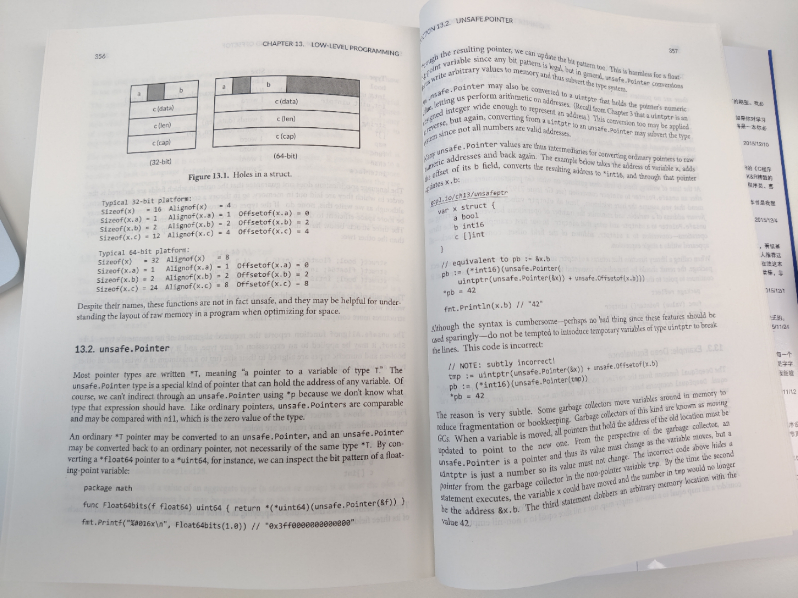

# 13. Low-Level Programming

unsafe package 实际上是被编译器实现的。

<!-- @import "[TOC]" {cmd="toc" depthFrom=3 depthTo=6 orderedList=false} -->

<!-- code_chunk_output -->

- [13.1 unsafe.Sizeof, Alignof, and Offsetof](#131-unsafesizeof-alignof-and-offsetof)
- [13.2 unsafe.Pointer](#132-unsafepointer)
- [13.3 Example: Deep Equivalence](#133-example-deep-equivalence)
- [13.4 Calling C Code with cgo](#134-calling-c-code-with-cgo)
- [13.5 Another Word of Caution](#135-another-word-of-caution)

<!-- /code_chunk_output -->

### 13.1 unsafe.Sizeof, Alignof, and Offsetof

```go
import "unsafe"
fmt.Println(unsafe.Sizeof(float64(0))) // "8"
```

注意 32 位机器上一个 word 长度是 4 字节，而 64 位机器上是 8 字节。

```go
Type                            Size
bool                            1 byte
intN, uintN, floatN, complexN   N/8 bytes
int, uint, uintptr              1 word
*T                              1 word
string                          2 words (data, len)
[]T                             3 words (data, len, cap)
map                             1 word
func                            1 word
chan                            1 word
interface                       2 words (type, value)
```

关于如下这个 struct 其在内存上的布局如下。

```go
var x struct {
    a bool
    b int16
    c []int
}
```



### 13.2 unsafe.Pointer

```go
package math

import "unsafe"
func Float64bits(f float64) uint64 {
    return *(*uint64)(unsafe.Pointer(&f))
}
fmt.Println(Float64bits(3.1415926)) // "0x40f918fb7a7b9f7f"
```

**Do not be tempted to introduce temporary variables of type `uintptr` to break this lines.**

```go
// NOTE: subtly incorrect:
tmp := uintptr(unsafe.Pointer(&x)) + unsafe.Offsetof(x.b)
pb := (*int16)(unsafe.Pointer(tmp))
*pb = 42
```

The reason is very subtle. **Some garbage collectors move variables around in memory to reduce fragmentation or bookkeeping.** Garbage collectors of this kind are known as moving GCs.

再次注意， Go 是一个有垃圾回收的语言，因此不要自认为 new 就是把变量开到了堆上。实际上，变量可能被回收了。

因此如下，你用 C++ 的思维和方法去写完全不行。

```go
pT := uintptr(unsafe.Pointer(new(T)))  // NOTE: wrong!
```

没有变量指向 `new(T)` ，在其一创造出来就被回收，因此其指针也是无效的。

### 13.3 Example: Deep Equivalence

见 [equal](../gopl.io/ch13/equal/) 。

### 13.4 Calling C Code with cgo

一些其他工具：
- foreign-function interfaces (FFIs)
- SWIG (swig.org)

案例参考 [bzip](../gopl.io/ch13/) 系列代码。

```go
/*
#cgo CFLAGS: -I/usr/include
#cgo LDFLAGS: -L/usr/lib -lbz2
#include <bzlib.h>
int bz2compress(bz_stream *s, int action,
                char *in, unsigned *inlen, char *out, unsigned *outlen);
*/
import "C"
```

There is no package C, but this import causes `go build` to preprocess the file using the cgo tool before the Go compiler sees it.

During preprocessing, `cgo` generates a temporary package that contains Go declarations corresponding to all the C functions and types used by the file, such as `C.bz_stream` and `C.BZ2_bzCompresInit`. （具体参考代码） The `cgo` toll discovers these types by invoking the C compiler in a special way on the contents of the comment that precedes the import declaration.

The comment may also contain `#cgo` directives that specify extra options to the C toolchain. The `CFLAGS` and `LDFLAGS` values contribute extra arguments to the compiler and linker commands so that they can locate the `bzlib.h` header file and the `libbz2.a` archive library. The example assumes that these are installed beneath `/usr` on your system.

### 13.5 Another Word of Caution
