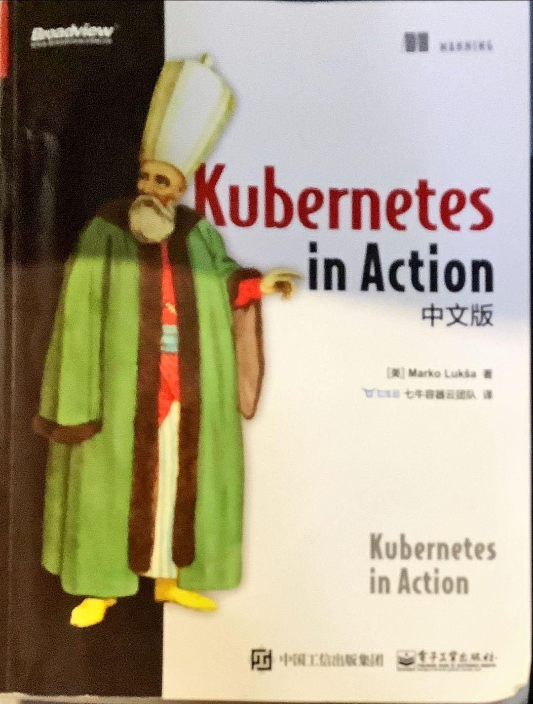
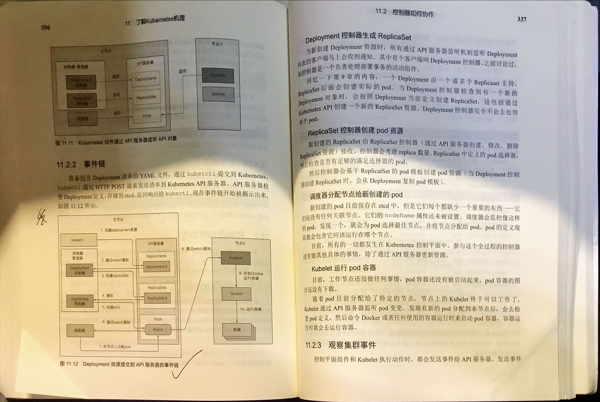

# Marko Luksa. Kubernetes in Action 中文版. 电子工业出版社. 七牛容器云团队译. 第一版

Marko Luksa. Kubernetes in Action 中文版. 电子工业出版社. 七牛容器云团队译. 第一版

购于京东， 2022 年 6 月 19 日上午。旁听面试意识到得让 k8s 在我心里形成体系。确实，官方文档读得我慌的一批，面临的工作也不知自己有没有把握，因此必须买书强化一下。

这就好比，你学语文，总不能去读字典来学吧？总要有一本由浅入深的教材吧？再不济，得读读故事书来学语文，是吧。

<!-- @import "[TOC]" {cmd="toc" depthFrom=3 depthTo=6 orderedList=false} -->

<!-- code_chunk_output -->

- [1 Kubernetes 介绍](#1-kubernetes-介绍)

<!-- /code_chunk_output -->

### 1 Kubernetes 介绍

[./drafts/k8s.01.md](./drafts/k8s.01.md)
