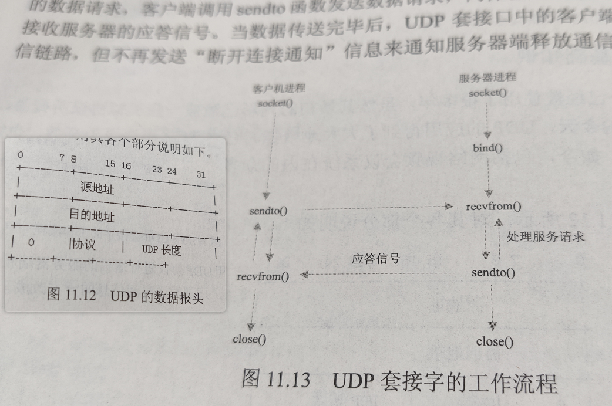

# 第 10 章 Linux 的线程

<!-- @import "[TOC]" {cmd="toc" depthFrom=3 depthTo=6 orderedList=false} -->

<!-- code_chunk_output -->

- [Linux 的网络基础操作函数（大小端调整、字节操作函数、IP地址转换函数、域名转换函数）](#linux-的网络基础操作函数大小端调整-字节操作函数-ip地址转换函数-域名转换函数)
- [Linux 的网络套接字 scoket 操作函数](#linux-的网络套接字-scoket-操作函数)
- [Linux 的 TCP 编程与 UDP 编程](#linux-的-tcp-编程与-udp-编程)

<!-- /code_chunk_output -->

除了在“网络编程”的 NTP 协议里出现了个 `select` ，剩下的地方并没有出现我想要看到的多路复用技术。但起码明确了 TCP 这类协议已经由 Linux 内核负责了，我们只需要处理其提供的 API 比如 `bind`, `listen`, `accept`, `connect`, `send`, `recv` 等等就可以了。

### Linux 的网络基础操作函数（大小端调整、字节操作函数、IP地址转换函数、域名转换函数）

大小端相关函数如下。

```c
#include <arpa/inet.h>
uint32_t htonl(uint32_t hostlong);
uint16_t htons(uint16_t hostshort);
uint32_t ntohl(uint32_t netlong);
uint16_t ntohs(uint16_t netshort);
```

由于套接字地址和 C 语言中的字符串不同，其是多字节数据而非空字符结尾，所以需要字节操作函数转换一下。

```c
#include <string.h>

// BSD 兼容函数
void bzero(void *s, size_t n);
void bcopy(const void *src, void *dst, size_t n);
int bcmp(const void *s1, const void *s2, size_t n);

// ANSI C 标准
void *memset(void *s, int c, size_t n);
void *memcpy(void *dst, const void *src, size_t n);
int memcmp(const void *s1, const void *s2, size_t n);
```

IP 地址转换函数如下。

```c
#include <arpa/inet.h>
int inet_aton(const char *cp, struct in_addr *inp);
char *inet_ntoa(struct in_addr in);
int in_addr_t_inet_addr(const char *straddr);
```

域名转换函数如下。

```c
#include <netdb.h>
extern int h_errno;
struct hostent *gethostbyname(const char *name);

#include <sys/socket.h>
struct hostent *gethostbyaddr(const void *addr, socklen_t len, int type);
```

### Linux 的网络套接字 scoket 操作函数

```c
#include <sys/types.h>
#include <sys/socket.h>

// 创建套接字
int scoket(int domain, int type, int protocol);

// 绑定套接字函数
int bind(int sockfd, const struct sockaddr *my_addr, socklen_t addrlen);

// 建立连接函数
int connect(int sockfd, const struct sockaddr *serv_addr, socklen_t addrlen);

// 倾听套接字切换函数
int listen(int sockfd, int backlog);

// 接受连接函数
int accept(int sockfd, struct sockaddr *cli_addr, socklen_t *addrlen);

// 关闭套接字函数
int close(int sockfd);

// 读写函数
int read(int fd, void *buf, size_t count);
int write(int fd, const void *buf, size_t count);

// 套接字地址获取函数
int getsockname(int sockfd, struct sockaddr *addr, socklen_t *addrlen);
int getpeername(int sockfd, struct sockaddr *addr, socklen_t *addrlen);

// 发送和接收函数
// 类似于 read 和 write 函数，但只用于 TCP 套接字
ssize_t send(int sockfd, const void *buf, size_t len, int flags);
ssize_t recv(int sockfd, void *buf, size_t len, int flags);

// 如果是 UDP 下面向无连接，则收发不能使用 write/read/send/recv 函数，而应该使用 sendto/recvfrom 函数
ssize_t sendto(int sockfd, const void *buf, size_t len, int flags, const struct sockaddr *dest_addr, socklen_t addrlen);
ssize_t recvfrom(int sockfd, void *buf, size_t len, int flags, struct sockaddr *src_addr, socklen_t *addrlen);
```

### Linux 的 TCP 编程与 UDP 编程


上图中右侧更重要一点，即，对于 TCP 而言，三次握手什么的都不需要我们来做，但是需要搞明白 `bind` 、 `listen` 和 `accept` 的先后顺序、做了什么。



与之形成对比的是 UDP 编程，如上图。

代码什么的请见 [../sample/chapter11/](../sample/chapter11/) 。

最后一个 NTP 协议不摘录了。
