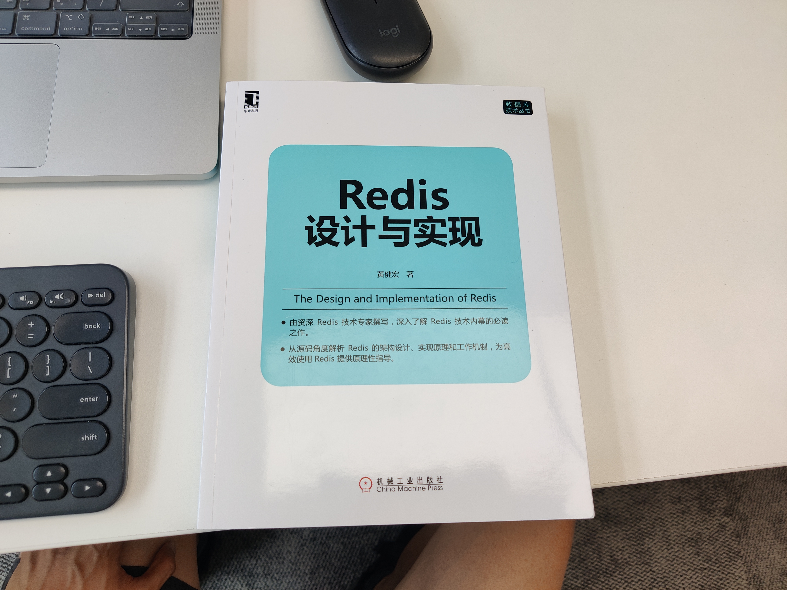

# 黄健宏. Redis 设计与实现. 机械工业出版社. 第一版

黄健宏. Redis 设计与实现. 机械工业出版社. 第一版

本书官网见 [http://redisbook.com/](http://redisbook.com/) 。

<!-- @import "[TOC]" {cmd="toc" depthFrom=2 depthTo=6 orderedList=false} -->

<!-- code_chunk_output -->

  - [第 1 章 引言](#第-1-章-引言)
- [第一部分 数据结构与对象](#第一部分-数据结构与对象)
  - [第 2 章 简单动态字符串](#第-2-章-简单动态字符串)
  - [第 3 章 链表](#第-3-章-链表)
  - [第 4 章 字典](#第-4-章-字典)
  - [第 5 章 跳跃表](#第-5-章-跳跃表)
  - [第 6 章 整数集合](#第-6-章-整数集合)
  - [第 7 章 压缩列表](#第-7-章-压缩列表)
  - [第 8 章 对象](#第-8-章-对象)
- [第二部分 单机数据库的实现](#第二部分-单机数据库的实现)
  - [第 9 章 数据库](#第-9-章-数据库)
  - [第 10 章 RDB 持久化](#第-10-章-rdb-持久化)
  - [第 11 章 AOF 持久化](#第-11-章-aof-持久化)
  - [第 12 章 事件](#第-12-章-事件)
  - [第 13 章 客户端](#第-13-章-客户端)
  - [第 14 章 服务器](#第-14-章-服务器)
- [第三部分 多机数据库的实现](#第三部分-多机数据库的实现)
  - [第 15 章 复制](#第-15-章-复制)
  - [第 16 章 Sentinel](#第-16-章-sentinel)
  - [第 17 章 集群](#第-17-章-集群)
- [第四部分 独立功能的实现](#第四部分-独立功能的实现)
  - [第 18 章 发布与订阅](#第-18-章-发布与订阅)
  - [第 19 章 事务](#第-19-章-事务)
  - [第 20 章 Lua 脚本](#第-20-章-lua-脚本)
  - [第 21 章 排序](#第-21-章-排序)
  - [第 24 章 监视器](#第-24-章-监视器)

<!-- /code_chunk_output -->

### 第 1 章 引言

介绍了本书各章节的内容及关系。

## 第一部分 数据结构与对象

第一部分可以换一个名字：“ C 语言数据结构设计与实践”。 Redis 为「如何在 C 语言中封装工程可用的数据结构」提供了一种工程实践范例：
- 如何使用 C 宏
- 定义了基本的数据结构及其 API
- 定义了“数据结构对象”这一个更高层次的概念，内部实现数据结构的「动态选型」与转化，从而完成时间空间的 trade off

### 第 2 章 简单动态字符串

[./drafts/ch.02.md](./drafts/ch.02.md)

- [2.1 SDS 的定义](./drafts/ch.02.md#21-sds-的定义)
- [2.2 SDS 与 C 字符串的区别](./drafts/ch.02.md#22-sds-与-c-字符串的区别)
  - [2.2.1 常数复杂度获取字符串的长度](./drafts/ch.02.md#221-常数复杂度获取字符串的长度)
  - [2.2.2 杜绝缓冲区溢出](./drafts/ch.02.md#222-杜绝缓冲区溢出)
  - [2.2.3 减少修改字符串时带来的内存重分配次数](./drafts/ch.02.md#223-减少修改字符串时带来的内存重分配次数)
  - [2.2.4 二进制安全](./drafts/ch.02.md#224-二进制安全)
  - [2.2.5 兼容部分 C 字符串函数](./drafts/ch.02.md#225-兼容部分-c-字符串函数)
- [2.3 SDS API](./drafts/ch.02.md#23-sds-api)
- [2.4 重点回顾](./drafts/ch.02.md#24-重点回顾)
- [2.5 参考资料](./drafts/ch.02.md#25-参考资料)
- [sds 源码阅读（重要）](./drafts/ch.02.md#sds-源码阅读重要)
  - [c 语言丰富的宏预处理](./drafts/ch.02.md#c-语言丰富的宏预处理)
  - [c 语言结构体中数组指针不占用 struct size](./drafts/ch.02.md#c-语言结构体中数组指针不占用-struct-size)

### 第 3 章 链表

[./drafts/ch.03.md](./drafts/ch.03.md)

- [3.1 链表和链表节点的实现](./drafts/ch.03.md#31-链表和链表节点的实现)
- [3.2 链表和链表节点的 API](./drafts/ch.03.md#32-链表和链表节点的-api)
- [3.3 重点回顾](./drafts/ch.03.md#33-重点回顾)

### 第 4 章 字典

[./drafts/ch.04.md](./drafts/ch.04.md)

- [4.1 字典的实现](./drafts/ch.04.md#41-字典的实现)
- [4.2 哈希算法](./drafts/ch.04.md#42-哈希算法)
- [4.3 解决键冲突](./drafts/ch.04.md#43-解决键冲突)
- [4.4 rehash](./drafts/ch.04.md#44-rehash)
- [4.5 渐进式 rehash](./drafts/ch.04.md#45-渐进式-rehash)
- [阅读源码：启动 server -> event loop -> 触发 rehash](./drafts/ch.04.md#阅读源码启动-server-event-loop-触发-rehash)

### 第 5 章 跳跃表

[./drafts/ch.05.md](./drafts/ch.05.md)

- [5.1 跳跃表的实现](./drafts/ch.05.md#51-跳跃表的实现)
  - [5.1.1 跳跃表节点](./drafts/ch.05.md#511-跳跃表节点)
  - [5.1.2 跳跃表](./drafts/ch.05.md#512-跳跃表)
- [5.2 跳跃表 API](./drafts/ch.05.md#52-跳跃表-api)
- [5.3 重点回顾](./drafts/ch.05.md#53-重点回顾)

### 第 6 章 整数集合

[./drafts/ch.06.md](./drafts/ch.06.md)

- [6.1 整数集合的实现](./drafts/ch.06.md#61-整数集合的实现)
- [6.2 升级](./drafts/ch.06.md#62-升级)
- [6.3 升级的好处](./drafts/ch.06.md#63-升级的好处)
  - [6.3.1 提升灵活性](./drafts/ch.06.md#631-提升灵活性)
  - [6.3.2 节约内存](./drafts/ch.06.md#632-节约内存)
- [6.4 降级](./drafts/ch.06.md#64-降级)
- [6.5 整数集合 API](./drafts/ch.06.md#65-整数集合-api)

### 第 7 章 压缩列表

[./drafts/ch.07.md](./drafts/ch.07.md)

- [7.1 压缩列表的构成](./drafts/ch.07.md#71-压缩列表的构成)
- [7.2 压缩列表节点的构成](./drafts/ch.07.md#72-压缩列表节点的构成)
  - [7.2.1 previous_entry_length](./drafts/ch.07.md#721-previous_entry_length)
  - [7.2.2 encoding](./drafts/ch.07.md#722-encoding)
  - [7.2.3 content](./drafts/ch.07.md#723-content)
- [7.3 连锁更新](./drafts/ch.07.md#73-连锁更新)
- [7.4 压缩列表 API](./drafts/ch.07.md#74-压缩列表-api)

### 第 8 章 对象

[./drafts/ch.08.md](./drafts/ch.08.md)

- [8.1 对象的类型与编码](./drafts/ch.08.md#81-对象的类型与编码)
  - [8.1.1 类型](./drafts/ch.08.md#811-类型)
  - [8.1.2 编码和底层实现](./drafts/ch.08.md#812-编码和底层实现)
- [8.2 字符串对象](./drafts/ch.08.md#82-字符串对象)
  - [8.2.1 编码的转换](./drafts/ch.08.md#821-编码的转换)
  - [8.2.2 字符串命令的实现](./drafts/ch.08.md#822-字符串命令的实现)
- [8.3 列表对象](./drafts/ch.08.md#83-列表对象)
  - [8.3.1 编码转换](./drafts/ch.08.md#831-编码转换)
  - [8.3.2 列表命令的实现](./drafts/ch.08.md#832-列表命令的实现)
- [8.4 哈希对象](./drafts/ch.08.md#84-哈希对象)
  - [8.4.1 编码转换](./drafts/ch.08.md#841-编码转换)
  - [8.4.2 哈希命令的实现](./drafts/ch.08.md#842-哈希命令的实现)
- [8.5 集合对象](./drafts/ch.08.md#85-集合对象)
  - [8.5.1 编码的转换](./drafts/ch.08.md#851-编码的转换)
  - [8.5.2 集合命令的实现](./drafts/ch.08.md#852-集合命令的实现)
- [8.6 有序集合对象](./drafts/ch.08.md#86-有序集合对象)
  - [8.6.1 编码的转换](./drafts/ch.08.md#861-编码的转换)
  - [8.6.2 有序集合命令的实现](./drafts/ch.08.md#862-有序集合命令的实现)
- [8.7 类型检查与命令多态](./drafts/ch.08.md#87-类型检查与命令多态)
  - [8.7.1 类型检查的实现](./drafts/ch.08.md#871-类型检查的实现)
  - [8.7.2 多态命令的实现](./drafts/ch.08.md#872-多态命令的实现)
- [8.8 内存回收](./drafts/ch.08.md#88-内存回收)
- [8.9 对象共享](./drafts/ch.08.md#89-对象共享)
- [8.10 对象的空转时长](./drafts/ch.08.md#810-对象的空转时长)

## 第二部分 单机数据库的实现

### 第 9 章 数据库

[./drafts/ch.09.md](./drafts/ch.09.md)

- [9.1 服务器中的数据库](./drafts/ch.09.md#91-服务器中的数据库)
- [9.2 切换数据库](./drafts/ch.09.md#92-切换数据库)
- [9.3 数据库键空间（redisDb）](./drafts/ch.09.md#93-数据库键空间redisdb)
  - [9.3.1 添加新键](./drafts/ch.09.md#931-添加新键)
  - [9.3.2 删除键](./drafts/ch.09.md#932-删除键)
  - [9.3.3 更新键](./drafts/ch.09.md#933-更新键)
  - [9.3.4 对键取值](./drafts/ch.09.md#934-对键取值)
  - [9.3.5 其他键空间操作](./drafts/ch.09.md#935-其他键空间操作)
  - [9.3.6 读写键空间时的维护操作](./drafts/ch.09.md#936-读写键空间时的维护操作)
- [9.4 设置键的生存时间或过期时间](./drafts/ch.09.md#94-设置键的生存时间或过期时间)
  - [9.4.1 设置过期时间](./drafts/ch.09.md#941-设置过期时间)
  - [9.4.2 保存过期时间](./drafts/ch.09.md#942-保存过期时间)
  - [9.4.3 移除过期时间](./drafts/ch.09.md#943-移除过期时间)
  - [9.4.4 计算并返回剩余剩余生存时间](./drafts/ch.09.md#944-计算并返回剩余剩余生存时间)
  - [9.4.5 过期键的判定](./drafts/ch.09.md#945-过期键的判定)
- [9.5 过期键删除策略](./drafts/ch.09.md#95-过期键删除策略)
  - [9.5.1 定时删除](./drafts/ch.09.md#951-定时删除)
  - [9.5.2 惰性删除](./drafts/ch.09.md#952-惰性删除)
  - [9.5.3 定期删除](./drafts/ch.09.md#953-定期删除)
- [9.6 Redis 的过期键删除策略](./drafts/ch.09.md#96-redis-的过期键删除策略)
  - [9.6.1 惰性删除策略的实现](./drafts/ch.09.md#961-惰性删除策略的实现)
  - [9.6.2 定期删除策略的实现（随机选取键判断是否过期）](./drafts/ch.09.md#962-定期删除策略的实现随机选取键判断是否过期)
- [9.7 AOF 、 RDB 和复制功能对过期键的处理](./drafts/ch.09.md#97-aof---rdb-和复制功能对过期键的处理)
  - [9.7.1 生成 RDB 文件](./drafts/ch.09.md#971-生成-rdb-文件)
  - [9.7.2 载入 RDB 文件](./drafts/ch.09.md#972-载入-rdb-文件)
  - [9.7.3 AOF 文件写入](./drafts/ch.09.md#973-aof-文件写入)
  - [9.7.4 AOF 重写](./drafts/ch.09.md#974-aof-重写)
  - [9.7.5 复制](./drafts/ch.09.md#975-复制)
- [9.8 数据库通知](./drafts/ch.09.md#98-数据库通知)
  - [9.8.1 发送通知](./drafts/ch.09.md#981-发送通知)
  - [9.8.2 发送通知的实现](./drafts/ch.09.md#982-发送通知的实现)

### 第 10 章 RDB 持久化

[./drafts/ch.10.md](./drafts/ch.10.md)

- [10.1 RDB 文件的创建与载入](./drafts/ch.10.md#101-rdb-文件的创建与载入)
  - [10.1.1 SAVE 命令执行时的服务器状态](./drafts/ch.10.md#1011-save-命令执行时的服务器状态)
  - [10.1.2 BGSAVE 命令执行时的服务器状态](./drafts/ch.10.md#1012-bgsave-命令执行时的服务器状态)
  - [10.1.3 RDB 文件载入时的服务器状态](./drafts/ch.10.md#1013-rdb-文件载入时的服务器状态)
- [10.2 自动间隔性保存](./drafts/ch.10.md#102-自动间隔性保存)
  - [10.2.1 设置保存条件](./drafts/ch.10.md#1021-设置保存条件)
  - [10.2.2 dirty 计数器和 lastsave 属性](./drafts/ch.10.md#1022-dirty-计数器和-lastsave-属性)
  - [10.2.3 检查保存条件是否满足](./drafts/ch.10.md#1023-检查保存条件是否满足)
- [10.3 RDB 文件结构](./drafts/ch.10.md#103-rdb-文件结构)
  - [10.3.1 databases 部分](./drafts/ch.10.md#1031-databases-部分)
  - [10.3.2 key_value_pairs 部分](./drafts/ch.10.md#1032-key_value_pairs-部分)
  - [10.3.3 value 的编码](./drafts/ch.10.md#1033-value-的编码)
- [10.4 分析 RDB 文件](./drafts/ch.10.md#104-分析-rdb-文件)
  - [10.4.1 不包含任何键值对的 RDB 文件](./drafts/ch.10.md#1041-不包含任何键值对的-rdb-文件)
  - [10.4.2 包含字符串键的 RDB 文件](./drafts/ch.10.md#1042-包含字符串键的-rdb-文件)
  - [10.4.3 包含带有过期时间的字符串键的 RDB 文件](./drafts/ch.10.md#1043-包含带有过期时间的字符串键的-rdb-文件)
  - [10.4.4 包含一个集合键的 RDB 文件](./drafts/ch.10.md#1044-包含一个集合键的-rdb-文件)
  - [10.4.5 关于分析 RDB 文件的说明](./drafts/ch.10.md#1045-关于分析-rdb-文件的说明)

### 第 11 章 AOF 持久化

[./drafts/ch.11.md](./drafts/ch.11.md)

- [11.1 AOF 持久化的实现](./drafts/ch.11.md#111-aof-持久化的实现)
  - [11.1.1 命令追加](./drafts/ch.11.md#1111-命令追加)
  - [11.1.2 AOF 文件的写入与同步](./drafts/ch.11.md#1112-aof-文件的写入与同步)
- [11.2 AOF 文件的载入与数据还原](./drafts/ch.11.md#112-aof-文件的载入与数据还原)
- [11.3 AOF 重写](./drafts/ch.11.md#113-aof-重写)
  - [11.3.1 AOF 文件重写的实现](./drafts/ch.11.md#1131-aof-文件重写的实现)
  - [11.3.2 AOF 后台重写](./drafts/ch.11.md#1132-aof-后台重写)

### 第 12 章 事件

[./drafts/ch.12.md](./drafts/ch.12.md)

- [12.1 文件事件](./drafts/ch.12.md#121-文件事件)
  - [12.1.1 文件事件处理器的构成](./drafts/ch.12.md#1211-文件事件处理器的构成)
  - [12.1.2 I/O 多路复用程序的实现](./drafts/ch.12.md#1212-io-多路复用程序的实现)
  - [12.1.3 事件的类型](./drafts/ch.12.md#1213-事件的类型)
  - [12.1.4 API](./drafts/ch.12.md#1214-api)
  - [12.1.5 文件事件的处理器](./drafts/ch.12.md#1215-文件事件的处理器)
- [12.2 时间事件](./drafts/ch.12.md#122-时间事件)
  - [12.2.1 实现](./drafts/ch.12.md#1221-实现)
  - [12.2.2 API](./drafts/ch.12.md#1222-api)
- [12.3 事件的调度与执行](./drafts/ch.12.md#123-事件的调度与执行)

### 第 13 章 客户端

[./drafts/ch.13.md](./drafts/ch.13.md)

- [13.1 客户端属性](./drafts/ch.13.md#131-客户端属性)
  - [13.1.1 套接字描述符](./drafts/ch.13.md#1311-套接字描述符)
  - [13.1.2 名字](./drafts/ch.13.md#1312-名字)
  - [13.1.3 标志](./drafts/ch.13.md#1313-标志)
  - [13.1.4 输入缓冲区](./drafts/ch.13.md#1314-输入缓冲区)
  - [13.1.5 命令与命令参数](./drafts/ch.13.md#1315-命令与命令参数)
  - [13.1.6 命令的实现函数](./drafts/ch.13.md#1316-命令的实现函数)
  - [13.1.7 输出缓冲区](./drafts/ch.13.md#1317-输出缓冲区)
  - [13.1.8 身份验证](./drafts/ch.13.md#1318-身份验证)
  - [13.1.9 时间](./drafts/ch.13.md#1319-时间)
- [13.2 客户端的创建与关闭](./drafts/ch.13.md#132-客户端的创建与关闭)
  - [13.2.1 创建普通客户端](./drafts/ch.13.md#1321-创建普通客户端)
  - [13.2.2 关闭普通客户端](./drafts/ch.13.md#1322-关闭普通客户端)
  - [13.2.3 Lua 脚本的伪客户端](./drafts/ch.13.md#1323-lua-脚本的伪客户端)
  - [13.2.4 AOF 文件的伪客户端](./drafts/ch.13.md#1324-aof-文件的伪客户端)

### 第 14 章 服务器

[./drafts/ch.14.md](./drafts/ch.14.md)

- [14.1 命令请求的执行过程](./drafts/ch.14.md#141-命令请求的执行过程)
  - [14.1.1 发送命令请求](./drafts/ch.14.md#1411-发送命令请求)
  - [14.1.2 读取命令请求](./drafts/ch.14.md#1412-读取命令请求)
  - [14.1.3 命令执行器（1）：查找命令实现](./drafts/ch.14.md#1413-命令执行器1查找命令实现)
  - [14.1.4 命令执行器（2）：执行预备操作](./drafts/ch.14.md#1414-命令执行器2执行预备操作)
  - [14.1.5 命令执行器（3）：调用命令的实现函数](./drafts/ch.14.md#1415-命令执行器3调用命令的实现函数)
  - [14.1.6 命令执行器（4）：执行后续工作](./drafts/ch.14.md#1416-命令执行器4执行后续工作)
  - [14.1.7 将命令回复发送给客户端](./drafts/ch.14.md#1417-将命令回复发送给客户端)
  - [14.1.8 客户端接收并打印命令回复](./drafts/ch.14.md#1418-客户端接收并打印命令回复)
- [14.2 serverCron 函数](./drafts/ch.14.md#142-servercron-函数)
  - [14.2.1 更新服务器时间缓存](./drafts/ch.14.md#1421-更新服务器时间缓存)
  - [14.2.2 更新 LRU 时钟](./drafts/ch.14.md#1422-更新-lru-时钟)
  - [14.2.3 更新服务器每秒执行命令次数](./drafts/ch.14.md#1423-更新服务器每秒执行命令次数)
  - [14.2.4 更新服务器内存峰值记录](./drafts/ch.14.md#1424-更新服务器内存峰值记录)
  - [14.2.5 处理 SIGTERM 信号](./drafts/ch.14.md#1425-处理-sigterm-信号)
  - [14.2.6 管理客户端资源](./drafts/ch.14.md#1426-管理客户端资源)
  - [14.2.7 管理数据库资源](./drafts/ch.14.md#1427-管理数据库资源)
  - [14.2.8 执行被延迟的 BGREWRITEAOF](./drafts/ch.14.md#1428-执行被延迟的-bgrewriteaof)
  - [14.2.9 检查持久化操作的运行状态](./drafts/ch.14.md#1429-检查持久化操作的运行状态)
  - [14.2.10 将 AOF 缓冲区中的内容写入 AOF 文件](./drafts/ch.14.md#14210-将-aof-缓冲区中的内容写入-aof-文件)
  - [14.2.11 关闭异步客户端](./drafts/ch.14.md#14211-关闭异步客户端)
  - [14.2.12 增加 cronloops 计数器的值](./drafts/ch.14.md#14212-增加-cronloops-计数器的值)
- [14.3 初始化服务器](./drafts/ch.14.md#143-初始化服务器)
  - [14.3.1 初始化服务器状态结构](./drafts/ch.14.md#1431-初始化服务器状态结构)
  - [14.3.2 载入配置选项](./drafts/ch.14.md#1432-载入配置选项)
  - [14.3.3 初始化服务器数据结构](./drafts/ch.14.md#1433-初始化服务器数据结构)
  - [14.3.4 还原数据库状态](./drafts/ch.14.md#1434-还原数据库状态)
  - [14.3.5 执行事件循环](./drafts/ch.14.md#1435-执行事件循环)

## 第三部分 多机数据库的实现

### 第 15 章 复制

[./drafts/ch.15.md](./drafts/ch.15.md)

- [15.1 旧版复制功能的实现](./drafts/ch.15.md#151-旧版复制功能的实现)
  - [15.1.1 同步](./drafts/ch.15.md#1511-同步)
  - [15.1.2 命令传播](./drafts/ch.15.md#1512-命令传播)
  - [15.2 旧版复制功能的缺陷](./drafts/ch.15.md#152-旧版复制功能的缺陷)
- [15.3 新版复制功能的实现](./drafts/ch.15.md#153-新版复制功能的实现)
- [15.4 部分重同步的实现](./drafts/ch.15.md#154-部分重同步的实现)
  - [15.4.1 复制偏移量](./drafts/ch.15.md#1541-复制偏移量)
  - [15.4.2 复制积压缓冲区](./drafts/ch.15.md#1542-复制积压缓冲区)
  - [15.4.3 服务器运行ID](./drafts/ch.15.md#1543-服务器运行id)
- [15.5 PSYNC 命令的实现](./drafts/ch.15.md#155-psync-命令的实现)
- [15.6 复制的实现](./drafts/ch.15.md#156-复制的实现)
  - [15.6.1 步骤1：设置主服务器的地址和端口](./drafts/ch.15.md#1561-步骤1设置主服务器的地址和端口)
  - [15.6.2 步骤2：建立套接字连接](./drafts/ch.15.md#1562-步骤2建立套接字连接)
  - [15.6.3 步骤3：发送PING命令](./drafts/ch.15.md#1563-步骤3发送ping命令)
  - [15.6.4 步骤4：身份验证](./drafts/ch.15.md#1564-步骤4身份验证)
  - [15.6.5 步骤5：发送端口信息](./drafts/ch.15.md#1565-步骤5发送端口信息)
  - [15.6.6 步骤6：同步](./drafts/ch.15.md#1566-步骤6同步)
  - [15.6.7 步骤7：命令传播](./drafts/ch.15.md#1567-步骤7命令传播)
- [15.7 心跳检测](./drafts/ch.15.md#157-心跳检测)
  - [15.7.1 检测主从服务器的网络连接状态](./drafts/ch.15.md#1571-检测主从服务器的网络连接状态)
  - [15.7.2 辅助实现min-slaves配置选项](./drafts/ch.15.md#1572-辅助实现min-slaves配置选项)
  - [15.7.3 检测命令丢失](./drafts/ch.15.md#1573-检测命令丢失)

### 第 16 章 Sentinel

[./drafts/ch.16.md](./drafts/ch.16.md)

- [16.1 启动并初始化 Sentinel](./drafts/ch.16.md#161-启动并初始化-sentinel)
  - [16.1.1 初始化服务器](./drafts/ch.16.md#1611-初始化服务器)
  - [16.1.2 使用 Sentinel 专用代码](./drafts/ch.16.md#1612-使用-sentinel-专用代码)
  - [16.1.3 初始化 Sentinel 状态](./drafts/ch.16.md#1613-初始化-sentinel-状态)
  - [16.1.4 初始化 Sentinel 状态的 masters 属性](./drafts/ch.16.md#1614-初始化-sentinel-状态的-masters-属性)
  - [16.1.5 创建连向主服务器的网络连接](./drafts/ch.16.md#1615-创建连向主服务器的网络连接)
- [16.2 获取主服务器信息](./drafts/ch.16.md#162-获取主服务器信息)
- [16.3 获取从服务器信息](./drafts/ch.16.md#163-获取从服务器信息)
- [16.4 向主服务器和从服务器发送信息](./drafts/ch.16.md#164-向主服务器和从服务器发送信息)
- [16.5 接收来自主服务器和从服务器的频道信息](./drafts/ch.16.md#165-接收来自主服务器和从服务器的频道信息)
  - [16.5.1 更新sentinels字典](./drafts/ch.16.md#1651-更新sentinels字典)
  - [16.5.2 创建连向其他Sentinel的命令连接](./drafts/ch.16.md#1652-创建连向其他sentinel的命令连接)
- [16.6 检测主观下线状态](./drafts/ch.16.md#166-检测主观下线状态)
- [16.7 检测客观下线状态](./drafts/ch.16.md#167-检测客观下线状态)
  - [16.7.1 发送SENTINEL is-master-down-by-addr命令](./drafts/ch.16.md#1671-发送sentinel-is-master-down-by-addr命令)
  - [16.7.2 接收SENTINEL is-master-down-by-addr命令](./drafts/ch.16.md#1672-接收sentinel-is-master-down-by-addr命令)
  - [16.7.3 接收SENTINEL is-master-down-by-addr命令的回复](./drafts/ch.16.md#1673-接收sentinel-is-master-down-by-addr命令的回复)
- [16.8 选举领头Sentinel](./drafts/ch.16.md#168-选举领头sentinel)
- [16.9 故障转移](./drafts/ch.16.md#169-故障转移)
  - [16.9.1 选出新的主服务器](./drafts/ch.16.md#1691-选出新的主服务器)
  - [16.9.2 修改从服务器的复制目标](./drafts/ch.16.md#1692-修改从服务器的复制目标)
  - [16.9.3 将旧的主服务器变为从服务器](./drafts/ch.16.md#1693-将旧的主服务器变为从服务器)

### 第 17 章 集群

[./drafts/ch.17.md](./drafts/ch.17.md)

- [17.1 节点](./drafts/ch.17.md#171-节点)
  - [17.1.1 启动节点](./drafts/ch.17.md#1711-启动节点)
  - [17.1.2 集群数据结构](./drafts/ch.17.md#1712-集群数据结构)
  - [17.1.3 CLUSTER MEET命令的实现](./drafts/ch.17.md#1713-cluster-meet命令的实现)
- [17.2 槽指派](./drafts/ch.17.md#172-槽指派)
  - [17.2.1 纪录节点的槽指派信息](./drafts/ch.17.md#1721-纪录节点的槽指派信息)
  - [17.2.2 传播节点的槽指派信息](./drafts/ch.17.md#1722-传播节点的槽指派信息)
  - [17.2.3 纪录集群所有槽的指派信息](./drafts/ch.17.md#1723-纪录集群所有槽的指派信息)
  - [17.2.4 CLUSTER ADDSLOTS命令的实现](./drafts/ch.17.md#1724-cluster-addslots命令的实现)
- [17.3 在集群中执行命令](./drafts/ch.17.md#173-在集群中执行命令)
  - [17.3.1 计算键属于哪个槽](./drafts/ch.17.md#1731-计算键属于哪个槽)
  - [17.3.2 判断槽是否由当前节点负责处理](./drafts/ch.17.md#1732-判断槽是否由当前节点负责处理)
  - [17.3.3 MOVED错误](./drafts/ch.17.md#1733-moved错误)
  - [17.3.4 节点数据库的实现](./drafts/ch.17.md#1734-节点数据库的实现)
- [17.4 重新分片](./drafts/ch.17.md#174-重新分片)
- [17.5 ASK错误](./drafts/ch.17.md#175-ask错误)
  - [17.5.1 CLUSTER SETSLOT IMPORTING命令的实现](./drafts/ch.17.md#1751-cluster-setslot-importing命令的实现)
  - [17.5.2 CLUSTER SETSLOT MIGRATING命令的实现](./drafts/ch.17.md#1752-cluster-setslot-migrating命令的实现)
  - [17.5.3 ASK错误](./drafts/ch.17.md#1753-ask错误)
  - [17.5.4 ASKING命令](./drafts/ch.17.md#1754-asking命令)
  - [17.5.5 ASK错误和MOVED错误的区别](./drafts/ch.17.md#1755-ask错误和moved错误的区别)
- [17.6 复制与故障转移](./drafts/ch.17.md#176-复制与故障转移)
  - [17.6.1 设置从节点](./drafts/ch.17.md#1761-设置从节点)
  - [17.6.2 故障检测](./drafts/ch.17.md#1762-故障检测)
  - [17.6.3 故障转移](./drafts/ch.17.md#1763-故障转移)
  - [17.6.4 选举新的主节点](./drafts/ch.17.md#1764-选举新的主节点)
- [17.7 消息](./drafts/ch.17.md#177-消息)
  - [17.7.1 消息头](./drafts/ch.17.md#1771-消息头)
  - [17.7.2 MEET、PING、PONG消息的实现](./drafts/ch.17.md#1772-meet-ping-pong消息的实现)
  - [17.7.3 FAIL消息的实现](./drafts/ch.17.md#1773-fail消息的实现)
  - [17.7.4 PUBLISH消息的实现](./drafts/ch.17.md#1774-publish消息的实现)

## 第四部分 独立功能的实现

### 第 18 章 发布与订阅

[./drafts/ch.18.md](./drafts/ch.18.md)

- [18.1 频道的订阅与退订](./drafts/ch.18.md#181-频道的订阅与退订)
  - [18.1.1 订阅频道](./drafts/ch.18.md#1811-订阅频道)
  - [18.1.2 退订频道](./drafts/ch.18.md#1812-退订频道)
- [18.2 模式的订阅与退订](./drafts/ch.18.md#182-模式的订阅与退订)
  - [18.2.1 订阅模式](./drafts/ch.18.md#1821-订阅模式)
  - [18.2.2 退订模式](./drafts/ch.18.md#1822-退订模式)
- [18.3 发送消息](./drafts/ch.18.md#183-发送消息)
  - [18.3.1 将消息发送给频道订阅者](./drafts/ch.18.md#1831-将消息发送给频道订阅者)
  - [18.3.2 将消息发送给模式订阅者](./drafts/ch.18.md#1832-将消息发送给模式订阅者)
- [18.4 查看订阅信息](./drafts/ch.18.md#184-查看订阅信息)
  - [18.4.1 PUBSUB CHANNELS](./drafts/ch.18.md#1841-pubsub-channels)
  - [18.4.2 PUBSUB NUMSUB](./drafts/ch.18.md#1842-pubsub-numsub)
  - [18.4.3 PUBSUB NUMPAT](./drafts/ch.18.md#1843-pubsub-numpat)

### 第 19 章 事务

[./drafts/ch.19.md](./drafts/ch.19.md)

- [19.1 事务的实现](./drafts/ch.19.md#191-事务的实现)
  - [19.1.1 事务开始](./drafts/ch.19.md#1911-事务开始)
  - [19.1.2 命令入队](./drafts/ch.19.md#1912-命令入队)
  - [19.1.3 事务队列](./drafts/ch.19.md#1913-事务队列)
  - [19.1.4 执行事务](./drafts/ch.19.md#1914-执行事务)
- [19.2 WATCH 命令的实现](./drafts/ch.19.md#192-watch-命令的实现)
  - [19.2.1 使用 WATCH 命令监视数据库键](./drafts/ch.19.md#1921-使用-watch-命令监视数据库键)
  - [19.2.2 监视机制的触发](./drafts/ch.19.md#1922-监视机制的触发)
  - [19.2.3 判断事务是否安全](./drafts/ch.19.md#1923-判断事务是否安全)
  - [19.2.4 一个完整的 WATCH 事务执行过程](./drafts/ch.19.md#1924-一个完整的-watch-事务执行过程)
- [19.3 事务的 ACID 性质](./drafts/ch.19.md#193-事务的-acid-性质)
  - [19.3.1 原子性](./drafts/ch.19.md#1931-原子性)
  - [19.3.2 一致性](./drafts/ch.19.md#1932-一致性)
  - [19.3.3 隔离性](./drafts/ch.19.md#1933-隔离性)
  - [19.3.4 耐久性](./drafts/ch.19.md#1934-耐久性)

### 第 20 章 Lua 脚本

[./drafts/ch.20.md](./drafts/ch.20.md)

- [20.1 创建并修改 Lua 环境](./drafts/ch.20.md#201-创建并修改-lua-环境)
  - [20.1.1 创建 Lua 环境](./drafts/ch.20.md#2011-创建-lua-环境)
  - [20.1.2 载入函数库](./drafts/ch.20.md#2012-载入函数库)
  - [20.1.3 创建 redis 全局表格](./drafts/ch.20.md#2013-创建-redis-全局表格)
  - [20.1.4 使用 Redis 自制的随机函数来替换 Lua 原有的随机函数](./drafts/ch.20.md#2014-使用-redis-自制的随机函数来替换-lua-原有的随机函数)
  - [20.1.5 创建排序辅助函数](./drafts/ch.20.md#2015-创建排序辅助函数)
  - [20.1.6 创建 redis.pcall 函数的错误报告辅助函数](./drafts/ch.20.md#2016-创建-redispcall-函数的错误报告辅助函数)
  - [20.1.7 保护 Lua 的全局环境](./drafts/ch.20.md#2017-保护-lua-的全局环境)
  - [20.1.8 将 Lua 环境保存到服务器状态的 lua 属性中](./drafts/ch.20.md#2018-将-lua-环境保存到服务器状态的-lua-属性中)
- [20.2 Lua 环境协作组件](./drafts/ch.20.md#202-lua-环境协作组件)
  - [20.2.1 伪客户端](./drafts/ch.20.md#2021-伪客户端)
  - [20.2.2 lua_scripts 字典](./drafts/ch.20.md#2022-lua_scripts-字典)
  - [20.3 EVAL 命令的实现](./drafts/ch.20.md#203-eval-命令的实现)
  - [20.3.1 定义脚本函数](./drafts/ch.20.md#2031-定义脚本函数)
  - [20.3.2 将脚本保存到 lua_scripts 字典](./drafts/ch.20.md#2032-将脚本保存到-lua_scripts-字典)
  - [20.3.3 执行脚本函数](./drafts/ch.20.md#2033-执行脚本函数)
- [20.4 EVALSHA 命令的实现](./drafts/ch.20.md#204-evalsha-命令的实现)
- [20.5 脚本管理命令的实现](./drafts/ch.20.md#205-脚本管理命令的实现)
  - [20.5.1 SCRIPT FLUSH](./drafts/ch.20.md#2051-script-flush)
  - [20.5.2 SCRIPT EXISTS](./drafts/ch.20.md#2052-script-exists)
  - [20.5.3 SCRIPT LOAD](./drafts/ch.20.md#2053-script-load)
  - [20.5.4 SCRIPT KILL](./drafts/ch.20.md#2054-script-kill)
- [20.6 脚本复制](./drafts/ch.20.md#206-脚本复制)
  - [20.6.1 复制 EVAL 命令、 SCRIPT FLUSH 命令和 SCRIPT LOAD 命令](./drafts/ch.20.md#2061-复制-eval-命令--script-flush-命令和-script-load-命令)
  - [20.6.2 复制 EVALSHA 命令](./drafts/ch.20.md#2062-复制-evalsha-命令)

### 第 21 章 排序

[./drafts/ch.21.md](./drafts/ch.21.md)

- [21.1 SORT <key> 命令的实现](./drafts/ch.21.md#211-sort-key-命令的实现)
- [21.2 ALPHA 选项的实现](./drafts/ch.21.md#212-alpha-选项的实现)
- [21.3 ASC 选项和 DESC 选项的实现](./drafts/ch.21.md#213-asc-选项和-desc-选项的实现)
- [21.4 BY 选项的实现](./drafts/ch.21.md#214-by-选项的实现)
- [21.5 带有 ALPHA 选项的 BY 选项的实现](./drafts/ch.21.md#215-带有-alpha-选项的-by-选项的实现)
- [21.6 LIMIT 选项的实现](./drafts/ch.21.md#216-limit-选项的实现)
- [21.7 GET 选项的实现](./drafts/ch.21.md#217-get-选项的实现)
- [21.8 STORE 选项的实现](./drafts/ch.21.md#218-store-选项的实现)
- [21.9 多个选项的执行顺序](./drafts/ch.21.md#219-多个选项的执行顺序)
  - [21.9.1 选项的执行顺序](./drafts/ch.21.md#2191-选项的执行顺序)
  - [21.9.2 选项的摆放顺序](./drafts/ch.21.md#2192-选项的摆放顺序)

### 第 24 章 监视器

[./drafts/ch.24.md](./drafts/ch.24.md)

- [24.1 成为监视器](./drafts/ch.24.md#241-成为监视器)
- [24.2 向监视器发送命令信息](./drafts/ch.24.md#242-向监视器发送命令信息)
