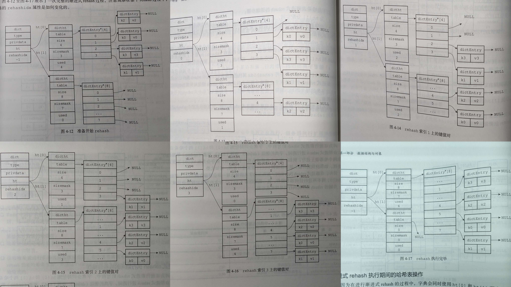

# 第 4 章 字典

Redis 自己实现了哈希表。代码见 https://github.com/redis/redis/blob/unstable/src/dict.h

书中让我觉得有趣的地方在于「在线 `rehash` 」， **是否线程安全** 以及 **如何加锁** 是我想通过观察源码学习的，书中没提。

<!-- @import "[TOC]" {cmd="toc" depthFrom=3 depthTo=6 orderedList=false} -->

<!-- code_chunk_output -->

- [4.1 字典的实现](#41-字典的实现)
- [4.2 哈希算法](#42-哈希算法)
- [4.3 解决键冲突](#43-解决键冲突)
- [4.4 rehash](#44-rehash)
- [4.5 渐进式 rehash](#45-渐进式-rehash)
- [阅读源码：启动 server -> event loop -> 触发 rehash](#阅读源码启动-server-event-loop-触发-rehash)

<!-- /code_chunk_output -->

### 4.1 字典的实现

```c
typedef struct dictEntry {
    void *key;
    union {
        void *val;
        uint64_t u64;
        int64_t s64;
        double d;
    } v;
    struct dictEntry *next;     /* Next entry in the same hash bucket. */
    void *metadata[];           /* An arbitrary number of bytes (starting at a
                                 * pointer-aligned address) of size as returned
                                 * by dictType's dictEntryMetadataBytes(). */
} dictEntry;

typedef struct dict dict;

typedef struct dictType {
    uint64_t (*hashFunction)(const void *key);
    void *(*keyDup)(dict *d, const void *key);
    void *(*valDup)(dict *d, const void *obj);
    int (*keyCompare)(dict *d, const void *key1, const void *key2);
    void (*keyDestructor)(dict *d, void *key);
    void (*valDestructor)(dict *d, void *obj);
    int (*expandAllowed)(size_t moreMem, double usedRatio);
    /* Allow a dictEntry to carry extra caller-defined metadata.  The
     * extra memory is initialized to 0 when a dictEntry is allocated. */
    size_t (*dictEntryMetadataBytes)(dict *d);
} dictType;

#define DICTHT_SIZE(exp) ((exp) == -1 ? 0 : (unsigned long)1<<(exp))
#define DICTHT_SIZE_MASK(exp) ((exp) == -1 ? 0 : (DICTHT_SIZE(exp))-1)

struct dict {
    dictType *type;

    // c 语言读的少，可能有些反直觉
    // 可以理解为 var ht_table [2][]dictEntry
    // ht_table[0] 的 length 就是哈希表的键的数量
    dictEntry **ht_table[2];
    unsigned long ht_used[2];

    long rehashidx; /* rehashing not in progress if rehashidx == -1 */

    /* Keep small vars at end for optimal (minimal) struct padding */
    int16_t pauserehash; /* If >0 rehashing is paused (<0 indicates coding error) */
    signed char ht_size_exp[2]; /* exponent of size. (size = 1<<exp) */
};

/* If safe is set to 1 this is a safe iterator, that means, you can call
 * dictAdd, dictFind, and other functions against the dictionary even while
 * iterating. Otherwise it is a non safe iterator, and only dictNext()
 * should be called while iterating. */
typedef struct dictIterator {
    dict *d;
    long index;
    int table, safe;
    dictEntry *entry, *nextEntry;
    /* unsafe iterator fingerprint for misuse detection. */
    unsigned long long fingerprint;
} dictIterator;
```

`DICTHT_SIZE_MASK` 是与哈希表的大小有关的：这个宏提供了一个掩码；扩容或缩容后，哈希算法可以不变，但是掩码变了，因此最终得到的 `key` 变了。

### 4.2 哈希算法

Redis 3.0 采用的 MurmurHash2 ： https://github.com/aappleby/smhasher

### 4.3 解决键冲突

可以理解为拉链法。

### 4.4 rehash

这里会在负载因子（ `load_factor = ht[0].used / ht[0].size` ）在特定情况下达到一定数值时自动进行扩容或收缩。

### 4.5 渐进式 rehash



主要在于 `rehashidx` 设置得比较巧妙，记录了两类信息：
- `rehashidx == -1` 表示目前没有在进行 rehash ，可以安全读写 `ht[0]`
- `rehashidx == x (x >= 0)` 表示目前 `0..x` 都已经转移到新开辟的区域了，你要访问的话去 `ht[1]` ，其他的在 `ht[0]`

### 阅读源码：启动 server -> event loop -> 触发 rehash

我最关心的问题：
- `rehashing` 没有锁吗？如果我在执行过程中突然访问了 dict 怎么办？

简言之概括我读代码的结论：
- 不需要锁， redis 内部有自己的 event loop ； redis server 启动之后，定期 rehash

```c
// src/server.c
int main(int argc, char **argv) {
    ...
    initServer();
    ...
    initListeners();
    ...
    aeMain(server.el);
    aeDeleteEventLoop(server.el);
    return 0;
}
```

在 `initServer` 中将 `serverCron` 函数（指针）加入到 event loop 中。

```c
void initServer(void) {
    ...
    createSharedObjects();
    adjustOpenFilesLimit();
    const char *clk_msg = monotonicInit();
    serverLog(LL_NOTICE, "monotonic clock: %s", clk_msg);
    server.el = aeCreateEventLoop(server.maxclients+CONFIG_FDSET_INCR);
    ...
    /* Create the timer callback, this is our way to process many background
     * operations incrementally, like clients timeout, eviction of unaccessed
     * expired keys and so forth. */
    if (aeCreateTimeEvent(server.el, 1, serverCron, NULL, NULL) == AE_ERR) {
        serverPanic("Can't create event loop timers.");
        exit(1);
    }
    ...
}
```

`serverCron` 中调用了 `databasesCron` （可以理解为是 serverCron 的一个子任务），其中包含了检查是否 rehashing 并且去“小心谨慎地” rehashing 几步或者任务限时 100ms 。具体见 `dictRehashMilliseconds` 函数。

```c
/* Our hash table implementation performs rehashing incrementally while
 * we write/read from the hash table. Still if the server is idle, the hash
 * table will use two tables for a long time. So we try to use 1 millisecond
 * of CPU time at every call of this function to perform some rehashing.
 *
 * The function returns 1 if some rehashing was performed, otherwise 0
 * is returned. */
int incrementallyRehash(int dbid) {
    /* Keys dictionary */
    if (dictIsRehashing(server.db[dbid].dict)) {
        dictRehashMilliseconds(server.db[dbid].dict,1);
        return 1; /* already used our millisecond for this loop... */
    }
    /* Expires */
    if (dictIsRehashing(server.db[dbid].expires)) {
        dictRehashMilliseconds(server.db[dbid].expires,1);
        return 1; /* already used our millisecond for this loop... */
    }
    return 0;
}


/* This function handles 'background' operations we are required to do
 * incrementally in Redis databases, such as active key expiring, resizing,
 * rehashing. */
void databasesCron(void) {
    ...
    /* Perform hash tables rehashing if needed, but only if there are no
     * other processes saving the DB on disk. Otherwise rehashing is bad
     * as will cause a lot of copy-on-write of memory pages. */
    if (!hasActiveChildProcess()) {
        /* Rehash */
        if (server.activerehashing) {
            for (j = 0; j < dbs_per_call; j++) {
                int work_done = incrementallyRehash(rehash_db);
                if (work_done) {
                    /* If the function did some work, stop here, we'll do
                     * more at the next cron loop. */
                    break;
                } else {
                    /* If this db didn't need rehash, we'll try the next one. */
                    rehash_db++;
                    rehash_db %= server.dbnum;
                }
            }
        }
    }
}

// src/dict.c
/* Rehash in ms+"delta" milliseconds. The value of "delta" is larger 
 * than 0, and is smaller than 1 in most cases. The exact upper bound 
 * depends on the running time of dictRehash(d,100).*/
int dictRehashMilliseconds(dict *d, int ms) {
    if (d->pauserehash > 0) return 0;

    long long start = timeInMilliseconds();
    int rehashes = 0;

    while(dictRehash(d,100)) {
        rehashes += 100;
        if (timeInMilliseconds()-start > ms) break;
    }
    return rehashes;
}

// 注意 dictRehash 回向前寻找 n*10 个 bucket ，如果这些 bucket 都已经 rehash 过了
// 那么本次 dictRehash 就停下
// 或者顶多 rehash n 次
/* Performs N steps of incremental rehashing. Returns 1 if there are still
 * keys to move from the old to the new hash table, otherwise 0 is returned.
 *
 * Note that a rehashing step consists in moving a bucket (that may have more
 * than one key as we use chaining) from the old to the new hash table, however
 * since part of the hash table may be composed of empty spaces, it is not
 * guaranteed that this function will rehash even a single bucket, since it
 * will visit at max N*10 empty buckets in total, otherwise the amount of
 * work it does would be unbound and the function may block for a long time. */
int dictRehash(dict *d, int n) {
    int empty_visits = n*10; /* Max number of empty buckets to visit. */
    if (!dictIsRehashing(d)) return 0;

    while(n-- && d->ht_used[0] != 0) {
        dictEntry *de, *nextde;

        /* Note that rehashidx can't overflow as we are sure there are more
         * elements because ht[0].used != 0 */
        assert(DICTHT_SIZE(d->ht_size_exp[0]) > (unsigned long)d->rehashidx);
        while(d->ht_table[0][d->rehashidx] == NULL) {
            d->rehashidx++;
            if (--empty_visits == 0) return 1;
        }
        de = d->ht_table[0][d->rehashidx];
        /* Move all the keys in this bucket from the old to the new hash HT */
        while(de) {
            uint64_t h;

            nextde = de->next;
            /* Get the index in the new hash table */
            h = dictHashKey(d, de->key) & DICTHT_SIZE_MASK(d->ht_size_exp[1]);
            de->next = d->ht_table[1][h];
            d->ht_table[1][h] = de;
            d->ht_used[0]--;
            d->ht_used[1]++;
            de = nextde;
        }
        d->ht_table[0][d->rehashidx] = NULL;
        d->rehashidx++;
    }

    /* Check if we already rehashed the whole table... */
    if (d->ht_used[0] == 0) {
        zfree(d->ht_table[0]);
        /* Copy the new ht onto the old one */
        d->ht_table[0] = d->ht_table[1];
        d->ht_used[0] = d->ht_used[1];
        d->ht_size_exp[0] = d->ht_size_exp[1];
        _dictReset(d, 1);
        d->rehashidx = -1;
        return 0;
    }

    /* More to rehash... */
    return 1;
}
```
