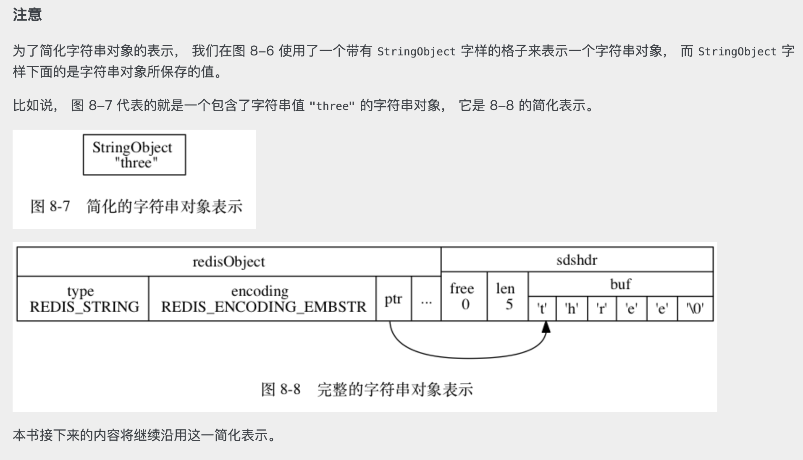

# 第 8 章 对象

<!-- @import "[TOC]" {cmd="toc" depthFrom=3 depthTo=6 orderedList=false} -->

<!-- code_chunk_output -->

- [8.1 对象的类型与编码](#81-对象的类型与编码)
  - [8.1.1 类型](#811-类型)
  - [8.1.2 编码和底层实现](#812-编码和底层实现)
- [8.2 字符串对象](#82-字符串对象)
  - [8.2.1 编码的转换](#821-编码的转换)
  - [8.2.2 字符串命令的实现](#822-字符串命令的实现)
- [8.3 列表对象](#83-列表对象)
  - [8.3.1 编码转换](#831-编码转换)
  - [8.3.2 列表命令的实现](#832-列表命令的实现)
- [8.4 哈希对象](#84-哈希对象)
  - [8.4.1 编码转换](#841-编码转换)
  - [8.4.2 哈希命令的实现](#842-哈希命令的实现)
- [8.5 集合对象](#85-集合对象)
  - [8.5.1 编码的转换](#851-编码的转换)
  - [8.5.2 集合命令的实现](#852-集合命令的实现)
- [8.6 有序集合对象](#86-有序集合对象)
  - [8.6.1 编码的转换](#861-编码的转换)
  - [8.6.2 有序集合命令的实现](#862-有序集合命令的实现)
- [8.7 类型检查与命令多态](#87-类型检查与命令多态)
  - [8.7.1 类型检查的实现](#871-类型检查的实现)
  - [8.7.2 多态命令的实现](#872-多态命令的实现)
- [8.8 内存回收](#88-内存回收)
- [8.9 对象共享](#89-对象共享)
- [8.10 对象的空转时长](#810-对象的空转时长)

<!-- /code_chunk_output -->

### 8.1 对象的类型与编码

```
redis> SET msg "hello"
```

如上实际上是创建了两个 Redis 对象。

Redis 对象：

```c
/* Object types */
#define REDIS_STRING 0
#define REDIS_LIST 1
#define REDIS_SET 2
#define REDIS_ZSET 3
#define REDIS_HASH 4

/* Objects encoding. Some kind of objects like Strings and Hashes can be
 * internally represented in multiple ways. The 'encoding' field of the object
 * is set to one of this fields for this object. */
#define REDIS_ENCODING_RAW 0     /* Raw representation */
#define REDIS_ENCODING_INT 1     /* Encoded as integer */
#define REDIS_ENCODING_HT 2      /* Encoded as hash table */
#define REDIS_ENCODING_ZIPMAP 3  /* Encoded as zipmap */
#define REDIS_ENCODING_LINKEDLIST 4 /* Encoded as regular linked list */
#define REDIS_ENCODING_ZIPLIST 5 /* Encoded as ziplist */
#define REDIS_ENCODING_INTSET 6  /* Encoded as intset */
#define REDIS_ENCODING_SKIPLIST 7  /* Encoded as skiplist */
#define REDIS_ENCODING_EMBSTR 8  /* Embedded sds string encoding */

typedef struct redisObject {
    unsigned type:4;
    unsigned encoding:4;
    unsigned lru:REDIS_LRU_BITS; /* lru time (relative to server.lruclock) */
    int refcount;
    void *ptr;
} robj;
```

#### 8.1.1 类型

```
# 键为字符串对象，值为字符串对象
redis> SET msg "hello world"
OK

redis> TYPE msg
string

# 键为字符串对象，值为列表对象
redis> RPUSH numbers 1 3 5
(integer) 6

redis> TYPE numbers
list

# 键为字符串对象，值为哈希对象
redis> HMSET profile name Tome age 25 career Programmer
OK

redis> TYPE profile
hash

# 键为字符串对象，值为集合对象
redis> SADD fruits apple banana cherry
(integer) 3

redis> TYPE fruits
set

# 键为字符串对象，值为有序集合对象
redis> ZADD price 8.5 apple 5.0 banana 6.0 cherry
(integer) 3

redis> TYPE price
zset
```

具体，可以参考 redis.h 。我们便有了 C 语言铸造的“对象类型系统”。

#### 8.1.2 编码和底层实现

### 8.2 字符串对象

#### 8.2.1 编码的转换

一些类型转换的规则，这里不详细记载。

需要了解的是：
- embstr 是只读的
- 一般而言，需要对 embstr 做操作，则其先会被转换成 raw 类型

#### 8.2.2 字符串命令的实现

一些相关的 Redis Cli 

**字符串对象是唯一一种会被其他对象嵌套的对象。**

### 8.3 列表对象

- linkedlist
- ziplist

如果是 linkedlist ，则每个 node 都是一个 stringObject 。



#### 8.3.1 编码转换

ziplist 在较小的数据分布下被优先使用。

#### 8.3.2 列表命令的实现

### 8.4 哈希对象

- ziplist
- hashtable

ziplist 可以以 `<k><v><k><v>` 的形式保存键值对。

#### 8.4.1 编码转换

#### 8.4.2 哈希命令的实现

### 8.5 集合对象

- intset
- hashtable

#### 8.5.1 编码的转换

#### 8.5.2 集合命令的实现

### 8.6 有序集合对象

- ziplist
- skiplist

值得注意的是， ziplist 用于较小的数据集；较大数据集使用 skiplist + dict 实现：
```c
typedef struct zset {
    dict *dict;
    zskiplist *zsl;
} zset;
```

- zskiplist 确保字典是有序的，可以进行范围查找
- 单个查找使用 dict 可以实现 O(1) 时间复杂度

#### 8.6.1 编码的转换

#### 8.6.2 有序集合命令的实现

### 8.7 类型检查与命令多态

不是传统意义的面向对象多态（通过虚表和指针）；更多的是一种逻辑判断。毕竟类型已经显示地记在 struct 中了。

#### 8.7.1 类型检查的实现

#### 8.7.2 多态命令的实现

### 8.8 内存回收

`refcount`

### 8.9 对象共享

增加 `refcount` ，指针指向同一块区域。值得注意的是并不是所有对象都共享的，因为在验证能否共享前，需要对对象进行比较，这里涉及到空间vs时间的取舍。

### 8.10 对象的空转时长

`lru` ，键对象被访问时会刷新该值。
