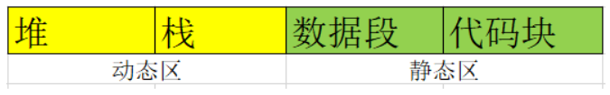
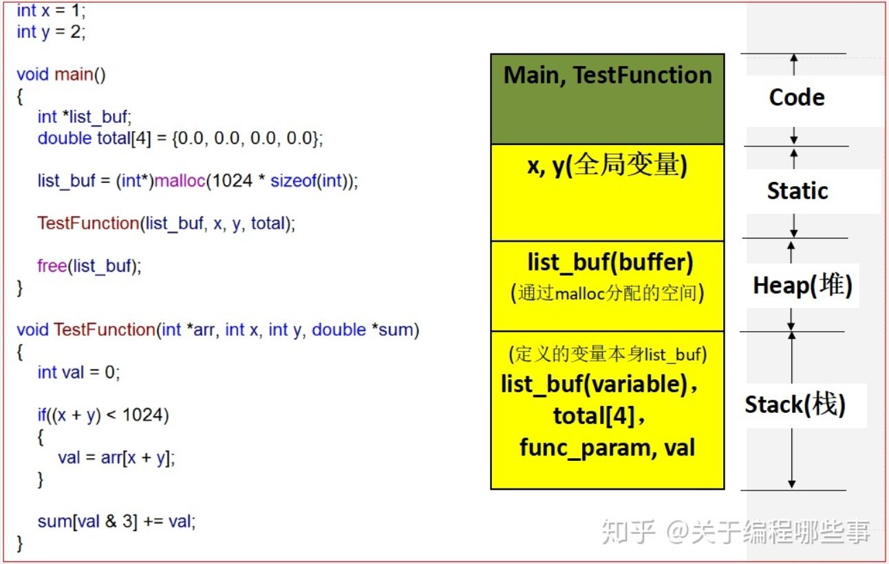
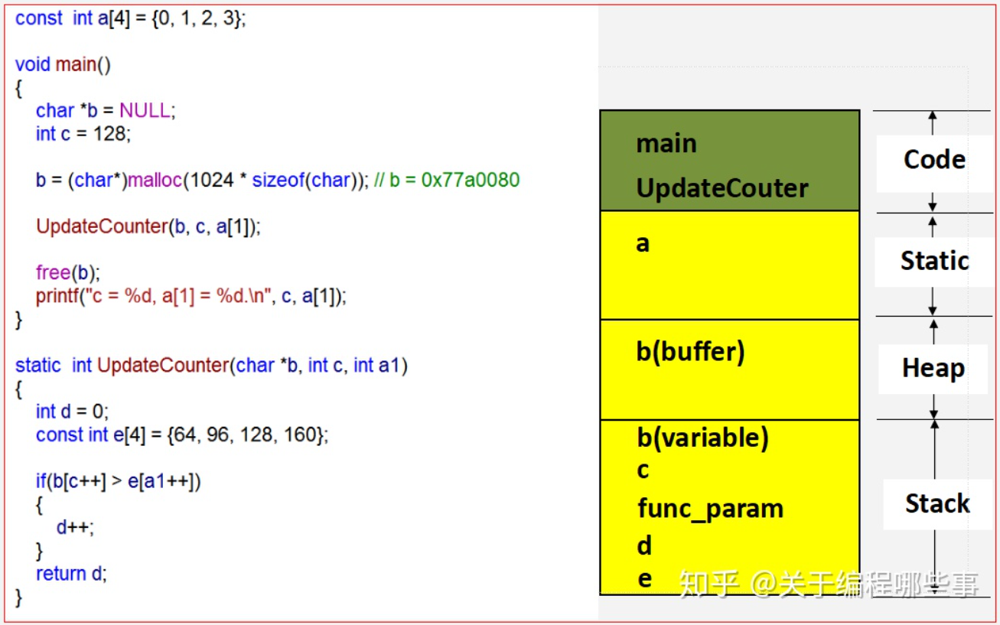
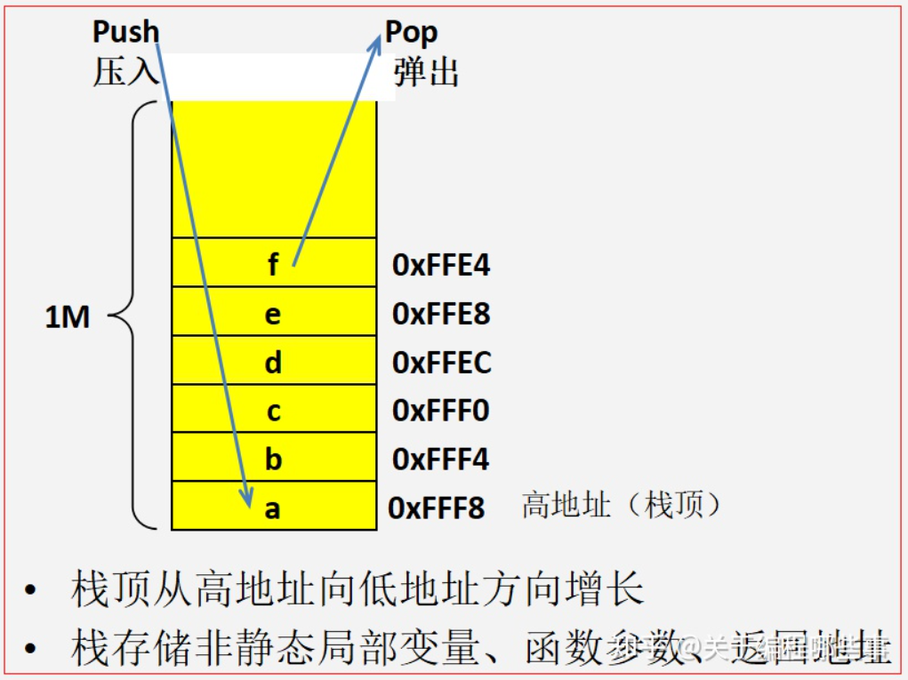
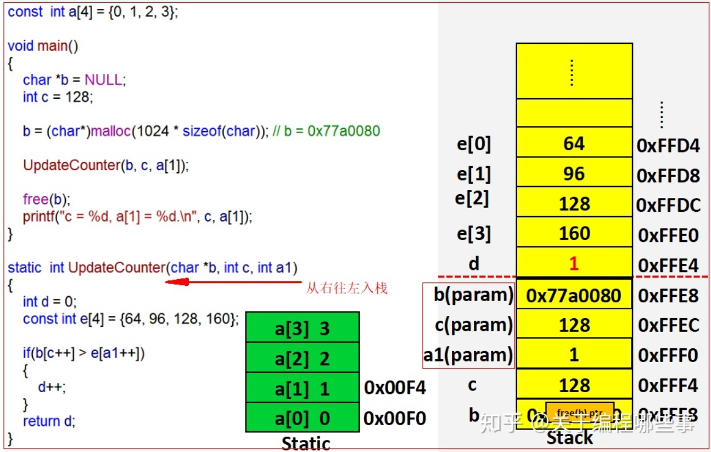

# 栈和堆分别是什么？

以前在计算机体系结构中学过，这里回忆总结一下，未必完全正确。

摘录自：
- C语言中的堆、栈和内存映射！ - 关于编程哪些事的文章 - 知乎 https://zhuanlan.zhihu.com/p/91807561
- C语言的内存分配——栈、堆 - jeremie的文章 - 知乎 https://zhuanlan.zhihu.com/p/96856260
- C++打印堆栈的几种方法 - TOMOCAT的文章 - 知乎 https://zhuanlan.zhihu.com/p/426518821
- 堆和栈的区别 - 知乎用户38Q1jd的文章 - 知乎 https://zhuanlan.zhihu.com/p/78478567

目录：

<!-- @import "[TOC]" {cmd="toc" depthFrom=3 depthTo=6 orderedList=false} -->

<!-- code_chunk_output -->

- [C中内存分配/二进制文件由什么构成](#c中内存分配二进制文件由什么构成)
- [结合代码的示例](#结合代码的示例)
  - [例子一：基本概念](#例子一基本概念)
  - [例子二：指针指向一块内存的例子](#例子二指针指向一块内存的例子)
- [C中栈的例子](#c中栈的例子)
- [C中打印堆栈](#c中打印堆栈)
- [一些心得](#一些心得)

<!-- /code_chunk_output -->

### C中内存分配/二进制文件由什么构成

一个由C/C++编译的程序占用的内存分为以下几个部分：
- 栈区（stack）由编译器自动分配释放，存放函数的参数值，局部变量的值等。其操作方式类似于数据结构中的栈。
- 堆区（heap）一般由程序员分配释放，若程序员不释放，程序结束时可能由操作系统回收。注意它与数据结构中的堆是两回事，分配方式倒是类似于链表。
- 全局区/静态区（static）全局变量和静态变量的存储是放在一块的，初始化的全局变量和静态变量在一块区域， 未初始化的全局变量和未初始化的静态变量在相邻的另一块区域。程序结束后由系统释放。
- 文字常量区（也属于代码区）：常量字符串就是放在这里的。程序结束后由系统释放。
- 程序代码区（text segment）：存放函数体的二进制代码。

二级制文件由什么构成？



### 结合代码的示例

#### 例子一：基本概念

```cpp
//main.cpp    
int   a   =   0;   全局初始化区    
char   *p1;   全局未初始化区    
main()    
{    
int   b;   栈    
char   s[]   =   "abc";   栈    
char   *p2;   栈    
char   *p3   =   "123456";   123456/0在常量区，p3在栈上。    
static   int   c   =0；   全局（静态）初始化区    
p1   =   (char   *)malloc(10);    
p2   =   (char   *)malloc(20);    
分配得来得10和20字节的区域就在堆区。    
strcpy(p1,   "123456");   123456/0放在常量区，编译器可能会将它与p3所指向的"123456"  
优化成一个地方。
}
```





#### 例子二：指针指向一块内存的例子

```cpp
char   s1[]   =   "aaaaaaaaaaaaaaa";    
char   *s2   =   "bbbbbbbbbbbbbbbbb";    
aaaaaaaaaaa是在运行时刻赋值的；    
而bbbbbbbbbbb是在编译时就确定的；    
但是，在以后的存取中，在栈上的数组比指针所指向的字符串(例如堆)快。    
比如：    
#include    
void   main()    
{    
char   a   =   1;    
char   c[]   =   "1234567890";    
char   *p   ="1234567890";    
a   =   c[1];    
a   =   p[1];    
return;    
}    
```

### C中栈的例子



int abc(int a, int b) //注意：c语言的形参是从右到左入栈的，b先入栈，a后入栈；a先出栈，b后出栈。



### C中打印堆栈

- glibc中的backtrace函数
- gcc内置函数__builtin_return_address
- 第三方库libunwind

### 一些心得

关于 heap 是如何分配空间的，可以参考丹尼斯里奇的《C程序设计语言》一书的最后一部分，堪称经典。

不要小看现代编译器的强大，很多内容并非是是像中文教材上一样死板，编译器能为我们优化很多内存分配。
