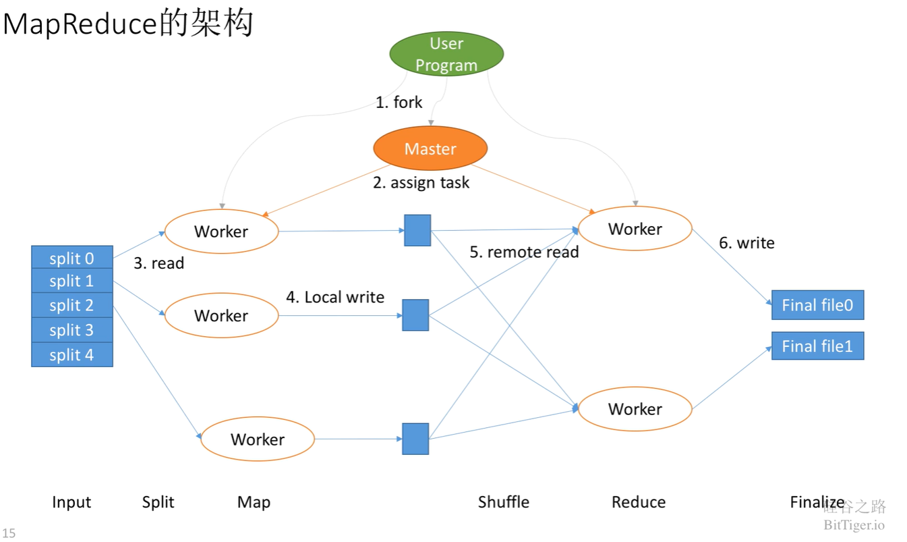
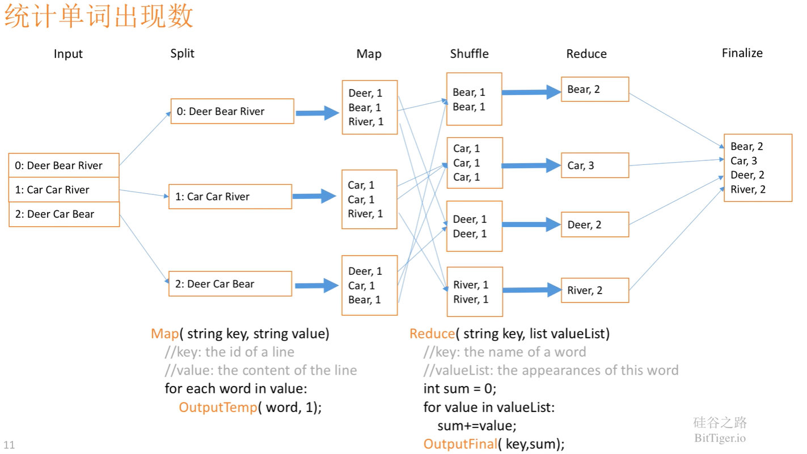
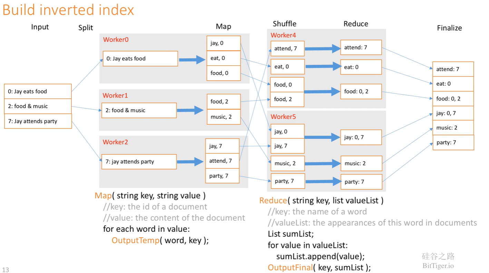

# MapReduce

<!-- @import "[TOC]" {cmd="toc" depthFrom=3 depthTo=6 orderedList=false} -->

<!-- code_chunk_output -->

- [MapReduce 思想](#mapreduce-思想)
- [MapReduce 实例](#mapreduce-实例)
  - [词频统计和倒排索引](#词频统计和倒排索引)

<!-- /code_chunk_output -->

都说 Google 有三宝：
- GFS 文件系统
- Bigtable 存储技术
- MapReduce 计算方法

[1] Dean, J. . (2004). MapReduce : Simplified Data Processing on Large Clusters. Symposium on Operating System Design & Implementation.

有[资料](https://baike.baidu.com/item/MapReduce/133425)显示， MapReduce 来源于函数式编程的启发（比如 `Lisp` ），如果单纯说 `map` 函数和 `reduce` 函数的话，我在以下语言中都见过并且经常使用：
- Python
- JavaScript
- Scala

### MapReduce 思想

参考：
- [从分治算法到 MapReduce - 终日而思一的文章 - 知乎](https://zhuanlan.zhihu.com/p/50733498)
- [mapreduce为什么被淘汰了？ - 极客时间的回答 - 知乎](https://www.zhihu.com/question/303101438/answer/655475086)
- [深入浅出讲解 MapReduce - Youtube](https://www.youtube.com/watch?v=Rz8JCS9TfOQ)

从数据库角度来看， MapReduce 是 `select + groupBy` ；从算法角度来看，是分治法。

Map 本质上就是做拆解， Reduce 本质上就是做组合。

### MapReduce 实例

#### 词频统计和倒排索引

词频统计就是统计各个单词出现的次数。

倒排索引：统计每个词分别出现在了哪些文章里，这样就可以根据关键词寻找文章。
