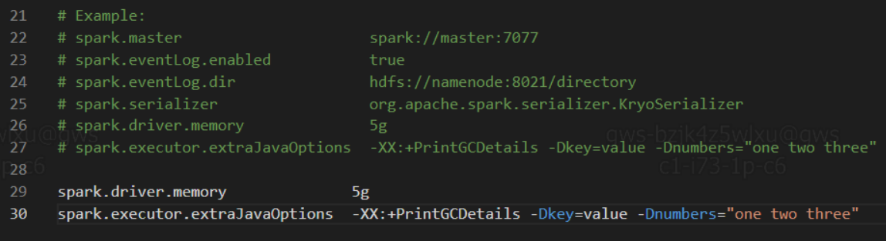
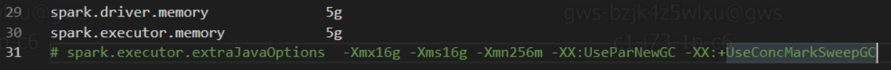

# 关于 Spark 工作日志记录

上手 Spark ，主要与数据结构 RDD 进行斗争。这里记录一些心得。方便日后再用到快速捡起来。

我这里版本较新， `spark` 实例相当于 `sparkContext` 实例。

就是举个例子，开个头，提个注意事项，真有什么还得查官方文档：http://spark.apache.org/

<!-- @import "[TOC]" {cmd="toc" depthFrom=3 depthTo=4 orderedList=false} -->

<!-- code_chunk_output -->

- [数据『读写』以及『分列』操作](#数据读写以及分列操作)
  - [『分列』](#分列)
  - [读写](#读写)
- [一些技巧](#一些技巧)
  - [.zipWithIndex.foreach](#zipwithindexforeach)
- [一些疑惑](#一些疑惑)
  - [如何从 DataFrame 中取出具体某一行！](#如何从-dataframe-中取出具体某一行)

<!-- /code_chunk_output -->

### 数据『读写』以及『分列』操作

读一个 csv 文件。不使用 `spark.read.format("csv").csv(path)` ，直接用 `spark.sparkContext.textFile(path)` 读生的数据。

```scala
val rawRDD: RDD[String] = spark.sparkContext.textFile(path)
// rawRDD 只有一列， take 后返回一个 Array 里面每个元素对应每一行
// 因此就算 take(1) 也返回一个 Array ，里面只有一个元素就是第一行的元素
// 因此还要再取索引 0
// 取到后，用 `split(',')` 分割字符串（ csv 是用字符 ',' 分割的）
val columns: Array[String] = rawRDD.take(1)(0).split(',')

// 我们的表头就是 columns
println("一共有" + columns.length.toString + "列")

import.implicits._  // 必须引入语法糖，否则无法调用 toDF 方法
val header = rawRDD.first
val df: DataFrame = rawRDD.filter(_ != header)  // 不要首行（不要表头）
    .map(_split(','))
    .toDF("value")  // 此时 df 只有一列，列内是 Array
    .select($"value" +: columns.indices.map(i => $"value"(i)) : _*)  // 把列内元素取出分散到各列
    .drop("value")  // 不要最开始的存 Array 的列
    .toDF(columns: _*)  // 赋予其表头

df.show(5)
```

#### 『分列』

分列如上：
```scala
.select($"value" +: columns.indices.map(i => $"value"(i)) : _*)  // 把列内元素取出分散到各列
```

Spark SQL 我还没太懂，不明确 `+:` 运算符以及后面的 `: _*` 具体含义，但是感谢老哥[Spark DataFrame数组列转多列-Snail的文章-知乎](https://zhuanlan.zhihu.com/p/148688827)解了我的燃眉之急。

```scala
// 创建RDD
val arrayData = Seq(
    Row("张三",List("Java","Scala","C++")),
    Row("李四",List("Spark","Java","C++")),
    Row("王老五",List("C#","VB",""))
  )

val arrayRDD = spark.sparkContext.parallelize(arrayData)

// 创建DataFrame
import org.apache.spark.sql.types.{ArrayType, StringType, StructType}
import org.apache.spark.sql.Row

val arraySchema = new StructType()
    .add("name",StringType)
    .add("subjects",ArrayType(StringType))

val arrayDF = spark.createDataFrame(arrayRDD, arraySchema)

arrayDF.printSchema
arrayDF.show()
```

输出结果如下：

```scala
root
 |-- name: string (nullable = true)
 |-- subjects: array (nullable = true)
 |    |-- element: string (containsNull = true)

+------+------------------+
|  name|          subjects|
+------+------------------+
|  张三|[Java, Scala, C++]|
|  李四|[Spark, Java, C++]|
|王老五|        [C#, VB, ]|
+------+------------------+
```

##### 一列转多列

```scala
val arrayDFColumn = arrayDF.select(
    $"name" +: (0 until 3).map(i => $"subjects"(i).alias(s"LanguagesKnown$i")): _*
  )

arrayDFColumn.show(false)
```

输出结果如下：

```scala
+------+---------------+---------------+---------------+
|name  |LanguagesKnown0|LanguagesKnown1|LanguagesKnown2|
+------+---------------+---------------+---------------+
|张三  |Java           |Scala          |C++            |
|李四  |Spark          |Java           |C++            |
|王老五|C#             |VB             |               |
+------+---------------+---------------+---------------+
```

##### （嵌套数组）转为多列

```scala
val arrArrData = Seq(
    Row("张三",List(List("Java","Scala","C++"),List("Spark","Java"))),
    Row("李四",List(List("Spark","Java","C++"),List("Spark","Java"))),
    Row("王老五",List(List("C#","VB"),List("Spark","Python")))
  )

var arrArrRDD = spark.sparkContext.parallelize(arrArrData)


val arrArrSchema = new StructType()
    .add("name",StringType)
    .add("subjects",ArrayType(ArrayType(StringType)))

val df = spark.createDataFrame(arrArrRDD,arrArrSchema)

df.printSchema()
df.show(false)
```

输出结果如下：

```scala
root
 |-- name: string (nullable = true)
 |-- subjects: array (nullable = true)
 |    |-- element: array (containsNull = true)
 |    |    |-- element: string (containsNull = true)

+------+-----------------------------------+
|name  |subjects                           |
+------+-----------------------------------+
|张三  |[[Java, Scala, C++], [Spark, Java]]|
|李四  |[[Spark, Java, C++], [Spark, Java]]|
|王老五|[[C#, VB], [Spark, Python]]        |
+------+-----------------------------------+
```

手写转换代码（嵌套数组转为多列）：

```scala
val df2 = df.select(
   $"name" +: (0 until 2).map(i => $"subjects"(i).alias(s"LanguagesKnown$i")): _*
)

df2.show(false)
```

输出结果如下：

```scala
+------+------------------+---------------+
|name  |LanguagesKnown0   |LanguagesKnown1|
+------+------------------+---------------+
|张三  |[Java, Scala, C++]|[Spark, Java]  |
|李四  |[Spark, Java, C++]|[Spark, Java]  |
|王老五|[C#, VB]          |[Spark, Python]|
+------+------------------+---------------+
```

##### 实现一列转多行

```scala
// 创建RDD
val arrayData = Seq(
    Row("张三",List("Java","Scala","C++")),
    Row("李四",List("Spark","Java","C++")),
    Row("王老五",List("C#","VB",""))
  )

val arrayRDD = spark.sparkContext.parallelize(arrayData)

// 创建DataFrame
import org.apache.spark.sql.types.{ArrayType, StringType, StructType}
import org.apache.spark.sql.Row

val arraySchema = new StructType()
    .add("name",StringType)
    .add("subjects",ArrayType(StringType))

val arrayDF = spark.createDataFrame(arrayRDD, arraySchema)

arrayDF.printSchema
arrayDF.show()
```

输出结果如下：

```scala
root
 |-- name: string (nullable = true)
 |-- subjects: array (nullable = true)
 |    |-- element: string (containsNull = true)

+------+------------------+
|  name|          subjects|
+------+------------------+
|  张三|[Java, Scala, C++]|
|  李四|[Spark, Java, C++]|
|王老五|        [C#, VB, ]|
+------+------------------+
```

使用explode 表函数:

```scala
// 将一列转多行
val arrayDFColumn = arrayDF.select($"name",explode($"subjects"))

arrayDFColumn.show(false)
```

输出结果如下：

```scala
+------+-----+
|name  |col  |
+------+-----+
|张三  |Java |
|张三  |Scala|
|张三  |C++  |
|李四  |Spark|
|李四  |Java |
|李四  |C++  |
|王老五|C#   |
|王老五|VB   |
|王老五|     |
+------+-----+
```

#### 读写

除了 textFile ，还有更加方便的 write 与 read 。

```scala
df.write
    .mode(SaveMode.Overwrite)
    .option("header", "true")
    .csv(path)

val df: DataFrame = spark.read.format("csv")
    .option("header", "true")
    .option("inferSchema", "true")
    .load(path)
```

### 一些技巧

#### .zipWithIndex.foreach

`zipWithIndex` 正确用法。

```scala
conCols.zipWithIndex.foreach {
    case (conCol, colIndex) =>
        ...
}
```

### 一些疑惑

#### 如何从 DataFrame 中取出具体某一行！

根据老哥[Spark的DataFrame不是真正的DataFrame-秦续业的文章-知乎](https://zhuanlan.zhihu.com/p/135329592)的文章：
- DataFrame 应该有『保证顺序，行列对称』等规律
- 因此「Spark DataFrame 和 Koalas 不是真正的 DataFrame」

> 确实可以运行，但却看到一句话，大意是数据会被放到一个分区来执行，这正是因为数据本身之间并不保证顺序，因此只能把数据收集到一起，排序，再调用 shift。这样就不再是一个分布式的程序了，甚至比 pandas 本身更慢。

我们可以明确一个前提： **Spark 中 DataFrame 是 RDD 的扩展，限于其分布式与弹性内存特性，我们没法直接进行类似 `df.iloc(r, c)` 的操作来取出其某一行。**

但是现在我有个需求，分箱，具体来讲，需要『排序后遍历每一行及其邻居比如 `i` 与 `i+j`』，因此，我们必须能够获取数据的某一行！

不知道有没有高手有好的方法？我只想到了以下几招！

##### 1/3排序后select再collect

`collect` 是将 DataFrame 转换为数组放到内存中来。但是 Spark 处理的数据一般都很大，直接转为数组，会爆内存。

因此不能直接 `collect` 。

要处理哪一列，就直接 `select('列名')` 取出这一列就好，再 `collect` 。我的数据有 `2e5 * 2e4` 这么多，因此 `select` 后只剩一列大小为 `2e5 * 1` ，还是可以 `collect` 的。

这显然不是个好方法！因为无法处理真正的大数据，比如行很多时。

##### 2/3排序后加index然后用SQL查找

给 DataFrame 实例 `.sort("列名")` 后，用 SQL 语句查找：

```sql
select 列名 from df_table where 索引列名 = i
```

我对于 SQL 不是很了解，因此这个做法只是在构思阶段。

此外，我不清楚 SQL 的性能！我要调用很多次 `df.iloc[i, 列]` ，那这样会不会太慢了？

##### 3/3排序后加index然后转置查找列名

这个想法也只是停留在脑子里！因为会有些难度。

给每一行加索引列，从0开始计数，然后把矩阵转置，新的列名就用索引列来做。

之后再取第 i 个数，就 `df(i.toString)` 就行。

这个方法似乎靠谱。

##### 附加方案：ml.feature.Bucketizer

```java
import org.apache.spark.ml.feature.{Bucketizer, QuantileDiscretizer}
```

`spark`中 `Bucketizer` 的作用和我实现的需求差不多（尽管细节不同），我猜测其中也应该有相似逻辑。有能力和精力了应该去读读源码，看看官方怎么实现的。

##### 7月20日：想到了一个好方案

一列一列 collect 太慢了，全都 collect 还爆内存，我这里调了配置也没用.





既然我的需求横竖都需要对数组进行排序，在操作某一列时，肯定要把这一列都安排到内存里来。

因此我减少 IO 时间，少 IO 几次，可以一次 collect 一些列。

比如我有 2184 个列，以前一次 collect 一列，要 2184 次 IO ，现在一次 collect 100 个，要 22 次 IO 就行了。快了大概能有 100 倍。

实践中，我的用时从 15 小时提升到了 12 分钟。（快了 75 倍）
