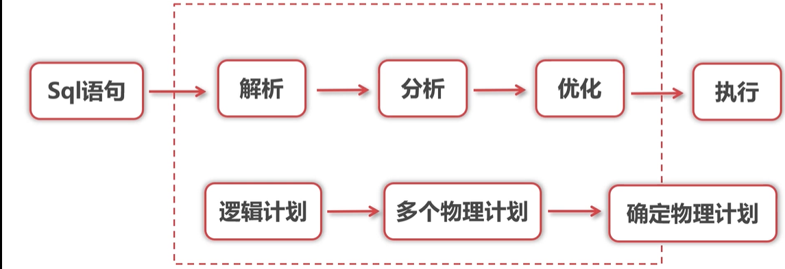
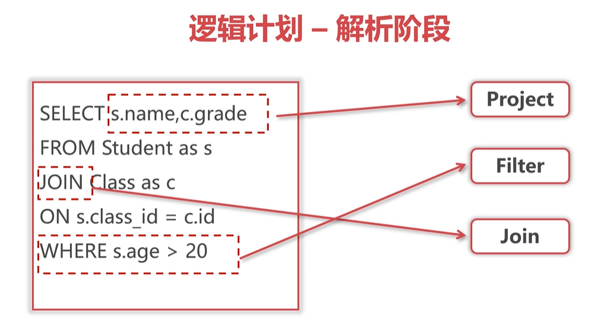
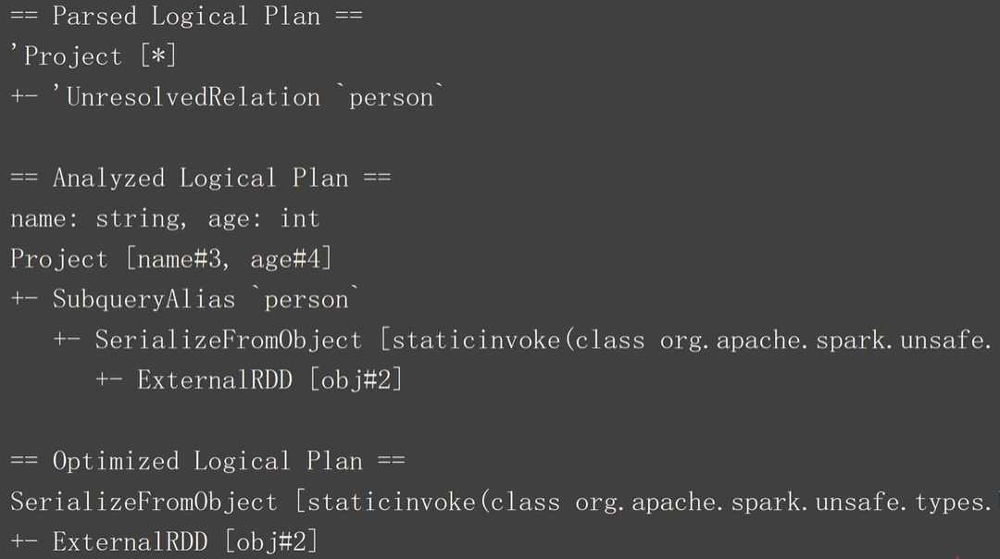
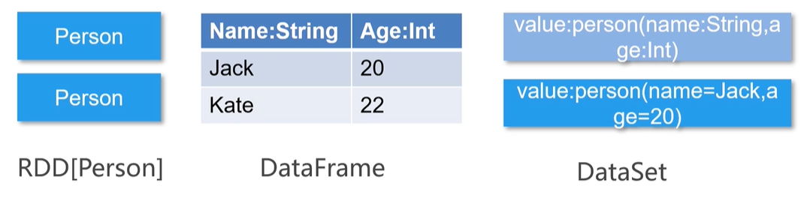
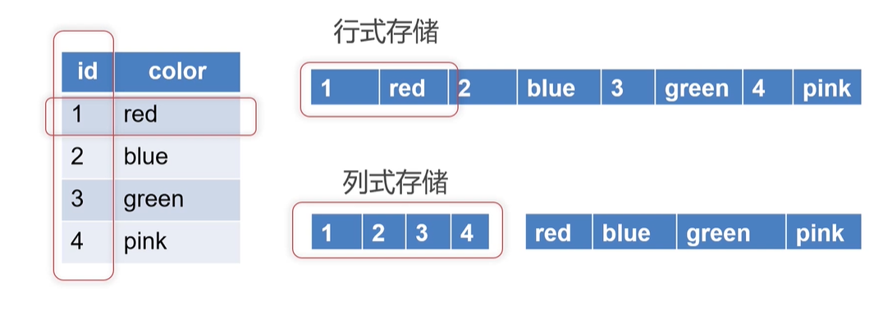

# 简单认识 Spark SQL 以及 Hive 、 Parquet 列式存储


<!-- @import "[TOC]" {cmd="toc" depthFrom=3 depthTo=6 orderedList=false} -->

<!-- code_chunk_output -->

- [Spark SQL 与 Hive](#spark-sql-与-hive)
  - [Spark SQL 是什么](#spark-sql-是什么)
  - [Spark SQL 的入口以及支持 Hive](#spark-sql-的入口以及支持-hive)
  - [Spark SQL 与 Hive 区别](#spark-sql-与-hive-区别)
- [Spark SQL 运行原理](#spark-sql-运行原理)
  - [逻辑计划](#逻辑计划)
  - [物理计划](#物理计划)
  - [Catalyst 优化器](#catalyst-优化器)
- [DataFrame 与 DataSet](#dataframe-与-dataset)
  - [RDD 、 DataFrame 与 DataSet](#rdd-dataframe-与-dataset)
  - [实例：创建 DataFrame 与 DataSet](#实例创建-dataframe-与-dataset)
- [Parquet 列式存储](#parquet-列式存储)

<!-- /code_chunk_output -->

### Spark SQL 与 Hive

#### Spark SQL 是什么

- 分布式 SQL 引擎
- 底层依赖 RDD
- 处理结构化数据的一个模块（基于 Spark Core 有四个常见模块： Spark SQL 、 Spark Streaming 、 MLlib 、 GraphX ）

#### Spark SQL 的入口以及支持 Hive

- 2.0 版本之前 SQLContext / HiveContext
- 2.0 版本之后使用 SparkSession

如下：
```scala
val spark = SparkSession.builder()
                        .enableHiveSupport()
                        .getOrCreate
```

Spark / SQL 客户端 通过 Hive 访问数据过程：
- sql 查询
- Thrift Server
- Metastore Server
- 数据

如何配置整合 Hive Spark ？两部：
- 在 `$SPARK_HOME/conf` 下添加 `hive-site.xml` 文件
- 启动 `thriftserver` 服务 `./$SPARK_HOME/sbin/start-thriftserver.sh`

#### Spark SQL 与 Hive 区别

- Hive 是基于 MapReduce 框架实现 SQL 基本操作
- Spark SQL 拥有 Catalyst 优化器
- Spark SQL 能够支持不同的数据源

Spark SQL 能代替 Hive 吗？不可以，两者不是干同一个事的：
- Spark SQL 没有自己的存储， Hive 集成 HDFS
- Spark SQL 没有自己的元数据管理，要依赖 Hive
- Hive 有 Sqoop ， Flume 等数据源同步配套组件

这里可以提到两个“术语”：
- **Hive on Spark** 在 Spark 功能没有那么强大的时候， Hive 既作为存储又负责解析，Spark 只负责执行
- **Spark on Hive** Hive 只作为存储， Spark 负责解析、执行

### Spark SQL 运行原理

Spark SQL 语句的运行流程如下。



#### 逻辑计划

首先生成逻辑计划，分为三个阶段：
- Parsed Logical Plan 解析阶段
- Analyzed Logical Plan 分析阶段
- Optimized Logical Plan 优化阶段

解析阶段做的事如下图。



如上，解析阶段做一些词法分析、语法分析，最终生成语法树。

分析阶段则将表格的 schema 信息和函数信息绑定到语法树上。

最终，优化阶段使用 Spark 优化器进行优化。

在优化阶段，主要使用基于规则的优化器 RBO 对语法树进行修剪。

```sql
// 使用 explain(true) 可以打印逻辑计划
sparkSession.sql("select * from Person").explaion(true)
```



逻辑计划打印如上。

#### 物理计划

逻辑计划并不能直接执行。因为没有具体执行方案。

例如物理计划就是将 Join 转为 Join 算子。

Spark 会产生多个物理计划，然后选择成本最小的执行。

#### Catalyst 优化器

基于规则的优化器 RBO ：经验式的优化思路，不擅长处理 Join 。

基于代价的优化器 CBO ：专门针对 Join 进行优化。

### DataFrame 与 DataSet

#### RDD 、 DataFrame 与 DataSet



如上：
- DataFrame 将 RDD 理解为二维表格，能知晓表的结构信息； DataFrame 以 RDD 为基础，是 Row 对象的集合
- DataSet 是 DataFrame 的一个特例，特点就在于其是强类型的数据集
- **上述内容结合下面的`创建实例代码`更好理解**

DataFrame 对比 RDD 的优势：
- DF 提供了数据的结构信息
- DF 定制化内存管理，数据存放于 JVM 堆外内存
- DF 是先转换成逻辑计划再去运行，对任何语言，执行效率一样
- DF 提供更丰富的 API

DataSet 对比 DataFrame 的优势：
- 具备了 DataFrame 的优点
- 编译时类型安全
- API 面向对象
- Encoder 能够在不反序列化整个对象情况下进行操作（提高分布式效率）

#### 实例：创建 DataFrame 与 DataSet

如下是 RDD 生成 DataFrame 方法之一： `toDF` 。

```scala
import org.apache.spark.sql.SparkSession

object Test1 {

  case class Person(name: String, age: Int)  // case class 放在自己被使用的作用域外
  def main(args: Array[String]): Unit = {
    System.setProperty("hadoop.home.dir", "C:\\Program Files\\hadoop-2.7.1")
    
    val sparkSession = SparkSession
      .builder()
      .master("local")
      .getOrCreate()

    val sparkContext = sparkSession.sparkContext

    /**
     * Jack 21
     * Kate 22
     * Ming 20
     */
    val rdd = sparkContext.textFile(
      "E:\\temp_piper\\testspark\\src\\main\\scala\\data.txt"
    )

    val rowRDD = rdd.map(_.split(" "))
      .map(x => Person(x(0), x(1).toInt))

    // 引入隐式转换
    import sparkSession.implicits._
    val df = rowRDD.toDF()

    df.show()

    sparkSession.stop()
  }
}
```

也可以用 `schema` 与 `createDataFrame` 。

```scala
val schemaField = "name,age"
val schemaString = schemaField.split(",")
val schema = StructType(
  List(
    StructField(schemaString(0), StringType, nullable = true),
    StructField(schemaString(1), IntegerType, nullable = true)
  )
)

val rowRDD = rdd.map(_.split(" "))
  .map(x => Row(x(0), x(1).toInt))

val df = sparkSession.createDataFrame(rowRDD, schema)
df.show()

sparkSession.stop()
```

DataFrame 以及 rdd 转为 DataSet 如下：

```scala
// 从 DataFrame 来 as
import sparkSession.implicits._
val ds = df.as[Person]
ds.show()

// 从 rdd 转换
import sparkSession.implicits._
val ds = sparkSession.createDataset(rdd)
ds.show()
```

以上的输出都是
```
+-------+
|  value|
+-------+
|Jack 21|
|Kate 22|
|Ming 20|
+-------+
```

### Parquet 列式存储



如上：
- 传统的行式存储一行数据被存在了一起，导致查询时会得到很多无用信息；并且行式存储使用索引进行查找，不适于分布式架构
- 而列式存储将列数据放在一起，不会得到很多不需要的信息

如果有嵌套数据格式如下：
```cpp
struct LogEven {
    LogBase: log_base
    String: context
    String: referrubf_event
}
// 而 LogBase 又是一个 struct
struct LogBase {
    String: id
    String: ip_address
}
```

一般来讲，我们将嵌套数据序列化成 json ，使用时再反序列化；而 Parquet 可以直接保存，不需要序列化反序列化，大大提升了存储效率。

Parquet 优势：
- 支持列存储+嵌套数据格式+适配多个计算框架
- 节省表扫描时间和反序列的时间
- 压缩技术稳定出色， 节省存储空间
- Spark 操作 Parquet 文件比操作 CSV 等普通文件的速度更快

Spark SQL 下可以进行 Parquet 的自动分区推断：

```sql
sparkSession.read.option("basePath", "/hive/warehouse/data_table/").parquet("/hive/warehouse/data_table/year=2019/month=06/*")
```
