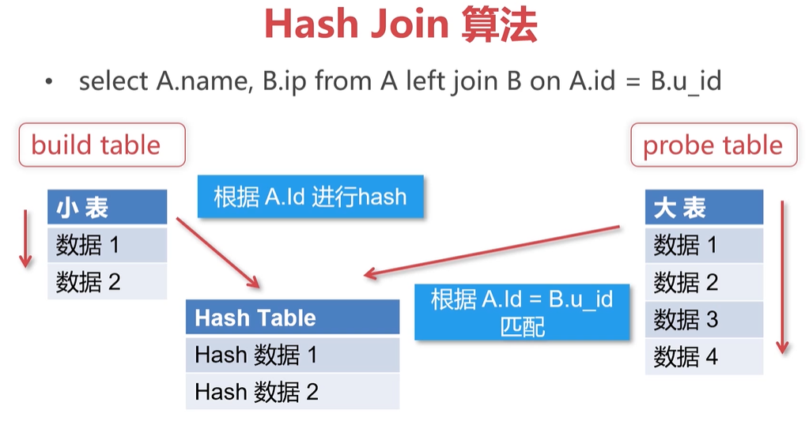
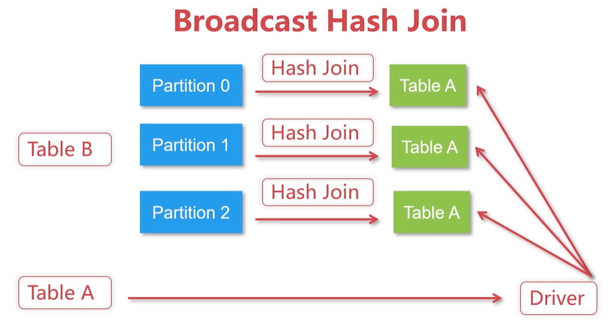
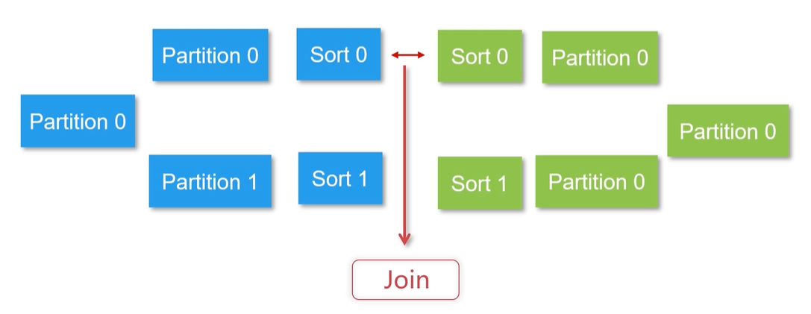

# DataFrame/DataSet 常用操作如多种 join 及其算法


<!-- @import "[TOC]" {cmd="toc" depthFrom=3 depthTo=6 orderedList=false} -->

<!-- code_chunk_output -->

- [查找和过滤](#查找和过滤)
  - [select 与 col](#select-与-col)
  - [条件查询（注意col使用===与=!=）以及逻辑运算方法](#条件查询注意col使用与以及逻辑运算方法)
- [聚合操作： groupby 和 agg](#聚合操作-groupby-和-agg)
- [列的增删与空值处理](#列的增删与空值处理)
  - [新增自增序号列 monotonically_increasing_id 等](#新增自增序号列-monotonically_increasing_id-等)
  - [行转列，透视 pivot ，空值判断 isNull](#行转列透视-pivot-空值判断-isnull)
- [多表操作 Join](#多表操作-join)
  - [Hash join 算法](#hash-join-算法)
  - [Broadcast Hash Join](#broadcast-hash-join)
  - [Shuffle Hash Join](#shuffle-hash-join)
  - [Sort Merge Join](#sort-merge-join)
  - [Spark SQL 支持的 Join](#spark-sql-支持的-join)

<!-- /code_chunk_output -->

### 查找和过滤

API 细碎的内容不记录了，具体查文档去。

`show(20, false)` 表示显示 20 行，内容不省略。

数据到内存： `collect()` 返回 `Array` ，而 `collectAsList()` 返回 `List` 。

```scala
df.first              // Row
df.head(3)            // Array[Row]
df.take(3)            // Array[Row]
df.takeAsList(3)      // List[Row]
df.limit(3).show      // 新的 DataFrame 不是 Action 操作
```

#### select 与 col

```scala
df.select("a", "b").show()
df.select(col("a").as("aa"), col("b") + 1).show()
```

使用 `col` 对象可以类型转换、赋别名、进行运算。

#### 条件查询（注意col使用===与=!=）以及逻辑运算方法

```scala
df.where("age > 21")
df.filter("age > 21")
df.where(col("age") > 21)
df.where($"age" > 21)

// 注意 col 的 === 与 =!=
df.where(col("age") === 21)  // 等于
df.where(col("age") =!= 21)  // 不等于

// 多条件查询
val ageFilter_1 = col("age") > 21  // 依然是个 Column 对象
val ageFilter_2 = col("age") < 25
val ageFilter_3 = ageFilter_1.or(ageFilter_2)

df.where(col("name") === "Jack")
  .where(ageFilter_3)

// 逻辑运算方法 && and || or
val ageFilter_1 = col("age") > 21
val ageFilter_2 = col("age") < 25
val ageFilter_3 = ageFilter_1.||(ageFilter_2)
```

### 聚合操作： groupby 和 agg

案例：按照省份分组统计人数。

```scala
/**
 * user_id province city city_level op_phone add_time total_mark
 */
// 案例：按照省份分组计数
df.groupBy(col("province"))
  .count()

// 案例：按照城市、手机运营商分组统计人数按人数排序
df.groupBy(col("city"), col("op_phone"))
  .count()
  .withColumnRenamed("count", "num")
  .orderBy(col("num").desc)


// 案例：按年统计注册用户最高的积分，以及平均积分
df.groupBy(year(col("add_time")))
  .agg(max(col("total_mark")).as("max_mark"),
       avg(col("total_mark")).as("avg_mark")
      )
// 另一种写法
df.groupBy(year(col("add_time")))
  .agg(Map(
    ("total_mark", "max"),
    ("total_mark", "avg")
  ))
// 另一种写法
df.groupBy(year(col("add_time")))
  .agg(Map(
    "total_mark" -> "max",
    "total_mark" -> "avg"
  ))
```

### 列的增删与空值处理

#### 新增自增序号列 monotonically_increasing_id 等

```scala
// 新增列
// 案例：把用户注册时间的年份单独提取出来作为一列
df.withColumn(
  "year",
  year(col("add_time"))
)

// 新增自增序号列
df.withColumn(
  "id",
  monotonically_increasing_id() + 1
)

// 修改数值类型
df.select(col("total_mark").cast(DoubleType))
df.withColumn(
  "total_mark",
  col("total_mark").cast(DoubleType)
)

// 修改多列的数值类型，使用 select 效率最高
val fields = "city_level,total_mark"
val cas = fields.split(",").map(f=>col(f).cast(IntegerType))
df.select(cas: _*)

// 修改列的数值
df.withColumn(
  "op_phone",
  concat(lit("广东"), col("op_phone"))  // 用 lit 作为字面值
)
```

#### 行转列，透视 pivot ，空值判断 isNull

```scala
// 行转列，透视
/**
 * year city count
 * 2018  aa    1
 * 2018  bb    1
 * 2019  cc    1
 * 转化为
 * year aa bb cc
 * 2018  1  1  0
 * 2019  0  0  1
 * 2017  0  0  0
 */
df.groupBy(year(col("add_time")))
  .pivot(col("city"))  // 透视，行转列
  .count()
  .na.fill(0)

// 空值填补，以及对指定列进行操作
df.na.fill(0)
df.na.fill(value=0, cols=Array("city_level"))

// isNull 空值判断
df.where(col("city").isNull)
df.where("city_level is null")
```

### 多表操作 Join

#### Hash join 算法



如上，用小表 id 做 hash 放到内存，然后扫描大表，匹配。

- 都会只扫描两张表一次， 时间复杂度是 $O(a+b)$
- 其中一侧的表格是加载到内存，提高了查询的效率
- Hash Join 是小表映射，大表试探

#### Broadcast Hash Join

Broadcast 阶段：将小表广播到大表所在的所有主机

Hash Join 阶段：在每个 executor 上执行 Hash Join



- 优点:减少了shuffle的开销
- 缺点:只能用于广播较小的表，对driver的内存也是挑战

#### Shuffle Hash Join

- 对两张表按照 Join Key 进行重分区
- 对分区中的数据进行 Hash Join

就是将数据再次分区进行 Join 。

优点：减少了 `driver` 和 `executor` 的内存压力。

#### Sort Merge Join

- 适用于两个表都非常大的场景（无法直接放入内存）
- 需要在 Join 前对数据进行排序



如上，因为 Sort 了，所以也是线性扫描，不需要 Hash 了。

- 不需要把一侧的数据全部加载到内存
- 大大提升了大数据量下 Join 的稳定性

#### Spark SQL 支持的 Join

- Inner Join ：左右表满足 Join 条件的记录
- Left Outer Join ：以左表为准，在右表查找匹配记录，查找失败，设为 `null`
- Right Outer Join ：以右表为准，在左表查找匹配记录，查找失败，设为 `null`
- Full Outer Join ：既要做 `Left Outer Join` ，又要做 `Right Outer Join` ，实现算法仅采用 Sort Merge Join
- Left Semi Join ：以左表为准，在右表查找匹配记录，查找成功，仅返回左边的记录，反之，返回 `null`
- Left Anti Join ：以左表为准，在右表查找匹配记录；查找成功， 返回 `null` ，反之，仅返回左边的记录，与 `Left Semi Join` 相反

代码以 `left_outer` 为例：

```scala
df_1.join(
  df_2,
  df_1("uid") === df_2("u_id"),
  "left_outer:
)
```
