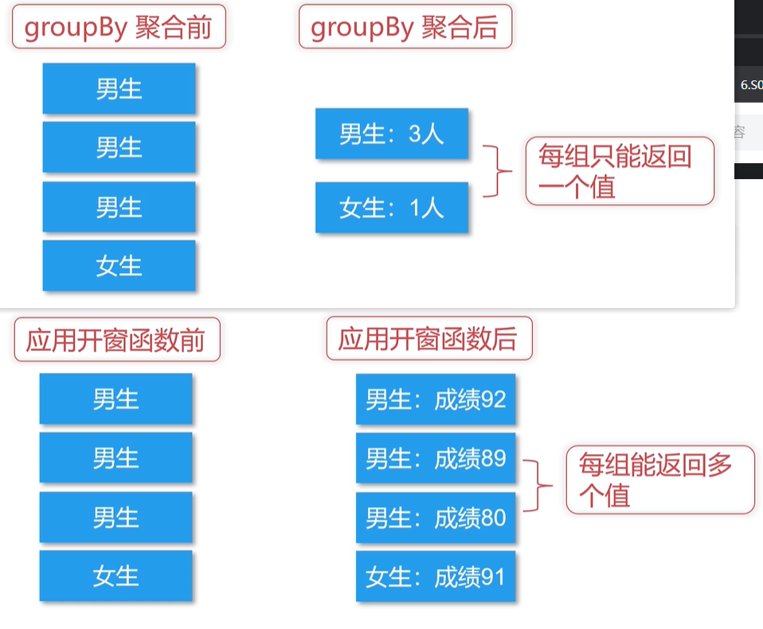

# Spark SQL 自定义函数和开窗函数


<!-- @import "[TOC]" {cmd="toc" depthFrom=3 depthTo=6 orderedList=false} -->

<!-- code_chunk_output -->

- [自定义函数 UDF](#自定义函数-udf)
  - [注册：通过匿名函数/实名函数，通过Spark SQL/DataFrame](#注册通过匿名函数实名函数通过spark-sqldataframe)
  - [自定义聚合函数 UDAF](#自定义聚合函数-udaf)
- [开窗函数](#开窗函数)
  - [row_number](#row_number)
  - [sum 实现一个分组累加](#sum-实现一个分组累加)

<!-- /code_chunk_output -->

### 自定义函数 UDF

#### 注册：通过匿名函数/实名函数，通过Spark SQL/DataFrame

```scala
// UDF注册：通过匿名函数
// Spark SQL 写法
sparkSession.udf
  .register(
    "strLen",
    (str: String) => str.length
  )
// DataFrame 写法
import org.apache.spark.sql.functions._
val strLen1 = udf(
  (str: String) => str.length
)

// UDF注册：通过实名函数
def strLen(str: String): Int = {
  str.length
}
// Spark SQL 写法
sparkSession.udf
  .register(
    "strLen",
    strLen _  // 注意有 _
  )
// DataFrame 写法
import org.apache.spark.sql.functions._
val strLen2 = udf(strLen _)
```

通过 Spark SQL 注册的 UDF 只对 `sql()` 可见；而通过 DataFrame 注册的 UDF 对外部可见。

#### 自定义聚合函数 UDAF

UDF 接受一行输入产生一行的输出；而 UDAF 接受多行输入产生一行的输出，一般和 `group by` 组合使用，但不是必须。

UDAF 实现应该继承 `UserDefinedAggregateFunction` 方法。

```scala
import org.apache.spark.sql.expressions.{MutableAggregationBuffer, UserDefinedAggregateFunction}
import org.apache.spark.sql.types._
import org.apache.spark.sql.{Row, SparkSession}

object Test4 {

  object T extends UserDefinedAggregateFunction {

    /**
     * @return 指定输入参数的数据类型
     */
    override def inputSchema: StructType = {
      StructType(
        StructField("sale", IntegerType)::   // 销售额
        StructField("off", DoubleType)::Nil  // 成本占比
      )
    }

    /**
     * @return buffer 的数据类型
     */
    override def bufferSchema: StructType = {
      StructType(
        StructField("profit", DoubleType)::Nil
      )
    }

    /**
     * @return UDAF 方法返回的数据类型
     */
    override def dataType: DataType = DoubleType

    /**
     * @return 最终输出结果是否幂等性
     */
    override def deterministic: Boolean = true

    /**
     * 指定 buffer 的初始值
     * @param buffer
     */
    override def initialize(buffer: MutableAggregationBuffer): Unit = {
      buffer(0) = 0.0
    }

    /**
     * 把每一行的数据进行计算，赋给 buffer
     * @param buffer buffer 只有一个返回参数，就是利润
     * @param input
     */
    override def update(buffer: MutableAggregationBuffer, input: Row): Unit = {
      buffer(0) = input.getInt(0) * (1 - input.getDouble(1))
    }

    /**
     * 把每一行的数据进行合并
     * @param buffer1
     * @param buffer2
     */
    override def merge(buffer1: MutableAggregationBuffer, buffer2: Row): Unit = {
      buffer1(0) = buffer1.getDouble(0) + buffer2.getDouble(0)
    }

    // 对 buffer 的最终计算
    override def evaluate(buffer: Row): Any = {
      buffer.getDouble(0)
    }
  }

  case class Sale(product: String, sale: Int, off: Double)
  def main(args: Array[String]): Unit = {
    val sparkSession = SparkSession.builder()
      .master("local")
      .getOrCreate()

    val sparkContext = sparkSession.sparkContext

    /**
     * Xiao mi,7821,0.45
     * Hua wei,15423,0.28
     * Xiao mi,16342,0.12
     * Hua wei,2423,0.16
     * Xiao mi,5837,0.23
     * Hua wei,6331,0.71
     */
    val rdd = sparkContext.textFile(
      "E:\\temp_piper\\testspark\\src\\main\\scala\\data2.txt"
    )

    val rowRDD = rdd.map(_.split(","))
      .map(x => Sale(x(0), x(1).toInt, x(2).toDouble))

    import sparkSession.implicits._

    val df = rowRDD.toDF()
    df.createTempView("sales")  // 建立为临时表！

    sparkSession.udf.register("T", T)

    sparkSession.sql(
      "select product, T(sale, off) from sales group by product"
    ).show()

    /**
+-------+------------------+
|product|     t$(sale, off)|
+-------+------------------+
|Hua wei|1835.9900000000002|
|Xiao mi|           4494.49|
+-------+------------------+
     */

    sparkSession.stop()
  }
}
```

### 开窗函数



如上，开窗函数可以在聚合后让每组返回多个值。

即：
- 在一个结果集上进行分组，再对分组后的值进行聚合等操作
- 调用格式： `函数名 OVER ( PARTITION BY 列名)`

#### row_number

- 实现分组取 Top N
- `row_number() over ( partition by 列名 order by 列名) rank`

```scala
import org.apache.spark.sql.functions._
import org.apache.spark.sql.expressions.Window
import org.apache.spark.sql.{Row, SparkSession}

object Test5 {

  case class Sales(product: String, category: String, sale:Int)
  def main(args: Array[String]): Unit = {
    val sparkSession = SparkSession.builder()
      .master("local")
      .getOrCreate()

    val sparkContext = sparkSession.sparkContext

    /**
X phone 8797
H phone 5463
O phone 7890
n shoe 162432
a shoe 354233
l shoe 172434
     */
    val rdd = sparkContext.textFile("E:\\temp_piper\\testspark\\src\\main\\scala\\data3.txt")

    val rowRDD = rdd.map(_.split(" "))
      .map(x=>Sales(x(0), x(1), x(2).toInt))

    import sparkSession.implicits._
    val df = rowRDD.toDF()

    df.select(
      col("product"),
      col("category"),
      row_number().over(
        Window.partitionBy(col("category"))
          .orderBy(col("sale").desc)
      ).as("row number")
    ).show
    /**
+-------+--------+----------+
|product|category|row number|
+-------+--------+----------+
|      X|   phone|         1|
|      O|   phone|         2|
|      H|   phone|         3|
|      a|    shoe|         1|
|      l|    shoe|         2|
|      n|    shoe|         3|
+-------+--------+----------+
     */

    sparkSession.stop()
  }
}
```

#### sum 实现一个分组累加

```scala
import org.apache.spark.sql.functions._
import org.apache.spark.sql.expressions.Window
import org.apache.spark.sql.{Row, SparkSession}

object Test5 {

  case class Sales(product: String, category: String, sale:Int)
  def main(args: Array[String]): Unit = {
    val sparkSession = SparkSession.builder()
      .master("local")
      .getOrCreate()

    val sparkContext = sparkSession.sparkContext

    /**
X phone 8797
H phone 5463
O phone 7890
n shoe 162432
a shoe 354233
l shoe 172434
     */
    val rdd = sparkContext.textFile("E:\\temp_piper\\testspark\\src\\main\\scala\\data3.txt")

    val rowRDD = rdd.map(_.split(" "))
      .map(x=>Sales(x(0), x(1), x(2).toInt))

    import sparkSession.implicits._
    val df = rowRDD.toDF()

    df.select(
      col("product"),
      col("category"),
      row_number().over(
        Window.partitionBy(col("category"))
          .orderBy(col("sale").desc)
      ).as("row number")
    ).show
    /**
+-------+--------+----------+
|product|category|row number|
+-------+--------+----------+
|      X|   phone|         1|
|      O|   phone|         2|
|      H|   phone|         3|
|      a|    shoe|         1|
|      l|    shoe|         2|
|      n|    shoe|         3|
+-------+--------+----------+
     */

    sparkSession.stop()
  }
}
```
