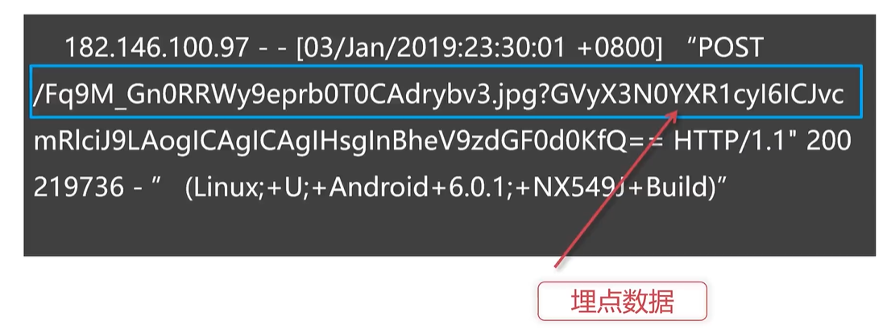

# Spark SQL 自定义函数和开窗函数


<!-- @import "[TOC]" {cmd="toc" depthFrom=3 depthTo=6 orderedList=false} -->

<!-- code_chunk_output -->

- [场景介绍与配置](#场景介绍与配置)
  - [Hadoop (Hdfs, Yarn) 高可用 Hive Flume Zookeeper](#hadoop-hdfs-yarn-高可用-hive-flume-zookeeper)
  - [jps 与 ps 检查](#jps-与-ps-检查)
- [对埋点数据第一次清洗（使用 flume）](#对埋点数据第一次清洗使用-flume)
- [第二次清洗：解析数据并且按天存储到 Hive 仓库](#第二次清洗解析数据并且按天存储到-hive-仓库)
- [用 c3p0 将分析结果批量写入 MySQL ，用 Spark 分析](#用-c3p0-将分析结果批量写入-mysql-用-spark-分析)
  - [MysqlPoolManager 连接池工具类](#mysqlpoolmanager-连接池工具类)
  - [MysqlUtil 操作工具类（拼接语句并执行 SQL 事务）](#mysqlutil-操作工具类拼接语句并执行-sql-事务)
  - [Main 函数](#main-函数)
- [性能监控（降低 Shuffle 数值）](#性能监控降低-shuffle-数值)

<!-- /code_chunk_output -->

### 场景介绍与配置

#### Hadoop (Hdfs, Yarn) 高可用 Hive Flume Zookeeper

开三台 centos7 服务器。

工具配置如下：
- Hadoop 3.1.2
- Hive 3.1.1
- Flume 1.8.0
- Spark 2.4.0 Scala 2.12.8
- Zookeeper 3.4

对于 Hadoop 集群：
- Hdfs 集群与 Yarn 集群都搭建
  - Hdfs 相当于文件系统框架
  - Yarn 是唯一支持 Spark 安全的集群管理器，使用 Yarn ， Spark 可以运行于 Kerberized Hadoop 之上，在它们进程之间进行安全认证
- 对于 Hdfs 采用 NameNode 高可用
- 对于 Yarn 采用 ResourceManager 高可用

这里解释一下高可用 High Availability ：系统架构设计中必须考虑的因素之一，它通常是指， **通过设计减少系统不能提供服务的时间。**

对于数据仓库来讲：
- 使用 Hive 以 Parquet 作为文件存储格式
- 采用 MetastoreServer 高可用

注意， hdfs 是文件系统用来装数据的， hive 是用来调用计算引擎操作数据的。


如上，对于 `Flume` 采用二级存储。

Flume 是开发的实时日志收集系统。

#### jps 与 ps 检查


如上，使用 `jps` （Java Virtual Machine Process Status Tool） 显示当前所有 `java` 进程 `pid` 的命令。


如上，使用 `ps -ef | grep metastore` 查看 `metastore` 是否在运行。

### 对埋点数据第一次清洗（使用 flume）




我们的目标如上：
- 首先将时间信息提取出来，并且最终的文件安排由时间分级
- 此外要提取埋点数据，埋点数据应用 base64 解码

我们需要使用 `flume` 如下。

```xml
<dependency>
    <groupId>org.apache.flume</groupId>
    <artifactId>flume-ng-core</artifactId>
    <version>1.9.0</version>
</dependency>
```

`LogForma.java` 如下：

```java
import org.apache.commons.codec.binary.Base64;
import org.apache.flume.Context;
import org.apache.flume.Event;
import org.apache.flume.interceptor.Interceptor;

import java.text.SimpleDateFormat;
import java.util.Date;
import java.util.List;
import java.util.Locale;
import java.util.Map;
import java.util.regex.Matcher;
import java.util.regex.Pattern;

public class LogFormat implements Interceptor {

    private String date = null;
    private String year = "";
    private String month = "";
    private String day = "";
    private String hour = "";
    final Base64 base64 = new Base64();

    @Override
    public void initialize() {

    }

    @Override
    public Event intercept(Event event) {
        Map<String, String> head = event.getHeaders();
        String body = new String(event.getBody());
        Pattern p = Pattern.compile("\\[([^]]+)\\]");  // 把中括号中的时间信息提取
        Matcher matcher = p.matcher(body);
        while (matcher.find()) {  // 如果提取到
            date = matcher.group(1);
        }  // 总感觉这里写得有点问题，如果 date 不为 null 但是 atcher.find() 失败了怎么办？
        if (date != null) {
            SimpleDateFormat sdf = new SimpleDateFormat(
                    "dd/MM/yyyy:HH:mm:ss Z",  // Z 是时区
                    Locale.ENGLISH
            );
            SimpleDateFormat sd = new SimpleDateFormat(
                    "dd"
            );
            SimpleDateFormat sm = new SimpleDateFormat(
                    "MM"
            );
            SimpleDateFormat sy = new SimpleDateFormat(
                    "yyyy"
            );
            SimpleDateFormat sh = new SimpleDateFormat(
                    "HH"
            );
            try {
                Date _date = sdf.parse(date);
                year = sy.format(_date);
                month = sm.format(_date);
                day = sd.format(_date);
                hour = sh.format(_date);
            } catch (Exception e) {
                e.getMessage();
            }
        }

        String[] _body = body.split(" ");
        String[] _split = _body[6].split("\\?");  // 埋点数据处于 ? 后面，用正则切割

        String mes = "";
        if (_split.length == 2) {
            mes = new String(base64.decode(_split[1]));
        }

        event.setBody(mes.getBytes());

        head.put("yearStr", year);
        head.put("monthStr", month);
        head.put("dayStr", day);
        head.put("hourStr", hour);

        return event;
    }

    @Override
    public List<Event> intercept(List<Event> list) {
        for (Event event: list) {
            intercept(event);
        }
        return list;
    }

    @Override
    public void close() {

    }

    public static class Builder implements Interceptor.Builder {

        @Override
        public Interceptor build() {
            return new LogFormat();
        }

        @Override
        public void configure(Context context) {

        }
    }
}
```

之后使用 maven package ，打包完成后，放在 flume 安装目录的 `lib` 下，如下。


可以查看到： `ll $FLUME_HOME/lib/log-format.jar` 。

配置文件 `collect-conf.properties` 部分预览如下：


如上规定了如何使用我们提取到的数据。


如上：
- `hdfs dfs -ls` 查看我们的文件夹
- `hdfs dfs -cat` 查看到我们提取的埋点信息

如上埋点信息被解析成为 json 字符串。

### 第二次清洗：解析数据并且按天存储到 Hive 仓库

这里仅仅写个 demo ，不具备对不同日期进行动态存储等自动化特性。仅仅展示了核心的数据处理 API 和流程。

如下是 `MyProject.scala` ：

```scala

```

打包上传到服务器后，可以使用如下命令来执行上述脚本：

```bash
spark-submit --master yarn --class MyProject TestScala.jar
```

接着创建 Hive 表格如下：


然后导入我们用 Spark 创建好的数据文件：


可以看到能够查询到内容了：


### 用 c3p0 将分析结果批量写入 MySQL ，用 Spark 分析

连接 MySQL ：使用 c3p0 作为连接池。

依赖如下。


这里的文件结构如下：

```
scala
│  MysqlPoolManager.scala
│  MysqlUtil.scala
│  Statistics.scala
└─META-INF
```

其中：
- MysqlPoolManager.scala 是 c3p0 连接池工具类
- MysqlUtil.scala 是 Mysql 操作工具类
- Statistics.scala 是 Main 函数

前两个相当于给 Spark 写工具。

#### MysqlPoolManager 连接池工具类

```scala
import com.mchange.v2.c3p0.ComboPooledDataSource

import java.sql.Connection

object MysqlPoolManager {
  // 以单例的形式生成 c3p0 连接池
  var mysqlManager: MysqlPool = _
  synchronized {
    if (mysqlManager == null) {
      mysqlManager = new MysqlPool
    }
    mysqlManager
  }

  class MysqlPool extends Serializable {
    // 连接池配置：一般来讲写在配置文件中，这里为了方便演示写在这里
    private val cbps: ComboPooledDataSource =
      new ComboPooledDataSource(true)

    cbps.setDriverClass("com.mysql.cj.jdbc.Driver")
    cbps.setUser("spark")
    cbps.setPassword("123456")
    cbps.setJdbcUrl(
      "jdbc:mysql://centos1:3306/spark?serverTimezone=GMT%2B"
    )

    // 取出连接
    def getConnection: Connection = {
      cbps.getConnection()
    }

    // 关闭连接
    def getClose: Unit = {
      cbps.close()
    }
  }
}
```

#### MysqlUtil 操作工具类（拼接语句并执行 SQL 事务）

```scala
import org.apache.spark.sql.DataFrame
import org.apache.spark.sql.types.{IntegerType, StringType}

/**
 * Mysql 操作工具类
 */
object MysqlUtil {

  def insert(tableName: String, df: DataFrame): Unit = {
    // 拼接 SQL 语句
    val cols = df.columns
    var sql = "insert into " + tableName + " values ("
    for (i <- 1 to cols.length) {
      sql += " ?"
      if (i != cols.length) {
        sql += " ,"
      }
    }
    sql += ")"

    // 遍历 DataFrame 分区
    val columnDataType = df.schema.fields.map(_.dataType)
    df.foreachPartition(
      partitionRecords => {
        val conn = MysqlPoolManager.mysqlManager.getConnection
        conn.setAutoCommit(false)  // 不要自动提交事务，提交由我们控制
        val preparedStatement = conn.prepareStatement(sql)

        partitionRecords.foreach { records => // 对于分区中的每个 row
          for (i <- 1 to cols.length) {
            val dataType = columnDataType(i - 1)
            dataType match {  // 把数据填入 sql 语句
              case _ : StringType => preparedStatement.setString(
                i, records.getAs[String](i - 1)
              )
              case _ : IntegerType => preparedStatement.setInt(
                i, records.getAs[Int](i - 1)
              )
            }
          }
          preparedStatement.addBatch()  // 把本条 insert 语句放到 batch 中
        }
        preparedStatement.executeBatch()  // 所有 sql 语句
        conn.commit()  // 提交事务
        preparedStatement.close()  // 关闭 preparedStatement
        conn.close()  // 关闭连接
      }
    )
  }
}
```

#### Main 函数

提取积分超过 1000 的用户，然后写回 MySQL 中。

```scala
import org.apache.spark.sql.SparkSession

object Statistics {
  def main(args: Array[String]): Unit = {
    val sparkSession = SparkSession.builder()
      .enableHiveSupport()
      .getOrCreate()

    val df = sparkSession.sql(
      "select uid, name from users where total_mark > 1000"
    )

    MysqlUtil.insert("users", df)
    sparkSession.stop()
  }
}
```

### 性能监控（降低 Shuffle 数值）

使用 Web UI

性能监控分为：
- 对 Job 监控，每提交一个任务就产生一个 Job
- 对 Stage 监控， Stage 是 Job 的组成单元
- 对 Task 监控，一般来讲有几个分区就有几个 Task ，因为每个 Task 只会处理一个 Partition 上的数据


如上，我们的代码应该让 Shuffle 的数值降低，以获得更好的性能。
