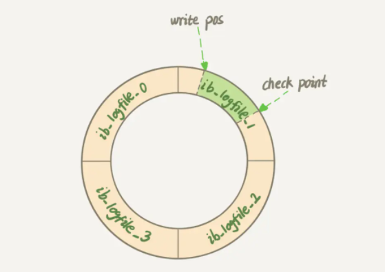
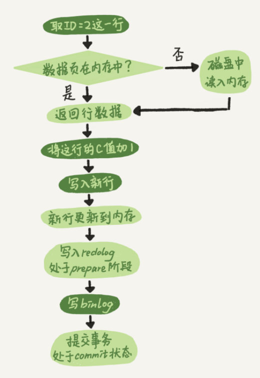

# 02 | 日志系统：一条SQL更新语句是如何执行的？


<!-- @import "[TOC]" {cmd="toc" depthFrom=3 depthTo=6 orderedList=false} -->

<!-- code_chunk_output -->

- [概述](#概述)
- [redo log（InnoDB特有）](#redo-loginnodb特有)
- [重要的日志模块：binlog](#重要的日志模块binlog)
- [InnoDB 中 update 内部流程](#innodb-中-update-内部流程)
- [两阶段提交](#两阶段提交)
- [参数：innodb_flush_log_at_trx_commit 和 sync_binlog](#参数innodb_flush_log_at_trx_commit-和-sync_binlog)
- [实践一下看看 binlog](#实践一下看看-binlog)

<!-- /code_chunk_output -->


### 概述

```sql
mysql> create table T(ID int primary key, c int);

mysql> update T set c=c+1 where ID=2;
```

首先，可以确定的说，查询语句的那一套流程，更新语句也是同样会走一遍。

你执行语句前要先连接数据库，这是连接器的工作。


前面我们说过，在一个表上有更新的时候，跟这个表有关的查询缓存会失效，所以这条语句就会把表 T 上所有缓存结果都清空。这也就是我们一般不建议使用查询缓存的原因。

接下来，分析器会通过词法和语法解析知道这是一条更新语句。优化器决定要使用 ID 这个索引。然后，执行器负责具体执行，找到这一行，然后更新。

与查询流程不一样的是，更新流程还涉及两个重要的日志模块，它们正是我们今天要讨论的主角 ：`redo log` （重做日志）和 `binlog` （归档日志）。

### redo log（InnoDB特有）

如果每一次的更新操作都需要写进磁盘，然后磁盘也要找到对应的那条记录，然后再更新，整个过程 IO 成本、查找成本都很高。

为了解决这个问题，MySQL 的设计者就用了类似酒店掌柜粉板的思路（ *生意忙时先记在粉板上，等有空时，再将粉板上的动作更新到账本上* ）来提升更新效率。

而粉板和账本配合的整个过程，其实就是 MySQL 里经常说到的 `WAL` `技术，WAL` 的全称是 `Write-Ahead Logging`，它的关键点就是先写日志，再写磁盘，也就是先写粉板，等不忙的时候再写账本。

具体来说，当有一条记录需要更新的时候， `InnoDB` 引擎就会先把记录写到 `redo log` （粉板）里面，并更新内存，这个时候更新就算完成了。

同时， `InnoDB` 引擎会在适当的时候，将这个操作记录更新到磁盘里面，而这个更新往往是在系统比较空闲的时候做，这就像打烊以后掌柜做的事。如果今天赊账的不多，掌柜可以等打烊后再整理。但如果某天赊账的特别多，粉板写满了，又怎么办呢？这个时候掌柜只好放下手中的活儿，把粉板中的一部分赊账记录更新到账本中，然后把这些记录从粉板上擦掉，为记新账腾出空间。

与此类似， `InnoDB` 的 `redo log` 是固定大小的，比如可以配置为一组 4 个文件，每个文件的大小是 `1GB` ，那么这块“粉板”总共就可以记录 `4GB` 的操作。从头开始写，写到末尾就又回到开头循环写，如下面这个图所示。



`write pos` 是当前记录的位置，一边写一边后移，写到第 `3` 号文件末尾后就回到 `0` 号文件开头。

`checkpoint` 是当前要擦除的位置，也是往后推移并且循环的，擦除记录前要把记录更新到数据文件。 `write pos` 和 `checkpoint` 之间的是“粉板”上还空着的部分，可以用来记录新的操作。如果 `write pos` 追上 `checkpoint` ，表示“粉板”满了，这时候不能再执行新的更新，得停下来先擦掉一些记录，把 `checkpoint` 推进一下。

有了 `redo log` ， `InnoDB` 就可以保证即使数据库发生异常重启，之前提交的记录都不会丢失， **这个能力称为 `crash-safe` 。**

### 重要的日志模块：binlog

MySQL 整体来看，其实就有两块：
- 一块是 Server 层，它主要做的是 MySQL 功能层面的事情；
- 还有一块是引擎层，负责存储相关的具体事宜。

上面我们聊到的“粉板” `redo log` 是 InnoDB 引擎特有的日志，而 Server 层也有自己的日志，称为 binlog（归档日志）。

为什么会有两份日志呢？因为最开始 MySQL 里并没有 InnoDB 引擎。 MySQL 自带的引擎是 MyISAM ，但是 MyISAM 没有 `crash-safe` 的能力， **`binlog` 日志只能用于归档。**

而 InnoDB 是另一个公司以插件形式引入 MySQL 的，既然只依靠 `binlog` 是没有 `crash-safe` 能力的，所以 InnoDB 使用另外一套日志系统——也就是 `redo log` 来实现 `crash-safe` 能力。这两种日志有以下三点不同。

这两种日志有以下三点不同：
- `redo log` 是 InnoDB 引擎特有的； `binlog` 是 MySQL 的 Server 层实现的，所有引擎都可以使用。
- **`redo log` 是物理日志** `，记录的是“在某个数据页上做了什么修改”；binlog` 是逻辑日志，记录的是这个语句的原始逻辑，比如“给 `ID=2` 这一行的 `c` 字段加 `1` ”。
- **`redo log` 是循环写的，空间固定会用完；binlog 是可以追加写入的。** “追加写”是指 `binlog` 文件写到一定大小后会切换到下一个，并不会覆盖以前的日志。

### InnoDB 中 update 内部流程

有了对这两个日志的概念性理解，我们再来看执行器和 InnoDB 引擎在执行这个简单的 `update` 语句时的内部流程。

- 执行器先找引擎取 ID=2 这一行。 `ID` 是主键，引擎直接用树搜索找到这一行。如果 `ID=2` 这一行所在的数据页本来就在内存中，就直接返回给执行器；否则，需要先从磁盘读入内存，然后再返回。
- 执行器拿到引擎给的行数据，把这个值加上 `1` ，比如原来是 `N` ，现在就是 `N+1` ，得到新的一行数据，再调用引擎接口写入这行新数据。
- 引擎将这行新数据更新到内存中，同时将这个更新操作记录到 `redo log` 里面，此时 `redo log` 处于 `prepare` 状态。然后告知执行器执行完成了，随时可以提交事务。
- 执行器生成这个操作的 `binlog` ，并把 `binlog` 写入磁盘。
- 执行器调用引擎的提交事务接口，引擎把刚刚写入的 `redo log` 改成提交（ `commit` ）状态，更新完成。



上图为这个 `update` 语句的执行流程图，**图中浅色框表示是在 InnoDB 内部执行的，深色框表示是在执行器中执行的。**

最后三步看上去有点“绕”，将 `redo log` 的写入拆成了两个步骤： `prepare` 和 `commit` ，这就是"两阶段提交"。

### 两阶段提交

为什么必须有“两阶段提交”呢？这是为了让两份日志之间的逻辑一致。要说明这个问题，我的从目标思考： **怎样让数据库恢复到半个月内任意一秒的状态？**

前面我们说过了， `binlog` 会记录所有的逻辑操作，并且是采用“追加写”的形式。如果你的 DBA 承诺说半个月内可以恢复，那么备份系统中一定会保存最近半个月的所有  `binlog` ，同时系统会定期做整库备份。这里的“定期”取决于系统的重要性，可以是一天一备，也可以是一周一备。

当需要恢复到指定的某一秒时，比如某天下午两点发现中午十二点有一次误删表，需要找回数据，那你可以这么做：
- 首先，找到最近的一次全量备份，如果你运气好，可能就是昨天晚上的一个备份，从这个备份恢复到临时库；
- 然后，从备份的时间点开始，将备份的 `binlog` 依次取出来，重放到中午误删表之前的那个时刻。

这样你的临时库就跟误删之前的线上库一样了，然后你可以把表数据从临时库取出来，按需要恢复到线上库去。

**所以，为什么日志需要“两阶段提交”？这里不妨用反证法来进行解释。**

由于 `redo log` 和 `binlog` 是两个独立的逻辑，如果不用两阶段提交，要么就是先写完 `redo log `再写 `binlog` ，或者采用反过来的顺序。

我们看看这两种方式会有什么问题：仍然用前面的 `update` 语句来做例子。假设当前 `ID=2` 的行，字段 `c` 的值是 `0` ，再假设执行 `update` 语句过程中在写完第一个日志后，第二个日志还没有写完期间发生了 `crash` ，会出现什么情况呢？

- 先写 `redo log` 后写 `binlog` 。假设在 `redo log` 写完， `binlog` 还没有写完的时候， MySQL 进程异常重启。由于我们前面说过的， `redo log` 写完之后，系统即使崩溃，仍然能够把数据恢复回来，所以恢复后这一行 `c` 的值是 `1` 。
  - 但是由于 `binlog` 没写完就 `crash` 了，这时候 `binlog` 里面就没有记录这个语句。因此，之后备份日志的时候，存起来的 `binlog` 里面就没有这条语句。
  - 然后你会发现，如果需要用这个 `binlog` 来恢复临时库的话，由于这个语句的 `binlog` 丢失，这个临时库就会少了这一次更新，恢复出来的这一行 `c` 的值就是 `0` ，与原库的值不同。
- 先写 `binlog` 后写 `redo log`。如果在 `binlog` 写完之后 `crash` ，由于 `redo log` 还没写，崩溃恢复以后这个事务无效，所以这一行 `c` 的值是 `0` 。但是 `binlog` 里面已经记录了“把 `c` 从 `0` 改成 `1` ”这个日志。所以，在之后用 `binlog` 来恢复的时候就多了一个事务出来，恢复出来的这一行 `c` 的值就是 `1` ，与原库的值不同。

可以看到，如果不使用“两阶段提交”，那么数据库的状态就有可能和用它的日志恢复出来的库的状态不一致。

这个概率是不是很低，平时也没有什么动不动就需要恢复临时库的场景呀？其实不是的， **不只是误操作后需要用这个过程来恢复数据。当你需要扩容的时候，也就是需要再多搭建一些备库来增加系统的读能力的时候，** 现在常见的做法也是用全量备份加上应用 `binlog` 来实现的，这个“不一致”就会导致你的线上出现主从数据库不一致的情况。简单说， `redo log` 和 `binlog` 都可以用于表示事务的提交状态，而两阶段提交就是让这两个状态保持逻辑上的一致。

### 参数：innodb_flush_log_at_trx_commit 和 sync_binlog

`redo log` 用于保证 `crash-safe` 能力。

`innodb_flush_log_at_trx_commit` 这个参数设置成 `1` 的时候，表示每次事务的 `redo log` 都直接持久化到磁盘。这个参数老师建议设置成 `1` ，这样可以保证 MySQL 异常重启之后数据不丢失。

`sync_binlog` 这个参数设置成 `1` 的时候，表示每次事务的 `binlog` 都持久化到磁盘。这个参数我也建议你设置成 `1` ，这样可以保证 MySQL 异常重启之后 `binlog` 不丢失。

定期全量备份的周期“取决于系统重要性，有的是一天一备，有的是一周一备”。那么 **在什么场景下，一天一备会比一周一备更有优势呢？或者说，它影响了这个数据库系统的哪个指标？**

在一天一备的模式好处是“最长恢复时间”更短，在这里最坏情况下需要应用一天的 `binlog` 。比如，你每天 0 点做一次全量备份，而要恢复出一个到昨天晚上 23 点的备份。一周一备最坏情况就要应用一周的 `binlog` 了。

系统的对应指标就是 RTO（恢复目标时间）。当然这个是有成本的，因为更频繁全量备份需要消耗更多存储空间，所以这个 RTO 是成本换来的，就需要你根据业务重要性来评估了。

### 实践一下看看 binlog

```bash
piperliu@go-x86:~$ uname -a
Linux go-x86 6.14.9-orbstack-gd9e87d038362 #131 SMP Tue Jun  3 07:51:59 UTC 2025 x86_64 x86_64 x86_64 GNU/Linux
piperliu@go-x86:~$ sudo apt update && sudo apt upgrade && sudo apt install mysql-server-8.0

# install
sudo mysql_secure_installation

# check
sudo systemctl status mysql  # if not active, sudo systemctl start mysql

# /etc/mysql/mysql.conf.d/mysqld.cnf
[mysqld]
# 这是必须的，用于唯一标识一个 server
server-id = 1

# 开启 binlog，并指定日志文件的前缀
log_bin = /var/log/mysql/mysql-bin.log

# 设置 binlog 格式，我们稍后会讨论这个
binlog_format = ROW

# 每次事务提交都将 binlog 同步到磁盘
# 这对应你学到的 sync_binlog = 1
sync_binlog = 1

# 每次事务提交都将 redo log 同步到磁盘
# 这对应你学到的 innodb_flush_log_at_trx_commit = 1
# 这是 MySQL 8.0 的默认值，但明确写出有助于理解
innodb_flush_log_at_trx_commit = 1

sudo systemctl restart mysql

sudo mysql -u root -p  # 设了空密码
```

```sql
-- 创建一个数据库用于实验
CREATE DATABASE test_log;
USE test_log;

-- 创建一张表
CREATE TABLE T (
  ID INT PRIMARY KEY,
  c INT
) ENGINE=InnoDB;

-- 插入一条初始数据
INSERT INTO T VALUES(2, 10);

-- 确认一下当前数据
SELECT * FROM T;
```

```sql
UPDATE T SET c = c + 1 WHERE ID = 2;
```

这条命令执行后，MySQL 内部已经完成了你所学的复杂流程：
- 执行器调用 InnoDB 引擎，找到了 ID=2 的行。
- InnoDB 在内存中更新了数据行（c 变为 11）。
- InnoDB 将这个更新操作写入了 redo log，并将其置为 prepare 状态。
- Server 层的执行器生成了这条 UPDATE 语句的 binlog 并写入磁盘。
- 执行器调用 InnoDB 的提交接口，InnoDB 将 redo log 的状态修改为 commit。

**Binlog 的模式（binlog_format）**

1.  STATEMENT
  - 内容：记录的是原始的 SQL 语句（例如，UPDATE T SET c=c+1 WHERE ID=2;）。
  - 优点：日志文件体积小。
  - 缺点：在某些情况下可能导致主从数据库不一致。例如，如果你使用 UUID() 或者 NOW() 这些非确定性函数，在主库和备库上执行同一条 SQL 语句可能会产生不同的结果。
2.  ROW（行模式） （MySQL 8.0 默认）
  - 内容：不记录 SQL 语句，而是记录哪一行数据被修改了，以及修改前后的具体值。例如，它会记录：“表 test_log.T 中，主键 ID=2 的行，字段 c 的值从 10 变成了 11”。
  - 优点：最安全、最可靠的格式，能保证主从数据的一致性。
  - 缺点：日志文件体积较大，特别是当你执行一个 UPDATE 或 DELETE 语句影响了很多行数据时。
3. MIXED（混合模式）
  - 内容：是 STATEMENT 和 ROW 的混合体。MySQL 会根据执行的 SQL 语句来自动选择使用哪种格式。对于大部分确定性的操作，它会使用 STATEMENT 格式以节省空间；对于可能导致主从不一致的非确定性操作，它会自动切换到 ROW 格式。

**查看 Binlog 内容**

```bash
mysql> SHOW MASTER STATUS;
+------------------+----------+--------------+------------------+-------------------+
| File             | Position | Binlog_Do_DB | Binlog_Ignore_DB | Executed_Gtid_Set |
+------------------+----------+--------------+------------------+-------------------+
| mysql-bin.000001 |     1178 |              |                  |                   |
+------------------+----------+--------------+------------------+-------------------+
1 row in set (0.00 sec)

piperliu@go-x86:~$ sudo cat /var/log/mysql/mysql-bin.000001
bbinahz~8.0.42-0ubuntu0.24.10.1ah


**4
(�ۘ,ah#��*�DOah"M�       �=ʳ8Ū8�<�       Oa3 �Estd���
                                                    test_log�test_logCREATE DATABASE test_logDԅ�Yah"M���ʳ8�8o�~�Yah3 �Estd���
                                                                                                                             test_lo�test_logCREATE TABLE T (
  ID INT PRIMARY KEY,
  c INT
) ENGINE=InnoDB�K��aah"O���J˳8��8�zk�aa �Estd����test_logBEGIN��Daah4test_logT���Laah,KZ�
���aahj �5)sah"O��V\̳8�0�8�Q7s& �Estd��� �test_logBEGIN��Zsah4Etest_logT*���sah6{Z��

���sah�
```

使用 mysqlbinlog 工具查看：

```bash
piperliu@go-x86:~$ sudo mysqlbinlog -v /var/log/mysql/mysql-bin.000001
# The proper term is pseudo_replica_mode, but we use this compatibility alias
# to make the statement usable on server versions 8.0.24 and older.
/*!50530 SET @@SESSION.PSEUDO_SLAVE_MODE=1*/;
/*!50003 SET @OLD_COMPLETION_TYPE=@@COMPLETION_TYPE,COMPLETION_TYPE=0*/;
DELIMITER /*!*/;
# at 4
#250629 18:57:34 server id 1  end_log_pos 126 CRC32 0x2c98dbf1  Start: binlog v 4, server v 8.0.42-0ubuntu0.24.10.1 created 250629 18:57:34 at startup
# Warning: this binlog is either in use or was not closed properly.
ROLLBACK/*!*/;
BINLOG '
HhxhaA8BAAAAegAAAH4AAAABAAQAOC4wLjQyLTB1YnVudHUwLjI0LjEwLjEAAAAAAAAAAAAAAAAA
AAAAAAAAAAAAAAAAAAAeHGFoEwANAAgAAAAABAAEAAAAYgAEGggAAAAICAgCAAAACgoKKioAEjQA
CigAAfHbmCw=
'/*!*/;
# at 126
#250629 18:57:34 server id 1  end_log_pos 157 CRC32 0x447fec2a  Previous-GTIDs
# [empty]
# at 157
#250629 18:58:23 server id 1  end_log_pos 234 CRC32 0x09fe3c9b  Anonymous_GTID  last_committed=0        sequence_number=1       rbr_only=no     original_committed_timestamp=1751194703608329   immediate_commit_timestamp=1751194703608329       transaction_length=197
# original_commit_timestamp=1751194703608329 (2025-06-29 18:58:23.608329 CST)
# immediate_commit_timestamp=1751194703608329 (2025-06-29 18:58:23.608329 CST)
/*!80001 SET @@session.original_commit_timestamp=1751194703608329*//*!*/;
/*!80014 SET @@session.original_server_version=80042*//*!*/;
/*!80014 SET @@session.immediate_server_version=80042*//*!*/;
SET @@SESSION.GTID_NEXT= 'ANONYMOUS'/*!*/;
# at 234
#250629 18:58:23 server id 1  end_log_pos 354 CRC32 0x8785d444  Query   thread_id=8     exec_time=0     error_code=0    Xid = 3
SET TIMESTAMP=1751194703/*!*/;
SET @@session.pseudo_thread_id=8/*!*/;
SET @@session.foreign_key_checks=1, @@session.sql_auto_is_null=0, @@session.unique_checks=1, @@session.autocommit=1/*!*/;
SET @@session.sql_mode=1168113696/*!*/;
SET @@session.auto_increment_increment=1, @@session.auto_increment_offset=1/*!*/;
/*!\C utf8mb4 *//*!*/;
SET @@session.character_set_client=255,@@session.collation_connection=255,@@session.collation_server=255/*!*/;
SET @@session.lc_time_names=0/*!*/;
SET @@session.collation_database=DEFAULT/*!*/;
/*!80011 SET @@session.default_collation_for_utf8mb4=255*//*!*/;
/*!80016 SET @@session.default_table_encryption=0*//*!*/;
CREATE DATABASE test_log
/*!*/;
# at 354
#250629 18:58:33 server id 1  end_log_pos 431 CRC32 0x807ea16f  Anonymous_GTID  last_committed=1        sequence_number=2       rbr_only=no     original_committed_timestamp=1751194713392074   immediate_commit_timestamp=1751194713392074       transaction_length=235
# original_commit_timestamp=1751194713392074 (2025-06-29 18:58:33.392074 CST)
# immediate_commit_timestamp=1751194713392074 (2025-06-29 18:58:33.392074 CST)
/*!80001 SET @@session.original_commit_timestamp=1751194713392074*//*!*/;
/*!80014 SET @@session.original_server_version=80042*//*!*/;
/*!80014 SET @@session.immediate_server_version=80042*//*!*/;
SET @@SESSION.GTID_NEXT= 'ANONYMOUS'/*!*/;
# at 431
#250629 18:58:33 server id 1  end_log_pos 589 CRC32 0xa09d4b94  Query   thread_id=8     exec_time=0     error_code=0    Xid = 8
use `test_log`/*!*/;
SET TIMESTAMP=1751194713/*!*/;
/*!80013 SET @@session.sql_require_primary_key=0*//*!*/;
CREATE TABLE T (
  ID INT PRIMARY KEY,
  c INT
) ENGINE=InnoDB
/*!*/;
# at 589
#250629 18:58:41 server id 1  end_log_pos 668 CRC32 0x876b7af3  Anonymous_GTID  last_committed=2        sequence_number=3       rbr_only=yes    original_committed_timestamp=1751194721242084   immediate_commit_timestamp=1751194721242084       transaction_length=285
/*!50718 SET TRANSACTION ISOLATION LEVEL READ COMMITTED*//*!*/;
# original_commit_timestamp=1751194721242084 (2025-06-29 18:58:41.242084 CST)
# immediate_commit_timestamp=1751194721242084 (2025-06-29 18:58:41.242084 CST)
/*!80001 SET @@session.original_commit_timestamp=1751194721242084*//*!*/;
/*!80014 SET @@session.original_server_version=80042*//*!*/;
/*!80014 SET @@session.immediate_server_version=80042*//*!*/;
SET @@SESSION.GTID_NEXT= 'ANONYMOUS'/*!*/;
# at 668
#250629 18:58:41 server id 1  end_log_pos 747 CRC32 0x194494b3  Query   thread_id=8     exec_time=0     error_code=0
SET TIMESTAMP=1751194721/*!*/;
BEGIN
/*!*/;
# at 747
#250629 18:58:41 server id 1  end_log_pos 799 CRC32 0x4cefd7a0  Table_map: `test_log`.`T` mapped to number 90
# has_generated_invisible_primary_key=0
# at 799
#250629 18:58:41 server id 1  end_log_pos 843 CRC32 0xd99d00c0  Write_rows: table id 90 flags: STMT_END_F

BINLOG '
YRxhaBMBAAAANAAAAB8DAAAAAFoAAAAAAAEACHRlc3RfbG9nAAFUAAIDAwACAQEAoNfvTA==
YRxhaB4BAAAALAAAAEsDAAAAAFoAAAAAAAEAAgAC/wACAAAACgAAAMAAndk=
'/*!*/;
### INSERT INTO `test_log`.`T`
### SET
###   @1=2
###   @2=10
# at 843
#250629 18:58:41 server id 1  end_log_pos 874 CRC32 0x293511a6  Xid = 9
COMMIT/*!*/;
# at 874
#250629 18:58:59 server id 1  end_log_pos 953 CRC32 0x1f3751cd  Anonymous_GTID  last_committed=3        sequence_number=4       rbr_only=yes    original_committed_timestamp=1751194739168960   immediate_commit_timestamp=1751194739168960       transaction_length=304
/*!50718 SET TRANSACTION ISOLATION LEVEL READ COMMITTED*//*!*/;
# original_commit_timestamp=1751194739168960 (2025-06-29 18:58:59.168960 CST)
# immediate_commit_timestamp=1751194739168960 (2025-06-29 18:58:59.168960 CST)
/*!80001 SET @@session.original_commit_timestamp=1751194739168960*//*!*/;
/*!80014 SET @@session.original_server_version=80042*//*!*/;
/*!80014 SET @@session.immediate_server_version=80042*//*!*/;
SET @@SESSION.GTID_NEXT= 'ANONYMOUS'/*!*/;
# at 953
#250629 18:58:59 server id 1  end_log_pos 1041 CRC32 0x5a069987         Query   thread_id=8     exec_time=0     error_code=0
SET TIMESTAMP=1751194739/*!*/;
BEGIN
/*!*/;
# at 1041
#250629 18:58:59 server id 1  end_log_pos 1093 CRC32 0x8095a32a         Table_map: `test_log`.`T` mapped to number 90
# has_generated_invisible_primary_key=0
# at 1093
#250629 18:58:59 server id 1  end_log_pos 1147 CRC32 0x18daf098         Update_rows: table id 90 flags: STMT_END_F

BINLOG '
cxxhaBMBAAAANAAAAEUEAAAAAFoAAAAAAAEACHRlc3RfbG9nAAFUAAIDAwACAQEAKqOVgA==
cxxhaB8BAAAANgAAAHsEAAAAAFoAAAAAAAEAAgAC//8AAgAAAAoAAAAAAgAAAAsAAACY8NoY
'/*!*/;
### UPDATE `test_log`.`T`
### WHERE
###   @1=2
###   @2=10
### SET
###   @1=2
###   @2=11
# at 1147
#250629 18:58:59 server id 1  end_log_pos 1178 CRC32 0xfc13d1f3         Xid = 11
COMMIT/*!*/;
SET @@SESSION.GTID_NEXT= 'AUTOMATIC' /* added by mysqlbinlog */ /*!*/;
DELIMITER ;
# End of log file
/*!50003 SET COMPLETION_TYPE=@OLD_COMPLETION_TYPE*/;
/*!50530 SET @@SESSION.PSEUDO_SLAVE_MODE=0*/;
```

**Golang 监听 binlog**

先清理一下 binlog ，把 gtid 模式打开重新生成。

```bash
mysql> SHOW BINARY LOGS;
+------------------+-----------+-----------+
| Log_name         | File_size | Encrypted |
+------------------+-----------+-----------+
| mysql-bin.000001 |      4516 | No        |
| mysql-bin.000002 |       461 | No        |
+------------------+-----------+-----------+
2 rows in set (0.02 sec)

mysql> PURGE BINARY LOGS TO 'mysql-bin.000003';
ERROR 1373 (HY000): Target log not found in binlog index
mysql> PURGE BINARY LOGS TO 'mysql-bin.000002';
Query OK, 0 rows affected (0.03 sec)

mysql> SHOW BINARY LOGS;
+------------------+-----------+-----------+
| Log_name         | File_size | Encrypted |
+------------------+-----------+-----------+
| mysql-bin.000002 |       461 | No        |
+------------------+-----------+-----------+
1 row in set (0.00 sec)

# 也可以用这个
sudo mysqladmin flush-logs

mysql> SHOW MASTER STATUS;
+------------------+----------+--------------+------------------+----------------------------------------+
| File             | Position | Binlog_Do_DB | Binlog_Ignore_DB | Executed_Gtid_Set                      |
+------------------+----------+--------------+------------------+----------------------------------------+
| mysql-bin.000003 |      197 |              |                  | 3284707b-54d7-11f0-b8c7-3255068778de:1 |
+------------------+----------+--------------+------------------+----------------------------------------+
1 row in set (0.01 sec)
```

```bash
piperliu@go-x86:~/mysql-go$ sudo vim /etc/mysql/mysql.conf.d/mysqld.cnf

gtid_mode = ON
enforce_gtid_consistency = ON
```

```sql
SHOW VARIABLES LIKE 'gtid_mode';

-- Create a user for your Go application
CREATE USER 'go_replica'@'%' IDENTIFIED BY 'a_strong_password';

-- Grant the necessary privileges
GRANT REPLICATION SLAVE, REPLICATION CLIENT ON *.* TO 'go_replica'@'%';

-- Make sure the changes take effect
FLUSH PRIVILEGES;
```

```bash
piperliu@go-x86:~/mysql-go$ go version
go version go1.24.0 linux/amd64
piperliu@go-x86:~/mysql-go$ go go mod init myapp
piperliu@go-x86:~/mysql-go$ go get github.com/go-mysql-org/go-mysql
piperliu@go-x86:~/mysql-go$ go mod tidy
piperliu@go-x86:~/mysql-go$ go list -m github.com/go-mysql-org/go-mysql
github.com/go-mysql-org/go-mysql v1.12.0
```

下面的 

```go
package main

import (
    "fmt"
    "os"
    "os/signal"
    "syscall"

    "github.com/go-mysql-org/go-mysql/canal"
    "github.com/go-mysql-org/go-mysql/mysql"
    "github.com/go-mysql-org/go-mysql/replication"
)

// MyEventHandler handles the binlog events.
// This is where your custom logic goes.
type MyEventHandler struct {
    canal.DummyEventHandler
}

func (h *MyEventHandler) OnRow(e *canal.RowsEvent) error {
    // e.Action can be "insert", "update", or "delete"
    fmt.Printf("Received a %s event for table %s\n", e.Action, e.Table.Name)

    // e.Rows is a slice of rows, for update it holds [before, after]
    // for insert or delete, it holds the affected rows.
    for i, row := range e.Rows {
        // For an UPDATE, the slice contains the old and new data
        if e.Action == canal.UpdateAction && i%2 == 0 {
            fmt.Println("--- Before Update:")
        } else if e.Action == canal.UpdateAction && i%2 != 0 {
            fmt.Println("--- After Update:")
        }
        
        // Print each column value in the row
        for colIdx, colValue := range row {
            colName := e.Table.Columns[colIdx].Name
            fmt.Printf("    Column '%s' (%s): %v\n", colName, e.Table.Columns[colIdx].Type, colValue)
        }
    }
    return nil
}

// We just need to print the GTID for position saving
func (h *MyEventHandler) OnGTID(eh *replication.EventHeader, gtidEvent mysql.BinlogGTIDEvent) error {
    eh.Dump(os.Stdout)
    gtids, err := gtidEvent.GTIDNext()
    if err != nil {
        fmt.Printf("Error getting GTID: %v\n", err)
        return err
    }
    fmt.Printf("Received GTID: %s\n", gtids)
    // Here you can save the GTID to a persistent store if needed
    return nil
}

func (h *MyEventHandler) String() string {
    return "MyEventHandler"
}

func main() {
    // Configuration for Canal
    cfg, err := canal.NewConfig("")
    if err != nil {
        panic(err)
    }
    cfg.Addr = "127.0.0.1:3306"
    cfg.User = "go_replica"
    cfg.Password = "a_strong_password"
    // We want to watch the test_log database, and specifically the T table
    cfg.Dump.TableDB = "test_log"
    cfg.Dump.Tables = []string{"T"}
    // This server_id must be unique among all replicas and the primary
    cfg.ServerID = 1001 

    // Create a new canal instance
    c, err := canal.NewCanal(cfg)
    if err != nil {
        panic(err)
    }

    // Register our custom event handler
    c.SetEventHandler(&MyEventHandler{})

    fmt.Println("Starting binlog listener...")
    
    // Start the listener. You can start from a specific GTID set if you have one saved.
    // For the first run, it will dump the table data and then start streaming from the current position.
    go func() {
        // Use Run() to start from the current master position.
        // To start from a specific GTID, use c.StartFromGTID(gtidSet)
        err = c.Run()
        if err != nil {
            fmt.Printf("Error during canal run: %v\n", err)
        }
    }()

    // Wait for a signal to gracefully shut down
    quit := make(chan os.Signal, 1)
    signal.Notify(quit, syscall.SIGINT, syscall.SIGTERM)
    
    <-quit
    fmt.Println("Shutting down...")
    c.Close()
}
```

如下是输出：
```bash
=== GTIDEvent ===
Date: 2025-06-29 19:45:54
Log position: 276
Event size: 79
Received GTID: 3284707b-54d7-11f0-b8c7-3255068778de:2
=== GTIDEvent ===
Date: 2025-06-29 19:47:44
Log position: 561
Event size: 79
Received GTID: 3284707b-54d7-11f0-b8c7-3255068778de:3
```

```bash
mysql> INSERT INTO T VALUES(21, 10);
Query OK, 1 row affected (0.02 sec)

mysql> DELETE FROM T WHERE ID = 21;
Query OK, 1 row affected (0.04 sec)
```

预期是：
1. MySQL commits a transaction.
2. It writes a GTIDEvent to the binlog.
3. It writes a TableMapEvent to describe the table T.
4. It writes a RowsEvent (Insert/Update/Delete) containing the actual data change.
5. It writes a XIDEvent (Commit).
6. go-mysql receives these events. The canal wrapper processes the GTID, maps the table structure, and when it gets the RowsEvent, it knows everything about the change and finally calls your OnRow handler.

但是这里 `OnRow` 事件没有被触发，暂且不纠结这个问题。
