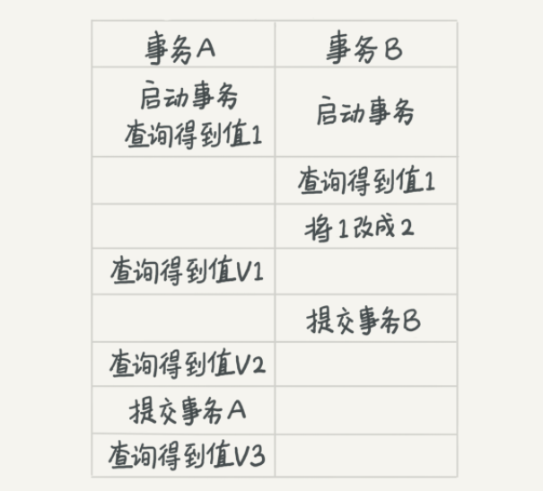
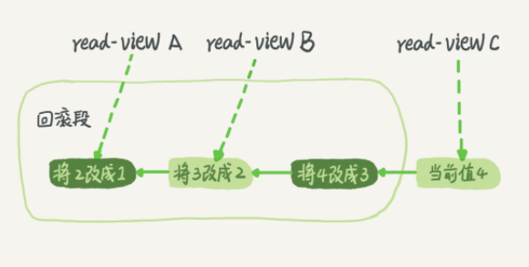

# 03 | 事务隔离：为什么你改了我还看不见？

<!-- @import "[TOC]" {cmd="toc" depthFrom=3 depthTo=6 orderedList=false} -->

<!-- code_chunk_output -->

- [什么是事务](#什么是事务)
- [隔离性与隔离级别](#隔离性与隔离级别)
  - [隔离级别示例](#隔离级别示例)
  - [视图](#视图)
  - [什么时候用可重复读？](#什么时候用可重复读)
- [事务隔离的实现](#事务隔离的实现)
- [事务的启动方式（应对长事务）](#事务的启动方式应对长事务)
- [深入理解事务隔离：`ReadView`](#深入理解事务隔离readview)
  - [什么是 `ReadView`？](#什么是-readview)
  - [`ReadView` 的 C++ 数据结构](#readview-的-c-数据结构)
  - [可见性检查算法（`changes_visible` 方法）](#可见性检查算法changes_visible-方法)
  - [`ReadView` 在四种隔离级别中的作用](#readview-在四种隔离级别中的作用)
- [实践实验：亲眼见证 `ReadView` 的作用](#实践实验亲眼见证-readview-的作用)
  - [步骤 1：设置](#步骤-1设置)
  - [场景 1：`REPEATABLE READ`（默认设置）](#场景-1repeatable-read默认设置)
  - [场景 2：`READ COMMITTED`](#场景-2read-committed)
- [深入解析 InnoDB：多版本数据如何与 B+ 树协同工作](#深入解析-innodb多版本数据如何与-b-树协同工作)
  - [Undo 日志与版本链](#undo-日志与版本链)
  - [B+ 树与多版本的协同工作](#b-树与多版本的协同工作)
  - [查询过程：索引查找与版本链遍历](#查询过程索引查找与版本链遍历)
  - [对索引和范围查找效率的影响](#对索引和范围查找效率的影响)

<!-- /code_chunk_output -->


### 什么是事务

最经典的例子就是转账，你要给朋友小王转 100 块钱，而此时你的银行卡只有 100 块钱。

转账过程具体到程序里会有一系列的操作，比如查询余额、做加减法、更新余额等，这些操作必须保证是一体的，不然等程序查完之后，还没做减法之前，你这 100 块钱，完全可以借着这个时间差再查一次，然后再给另外一个朋友转账，如果银行这么整，不就乱了么？

这时就要用到“事务”这个概念了。 **简单来说，事务就是要保证一组数据库操作，要么全部成功，要么全部失败。** 在 MySQL 中，事务支持是在引擎层实现的。

 MySQL 是一个支持多引擎的系统，但并不是所有的引擎都支持事务。比如 MySQL 原生的 MyISAM 引擎就不支持事务， **这也是 MyISAM 被 InnoDB 取代的重要原因之一。**

本文以 `InnoDB` 为例。

### 隔离性与隔离级别

隔离性是 ACID（Atomicity、Consistency、Isolation、Durability，即原子性、一致性、隔离性、持久性）中的 I 。

当数据库上有多个事务同时执行的时候，就可能出现脏读（`dirty read`）、不可重复读（`non-repeatable read`）、幻读（`phantom read`）的问题，为了解决这些问题，就有了“隔离级别”的概念。

在谈隔离级别之前，首先要知道， **你隔离得越严实，效率就会越低。** 因此很多时候，我们都要在二者之间寻找一个平衡点。 SQL 标准的事务隔离级别包括：读未提交（`read uncommitted`）、读提交（`read committed`）、可重复读（`repeatable read`）和串行化（`serializable`）：
- 读未提交 `RU` 是指，一个事务还没提交时，它做的变更就能被别的事务看到。
- 读提交 `RC` 是指，一个事务提交之后，它做的变更才会被其他事务看到。
- 可重复读 `RR` 是指，一个事务执行过程中看到的数据，总是跟这个事务在启动时看到的数据是一致的。当然在可重复读隔离级别下，未提交变更对其他事务也是不可见的。
- 串行化 `Serial` ，顾名思义是对于同一行记录，“写”会加“写锁”，“读”会加“读锁”。当出现读写锁冲突的时候，后访问的事务必须等前一个事务执行完成，才能继续执行。

这 4 种隔离级别，并行性能依次降低，安全性依次提高。

#### 隔离级别示例

解释一下读提交和可重复读。假设数据表 T 中只有一列，其中一行的值为 1 ，下面是按照时间顺序执行两个事务的行为。

```sql
mysql> create table T(c int) engine=InnoDB;
insert into T(c) values(1);
```



我们来看看在不同的隔离级别下，事务 A 会有哪些不同的返回结果，也就是图里面 V1、V2、V3 的返回值分别是什么。
- 若隔离级别是“读未提交”， 则 V1 的值就是 2。这时候事务 B 虽然还没有提交，但是结果已经被 A 看到了。因此，V2、V3 也都是 2。
- 若隔离级别是“读提交”，则 V1 是 1，V2 的值是 2。事务 B 的更新在提交后才能被 A 看到。所以， V3 的值也是 2。
- 若隔离级别是“可重复读”，则 V1、V2 是 1，V3 是 2。之所以 V2 还是 1，遵循的就是这个要求： **RR中事务在执行期间看到的数据前后必须是一致的。**
- 若隔离级别是“串行化”，则在事务 B 执行“将 1 改成 2”的时候，会被锁住。直到事务 A 提交后，事务 B 才可以继续执行。所以从 A 的角度看， V1、V2 值是 1，V3 的值是 2。

#### 视图

**在实现上，数据库里面会创建一个视图，访问的时候以视图的逻辑结果为准。**
- 在“可重复读”隔离级别下，这个视图是在事务启动时创建的，整个事务存在期间都用这个视图。
- 在“读提交”隔离级别下，这个视图是在每个 SQL 语句开始执行的时候创建的。
- 这里需要注意的是： **“读未提交”隔离级别下直接返回记录上的最新值，没有视图概念；而“串行化”隔离级别下直接用加锁的方式来避免并行访问。**

我们可以看到在不同的隔离级别下，数据库行为是有所不同的。 Oracle 数据库的默认隔离级别其实就是“读提交”， **因此对于一些从 Oracle 迁移到 MySQL 的应用，为保证数据库隔离级别的一致，你一定要记得将 MySQL 的隔离级别设置为“读提交”。**

配置的方式是，将启动参数 `transaction-isolation` 的值设置成 `READ-COMMITTED` 。你可以用 `show variables` 来查看当前的值。

```sql
mysql> show variables like 'transaction_isolation';

+-----------------------+----------------+

| Variable_name | Value |

+-----------------------+----------------+

| transaction_isolation | READ-COMMITTED |

+-----------------------+----------------+
```

#### 什么时候用可重复读？

我们来看一个数据校对逻辑的案例。

假设你在管理一个个人银行账户表。一个表存了账户余额，一个表存了账单明细。到了月底你要做数据校对，也就是判断上个月的余额和当前余额的差额，是否与本月的账单明细一致。

你一定希望在校对过程中，即使有用户发生了一笔新的交易，也不影响你的校对结果。这时候使用`“可重复读”`隔离级别就很方便。**事务启动时的视图可以认为是静态的，不受其他事务更新的影响。**

### 事务隔离的实现

理解了事务的隔离级别，我们再来看看事务隔离具体是怎么实现的。

这里我们展开说明“可重复读”。

在 MySQL 中，实际上每条记录在更新的时候都会同时记录一条回滚操作。记录上的最新值，通过回滚操作，都可以得到前一个状态的值。

假设一个值从 1 被按顺序改成了 2、3、4，在回滚日志里面就会有类似下面的记录。



当前值是 4，但是在查询这条记录的时候，不同时刻启动的事务会有不同的 `read-view` 。如图中看到的，在视图 A、B、C 里面，这一个记录的值分别是 1、2、4，同一条记录在系统中可以存在多个版本，就是数据库的`多版本并发控制`（ `MVCC` ）。对于 `read-view A` ，要得到 1，就必须将当前值依次执行图中所有的回滚操作得到。

同时你会发现，即使现在有另外一个事务正在将 4 改成 5，这个事务跟 `read-view` A 、 B 、 C 对应的事务是不会冲突的。

你一定会问，回滚日志总不能一直保留吧，什么时候删除呢？答案是， **在不需要的时候才删除。** 也就是说，系统会判断， **当没有事务再需要用到这些回滚日志时，回滚日志会被删除。**

**什么时候才不需要了呢？就是当系统里没有比这个回滚日志更早的 `read-view` 的时候。**

基于上面的说明，我们来讨论一下为什 **尽量不要使用长事务。**

长事务意味着系统里面会存在很老的事务视图。由于这些事务随时可能访问数据库里面的任何数据，所以这个事务提交之前，数据库里面它可能用到的回滚记录都必须保留，这就会导致大量占用存储空间。在 MySQL 5.5 及以前的版本，回滚日志是跟数据字典一起放在 `ibdata` 文件里的，即使长事务最终提交，回滚段被清理，文件也不会变小。我见过数据只有 20GB，而回滚段有 200GB 的库。最终只好为了清理回滚段，重建整个库。

除了对回滚段的影响，长事务还占用锁资源，也可能拖垮整个库，这个会在后面讲锁的时候展开。

### 事务的启动方式（应对长事务）

如前面所述，长事务有这些潜在风险，我当然是建议你尽量避免。其实很多时候业务开发同学并不是有意使用长事务，通常是由于误用所致。MySQL 的事务启动方式有以下两种：
- 显式启动事务语句， `begin` 或 `start transaction`。配套的提交语句是 `commit` ，回滚语句是 `rollback` 。
- `set autocommit=0`，这个命令会将这个线程的自动提交关掉。意味着如果你只执行一个 `select` 语句，这个事务就启动了，而且并不会自动提交。这个事务持续存在直到你主动执行 `commit` 或 `rollback` 语句，或者断开连接。

有些客户端连接框架会默认连接成功后先执行一个 `set autocommit=0` 的命令。这就导致接下来的查询都在事务中，如果是长连接，就导致了意外的长事务。

有些客户端连接框架会默认连接成功后先执行一个 `set autocommit=0` 的命令。这就导致接下来的查询都在事务中，如果是长连接，就导致了意外的长事务。

因此，我会建议你总是使用 `set autocommit=1` , 通过显式语句的方式来启动事务。

但是有的开发同学会纠结“多一次交互”的问题。对于一个需要频繁使用事务的业务，第二种方式每个事务在开始时都不需要主动执行一次 `begin`，减少了语句的交互次数。

如果基于这个考虑，可以使用 `commit work and chain` 语法。在 `autocommit` 为 `1` 的情况下，用 `begin` 显式启动的事务，如果执行 `commit` 则提交事务。如果执行 `commit work and chain`，则是提交事务并自动启动下一个事务，这样也省去了再次执行 `begin` 语句的开销。同时带来的好处是从程序开发的角度明确地知道每个语句是否处于事务中。

你可以在 `information_schema` 库的 `innodb_trx` 这个表中查询长事务，比如下面这个语句，用于查找持续时间超过 `60s` 的事务。

```sql
select * from information_schema.innodb_trx where TIME_TO_SEC(timediff(now(), trx_started)) > 60
```

系统里面应该避免长事务，如果你是业务开发负责人同时也是数据库负责人，你会有什么方案来避免出现或者处理这种情况呢？

**首先，从应用开发端来看：**
- 确认是否使用了 `set autocommit=0` 。这个确认工作可以在测试环境中开展，把 MySQL 的 `general_log` 开起来，然后随便跑一个业务逻辑，通过 `general_log` 的日志来确认。一般框架如果会设置这个值，也就会提供参数来控制行为，你的目标就是把它改成 `1` 。
- 确认是否有不必要的只读事务。有些框架会习惯不管什么语句先用 `begin/commit` 框起来。我见过有些是业务并没有这个需要，但是也把好几个 `select` 语句放到了事务中。这种只读事务可以去掉。
- 业务连接数据库的时候，根据业务本身的预估，通过 `SET MAX_EXECUTION_TIME` 命令，来控制每个语句执行的最长时间，避免单个语句意外执行太长时间。（为什么会意外？在后续的文章中会提到这类案例）

**其次，从数据库端来看：**
- 监控 `information_schema.Innodb_trx` 表，设置长事务阈值，超过就报警 `/` 或者 `kill` ；
- Percona 的 `pt-kill` 这个工具不错，推荐使用；
- 在业务功能测试阶段要求输出所有的 `general_log` ，分析日志行为提前发现问题；如果使用的是 MySQL 5.6 或者更新版本，把 `innodb_undo_tablespaces` 设置成 `2` （或更大的值）。如果真的出现大事务导致回滚段过大，这样设置后清理起来更方便。

### 深入理解事务隔离：`ReadView`

本文所讲的事务隔离关键在于多版本并发控制（MVCC）。`ReadView` 是 C++ 中的一个具体对象，它作为事务的“快照”，正是它使得 MVCC 在事务中得以实现。

#### 什么是 `ReadView`？

你可以将 `ReadView` 想象为数据库事务状态在某一时刻的“照片”。当事务需要读取数据时，InnoDB 会为它创建这样一张“照片”。随后，事务会利用这张照片来决定它能够“看到”哪些行版本。

任何在照片拍摄时尚未提交的事务所做的更改，对当前事务而言都是不可见的。这种机制无需传统的读操作加锁即可实现，因此 InnoDB 能够支持高并发。

#### `ReadView` 的 C++ 数据结构

尽管在不同 MySQL 版本中具体实现可能有所变化，但其基本结构和关键成员在概念上保持一致。以下是 `ReadView` 类及其最重要成员变量的概念性描述（来源于 InnoDB 存储引擎源码）。

```cpp
// ReadView 类的概念性表示
class ReadView {
private:
    /**
     * 创建此 ReadView 的事务 ID。
     * 事务总是可以看到自己所做的更改。
     */
    trx_id_t m_creator_trx_id;

    /**
     * 创建 ReadView 时处于活动状态（运行但尚未提交）的事务 ID 列表。
     * 这是快照的核心。
     */
    ids_t m_ids;

    /**
     * “低水位线”。创建时系统中最早的活动事务 ID。
     * 任何小于此的事务 ID 都已提交。
     */
    trx_id_t m_up_limit_id;

    /**
     * “高水位线”。即将分配的下一个事务 ID。
     * 任何大于或等于此的事务 ID 在创建 ReadView 时尚未开始。
     */
    trx_id_t m_low_limit_id;

    // ... 其他成员和方法
};
```

**关键成员变量解释**

* **`m_creator_trx_id`** ：你自己的事务 ID。可见性规则很简单：你总是可以看到自己所做的更改。
* **`m_ids`** ：这是一个已排序的列表或向量，包含创建 `ReadView` 时所有活动的事务 ID。这是“灰色地带”。由这个列表中的事务修改的行版本对你不可见，因为这些事务在快照时尚未提交。
* **`m_up_limit_id`** ：这是所有活动事务中最低的事务 ID（即 `m_ids` 列表中的第一个 ID）。任何事务 ID 小于 `m_up_limit_id` 的行版本都属于在你的快照拍摄之前已经提交的事务。这些版本是 **可见的** 。
* **`m_low_limit_id`** ：这是将分配给*下一个*开始的事务的 ID。任何事务 ID 大于或等于 `m_low_limit_id` 的行版本都属于在你的快照拍摄*之后*开始的事务。这些版本是 **不可见的** 。

#### 可见性检查算法（`changes_visible` 方法）

当你的事务读取一行时，可能会在回滚段（即 undo log）中找到该行的多个版本。对于每个版本，InnoDB 会获取与其关联的事务 ID（称为 `DB_TRX_ID`），并使用 `ReadView` 进行可见性检查。

这个逻辑，概念上属于 `ReadView::changes_visible(DB_TRX_ID)` 这样的方法，遵循以下步骤：

1.  **是否 `DB_TRX_ID` == `m_creator_trx_id`？**

      * 如果 **是** ，则该更改是由我们自己的事务进行的。 **它是可见的。**

2.  **是否 `DB_TRX_ID` < `m_up_limit_id`？**

      * 如果 **是** ，则该更改是由在我们的 `ReadView` 创建之前完成的事务进行的。 **它是可见的。**

3.  **是否 `DB_TRX_ID` >= `m_low_limit_id`？**

      * 如果 **是** ，则该更改是由在我们的 `ReadView` 创建之后开始的事务进行的。 **它是不可见的。** 事务必须在 undo log 中寻找该行的较旧版本。

4.  **是否 `DB_TRX_ID` 在 `m_ids` 列表中？**

      * 这是对快照时处于活动状态的事务的最终检查。
      * 如果 **是** ，则该更改是由在快照时仍处于活动状态的事务进行的。 **它是不可见的。** 事务必须寻找较旧的版本。
      * 如果 **否** ，则该更改是由在最早的活动事务（`m_up_limit_id`）之后开始并在 `ReadView` 创建之前提交的事务进行的。 **它是可见的。**

这个精巧的算法使 InnoDB 能够快速判断可见性而无需加锁。

#### `ReadView` 在四种隔离级别中的作用

`ReadView` 的 *规则* 是相同的。隔离级别之间的区别在于 *何时* 创建 `ReadView` 以及使用它的 *时长* 。

  * **`READ UNCOMMITTED`** ： **不使用 `ReadView`。** 此级别通过简单地获取行的绝对最新版本来执行“脏读”，完全忽略事务可见性规则。这就是为什么它是最快但 pyrite最不安全的级别。

  * **`READ COMMITTED` (RC)** ：在事务中的每个 `SELECT` 语句开始时 **创建一个新的 `ReadView`** 。

      * *效果* ：如果在你的两个 `SELECT` 语句之间另一个事务提交了更改，你的第二个 `SELECT` 将创建一个新的 `ReadView`，看到该事务不再在其 `m_ids` 列表中，因此能够看到已提交的更改。这就是导致“不可重复读”现象的原因。

  * **`REPEATABLE READ` (RR)** （MySQL 的默认设置）：`ReadView` **仅在事务中执行的第一个 `SELECT` 语句时创建一次** 。随后在该事务中的所有 `SELECT` 语句都**重用这个原始的 `ReadView`**。

      * *效果* ：由于“快照”（`m_ids`、`m_up_limit_id`、`m_low_limit_id`）在时间上是固定的，你将在整个事务期间看到完全相同的数据，无论其他事务在此期间提交了什么。这直接回答了“为什么你改了我还看不见？”。

  * **`SERIALIZABLE`** ：此级别实际上放弃了 MVCC 在读取方面的高并发优势。它隐式地为每个 `SELECT` 语句添加 `LOCK IN SHARE MODE`。这意味着对读取的任何行都加上了共享锁。任何其他尝试 `UPDATE` 或 `DELETE` 该行的事务都将被阻塞，直到读取事务提交。它不依赖 `ReadView` 进行并发控制，因为它首先就防止了并发的数据修改。

### 实践实验：亲眼见证 `ReadView` 的作用

让我们使用 MySQL 8.0 环境来演示 `REPEATABLE READ` 和 `READ COMMITTED` 之间的区别。

#### 步骤 1：设置

打开两个独立的终端窗口或 SQL 客户端连接到 MySQL 服务器。我们将它们称为 **会话 A** 和 **会话 B** 。

在 **会话 A** 中，创建一个测试表并插入一行：

```sql
-- 在会话 A 中
CREATE DATABASE test_mvcc;
USE test_mvcc;

CREATE TABLE mvcc_test (
    id INT PRIMARY KEY,
    name VARCHAR(50)
) ENGINE=InnoDB;

INSERT INTO mvcc_test (id, name) VALUES (1, 'Alice');

-- 验证初始状态
SELECT * FROM mvcc_test;
```

你应该看到：

```
+----+-------+
| id | name  |
+----+-------+
|  1 | Alice |
+----+-------+
1 row in set (0.00 sec)
```

#### 场景 1：`REPEATABLE READ`（默认设置）

我们将看到在 `REPEATABLE READ` 模式下，事务如何保持一致的视图。

| 时间 | 会话 A (Repeatable Read)                                                                  | 会话 B                                                                                                                              | 解释                                                                                                                                                                                                 |
| :--- | :------------------------------------------------------------------------------------------- | :------------------------------------------------------------------------------------------------------------------------------------- | :---------------------------------------------------------------------------------------------------------------------------------------------------------------------------------------------------------- |
| 1    | `START TRANSACTION;`                                                                         |                                                                                                                                        | 会话 A 开始一个新事务。                                                                                                                                                                         |
| 2    | `SELECT * FROM mvcc_test WHERE id = 1;` <br> **-- 输出: (1, 'Alice')** |                                                                                                                                        | **为会话 A 的事务创建了一个 `ReadView`**。它看到了当前状态。                                                                                                                         |
| 3    |                                                                                              | `START TRANSACTION;` <br> `UPDATE mvcc_test SET name = 'Bob' WHERE id = 1;`                                                            | 会话 B 开始一个事务并更新 name。此时，更改尚未提交。                                                                                                            |
| 4    | `SELECT * FROM mvcc_test WHERE id = 1;` <br> **-- 输出: (1, 'Alice')** |                                                                                                                                        | 会话 A 重用其现有的 `ReadView`。会话 B 的事务处于活动状态，因此其 `DB_TRX_ID` 在会话 A 的 `ReadView.m_ids` 中。更改是不可见的。                                                  |
| 5    |                                                                                              | `COMMIT;`                                                                                                                              | **会话 B 提交其更改。** name 现在永久变为 'Bob'。                                                                                                                      |
| 6    | `SELECT * FROM mvcc_test WHERE id = 1;` <br> **-- 输出: (1, 'Alice')** |                                                                                                                                        | **这是关键时刻。** 尽管 B 的更改已提交，会话 A **仍然重用其在步骤 2 中创建的原始 `ReadView`**。它将 B 的事务视为“曾经处于活动状态”并忽略更改。 |
| 7    | `COMMIT;`                                                                                    |                                                                                                                                        | 会话 A 结束其事务。其 `ReadView` 被销毁。                                                                                                                                                |
| 8    | `SELECT * FROM mvcc_test WHERE id = 1;` <br> **-- 输出: (1, 'Bob')** |                                                                                                                                        | 现在会话 A 不在事务中，这个新的 `SELECT` 获取了数据库的最新视图，终于看到了已提交的值。                                                              |

#### 场景 2：`READ COMMITTED`

现在，让我们更改隔离级别并观察差异。

| 时间 | 会话 A (Read Committed)                                                                                                              | 会话 B                                                                  | 解释                                                                                                                                                                 |
| :--- | :---------------------------------------------------------------------------------------------------------------------------------------- | :------------------------------------------------------------------------- | :-------------------------------------------------------------------------------------------------------------------------------------------------------------------------- |
| 1    | `SET SESSION TRANSACTION ISOLATION LEVEL READ COMMITTED;` <br> `START TRANSACTION;`                                                         |                                                                            | 设置此会话的隔离级别并开始一个事务。                                                                                                           |
| 2    | `SELECT * FROM mvcc_test WHERE id = 1;` <br> **-- 输出: (1, 'Bob')** |                                                                            | **为这个 `SELECT` 创建了一个新的 `ReadView`**。它看到了当前已提交的状态 ('Bob')。                                                                             |
| 3    |                                                                                                                                           | `START TRANSACTION;` <br> `UPDATE mvcc_test SET name = 'Charlie' WHERE id = 1;` | 会话 B 再次更新 name。                                                                                                                                           |
| 4    | `SELECT * FROM mvcc_test WHERE id = 1;` <br> **-- 输出: (1, 'Bob')** |                                                                            | 会话 A 运行另一个 `SELECT`。**创建了一个新的 `ReadView`**。B 的事务处于活动状态，因此其更改是不可见的。输出仍然是 'Bob'。                       |
| 5    |                                                                                                                                           | `COMMIT;`                                                                  | **会话 B 提交其更改。** name 现在永久变为 'Charlie'。                                                                                                    |
| 6    | `SELECT * FROM mvcc_test WHERE id = 1;` <br> **-- 输出: (1, 'Charlie')** |                                                                            | **这是关键时刻。** 会话 A 运行另一个 `SELECT`。由于隔离级别是 `READ COMMITTED`，**创建了一个全新的 `ReadView`**。在这个新快照中，B 的事务已经提交，不再处于活动状态。因此，更改为 'Charlie' 立即可见。 |
| 7    | `COMMIT;`                                                                                                                                 |                                                                            | 结束事务。                                                                                                                                                        |

### 深入解析 InnoDB：多版本数据如何与 B+ 树协同工作

上面我们讨论了，事务通过一个名为 `ReadView` 的快照来判断另一个事务所做的修改是否可见。这引出了一个关键的实现问题：如果数据库的索引（通常是 B+ 树）中只保存一份最新的数据，那么事务要到哪里去寻找符合其 `ReadView` 标准的“旧版本”数据呢？如果为了支持多版本而让索引结构变得臃肿，查询效率又如何保证？

答案在于 InnoDB 的一项精妙设计：将 **最新版本的数据** 和 **历史版本的数据** 进行分离存储，并通过一个“指针”将它们串联起来。

#### Undo 日志与版本链

为了实现这一机制，InnoDB 会在每行数据中增加几个隐藏列。其中最重要的两个是：

* `DB_TRX_ID`：一个 6 字节的字段，记录了最后一次修改（`INSERT` 或 `UPDATE`）该行数据的 **事务 ID** 。
* `DB_ROLL_PTR`：一个 7 字节的字段，称为 **回滚指针** (roll pointer)。它指向该行数据 **上一个版本** 在 `undo` 日志中的位置。

当一个事务首次 `INSERT` 一条新数据时，该行的 `DB_ROLL_PTR` 为 `null`，因为它没有更早的版本。

当一个事务 `UPDATE` 一条数据时，InnoDB 并非直接覆盖老数据，而是执行以下操作：

1.  **记录 Undo Log** ：首先，将这行数据的旧版本（被修改前的值）完整地复制到一个特殊的内存区域，即 `undo` 日志中。这个 `undo` 日志既用于事务回滚，也用于 MVCC 的多版本读取。
2.  **更新数据页** ：然后，在 B+ 树的数据页中，用新数据 **就地更新 (in-place update)** 这行记录，并把该行的 `DB_TRX_ID` 更新为当前事务的 ID。
3.  **构建版本链** ：最后，设置这行新版本数据的 `DB_ROLL_PTR`，使其指向刚才在 `undo` 日志中创建的旧版本记录。

通过 `DB_ROLL_PTR` 这个回滚指针，一行数据的多个历史版本就被串联成了一个 **版本链 (version chain)** ，它是一个单向链表，链表头是最新的数据，链表尾是最老的数据。

我们可以用一个简单的文本图来表示这个关系：

```txt
B+ Tree Leaf Page (数据页)
+-------------------------------------------------------------+
| Row: id=1, name='Charlie', DB_TRX_ID=105, DB_ROLL_PTR=Addr_B |<--+
+-------------------------------------------------------------+    |
                                                                   |
Undo Log Segment (回滚段)                                           |
+-------------------------------------------------------------+    |
| Addr_B: id=1, name='Bob', DB_TRX_ID=102, DB_ROLL_PTR=Addr_A  |<--+
+-------------------------------------------------------------+    |
                                                                   |
+-------------------------------------------------------------+    |
| Addr_A: id=1, name='Alice', DB_TRX_ID=99, DB_ROLL_PTR=null   |<--+
+-------------------------------------------------------------+
```

在这个图中，B+ 树索引直接指向的是 `id=1` 的最新版本（`name` 为 'Charlie'）。如果需要，可以通过它的 `DB_ROLL_PTR` 找到由事务 `102` 修改前的版本 'Bob'，再进一步找到由事务 `99` 创建的初始版本 'Alice'。

#### B+ 树与多版本的协同工作

理解了版本链的存在，我们就能明白 B+ 树是如何高效地与 MVCC 协同工作的。

关键点在于： **任何索引（无论是聚簇索引还是二级索引）的叶子节点中，存放的永远是数据行的最新版本。**

这个设计策略是保证索引效率的核心。当 MySQL 执行一个查询，例如 `SELECT * FROM t WHERE id = 1;` 时，它执行 B+ 树查找的过程与没有 MVCC 的数据库完全相同。它会快速地通过树的层级结构，精准定位到包含 `id = 1` 最新数据的数据页。

这种设计避免了索引因为存储多个数据版本而变得庞大、稀疏，从而保证了索引查找的基本盘——定位最新数据的速度，几乎不受影响。

#### 查询过程：索引查找与版本链遍历

现在，我们将 `ReadView`、B+ 树和版本链结合起来，看看一个读请求的完整流程：

1.  **索引定位** ：事务首先利用 B+ 树索引，快速找到所需数据行的最新版本。例如，对于聚簇索引，就是直接找到主键对应的数据行。

2.  **版本可见性判断** ：找到最新版本后，并不立即返回，而是比较该版本的 `DB_TRX_ID` 和当前事务的 `ReadView`。

      * **如果可见** ：这说明最新版本的数据符合当前事务的可见性规则（例如，它是由一个在 `ReadView` 创建前就已提交的事务所修改的）。此时，查询过程结束，直接返回这个版本的数据。这是最高效的“快速路径”。
      * **如果不可见** ：这说明最新版本对当前事务来说“太新了”。它可能是由一个尚未提交的事务或在 `ReadView` 创建后才开始的事务所修改的。

3.  **遍历版本链** ：如果最新版本不可见，事务就会沿着 `DB_ROLL_PTR` 指针，去 `undo` 日志中读取前一个版本的数据。然后，再次用 `ReadView` 对这个旧版本的 `DB_TRX_ID` 进行可见性判断。

      * 如果这个旧版本可见，就返回它。
      * 如果仍然不可见，就继续沿着版本链向上一个版本回溯。
      * 这个过程会一直重复，直到找到一个可见的版本，或者遍历完整个版本链（即 `DB_ROLL_PTR` 为 `null`）为止。如果找不到任何可见的版本，查询结果就为空。

#### 对索引和范围查找效率的影响

基于上述流程，我们可以清晰地评估 MVCC 对查询效率的影响。

对于 **单点查询** （如 `WHERE id = ?`），B+ 树的查找效率几乎不受影响。性能开销主要取决于需要回溯版本链的长度。如果一行数据很少被更新，或者更新它的事务都能很快提交，那么大部分读请求都能命中“快速路径”，性能极佳。反之，如果一行数据被一个长事务频繁更新，其他事务来读取它时，就可能需要遍历一个很长的版本链，导致查询变慢。

对于 **范围查找** （如 `WHERE age > 30`），B+ 树同样能高效地在叶子节点链表上进行扫描。引擎会依次读取范围内的每一行（的最新版本），并对 **每一行都执行** 上述的“版本可见性判断”流程。如果某一行需要回溯版本链，就会产生相应的开销。

因此，MVCC 的设计哲学可以总结为： **通过将历史数据移出主索引，保证了 B+ tree 的紧凑和高效，使得数据定位的速度得以保障。其性能开销被转移到了“可能发生”的版本链回溯上，这在大多数场景下是一种用空间换时间的、非常成功的优化。**
