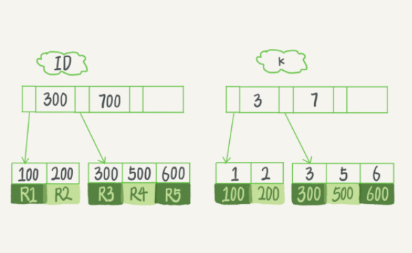

# 04 | 深入浅出索引（上）

<!-- @import "[TOC]" {cmd="toc" depthFrom=3 depthTo=6 orderedList=false} -->

<!-- code_chunk_output -->

- [概述](#概述)
- [索引的常见模型](#索引的常见模型)
  - [哈希表](#哈希表)
  - [有序数组](#有序数组)
  - [（平衡）搜索树](#平衡搜索树)
- [InnoDB 的索引模型](#innodb-的索引模型)
  - [B+树](#b树)
  - [主键索引和非主键索引](#主键索引和非主键索引)
- [索引维护](#索引维护)
- [重建索引分析](#重建索引分析)

<!-- /code_chunk_output -->


### 概述

一句话简单来说，索引的出现其实就是为了提高数据查询的效率，就像书的目录一样。一本 500 页的书，如果你想快速找到其中的某一个知识点，在不借助目录的情况下，那么要遍历。同样，对于数据库的表而言，索引其实就是它的“目录”。

### 索引的常见模型

索引的出现是为了提高查询效率，但是实现索引的方式却有很多种，所以这里也就引入了索引模型的概念。

可以用于提高读写效率的数据结构很多，这里我介绍三种常见、也比较简单的数据结构：`哈希表`、`有序数组`和`搜索树`。

从使用的角度分析一下这三种模型的区别。

#### 哈希表

哈希表是一种以 `键 - 值` （ `key-value` ）存储数据的结构，我们只要输入待查找的键即 `key` ，就可以找到其对应的值即 `value` 。

哈希的思路很简单，把值放在数组里，用一个哈希函数把 `key` 换算成一个确定的位置，然后把 `value` 放在数组的这个位置。

不可避免地，多个 `key` 值经过哈希函数的换算，会出现同一个值的情况。处理这种情况的一种方法是，拉出一个链表。

普通哈希表是无序的，因此追加数据很快。但是查找某个 `Value` 区间则很困难，需要遍历。

#### 有序数组

比如按照值的顺序排序，区间查找也相当方便，用二分就行： $O(logN)$ 。

如果仅仅看查询效率，有序数组就是最好的数据结构了。但是，在需要更新数据的时候就麻烦了，你往中间插入一个记录就必须得挪动后面所有的记录，成本太高。

所以，有序数组索引只适用于静态存储引擎，比如你要保存的是 2017 年某个城市的所有人口信息，这类不会再修改的数据。

#### （平衡）搜索树

所以这里综合“查询”和“操作”性能，我们选择（平衡）搜索树。

树可以有二叉，也可以有多叉。

多叉树就是每个节点有多个儿子，儿子之间的大小保证从左到右递增。**二叉树是搜索效率最高的，但是实际上大多数的数据库存储却并不使用二叉树。其原因是，索引不止存在内存中，还要写到磁盘上。**

你可以想象一下一棵 100 万节点的平衡二叉树，树高 20。一次查询可能需要访问 20 个数据块。在机械硬盘时代，从磁盘随机读一个数据块需要 10 ms 左右的寻址时间。也就是说，对于一个 100 万行的表，如果使用二叉树来存储，单独访问一个行可能需要 20 个 10 ms 的时间，这个查询可真够慢的。

为了让一个查询尽量少地读磁盘，就必须让查询过程访问尽量少的数据块。那么，我们就不应该使用二叉树，而是要使用`“N 叉”树`。这里，`“N 叉”`树中的“`N`”取决于数据块的大小。

以 `InnoDB` 的一个整数字段索引为例，这个 `N` 差不多是 `1200` 。这棵树高是 `4` 的时候，就可以存 `1200` 的 `3` 次方个值，这已经 `17亿` 了。考虑到树根的数据块总是在内存中的，一个 `10` 亿行的表上一个整数字段的索引，查找一个值最多只需要访问 `3` 次磁盘。其实，树的第二层也有很大概率在内存中，那么访问磁盘的平均次数就更少了。

**`N` 叉树由于在读写上的性能优点，以及适配磁盘的访问模式，已经被广泛应用在数据库引擎中了。** 不管是哈希还是有序数组，或者 `N` 叉树，它们都是不断迭代、不断优化的产物或者解决方案。数据库技术发展到今天，跳表、 `LSM` 树等数据结构也被用于引擎设计中，这里不再一一展开。

心里要有个概念： **数据库底层存储的核心就是基于这些数据模型的。每碰到一个新数据库，我们需要先关注它的数据模型，这样才能从理论上分析出这个数据库的适用场景。**

在 MySQL 中，索引是在存储引擎层实现的，所以并没有统一的索引标准，即 **不同存储引擎的索引的工作方式并不一样。而即使多个存储引擎支持同一种类型的索引，其底层的实现也可能不同。** 由于 InnoDB 存储引擎在 MySQL 数据库中使用最为广泛，所以这里以 InnoDB 为例分析索引模型。

### InnoDB 的索引模型

#### B+树

在 InnoDB 中，表都是根据主键顺序以索引的形式存放的，这种存储方式的表称为索引组织表。 InnoDB 使用了 B+ 树索引模型，所以数据都是存储在 B+ 树中的。

每一个索引在 InnoDB 里面对应一棵 B+ 树。假设，我们有一个主键列为 ID 的表，表中有字段 `k` ，并且在 `k` 上有索引。这个表的建表语句是：

```sql
mysql> create table T(
id int primary key, 
k int not null, 
name varchar(16),
index (k))engine=InnoDB;
```

表中 `R1~R5` 的 `(ID,k)` 值分别为 `(100,1)` 、 `(200,2)` 、 `(300,3)` 、 `(500,5)` 和 `(600,6)` ，两棵树的示例示意图如下。



#### 主键索引和非主键索引

从图中不难看出，根据叶子节点的内容，索引类型分为主键索引和非主键索引。

主键索引的叶子节点存的是整行数据。在 InnoDB 里，主键索引也被称为聚簇索引（ `clustered index` ）。非主键索引的叶子节点内容是主键的值。在 InnoDB 里，非主键索引也被称为二级索引（`secondary index`）。

根据上面的索引结构说明，我们来讨论一个问题：基于主键索引和普通索引的查询有什么区别？

- 如果语句是 `select * from T where ID=500` ，即主键查询方式，则只需要搜索 ID 这棵 B+ 树；
- 如果语句是 `select * from T where k=5` ，即普通索引查询方式，则需要先搜索 `k` 索引树，得到 `ID` 的值为 `500` ，再到 `ID` 索引树搜索一次。这个过程称为`回表`。

也就是说，基于非主键索引的查询需要多扫描一棵索引树。因此，我们在应用中应该尽量使用主键查询。

### 索引维护

B+ 树为了维护索引有序性，在插入新值的时候需要做必要的维护。

以上面这个图为例，如果插入新的行 `ID` 值为 `700` ，则只需要在 `R5` 的记录后面插入一个新记录。

如果新插入的 `ID` 值为 `400` ，就相对麻烦了，需要逻辑上挪动后面的数据，空出位置。而更糟的情况是，如果 `R5` 所在的数据页已经满了，根据 B+ 树的算法，这时候需要申请一个新的数据页，然后挪动部分数据过去。

这个过程称为`页分裂`。在这种情况下，性能自然会受影响。除了性能外，页分裂操作还影响数据页的利用率。原本放在一个页的数据，现在分到两个页中，整体空间利用率降低大约 `50%`。

当然有分裂就有合并。当相邻两个页由于删除了数据，利用率很低之后，会将数据页做`合并`。合并的过程，可以认为是分裂过程的逆过程。

基于上面的索引维护过程说明，我们来讨论一个案例：
- 你可能在一些建表规范里面见到过类似的描述，要求建表语句里一定要有自增主键。
- 当然事无绝对，**我们来分析一下哪些场景下应该使用自增主键，而哪些场景下不应该。**

自增主键是指自增列上定义的主键，在建表语句中一般是这么定义的： `NOT NULL PRIMARY KEY AUTO_INCREMENT` 。

插入新记录的时候可以不指定 `ID` 的值，系统会获取当前 `ID` 最大值加 `1` 作为下一条记录的 `ID` 值。

也就是说，自增主键的插入数据模式，正符合了递增插入的场景。每次插入一条新记录，都是追加操作，都不涉及到挪动其他记录，也不会触发叶子节点的分裂。

而有业务逻辑的字段做主键，则往往不容易保证有序插入，这样写数据成本相对较高。

除了考虑性能外，我们还可以从存储空间的角度来看。假设你的表中确实有一个唯一字段，比如字符串类型的身份证号，那应该用身份证号做主键，还是用自增字段做主键呢？

由于每个非主键索引的叶子节点上都是主键的值。如果用身份证号做主键，那么每个二级索引的叶子节点占用约 `20` 个字节，而如果用整型做主键，则只要 `4` 个字节，如果是长整型（`bigint`）则是 `8` 个字节。

**显然，主键长度越小，普通索引的叶子节点就越小，普通索引占用的空间也就越小。**

所以，从性能和存储空间方面考量，自增主键往往是更合理的选择。

有没有什么场景适合用业务字段直接做主键的呢？还是有的。比如，有些业务的场景需求是这样的：
- 只有一个索引；
- 该索引必须是唯一索引。

这就是典型的 `KV 场景` 。由于没有其他索引，所以也就不用考虑其他索引的叶子节点大小的问题。这时候我们就要优先考虑上一段提到的“尽量使用主键查询”原则，直接将这个索引设置为主键，可以避免每次查询需要搜索两棵树。

### 重建索引分析

为什么要重建索引？
- **索引可能因为删除，或者页分裂等原因，导致数据页有空洞**
- 重建索引的过程会创建一个新的索引，把数据按顺序插入，**这样页面的利用率最高，也就是索引更紧凑、更省空间。**

以下写法是否合理？

对于上面例子中的 InnoDB 表 `T` ，如果你要重建索引 `k` ，你的两个 SQL 语句可以这么写：

```sql
alter table T drop index k;
alter table T add index(k);
```

如果你要重建主键索引，也可以这么写：

```sql
alter table T drop primary key;
alter table T add primary key(id);
```

重建索引 `k` 的做法是合理的，可以达到省空间的目的。但是， **重建主键的过程不合理。不论是删除主键还是创建主键，都会将整个表重建。** 所以连着执行这两个语句的话，第一个语句就白做了。这两个语句，你可以用这个语句代替 ： `alter table T engine=InnoDB` 。在第 12 讲《为什么表数据删掉一半，表文件大小不变？》中，老师会分析这条语句的执行流程。

