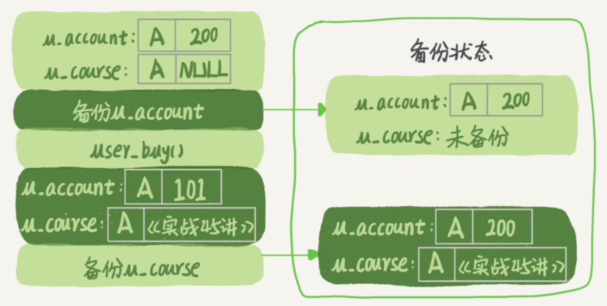

# 06 | 全局锁和表锁 ：给表加个字段怎么有这么多阻碍？

<!-- @import "[TOC]" {cmd="toc" depthFrom=3 depthTo=6 orderedList=false} -->

<!-- code_chunk_output -->

- [概述](#概述)
- [全局锁](#全局锁)
  - [加全局读锁FTWRL](#加全局读锁ftwrl)
  - [为什么不用可重复读事务隔离](#为什么不用可重复读事务隔离)
  - [为什么不用readonly=true](#为什么不用readonlytrue)
- [表级锁](#表级锁)
  - [表锁](#表锁)
  - [元数据锁MDL](#元数据锁mdl)
  - [小表加字段导致库挂了例子](#小表加字段导致库挂了例子)
  - [如何安全地给小表加字段？](#如何安全地给小表加字段)
- [小结](#小结)
- [问题：备库上备份，主库DDL会发生什么](#问题备库上备份主库ddl会发生什么)
- [补充章节：深入代码：Server层锁的实现原理](#补充章节深入代码server层锁的实现原理)
  - [1. 全局锁 `FTWRL` 的实现](#1-全局锁-ftwrl-的实现)
  - [2. 表锁 `LOCK TABLES` 的实现](#2-表锁-lock-tables-的实现)
  - [3. 元数据锁 `MDL` 的实现](#3-元数据锁-mdl-的实现)

<!-- /code_chunk_output -->

### 概述

数据库锁设计的初衷是处理并发问题。作为多用户共享的资源，当出现并发访问的时候，数据库需要合理地控制资源的访问规则。而锁就是用来实现这些访问规则的重要数据结构。

根据加锁的范围，MySQL 里面的锁大致可以分成`全局锁`、`表级锁`和`行锁`三类。

这一讲为全局锁和表级锁。而关于行锁的内容在下一讲。这里需要说明的是，锁的设计比较复杂，这里不会涉及锁的具体实现细节，主要介绍的是碰到锁时的现象和其背后的原理。

### 全局锁

#### 加全局读锁FTWRL

顾名思义，全局锁就是对整个数据库实例加锁。MySQL 提供了一个加全局读锁的方法，命令是 `Flush tables with read lock (FTWRL)` 。当你需要让整个库处于只读状态的时候，可以使用这个命令，之后其他线程的以下语句会被阻塞：数据更新语句（数据的增删改）、数据定义语句（包括建表、修改表结构等）和更新类事务的提交语句。

**全局锁的典型使用场景是，做全库逻辑备份。** 也就是把整库每个表都 `select` 出来存成文本。

以前有一种做法，是通过 `FTWRL` 确保不会有其他线程对数据库做更新，然后对整个库做备份。注意，在备份过程中整个库完全处于只读状态。

但是让整库都只读，听上去就很危险：
- 如果你在主库上备份，那么在备份期间都不能执行更新，业务基本上就得停摆；
- 如果你在从库上备份，那么备份期间从库不能执行主库同步过来的 binlog，会导致主从延迟。

看来加全局锁不太好。但是细想一下，备份为什么要加锁呢？我们来看一下不加锁会有什么问题。

假设你现在要维护“极客时间”的购买系统，关注的是用户账户余额表和用户课程表。

现在发起一个逻辑备份。假设备份期间，有一个用户，他购买了一门课程，业务逻辑里就要扣掉他的余额，然后往已购课程里面加上一门课。

如果时间顺序上是先备份账户余额表 ( `u_account` )，然后用户购买，然后备份用户课程表 ( `u_course` )，会怎么样呢？如下图：



可以看到，这个备份结果里，用户 A 的数据状态是“账户余额没扣，但是用户课程表里面已经多了一门课”。如果后面用这个备份来恢复数据的话，用户 A 就发现，自己赚了。

如果备份表的顺序反过来，先备份用户课程表再备份账户余额表，又可能会出现什么结果？

#### 为什么不用可重复读事务隔离

也就是说，不加锁的话，备份系统备份的得到的库不是一个逻辑时间点，这个视图是逻辑不一致的。说到视图，结合前面讲`事务隔离`，其实是有一个方法能够拿到一致性视图的，就是在`可重复读隔离级别`下开启一个事务。

官方自带的逻辑备份工具是 `mysqldump` 。当 `mysqldump` 使用参数`–single-transaction` 的时候，导数据之前就会启动一个事务，来确保拿到一致性视图。而由于 MVCC 的支持，这个过程中数据是可以正常更新的。

**有了这个功能，为什么还需要 `FTWRL` 呢？** 一致性读是好，但前提是引擎要支持这个隔离级别。比如，对于 MyISAM 这种不支持事务的引擎，如果备份过程中有更新，总是只能取到最新的数据，那么就破坏了备份的一致性。这时，我们就需要使用 `FTWRL` 命令了。

所以， `single-transaction` 方法只适用于所有的表使用事务引擎的库。如果有的表使用了不支持事务的引擎，那么备份就只能通过 `FTWRL` 方法。这往往是 DBA 要求业务开发人员使用 InnoDB 替代 MyISAM 的原因之一。

#### 为什么不用readonly=true

**既然要全库只读，为什么不使用 `set global readonly=true` 的方式呢？** 确实 `readonly` 方式也可以让全库进入只读状态，但老师还是建议用 `FTWRL` 方式，主要有两个原因：
- 一是，在有些系统中， `readonly` 的值会被用来做其他逻辑，比如用来判断一个库是主库还是备库。因此，修改 `global` 变量的方式影响面更大，不建议使用。
- 二是，在异常处理机制上有差异。如果执行 `FTWRL` 命令之后由于客户端发生异常断开，那么 MySQL 会自动释放这个全局锁，整个库回到可以正常更新的状态。而将整个库设置为 `readonly` 之后，如果客户端发生异常，则数据库就会一直保持 `readonly` 状态，这样会导致整个库长时间处于不可写状态，风险较高。

业务的更新不只是增删改数据（ `DML` )，还有可能是加字段等修改表结构的操作（ `DDL` ）。不论是哪种方法，一个库被全局锁上以后，你要对里面任何一个表做加字段操作，都是会被锁住的。

但是，即使没有被全局锁住，加字段也不是就能一帆风顺的，因为你还会碰到接下来我们要介绍的表级锁。

### 表级锁

MySQL 里面表级别的锁有两种：一种是`表锁`，一种是`元数据锁`（ `meta data lock` ，`MDL`)。

#### 表锁

表锁的语法是 `lock tables … read/write` 。与 `FTWRL` 类似，可以用 `unlock tables` 主动释放锁，也可以在客户端断开的时候自动释放。需要注意，`lock tables` 语法除了会限制别的线程的读写外，也限定了本线程接下来的操作对象。

举个例子, 如果在某个线程 A 中执行 `lock tables t1 read, t2 write;` 这个语句，则其他线程写 `t1` 、读写 `t2` 的语句都会被阻塞。同时，线程 A 在执行 `unlock tables` 之前，也只能执行读 `t1` 、读写 `t2` 的操作。连写 `t1` 都不允许，自然也不能访问其他表。**（写是排他锁，写锁意味着其他线程不能读也不能写。读锁是共享锁，加上后其他锁只能读不能写，本线程也不能写）**

在还没有出现更细粒度的锁的时候，表锁是最常用的处理并发的方式。而对于 InnoDB 这种支持行锁的引擎，一般不使用 `lock tables` 命令来控制并发，毕竟锁住整个表的影响面还是太大。

#### 元数据锁MDL

另一类表级的锁是 `MDL` （`metadata lock`)。 `MDL` 不需要显式使用，在访问一个表的时候会被自动加上。 `MDL` 的作用是，保证读写的正确性。你可以想象一下，如果一个查询正在遍历一个表中的数据，而执行期间另一个线程对这个表结构做变更，删了一列，那么查询线程拿到的结果跟表结构对不上，肯定是不行的。

因此，在 MySQL 5.5 版本中引入了 `MDL` ，当对一个表做增删改查操作的时候，加 `MDL` 读锁；当要对表做结构变更操作的时候，加 `MDL` 写锁。
- 读锁之间不互斥，因此你可以有多个线程同时对一张表增删改查。
- 读写锁之间、写锁之间是互斥的，用来保证变更表结构操作的安全性。

因此，如果有两个线程要同时给一个表加字段，其中一个要等另一个执行完才能开始执行。

#### 小表加字段导致库挂了例子

虽然 `MDL` 锁是系统默认会加的，但却是你不能忽略的一个机制。比如下面这个例子，：给一个小表加个字段，导致整个库挂了。

给一个表加字段，或者修改字段，或者加索引，需要扫描全表的数据。在对大表操作的时候，你肯定会特别小心，以免对线上服务造成影响。而实际上，即使是小表，操作不慎也会出问题。我们来看一下下面的操作序列，假设表 `t` 是一个小表。


> 备注：这里的实验环境是 MySQL 5.6。

我们可以看到 `session A` 先启动，这时候会对表 `t` 加一个 `MDL` 读锁。由于 `session B` 需要的也是 `MDL` 读锁，因此可以正常执行。

之后 `session C` 会被 `blocked` ，是因为 `session A` 的 `MDL` 读锁还没有释放，而 `session C` 需要 `MDL` 写锁，因此只能被阻塞。

如果只有 `session C` 自己被阻塞还没什么关系，但是之后所有要在表 `t` 上新申请 `MDL` 读锁的请求也会被 `session C` 阻塞。前面我们说了，所有对表的增删改查操作都需要先申请 `MDL` 读锁，就都被锁住，等于这个表现在完全不可读写了。

如果某个表上的查询语句频繁，而且客户端有重试机制，也就是说超时后会再起一个新 `session` 再请求的话，这个库的线程很快就会爆满。

因此， **事务中的 `MDL` 锁，在语句执行开始时申请，但是语句结束后并不会马上释放，而会等到整个事务提交后再释放。**

#### 如何安全地给小表加字段？

基于上面的分析，我们来讨论一个问题， **如何安全地给小表加字段？**

首先我们要解决长事务，事务不提交，就会一直占着 `MDL` 锁。在 MySQL 的 `information_schema` 库的 `innodb_trx` 表中，你可以查到当前执行中的事务。

如果你要做 `DDL` 变更的表刚好有长事务在执行，要考虑先暂停 `DDL` ，或者 `kill` 掉这个长事务。

但考虑一下这个场景。如果你要变更的表是一个热点表，虽然数据量不大，但是上面的请求很频繁，而你不得不加个字段，你该怎么做呢？

这时候 `kill` 可能未必管用，因为新的请求马上就来了。比较理想的机制是，在 `alter table` 语句里面设定等待时间，如果在这个指定的等待时间里面能够拿到 `MDL` 写锁最好，拿不到也不要阻塞后面的业务语句，先放弃。之后开发人员或者 DBA 再通过重试命令重复这个过程。

MariaDB 已经合并了 AliSQL 的这个功能，所以这两个开源分支目前都支持 `DDL NOWAIT/WAIT n` 这个语法：

```sql
ALTER TABLE tbl_name NOWAIT add column ...
ALTER TABLE tbl_name WAIT N add column ...
```

### 小结

全局锁主要用在逻辑备份过程中。

对于全部是 InnoDB 引擎的库，我建议你选择使用 `–single-transaction` 参数，对应用会更友好。

表锁一般是在数据库引擎不支持行锁的时候才会被用到的。

如果你发现你的应用程序里有 `lock tables` 这样的语句，你需要追查一下，比较可能的情况是：
- 要么是你的系统现在还在用 MyISAM 这类不支持事务的引擎，那要安排升级换引擎；
- 要么是你的引擎升级了，但是代码还没升级。老师见过这样的情况，最后业务开发就是把 `lock tables` 和 `unlock tables` 改成 `begin` 和 `commit` ，问题就解决了。

`MDL` 会直到事务提交才释放，在做表结构变更的时候，你一定要小心不要导致锁住线上查询和更新。

### 问题：备库上备份，主库DDL会发生什么

备份一般都会在备库上执行，你在用 `–single-transaction` 方法做逻辑备份的过程中，如果主库上的一个小表做了一个 `DDL` ，比如给一个表上加了一列。这时候，从备库上会看到什么现象呢？

假设这个 `DDL` 是针对表 `t1` 的， 这里备份过程中几个关键的语句列出如下：

```sql
Q1:SET SESSION TRANSACTION ISOLATION LEVEL REPEATABLE READ;
Q2:START TRANSACTION  WITH CONSISTENT SNAPSHOT；
/* other tables */
Q3:SAVEPOINT sp;
/* 时刻 1 */
Q4:show create table `t1`;
/* 时刻 2 */
Q5:SELECT * FROM `t1`;
/* 时刻 3 */
Q6:ROLLBACK TO SAVEPOINT sp;
/* 时刻 4 */
/* other tables */
```

在备份开始的时候，为了确保 RR（可重复读）隔离级别，再设置一次 RR 隔离级别 (Q1)；

启动事务，这里用 `WITH CONSISTENT SNAPSHOT` 确保这个语句执行完就可以得到一个一致性视图（Q2)；

设置一个保存点，这个很重要（Q3）；

`show create` 是为了拿到表结构 (Q4)，然后正式导数据（Q5），回滚到 `SAVEPOINT sp` ，在这里的作用是释放 `t1` 的 `MDL` 锁 （Q6）。当然这部分属于“超纲”，上文正文里面都没提到。

`DDL` 从主库传过来的时间按照效果不同，老师打了四个时刻。题目设定为小表，我们假定到达后，如果开始执行，则很快能够执行完成。参考答案如下：
- 如果在 Q4 语句执行之前到达，现象：没有影响，备份拿到的是 DDL 后的表结构。
- 如果在“时刻 2”到达，则表结构被改过，Q5 执行的时候，报 `Table definition has changed, please retry transaction` ，现象： `mysqldump` 终止；
- 如果在“时刻 2”和“时刻 3”之间到达， `mysqldump` 占着 `t1` 的 `MDL` 读锁， `binlog` 被阻塞，现象：主从延迟，直到 Q6 执行完成。
- 从“时刻 4”开始， `mysqldump` 释放了 MDL 读锁，现象：没有影响，备份拿到的是 `DDL` 前的表结构。

### 补充章节：深入代码：Server层锁的实现原理

本章旨在补充笔记中提到的三种锁在MySQL源代码层面的核心实现逻辑。为了便于理解，我们将使用简化的伪代码和注释来描述其工作流程，这些逻辑主要分布在 `sql/` 目录下的 `sql_base.cc`, `sql_lock.cc`, `mdl.cc` 等文件中。

#### 1. 全局锁 `FTWRL` 的实现

`FLUSH TABLES WITH READ LOCK` (FTWRL) 的目标是暂停整个实例的写入活动。其实现依赖于一个全局性的锁和对所有工作线程状态的协调。

**核心函数：`lock_global_read_lock()` (位于 `sql_lock.cc`)**

当用户执行FTWRL命令时，MySQL Server最终会调用这个函数。

```cpp
// 伪代码: lock_global_read_lock()
int lock_global_read_lock(THD* thd) {
    // 步骤1: 获取全局读锁的互斥锁（Mutex）
    // 这是一个内部控制锁，用来确保同一时间只有一个线程可以执行FTWRL或UNLOCK操作。
    // 防止多个FTWRL请求相互干扰。
    mysql_mutex_lock(&LOCK_global_read);

    // 步骤2: 检查当前线程是否已经持有全局锁，防止重入导致死锁。
    if (thd->global_read_lock) {
        // 如果已经持有，则直接返回。
        mysql_mutex_unlock(&LOCK_global_read);
        return 0; 
    }

    // 步骤3: 关键步骤 - 刷新并关闭所有打开的表。
    // 这个操作会强制所有线程释放它们当前持有的表缓存。
    // 同时，它会等待所有正在使用表的线程完成当前操作。
    close_cached_tables(thd, true, true);

    // 步骤4: 设置全局变量，标记整个实例已进入全局读锁状态。
    // 这个变量是一个全局的"交通信号灯"，新的写操作会检查这个变量。
    mysql_gaq_add_lock(&global_read_lock);

    // 步骤5: 标记当前会话（THD）持有了全局锁。
    // 这很重要，因为当这个会话断开连接时，服务端会根据这个标记自动释放全局锁。
    thd->global_read_lock = true;

    // 步骤6: 释放内部控制锁
    mysql_mutex_unlock(&LOCK_global_read);
    return 0;
}

// 释放锁的逻辑在 `unlock_global_read_lock()` 中，过程相反。
// 它会清除全局状态变量 `global_read_lock` 和会话标记 `thd->global_read_lock`。
```

**总结** ：`FTWRL`的实现可以看作是一个“两阶段”过程。首先，通过`close_cached_tables`强制所有正在进行中的操作“靠边停车”。然后，通过设置一个全局变量`global_read_lock`来阻止新的写操作“上路”。

#### 2. 表锁 `LOCK TABLES` 的实现

`LOCK TABLES` 是一种显式的、由用户控制的表级锁。其实现与线程的上下文（`THD`对象）紧密相关。

**核心函数：`mysql_lock_tables()` (位于 `sql_lock.cc`)**

```cpp
// 伪代码: mysql_lock_tables()
bool mysql_lock_tables(THD *thd, TABLE_LIST *tables) {
    // 步骤1: 清理当前线程之前可能持有的所有表锁。
    // LOCK TABLES命令会覆盖之前的任何LOCK TABLES操作。
    unlock_tables(thd, thd->lock);

    // 步骤2: 遍历用户请求加锁的表列表（tables）。
    for (TABLE_LIST *table = tables; table; table = table->next) {
        // 步骤2.1: 为每个表打开并获取一个表实例。
        // 这个过程会触发MDL锁的获取（见下一节）。
        open_ltable(thd, table, ...);

        // 步骤2.2: 设置锁的类型（READ, WRITE等）到表实例的 lock_type 属性中。
        table->lock_type = ...;
    }

    // 步骤3: 核心步骤 - 执行加锁操作。
    // 这个函数会真正地去获取物理的表锁。
    if (lock_tables(thd, tables)) {
        // 如果加锁失败（例如发生死锁），则回滚并释放所有已尝试加的锁。
        return true; // 返回失败
    }

    // 步骤4: 将成功加锁的表列表保存到当前线程的上下文中。
    // thd->lock 指向这个锁定的表列表。
    // Server层的其他部分会通过检查 thd->lock 来判断该线程的权限。
    // 例如，如果一个线程执行了 LOCK TABLES t1 READ，
    // 当它尝试 "UPDATE t1 ..." 时，Server会检查 thd->lock 发现 t1 是读锁，从而报错。
    thd->lock = tables;

    return false; // 返回成功
}
```

**总结** ：`LOCK TABLES` 的实现是将锁信息（哪些表、何种锁）直接绑定到了发起操作的线程对象`THD`上。Server层的SQL执行器在处理后续语句时，会主动检查`thd->lock`来强制执行锁的约束，这完全是Server层的行为。

#### 3. 元数据锁 `MDL` 的实现

MDL是为保证事务期间表结构不被修改而设计的。它的实现是现代MySQL中锁管理最精巧的部分之一，其核心是基于一个“锁请求队列”的机制。

**核心组件与函数 (位于 `mdl.h`, `mdl.cc`)**
* **`MDL_context`** : 每个事务（或语句）都有一个MDL上下文，用于管理其生命周期内的所有MDL锁。
* **`MDL_request`** : 代表一个锁请求，包含要锁的对象名、锁类型（如`MDL_SHARED_READ`, `MDL_EXCLUSIVE`）等信息。
* **`MDL_ticket`** : 代表一个已成功获取的锁。它是一个“凭证”，当这个凭证被销毁时，锁就被释放。通常在事务结束时，`MDL_context`会销毁其持有的所有`MDL_ticket`。

**核心函数：`MDL_context::acquire_lock()`**

```cpp
// 伪代码: MDL_context::acquire_lock()
bool MDL_context::acquire_lock(MDL_request *mdl_request, MDL_ticket **ticket) {
    // 步骤1: 找到或创建一个对应于请求对象（如表't'）的锁对象。
    MDL_object *obj = find_or_create_mdl_object(mdl_request->key);

    // 步骤2: 检查这个锁对象的队列，判断请求的锁是否与已授予的锁兼容。
    // 这是最关键的调度逻辑。
    if (is_compatible_with_granted_locks(obj, mdl_request)) {
        // 场景A: 锁兼容 (例如，读请求遇到读锁)
        // 步骤2A.1: 直接授予锁。
        grant_lock(obj, mdl_request);
        
        // 步骤2A.2: 创建一个MDL_ticket，并返回给调用者。
        *ticket = create_ticket(...);
        return true; // 成功获取锁
    } else {
        // 场景B: 锁不兼容 (例如，写请求遇到读锁，或读请求遇到等待中的写锁)
        // 步骤2B.1: 将当前的MDL_request放入该锁对象的等待队列（pending_requests）。
        obj->pending_requests.push_back(mdl_request);

        // 步骤2B.2: 当前线程进入等待状态（休眠）。
        // 它会等待，直到持有冲突锁的线程释放锁。
        thd_wait_begin(...);
        
        // ... 等待被唤醒 ...

        // 当被唤醒后，会重新尝试获取锁。
        // 如果获取成功，则从等待队列中移除请求，并返回ticket。
        // 如果因超时等原因失败，则返回false。
    }
}

// 锁释放逻辑 (发生在事务结束时)
MDL_context::~MDL_context() {
    for (ticket in all_my_tickets) {
        // 销毁ticket会触发锁的释放
        release_lock(ticket->lock_object, ticket);
        // 释放锁后，会检查并唤醒等待队列中的其他线程。
        wakeup_pending_threads(ticket->lock_object);
    }
}
```

**总结** ：MDL的实现精髓在于其 **队列机制** 。一个`ALTER TABLE`（请求`MDL_EXCLUSIVE`）之所以会因一个长事务中的`SELECT`（持有`MDL_SHARED_READ`）而阻塞，就是因为它在`acquire_lock`时发现锁不兼容，其请求被放入了等待队列。而更致命的是，一旦队列中有写锁请求（即使在等待），后续的读锁请求为了防止写锁“饿死”，也会被阻塞排队。这就是“给小表加字段导致库挂了”的根本代码层原因。锁的生命周期与事务绑定，确保了事务的原子性和隔离性不受DDL干扰。
