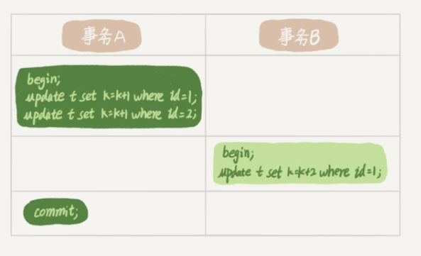
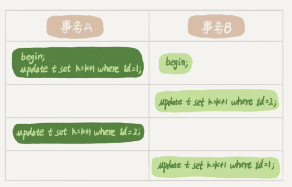

# 07 | 行锁功过：怎么减少行锁对性能的影响？

<!-- @import "[TOC]" {cmd="toc" depthFrom=3 depthTo=6 orderedList=false} -->

<!-- code_chunk_output -->

- [概述](#概述)
- [从两阶段锁说起](#从两阶段锁说起)
  - [例子：两阶段锁协议](#例子两阶段锁协议)
  - [例子：最可能影响并发度的锁尽量往后放](#例子最可能影响并发度的锁尽量往后放)
- [死锁和死锁检测](#死锁和死锁检测)
  - [主动死锁检测](#主动死锁检测)
  - [解决由这种热点行更新导致的性能问题](#解决由这种热点行更新导致的性能问题)
- [问题：如何删除一个表前 10000 行数据](#问题如何删除一个表前-10000-行数据)
- [补充章节：深入代码：InnoDB行锁与死锁检测的实现细节](#补充章节深入代码innodb行锁与死锁检测的实现细节)
  - [1. InnoDB 行锁与两阶段锁的实现](#1-innodb-行锁与两阶段锁的实现)
  - [2. 主动死锁检测的实现](#2-主动死锁检测的实现)
  - [3. 死锁处理：受害者选择与回滚](#3-死锁处理受害者选择与回滚)

<!-- /code_chunk_output -->

### 概述

MySQL 的行锁是在引擎层由各个引擎自己实现的。但并不是所有的引擎都支持行锁，比如 MyISAM 引擎就不支持行锁。不支持行锁意味着并发控制只能使用表锁，对于这种引擎的表，同一张表上任何时刻只能有一个更新在执行，这就会影响到业务并发度。 InnoDB 是支持行锁的，这也是 MyISAM 被 InnoDB 替代的重要原因之一。

今天就主要来聊聊 InnoDB 的行锁，以及如何通过减少锁冲突来提升业务并发度。

顾名思义，行锁就是针对数据表中行记录的锁。这很好理解，比如事务 A 更新了一行，而这时候事务 B 也要更新同一行，则必须等事务 A 的操作完成后才能进行更新。

当然，数据库中还有一些没那么一目了然的概念和设计，这些概念如果理解和使用不当，容易导致程序出现非预期行为，比如两阶段锁。

### 从两阶段锁说起

#### 例子：两阶段锁协议

在下面的操作序列中，事务 B 的 `update` 语句执行时会是什么现象呢？假设字段 `id` 是表 `t` 的主键。



这个问题的结论取决于事务 A 在执行完两条 `update` 语句后，持有哪些锁，以及在什么时候释放。实际上事务 B 的 `update` 语句会被阻塞，直到事务 A 执行 `commit` 之后，事务 B 才能继续执行。

事务 A 持有的两个记录的行锁，都是在 `commit` 的时候才释放的。

也就是说，在 InnoDB 事务中，行锁是在需要的时候才加上的， **但并不是不需要了就立刻释放，而是要等到事务结束时才释放。** 这个就是`两阶段锁协议`。

#### 例子：最可能影响并发度的锁尽量往后放

如果你的事务中需要锁多个行，要把最可能造成锁冲突、最可能影响并发度的锁尽量往后放。如下例。

假设你负责实现一个电影票在线交易业务，顾客 A 要在影院 B 购买电影票。我们简化一点，这个业务需要涉及到以下操作：
- 从顾客 A 账户余额中扣除电影票价；
- 给影院 B 的账户余额增加这张电影票价；
- 记录一条交易日志。

也就是说，要完成这个交易，我们需要 `update` 两条记录，并 `insert` 一条记录。当然，为了保证交易的原子性，我们要把这三个操作放在一个事务中。那么，你会怎样安排这三个语句在事务中的顺序呢？

试想如果同时有另外一个顾客 C 要在影院 B 买票，那么这两个事务冲突的部分就是语句 2 了。因为它们要更新同一个影院账户的余额，需要修改同一行数据。

根据两阶段锁协议，不论你怎样安排语句顺序，所有的操作需要的行锁都是在事务提交的时候才释放的。所以， **如果你把语句 2 安排在最后，比如按照 3、1、2 这样的顺序，那么影院账户余额这一行的锁时间就最少。这就最大程度地减少了事务之间的锁等待，提升了并发度。**

好了，现在由于你的正确设计，影院余额这一行的行锁在一个事务中不会停留很长时间。但是，这并没有完全解决你的困扰。

如果这个影院做活动，可以低价预售一年内所有的电影票，而且这个活动只做一天。于是在活动时间开始的时候，你的 MySQL 就挂了。你登上服务器一看， CPU 消耗接近 100% ，但整个数据库每秒就执行不到 100 个事务。这是什么原因呢？这里，我就要说到死锁和死锁检测了。

### 死锁和死锁检测

当并发系统中不同线程出现循环资源依赖，涉及的线程都在等待别的线程释放资源时，就会导致这几个线程都进入无限等待的状态，称为死锁。这里我用数据库中的行锁举个例子。



这时候，事务 A 在等待事务 B 释放 `id=2` 的行锁，而事务 B 在等待事务 A 释放 `id=1` 的行锁。事务 A 和事务 B 在互相等待对方的资源释放，就是进入了死锁状态。当出现死锁以后，有两种策略：
- 一种策略是，直接进入等待，直到超时。这个超时时间可以通过参数 `innodb_lock_wait_timeout` 来设置。
- 另一种策略是，发起死锁检测，发现死锁后，主动回滚死锁链条中的某一个事务，让其他事务得以继续执行。将参数 `innodb_deadlock_detect` 设置为 `on` ，表示开启这个逻辑。

在 InnoDB 中， `innodb_lock_wait_timeout` 的默认值是 50s，意味着如果采用第一个策略，当出现死锁以后，第一个被锁住的线程要过 50s 才会超时退出，然后其他线程才有可能继续执行。

对于在线服务来说，这个等待时间往往是无法接受的。但是，我们又不可能直接把这个时间设置成一个很小的值，比如 1s。这样当出现死锁的时候，确实很快就可以解开，但如果不是死锁，而是简单的锁等待呢？所以，超时时间设置太短的话，会出现很多误伤。

#### 主动死锁检测

所以，正常情况下我们还是要采用第二种策略，即：主动死锁检测，而且 `innodb_deadlock_detect` 的默认值本身就是 `on` 。主动死锁检测在发生死锁的时候，是能够快速发现并进行处理的，但是它也是有额外负担的。

你可以想象一下这个过程：每当一个事务被锁的时候，就要看看它所依赖的线程有没有被别人锁住，如此循环，最后判断是否出现了循环等待，也就是死锁。

那如果是我们上面说到的所有事务都要更新同一行的场景呢？

每个新来的被堵住的线程，都要判断会不会由于自己的加入导致了死锁，这是一个时间复杂度是 $O(n^2)$ 的操作。假设有 $1000$ 个并发线程要同时更新同一行，那么死锁检测操作就是 100 万这个量级的。

虽然最终检测的结果是没有死锁，但是这期间要消耗大量的 CPU 资源。因此，你就会看到 CPU 利用率很高，但是每秒却执行不了几个事务。

根据上面的分析，我们来讨论一下， **怎么解决由这种热点行更新导致的性能问题呢？问题的症结在于，死锁检测要耗费大量的 CPU 资源。**

#### 解决由这种热点行更新导致的性能问题

**一种头痛医头的方法，就是如果你能确保这个业务一定不会出现死锁，可以临时把死锁检测关掉。** 但是这种操作本身带有一定的风险，因为业务设计的时候一般不会把死锁当做一个严重错误，毕竟出现死锁了，就回滚，然后通过业务重试一般就没问题了，这是业务无损的。而关掉死锁检测意味着可能会出现大量的超时，这是业务有损的。

**另一个思路是控制并发度。** 根据上面的分析，你会发现如果并发能够控制住，比如同一行同时最多只有 10 个线程在更新，那么死锁检测的成本很低，就不会出现这个问题。一个直接的想法就是，在客户端做并发控制。但是，你会很快发现这个方法不太可行，因为客户端很多。我见过一个应用，有 600 个客户端，这样即使每个客户端控制到只有 5 个并发线程，汇总到数据库服务端以后，峰值并发数也可能要达到 3000。

因此，这个并发控制要做在数据库服务端。如果你有中间件，可以考虑在中间件实现；如果你的团队有能修改 MySQL 源码的人，也可以做在 MySQL 里面。 **基本思路就是，对于相同行的更新，在进入引擎之前排队。** 这样在 InnoDB 内部就不会有大量的死锁检测工作了。

如果团队里暂时没有数据库方面的专家，不能实现这样的方案，能不能从设计上优化这个问题呢？

**可以考虑通过将一行改成逻辑上的多行来减少锁冲突。** 还是以影院账户为例，可以考虑放在多条记录上，比如 10 个记录，影院的账户总额等于这 10 个记录的值的总和。这样每次要给影院账户加金额的时候，随机选其中一条记录来加。这样每次冲突概率变成原来的 1/10，可以减少锁等待个数，也就减少了死锁检测的 CPU 消耗。

这个方案看上去是无损的，但其实这类方案需要根据业务逻辑做详细设计。如果账户余额可能会减少，比如退票逻辑，那么这时候就需要考虑当一部分行记录变成 0 的时候，代码要有特殊处理。

**减少死锁的主要方向，就是控制访问相同资源的并发事务量。**

### 问题：如何删除一个表前 10000 行数据

如果你要删除一个表里面的前 10000 行数据，有以下三种方法可以做到：
- 第一种，直接执行 `delete from T limit 10000;`
- 第二种，在一个连接中循环执行 20 次 `delete from T limit 500;`
- 第三种，在 20 个连接中同时执行 `delete from T limit 500` 。

第二种方式是相对较好的。

第一种方式（即：直接执行 `delete from T limit 10000` ）里面，单个语句占用时间长，锁的时间也比较长；而且大事务还会导致主从延迟。

第三种方式（即：在 20 个连接中同时执行 `delete from T limit 500` ），会人为造成锁冲突。

如果可以加上特定条件，将这 10000 行天然分开，可以考虑第三种。实际上在操作的时候老师也建议尽量拿到 ID 再删除。

### 补充章节：深入代码：InnoDB行锁与死锁检测的实现细节

#### 1. InnoDB 行锁与两阶段锁的实现

InnoDB 的行锁并不是直接存储在数据行（row）上的，而是通过一个独立的 **锁信息结构** 来管理，并与事务对象（`trx_t`）关联。

**核心数据结构**

* `trx_t`: 事务对象。每个事务在 InnoDB 内部都由一个 `trx_t` 结构体表示，它包含了事务ID、状态、以及该事务持有的所有锁链表（`trx->locks`）。
* `lock_t`: 通用锁对象。描述一个锁的详细信息，包括持有该锁的事务（`lock->trx`）、锁模式（`lock->mode`，如 `LOCK_S` 读锁/共享锁、`LOCK_X` 写锁/排他锁）、以及一个指向下一个锁对象的指针，形成一个链表。
* `rec_lock_t`: 行锁（Record Lock）对象。这是 `lock_t` 的一种具体实现，专门用于行锁。
* **锁哈希表（`lock_sys->rec_hash`）** : InnoDB 在内存中维护一个全局的哈希表来快速定位行锁。这个哈希表的 `key` 通常是 `(space_id, page_no)`，`value` 是一个链表，包含了该数据页上所有的行锁对象（`rec_lock_t`）。

**加锁与两阶段锁的实现流程 (以 `SELECT ... FOR UPDATE` 为例)**

当 InnoDB 需要对某一行加锁时，主要入口是 `row_search_mvcc()` 函数，其内部会调用加锁的核心函数 `lock_rec_lock()`。

```cpp
// 伪代码: lock_rec_lock() - 尝试对一条记录加锁
// location: lock/lock0lock.cc

lock_t* lock_rec_lock(
    bool          implicit, // 是否是隐式锁
    lock_mode_t   mode,     // 请求的锁模式, e.g., LOCK_X
    const rec_t*  rec,      // 指向要加锁的物理记录
    trx_t*        trx       // 请求加锁的事务
) {
    // 步骤1: 定位或创建该记录所在数据页的锁队列头。
    // 使用 (space_id, page_no) 作为 key 在全局锁哈希表中查找。
    lock_queue = lock_rec_get_queue(rec);

    // 步骤2: 遍历该页的锁队列，检查是否存在冲突的锁。
    // 这是锁冲突检测的核心。
    for (lock in lock_queue) {
        // a. 检查这个锁是否在同一条记录上。
        if (!lock_rec_same_trx(lock, trx) && lock_rec_is_on_rec(lock, rec)) {

            // b. 如果是其他事务持有的锁，则检查锁模式是否冲突。
            // is_conflicting() 会根据锁兼容性矩阵返回 true/false。
            // 例如，请求的 LOCK_X 与已有的 LOCK_S/LOCK_X 冲突。
            if (is_conflicting(mode, lock->mode)) {
                // *** 发现锁冲突 ***
                
                // 步骤 2.1: 创建一个新的 lock_t 对象来表示本次"等待"的锁请求。
                wait_lock = lock_alloc(trx, ...);
                wait_lock->type_mode = mode | LOCK_WAIT; // 标记为等待状态

                // 步骤 2.2: 将这个等待锁请求加入到锁队列的末尾。
                add_to_queue(lock_queue, wait_lock);

                // 步骤 2.3: 将当前事务状态设置为等待，并挂起当前线程。
                trx->state = TRX_STATE_LOCK_WAIT;
                suspend_thread(trx); // 线程进入休眠

                // ... 线程在这里等待，直到被唤醒 (锁被释放或死锁回滚) ...

                // 唤醒后，重新检查状态，可能成功，也可能被回滚。
                // ...
                return nullptr; // 暂时返回，表示等待
            }
        }
    }

    // *** 没有锁冲突 ***
    // 步骤3: 创建一个新的 lock_t 对象。
    granted_lock = lock_alloc(trx, ...);
    granted_lock->type_mode = mode; // 正常模式，非等待

    // 步骤4: 将新锁加入到数据页的锁队列中。
    add_to_queue(lock_queue, granted_lock);

    // 步骤5:【两阶段锁的关键】将新锁加入到事务的私有锁链表(trx->locks)中。
    // 只要事务不提交/回滚，这个链表就不会清空，锁就一直被持有。
    trx->locks.add(granted_lock);

    return granted_lock; // 成功获得锁
}
```

**两阶段锁协议的体现** ：从 `步骤5` 可以清晰地看到，一旦一个锁被成功获取（`granted_lock`），它就会被添加到事务对象 `trx_t` 的 `locks` 链表中。这个链表中的所有锁，只会在事务提交（`trx_commit`）或回滚（`trx_rollback`）时，通过 `lock_trx_release_locks()` 函数统一遍历并释放。语句执行完并不会触发释放，这就是两阶段锁协议在代码层面的直接体现。

#### 2. 主动死锁检测的实现

当一个事务因锁冲突而进入等待状态时（即 `lock_rec_lock` 中 `suspend_thread` 的地方），InnoDB 会触发主动死锁检测。

**核心逻辑：构建“等待关系图”（Waits-for Graph）并深度优先搜索（DFS）**

这个图是在需要检测时 **动态构建** 的，节点是事务（`trx_t`），有向边 `T1 -> T2` 表示 `T1` 正在等待 `T2` 释放锁。

**核心函数：`DeadlockChecker::check_and_resolve()` (位于 `lock/lock0deadlock.cc`)**

```cpp
// 伪代码: DeadlockChecker::check_and_resolve()
bool DeadlockChecker::check_and_resolve(lock_t* wait_lock, trx_t* trx) {
    // 步骤1: 初始化。获取等待的事务(wait_trx)和它等待的锁(wait_lock)。
    m_wait_trx = trx;
    
    // 步骤2: 启动深度优先搜索（DFS）来寻找等待图中的环。
    // search() 函数是DFS的核心实现。
    // m_start_node 记录了DFS的起点，用于判断是否回到原点。
    m_start_node = trx; 
    bool found = search(trx);

    if (found) {
        // *** 发现死锁 ***

        // 步骤3: 如果检测到环，则选择一个“代价”最小的事务作为受害者。
        trx_t* victim_trx = select_victim();

        // 步骤4: 回滚受害者事务。
        // 这会释放受害者持有的所有锁，从而打破死锁环。
        trx_rollback_for_deadlock(victim_trx);

        return true; // 报告已处理死锁
    }

    return false; // 未发现死lok
}


// 伪代码: DeadlockChecker::search() - DFS核心
bool DeadlockChecker::search(trx_t* current_trx) {
    // a. 将当前事务加入到本次搜索的路径中，防止在同一个路径上重复访问。
    m_path.add(current_trx);

    // b. 获取 current_trx 正在等待的那个锁 lock_being_waited_for。
    lock_t* lock = current_trx->wait_lock;

    // c. 遍历这个锁的持有者和等待者，找到锁的直接持有者。
    //    对于行锁，通常只有一个持有者 trx_holder。
    trx_t* trx_holder = get_trx_holding_the_lock(lock);

    if (trx_holder == m_start_node) {
        // ** 找到环 **
        // 如果锁的持有者正是我们搜索的起点，说明形成了一个闭环。
        // 例如：T1 -> T2 -> T1
        return true; // 死锁发现！
    }

    // d. 检查 trx_holder 是否已经存在于当前的搜索路径中。
    if (m_path.contains(trx_holder)) {
        // ** 找到环 **
        // 例如：T1 -> T2 -> T3 -> T2，当从T3访问T2时，发现T2已在路径中。
        return true; // 死锁发现！
    }

    // e. 递归深入: 以锁的持有者 trx_holder 作为新节点，继续进行DFS搜索。
    if (search(trx_holder)) {
        return true;
    }
    
    // f. 回溯: 如果从 trx_holder 出发的所有路径都没有找到环，
    //    则将 current_trx 从当前搜索路径中移除。
    m_path.remove(current_trx);

    return false; // 在这个分支没有找到死锁
}
```

**性能瓶颈** ：笔记中提到的热点行更新导致CPU飙升，根源就在于此。当1000个线程同时更新同一行时，第2个线程等待第1个，第3个等待第1个... 第1000个也等待第1个。当第 `n` 个线程进入等待时，它会触发一次死锁检测。这次检测需要构建一个包含 `n-1` 个节点（都在等待第1个线程）的图，并进行遍历。虽然最终没有环，但这个遍历的成本随着 `n` 的增大而急剧升高，导致大量CPU消耗在死锁检测上。

#### 3. 死锁处理：受害者选择与回滚

一旦 `DeadlockChecker` 发现了死锁环，就需要选择一个事务进行回滚，以打破循环。

**核心逻辑：选择回滚代价最小的事务**

InnoDB 不会随机选择受害者，而是倾向于选择“最年轻”、做的工作最少的事务。这样回滚的成本（Undo Log的回放等）最低。

**核心函数：`DeadlockChecker::select_victim()`**

```cpp
// 伪代码: DeadlockChecker::select_victim()
trx_t* DeadlockChecker::select_victim() {
    trx_t* victim = nullptr;
    uint32_t min_weight = MAX_UINT32;

    // 步骤1: 遍历死锁环上的所有事务。
    // DFS找到的环已经记录在 m_path 或类似的数据结构中。
    for (trx in deadlock_cycle) {

        // 步骤2: 计算每个事务的“权重”（weight）。
        // 权重越小，代表事务做的修改越少，回滚代价越低。
        // 主要的考量是事务生成的 undo log 记录数量。
        uint32_t weight = trx->undo_no;

        // 也可以加入其他考量，比如事务是否修改了非事务性表等。
        // ...

        // 步骤3: 选择权重最小的事务。
        if (weight < min_weight) {
            min_weight = weight;
            victim = trx;
        }
    }

    // 步骤4: 返回被选中的受害者事务。
    return victim;
}
```

选出受害者后，引擎会对其执行 `trx_rollback_for_deadlock`，释放其全部锁，并唤醒其他因它而等待的事务。被回滚的事务对应的客户端会收到一个 “Deadlock found when trying to get lock; try restarting transaction” 的错误。
