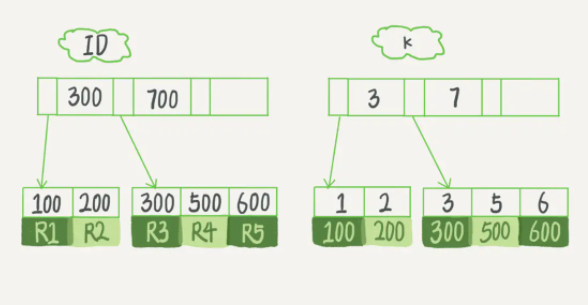
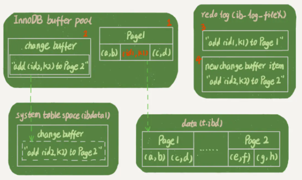
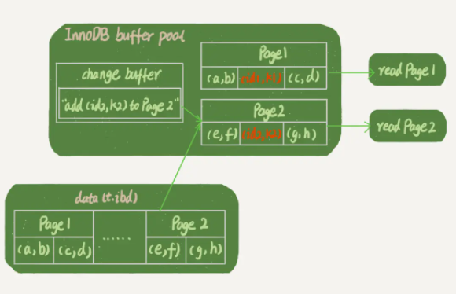

# 09 | 普通索引和唯一索引，应该怎么选择？

<!-- @import "[TOC]" {cmd="toc" depthFrom=3 depthTo=6 orderedList=false} -->

<!-- code_chunk_output -->

- [概述：选择普通索引还是唯一索引？](#概述选择普通索引还是唯一索引)
- [查询过程](#查询过程)
- [更新过程](#更新过程)
  - [change buffer](#change-buffer)
  - [什么条件下可以使用 change buffer](#什么条件下可以使用-change-buffer)
  - [坑：别把普通索引改成唯一索引](#坑别把普通索引改成唯一索引)
- [change buffer 的使用场景](#change-buffer-的使用场景)
- [索引选择和实践](#索引选择和实践)
- [change buffer 和 redo log](#change-buffer-和-redo-log)
- [业务中是否使用唯一索引](#业务中是否使用唯一索引)
- [问题：断电是否会丢失 change buffer](#问题断电是否会丢失-change-buffer)

<!-- /code_chunk_output -->

### 概述：选择普通索引还是唯一索引？

本讲探讨在不同的业务场景下，应该选择普通索引，还是唯一索引。

假设你在维护一个市民系统，每个人都有一个唯一的身份证号，而且业务代码已经保证了不会写入两个重复的身份证号。如果市民系统需要按照身份证号查姓名，就会执行类似这样的 SQL 语句：

```sql
select name from CUser where id_card = 'xxxxxxxyyyyyyzzzzz';
```

所以，你一定会考虑在 `id_card` 字段上建索引。**由于身份证号字段比较大，我不建议你把身份证号当做主键，** 那么现在你有两个选择，要么给 `id_card` 字段创建唯一索引，要么创建一个普通索引。如果业务代码已经保证了不会写入重复的身份证号，那么这两个选择逻辑上都是正确的。

从性能的角度考虑，你选择唯一索引还是普通索引呢？选择的依据是什么呢？

本文以下图为例。假设字段 `k` 上的值都不重复。



### 查询过程

假设，执行查询的语句是 `select id from T where k=5` 。这个查询语句在索引树上查找的过程，先是通过 B+ 树从树根开始，按层搜索到叶子节点，也就是图中右下角的这个数据页，然后可以认为数据页内部通过二分法来定位记录。
- **对于普通索引来说，查找到满足条件的第一个记录 `(5,500)` 后，需要查找下一个记录，直到碰到第一个不满足 k=5 条件的记录。**
- **对于唯一索引来说，由于索引定义了唯一性，查找到第一个满足条件的记录后，就会停止继续检索。**

那么，这个不同带来的性能差距会有多少呢？答案是，微乎其微。

**InnoDB 的数据是按数据页为单位来读写的。**

也就是说，当需要读一条记录的时候，并不是将这个记录本身从磁盘读出来，而是以页为单位，将其整体读入内存。在 InnoDB 中，每个数据页的大小默认是 `16KB` 。

因为引擎是按页读写的，所以说，当找到 `k=5` 的记录的时候，它所在的数据页就都在内存里了。那么，对于普通索引来说，要多做的那一次“查找和判断下一条记录”的操作，就只需要一次指针寻找和一次计算。

当然，如果 `k=5` 这个记录刚好是这个数据页的最后一个记录，那么要取下一个记录，必须读取下一个数据页，这个操作会稍微复杂一些。

但是，我们之前计算过，对于整型字段，一个数据页可以放近千个 `key` ，因此出现这种情况的概率会很低。所以，我们计算平均性能差异时，仍可以认为这个操作成本对于现在的 CPU 来说可以忽略不计。

### 更新过程

#### change buffer

为了说明普通索引和唯一索引对更新语句性能的影响这个问题，需要先介绍一下 `change buffer` 。

当需要更新一个数据页时，如果数据页在内存中就直接更新，而如果这个数据页还没有在内存中的话，在不影响数据一致性的前提下， InnoDB 会将这些更新操作缓存在 `change buffer` 中，这样就不需要从磁盘中读入这个数据页了。在下次查询需要访问这个数据页的时候，将数据页读入内存，然后执行 change buffer 中与这个页有关的操作。通过这种方式就能保证这个数据逻辑的正确性。

（有点类似 `spark` 懒操作）

需要说明的是，虽然名字叫作 `change buffer` ，实际上它是可以持久化的数据。也就是说， `change buffer` 在内存中有拷贝，也会被写入到磁盘上。

将 `change buffer` 中的操作应用到原数据页，得到最新结果的过程称为 `merge` 。除了访问这个数据页会触发 `merge` 外，系统有后台线程会定期 `merge` 。在数据库正常关闭（`shutdown`）的过程中，也会执行 `merge` 操作。

显然，如果能够将更新操作先记录在 `change buffer` ，减少读磁盘，语句的执行速度会得到明显的提升。而且，数据读入内存是需要占用 `buffer pool` 的，所以这种方式还能够避免占用内存，提高内存利用率。

#### 什么条件下可以使用 change buffer

那么，什么条件下可以使用 `change buffer` 呢？

对于唯一索引来说，所有的更新操作都要先判断这个操作是否违反唯一性约束。比如，要插入 `(4,400)` 这个记录，就要先判断现在表中是否已经存在 `k=4` 的记录，而这必须要将数据页读入内存才能判断。如果都已经读入到内存了，那直接更新内存会更快，就没必要使用 `change buffer` 了。因此，**唯一索引的更新就不能使用 `change buffer` ，实际上也只有普通索引可以使用。**

`change buffer` 用的是 `buffer pool` 里的内存，因此不能无限增大。 `change buffer` 的大小，可以通过参数 `innodb_change_buffer_max_size` 来动态设置。这个参数设置为 `50` 的时候，表示 `change buffer` 的大小最多只能占用 `buffer pool` 的 `50%` 。现在，你已经理解了 `change buffer` 的机制，那么我们再一起来看看如果要在这张表中插入一个新记录 `(4,400)` 的话，InnoDB 的处理流程是怎样的。

第一种情况是，这个记录要更新的目标页在内存中。

这时，InnoDB 的处理流程如下：
- 对于唯一索引来说，找到 `3` 和 `5` 之间的位置，判断到没有冲突，插入这个值，语句执行结束；
- 对于普通索引来说，找到 3 和 5 之间的位置，插入这个值，语句执行结束。

这样看来，普通索引和唯一索引对更新语句性能影响的差别，只是一个判断，只会耗费微小的 CPU 时间。但，这不是我们关注的重点。

但，这不是我们关注的重点。

第二种情况是，这个记录要更新的目标页不在内存中。这时，InnoDB 的处理流程如下：
- 对于唯一索引来说，需要将数据页读入内存，判断到没有冲突，插入这个值，语句执行结束；
- 对于普通索引来说，则是将更新记录在 `change buffer` ，语句执行就结束了。

**将数据从磁盘读入内存涉及随机 IO 的访问，是数据库里面成本最高的操作之一。 `change buffer` 因为减少了随机磁盘访问，所以对更新性能的提升是会很明显的。**

#### 坑：别把普通索引改成唯一索引

有个 DBA 的同学跟老师反馈说，他负责的某个业务的库内存命中率突然从 99% 降低到了 75%，整个系统处于阻塞状态，更新语句全部堵住。而探究其原因后，我发现这个业务有大量插入数据的操作，而他在前一天把其中的某个普通索引改成了唯一索引。

### change buffer 的使用场景

现在有一个问题就是：普通索引的所有场景，使用 `change buffer` 都可以起到加速作用吗？

因为 `merge` 的时候是真正进行数据更新的时刻，而 `change buffer` 的主要目的就是将记录的变更动作缓存下来，所以在一个数据页做 `merge` 之前，`change buffer` 记录的变更越多（也就是这个页面上要更新的次数越多），收益就越大。

因此，对于写多读少的业务来说，页面在写完以后马上被访问到的概率比较小，此时 `change buffer` 的使用效果最好。这种业务模型常见的就是账单类、日志类的系统。

反过来，假设一个业务的更新模式是写入之后马上会做查询，那么即使满足了条件，将更新先记录在 `change buffer` ，但之后由于马上要访问这个数据页，会立即触发 `merge` 过程。这样随机访问 IO 的次数不会减少，反而增加了 `change buffer` 的维护代价。所以，对于这种业务模式来说， `change buffer` 反而起到了副作用。

### 索引选择和实践

回到我们开头的问题，普通索引和唯一索引应该怎么选择。其实，这两类索引在查询能力上是没差别的，主要考虑的是对更新性能的影响。所以，老师建议你尽量选择普通索引。

如果所有的更新后面，都马上伴随着对这个记录的查询，那么你应该关闭 `change buffer` 。而在其他情况下， `change buffer` 都能提升更新性能。

在实际使用中，你会发现，普通索引和 `change buffer` 的配合使用，对于数据量大的表的更新优化还是很明显的。

特别地，在使用机械硬盘时， `change buffer` 这个机制的收效是非常显著的。所以，当你有一个类似“历史数据”的库，并且出于成本考虑用的是机械硬盘时，那你应该特别关注这些表里的索引，尽量使用普通索引，然后把 change buffer 尽量开大，以确保这个“历史数据”表的数据写入速度。

### change buffer 和 redo log

`WAL` : [Write-Ahead Logging](./mysql.45.01.002.md#redo-loginnodb特有)

理解了 change buffer 的原理，可能会让人联想到老师之前介绍过的 `redo log` 和 `WAL` 。

`change buffer` 和 `redo log` 可能令人混淆，这里举例说一下。

现在，我们要在表上执行这个插入语句：

```sql
mysql> insert into t(id,k) values(id1,k1),(id2,k2);
```

这里，我们假设当前 `k` 索引树的状态，查找到位置后， `k1` 所在的数据页在内存 (`InnoDB buffer pool`) 中， `k2` 所在的数据页不在内存中。如下图所示是带 `change buffer` 的更新状态图。



分析这条更新语句，你会发现它涉及了四个部分：内存、`redo log`（`ib_log_fileX`）、 数据表空间（`t.ibd`）、系统表空间（`ibdata1`）。

这条更新语句做了如下的操作（按照图中的数字顺序）：
- Page 1 在内存中，直接更新内存；
- Page 2 没有在内存中，就在内存的 `change buffer` 区域，记录下“我要往 Page 2 插入一行”这个信息
- 将上述两个动作记入 `redo log` 中（图中 3 和 4）。

做完上面这些，事务就可以完成了。所以，你会看到，执行这条更新语句的成本很低，就是写了两处内存，然后写了一处磁盘（两次操作合在一起写了一次磁盘），而且还是顺序写的。

同时，图中的两个虚线箭头，是后台操作，不影响更新的响应时间。

那在这之后的读请求，要怎么处理呢？

比如，我们现在要执行 `select * from t where k in (k1, k2)` 。下图老师画了这两个读请求的流程图。如果读语句发生在更新语句后不久，内存中的数据都还在，那么此时的这两个读操作就与系统表空间（`ibdata1`）和 `redo log`（`ib_log_fileX`）无关了。所以，老师在图中就没画出这两部分。



从图中可以看到：
- 读 Page 1 的时候，直接从内存返回。 `WAL` 之后如果读数据，是不是一定要读盘，是不是一定要从 redo log 里面把数据更新以后才可以返回？其实是不用的，比如在上图的这个状态，虽然磁盘上还是之前的数据，但是这里直接从内存返回结果，结果是正确的。
- 要读 Page 2 的时候，需要把 Page 2 从磁盘读入内存中，然后应用 `change buffer` 里面的操作日志，生成一个正确的版本并返回结果。

可以看到，直到需要读 Page 2 的时候，这个数据页才会被读入内存。

所以，如果要简单地对比这两个机制在提升更新性能上的收益的话， **`redo log` 主要节省的是随机写磁盘的 IO 消耗（转成顺序写），而 `change buffer` 主要节省的则是随机读磁盘的 IO 消耗。**

### 业务中是否使用唯一索引

由于唯一索引用不上 `change buffer` 的优化机制，因此如果业务可以接受，从性能角度出发我建议你优先考虑非唯一索引。

此外，补充说明一下业务相关问题。

首先，业务正确性优先。本讲的前提是“业务代码已经保证不会写入重复数据”的情况下，讨论性能问题。如果业务不能保证，或者业务就是要求数据库来做约束，那么没得选，必须创建唯一索引。这种情况下，本讲的意义在于，如果碰上了大量插入数据慢、内存命中率低的时候，可以给你多提供一个排查思路。

然后，在一些“归档库”的场景，你是可以考虑使用普通索引的。比如，线上数据只需要保留半年，然后历史数据保存在归档库。这时候，归档数据已经是确保没有唯一键冲突了。要提高归档效率，可以考虑把表里面的唯一索引改成普通索引。

### 问题：断电是否会丢失 change buffer

`change buffer` 一开始是写内存的，那么如果这个时候机器掉电重启，会不会导致 `change buffer` 丢失呢？ `change buffer` 丢失可不是小事儿，再从磁盘读入数据可就没有了 `merge` 过程，就等于是数据丢失了。会不会出现这种情况呢？

这个问题的答案是不会丢失。

虽然是只更新内存，但是在事务提交的时候，我们把 `change buffer` 的操作也记录到 `redo log` 里了，所以崩溃恢复的时候， `change buffer` 也能找回来。

有同学问到， `merge` 的过程是否会把数据直接写回磁盘？

`merge` 的执行流程是这样的：
- 从磁盘读入数据页到内存（老版本的数据页）；
- 从 `change buffer` 里找出这个数据页的 `change buffer` 记录 (可能有多个），依次应用，得到新版数据页；
- 写 `redo log`。

这个 `redo log` 包含了数据的变更和 `change buffer` 的变更。到这里 `merge` 过程就结束了。这时候，数据页和内存中 `change buffer` 对应的磁盘位置都还没有修改，属于脏页，之后各自刷回自己的物理数据，就是另外一个过程了。

