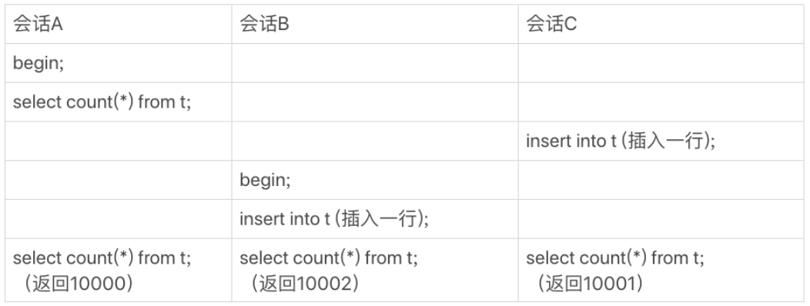
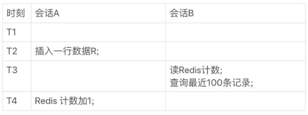
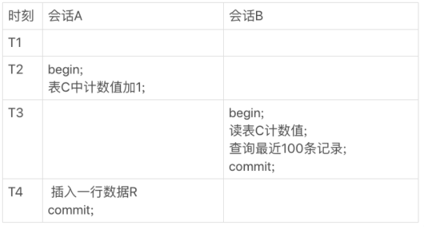

# 14 | count(*)这么慢，我该怎么办？

<!-- @import "[TOC]" {cmd="toc" depthFrom=3 depthTo=6 orderedList=false} -->

<!-- code_chunk_output -->

- [概述：count(*) 怎么这么慢？](#概述count-怎么这么慢)
- [count(*) 的实现方式](#count-的实现方式)
  - [例子：为什么不把 count 存起来？](#例子为什么不把-count-存起来)
  - [count(*) 中的优化](#count-中的优化)
- [用缓存系统保存计数](#用缓存系统保存计数)
  - [使用 Redis 似乎很直观](#使用-redis-似乎很直观)
  - [使用 Redis 导致逻辑不精确](#使用-redis-导致逻辑不精确)
- [在数据库保存计数](#在数据库保存计数)
  - [在数据库保存计数支持崩溃恢复](#在数据库保存计数支持崩溃恢复)
  - [在数据库保存计数解决计数不精确](#在数据库保存计数解决计数不精确)
- [不同的 count 用法](#不同的-count-用法)
  - [count(主键 id)](#count主键-id)
  - [count(1)](#count1)
  - [count(字段)](#count字段)
  - [count(*)](#count)
- [问题：先插入操作记录还是先更新计数表？](#问题先插入操作记录还是先更新计数表)

<!-- /code_chunk_output -->

### 概述：count(*) 怎么这么慢？

在开发系统的时候，你可能经常需要计算一个表的行数，比如一个交易系统的所有变更记录总数。这时候你可能会想，一条 `select count(*) from t` 语句不就解决了吗？

但是，你会发现随着系统中记录数越来越多，这条语句执行得也会越来越慢。然后你可能就想了，MySQL 怎么这么笨啊，记个总数，每次要查的时候直接读出来，不就好了吗。

本节课讲解 count(*) 语句到底是怎样实现的，以及 MySQL 为什么会这么实现， **如果应用中有这种频繁变更并需要统计表行数的需求，业务设计上可以怎么做。**

### count(*) 的实现方式

首先要明确的是，在不同的 MySQL 引擎中，`count(*)` 有不同的实现方式：
- MyISAM 引擎把一个表的总行数存在了磁盘上，因此执行 `count(*)` 的时候会直接返回这个数，效率很高；
- 而 InnoDB 引擎就麻烦了，它执行 `count(*)` 的时候，需要把数据一行一行地从引擎里面读出来，然后累积计数。
- 这里需要注意的是，我们在这篇文章里讨论的是没有过滤条件的 `count(*)`，如果加了 `where` 条件的话，MyISAM 表也是不能返回得这么快的。

在前面的课程中，我们一起分析了为什么要使用 InnoDB，因为不论是在事务支持、并发能力还是在数据安全方面，InnoDB 都优于 MyISAM 。我猜你的表也一定是用了 InnoDB 引擎。这就是当你的记录数越来越多的时候，计算一个表的总行数会越来越慢的原因。

#### 例子：为什么不把 count 存起来？

**那为什么 InnoDB 不跟 MyISAM 一样，也把数字存起来呢？**

这是因为即使是在同一个时刻的多个查询，由于多版本并发控制（MVCC）的原因， InnoDB 表“应该返回多少行”也是不确定的。这里举个 `count(*)` 的例子。

假设表 `t` 中现在有 10000 条记录，我们设计了三个用户并行的会话。
- 会话 A 先启动事务并查询一次表的总行数；
- 会话 B 启动事务，插入一行后记录后，查询表的总行数；
- 会话 C 先启动一个单独的语句，插入一行记录后，查询表的总行数。

我们假设从上到下是按照时间顺序执行的，同一行语句是在同一时刻执行的。



如上，在最后一个时刻，三个会话 A、B、C 会同时查询表 `t` 的总行数，但拿到的结果却不同。

这和 InnoDB 的事务设计有关系， **可重复读是它默认的隔离级别，在代码上就是通过多版本并发控制，也就是 MVCC 来实现的。每一行记录都要判断自己是否对这个会话可见，因此对于 `count(*)` 请求来说，InnoDB 只好把数据一行一行地读出依次判断，可见的行才能够用于计算“基于这个查询”的表的总行数。**

#### count(*) 中的优化

当然，现在这个看上去笨笨的 MySQL，在执行 `count(*)` 操作的时候还是做了优化的。

InnoDB 是索引组织表，主键索引树的叶子节点是数据，而普通索引树的叶子节点是主键值。所以，普通索引树比主键索引树小很多。对于 `count(*)` 这样的操作，遍历哪个索引树得到的结果逻辑上都是一样的。因此，MySQL 优化器会找到最小的那棵树来遍历。 **在保证逻辑正确的前提下，尽量减少扫描的数据量，是数据库系统设计的通用法则之一。**

如果你用过 `show table status` 命令的话，就会发现这个命令的输出结果里面也有一个 `TABLE_ROWS` 用于显示这个表当前有多少行，这个命令执行挺快的，那这个 `TABLE_ROWS` 能代替 `count(*)` 吗？

在[第 10 讲《 MySQL 为什么有时候会选错索引？》](./mysql.45.02.004.md)中提到过，索引统计的值是通过采样来估算的。实际上， `TABLE_ROWS` 就是从这个采样估算得来的，因此它也很不准。有多不准呢，官方文档说误差可能达到 40% 到 50%。所以， `show table status` 命令显示的行数也不能直接使用。

到这里我们小结一下：
- MyISAM 表虽然 `count(*)` 很快，但是不支持事务；
- `show table status` 命令虽然返回很快，但是不准确；
- InnoDB 表直接 `count(*)` 会遍历全表，虽然结果准确，但会导致性能问题。

那么，回到开头的问题，如果你现在有一个页面经常要显示交易系统的操作记录总数，到底应该怎么办呢？

**答案是，我们只能自己计数。**

接下来，我们讨论一下，看看自己计数有哪些方法，以及每种方法的优缺点有哪些。

这些方法的基本思路：你需要自己找一个地方，把操作记录表的行数存起来。

### 用缓存系统保存计数

#### 使用 Redis 似乎很直观

对于更新很频繁的库来说，你可能会第一时间想到，用缓存系统来支持。

你可以用一个 Redis 服务来保存这个表的总行数。这个表每被插入一行 Redis 计数就加 `1` ，每被删除一行 Redis 计数就减 `1` 。

这种方式下，读和更新操作都很快，但你再想一下这种方式存在什么问题吗？

**缓存系统可能会丢失更新。**

Redis 的数据不能永久地留在内存里，所以你会找一个地方把这个值定期地持久化存储起来。但即使这样，仍然可能丢失更新。试想如果刚刚在数据表中插入了一行，Redis 中保存的值也加了 `1` ，然后 Redis 异常重启了，重启后你要从存储 Redis 数据的地方把这个值读回来，而刚刚加 `1` 的这个计数操作却丢失了。

当然了，这还是有解的。比如， Redis 异常重启以后，到数据库里面单独执行一次 `count(*)` 获取真实的行数，再把这个值写回到 Redis 里就可以了。异常重启毕竟不是经常出现的情况，这一次全表扫描的成本，还是可以接受的。

#### 使用 Redis 导致逻辑不精确

但实际上， **将计数保存在缓存系统中的方式，还不只是丢失更新的问题。即使 Redis 正常工作，这个值还是逻辑上不精确的。**

你可以设想一下有这么一个页面，要显示操作记录的总数，同时还要显示最近操作的 `100` 条记录。那么，这个页面的逻辑就需要先到 Redis 里面取出计数，再到数据表里面取数据记录。

我们是这么定义不精确的：
- 一种是，查到的 `100` 行结果里面有最新插入记录，而 Redis 的计数里还没加 `1` ；
- 另一种是，查到的 `100` 行结果里没有最新插入的记录，而 Redis 的计数里已经加了 `1` 。

这两种情况，都是逻辑不一致的。

我们一起来看看这个时序图。



上图中，会话 A 是一个插入交易记录的逻辑，往数据表里插入一行 R，然后 Redis 计数加 `1` ；会话 B 就是查询页面显示时需要的数据。

在上图的这个时序里，在 T3 时刻会话 B 来查询的时候，会显示出新插入的 R 这个记录，但是 Redis 的计数还没加 1。这时候，就会出现我们说的数据不一致。

或许这是因为我们执行新增记录逻辑时候，是先写数据表，再改 Redis 计数。而读的时候是先读 Redis，再读数据表，这个顺序是相反的。那么，如果保持顺序一样的话，是不是就没问题了？我们现在把会话 A 的更新顺序换一下，再看看执行结果。


你会发现，这时候反过来了，会话 B 在 T3 时刻查询的时候，Redis 计数加了 `1` 了，但还查不到新插入的 R 这一行，也是数据不一致的情况。在并发系统里面，我们是无法精确控制不同线程的执行时刻的，因为存在图中的这种操作序列，所以，我们说即使 Redis 正常工作，这个计数值还是逻辑上不精确的。

### 在数据库保存计数

#### 在数据库保存计数支持崩溃恢复

根据上面的分析，用缓存系统保存计数有丢失数据和计数不精确的问题。那么， **如果我们把这个计数直接放到数据库里单独的一张计数表 C 中，又会怎么样呢？**

首先，这解决了崩溃丢失的问题，InnoDB 是支持崩溃恢复不丢数据的。

#### 在数据库保存计数解决计数不精确

我们再看看能不能解决计数不精确的问题。

这和 Redis 不一样吗？无非就是把上图中对 Redis 的操作，改成了对计数表 C 的操作。只要出现上图的这种执行序列，这个问题还是无解的吧？

这个问题还真不是无解的。我们这篇文章要解决的问题，都是由于 InnoDB 要支持事务，从而导致 InnoDB 表不能把 `count(*)` 直接存起来，然后查询的时候直接返回形成的。

所谓以子之矛攻子之盾，现在我们就利用“事务”这个特性，把问题解决掉。



我们来看下现在的执行结果。虽然会话 B 的读操作仍然是在 T3 执行的，但是因为这时候更新事务还没有提交，所以计数值加 1 这个操作对会话 B 还不可见。

因此，会话 B 看到的结果里， 查计数值和“最近 100 条记录”看到的结果，逻辑上就是一致的。

### 不同的 count 用法

有同学留言问到：在 `select count(?) from t` 这样的查询语句里面， `count(*)` 、 `count(主键 id)` 、 `count(字段)` 和 `count(1)` 等不同用法的性能，有哪些差别。

需要注意的是，下面的讨论还是基于 InnoDB 引擎的。

这里，首先你要弄清楚 `count()` 的语义。`count()` 是一个聚合函数，对于返回的结果集，一行行地判断，如果 `count` 函数的参数不是 `NULL` ，累计值就加 `1` ，否则不加。最后返回累计值。

所以， `count(*)` 、 `count(主键 id)` 和 `count(1)` 都表示返回满足条件的结果集的总行数；而 `count(字段)` ，则表示返回满足条件的数据行里面，参数“字段”不为 `NULL` 的总个数。

至于分析性能差别的时候，你可以记住这么几个原则：
- server 层要什么就给什么；
- InnoDB 只给必要的值；
- 现在的优化器只优化了 `count(*)` 的语义为“取行数”，其他“显而易见”的优化并没有做。

#### count(主键 id)

对于 `count(主键 id)` 来说，InnoDB 引擎会遍历整张表，把每一行的 id 值都取出来，返回给 server 层。server 层拿到 id 后，判断是不可能为空的，就按行累加。

#### count(1)

对于 `count(1)` 来说，InnoDB 引擎遍历整张表，但不取值。server 层对于返回的每一行，放一个数字“`1`”进去，判断是不可能为空的，按行累加。

单看这两个用法的差别的话，你能对比出来， `count(1)` 执行得要比 `count(主键 id)` 快。因为从引擎返回 `id` 会涉及到解析数据行，以及拷贝字段值的操作。

#### count(字段)

- 对于 `count(字段)` 来说：如果这个“字段”是定义为 `not null` 的话，一行行地从记录里面读出这个字段，判断不能为 `null` ，按行累加；
- 如果这个“字段”定义允许为 `null` ，那么执行的时候，判断到有可能是 `null` ，还要把值取出来再判断一下，不是 `null` 才累加。

也就是前面的第一条原则，server 层要什么字段，InnoDB 就返回什么字段。

#### count(*)

但是 `count(*)` 是例外，并不会把全部字段取出来，而是专门做了优化，不取值。`count(*)` 肯定不是 `null` ，按行累加。

看到这里似乎会有疑问：优化器就不能自己判断一下吗，主键 `id` 肯定非空啊，为什么不能按照 `count(*)` 来处理，多么简单的优化啊。

当然，MySQL 专门针对这个语句进行优化，也不是不可以。但是这种需要专门优化的情况太多了，而且 MySQL 已经优化过 `count(*)` 了，你直接使用这种用法就可以了。

所以结论是：按照效率排序的话， `count(字段)<count(主键 id)<count(1)≈count(*)` ，所以建议尽量使用 `count(*)`。

### 问题：先插入操作记录还是先更新计数表？

在刚刚讨论的方案中，我们用了事务来确保计数准确。由于事务可以保证中间结果不被别的事务读到，因此修改计数值和插入新记录的顺序是不影响逻辑结果的。但是，从并发系统性能的角度考虑，在这个事务序列里，应该先插入操作记录，还是应该先更新计数表呢？

概括一下问题：

用一个计数表记录一个业务表的总行数，在往业务表插入数据的时候，需要给计数值加 `1` 。逻辑实现上是启动一个事务，执行两个语句：
- `insert into 数据表`；
- `update 计数表，计数值加 1`。

从系统并发能力的角度考虑，怎么安排这两个语句的顺序。

**因为更新计数表涉及到行锁的竞争，先插入再更新能最大程度地减少事务之间的锁等待，提升并发度。**

有同学说：应该把 `update` 计数表放后面，因为这个计数表可能保存了多个业务表的计数值。如果把 `update` 计数表放到事务的第一个语句，多个业务表同时插入数据的话，等待时间会更长。

**这个答案的结论是对的，但是理解不太正确。**

**即使我们用一个计数表记录多个业务表的行数，也肯定会给表名字段加唯一索引。** 类似于下面这样的表结构：

```sql
CREATE TABLE `rows_stat` (
  `table_name` varchar(64) NOT NULL,
  `row_count` int(10) unsigned NOT NULL,
  PRIMARY KEY (`table_name`)
) ENGINE=InnoDB;
```

在更新计数表的时候，一定会传入 `where table_name=$table_name` ，使用主键索引，更新加行锁只会锁在一行上。

**而在不同业务表插入数据，是更新不同的行，不会有行锁。**
