# 19 | 为什么我只查一行的语句，也执行这么慢？

<!-- @import "[TOC]" {cmd="toc" depthFrom=3 depthTo=6 orderedList=false} -->

<!-- code_chunk_output -->

- [概述](#概述)
- [第一类：查询长时间不返回](#第一类查询长时间不返回)
  - [等 MDL 锁](#等-mdl-锁)
  - [等 flush](#等-flush)
  - [等行锁](#等行锁)
- [第二类：查询慢](#第二类查询慢)
- [问题：没有索引的语句什么时候加的锁？](#问题没有索引的语句什么时候加的锁)

<!-- /code_chunk_output -->

### 概述

一般情况下，说到查询性能优化，你首先会想到一些复杂的语句，想到查询需要返回大量的数据。

但有些情况下，“查一行”，也会执行得特别慢。今天就看看什么情况下会出现这个现象。

需要说明的是，如果 MySQL 数据库本身就有很大的压力，导致数据库服务器 CPU 占用率很高或 ioutil（IO 利用率）很高，这种情况下所有语句的执行都有可能变慢，不属于我们今天的讨论范围。

为了便于描述，我们还是构造一个表，基于这个表来说明今天的问题。这个表有两个字段 id 和 c，并且我在里面插入了 10 万行记录。

```sql

mysql> CREATE TABLE `t` (
  `id` int(11) NOT NULL,
  `c` int(11) DEFAULT NULL,
  PRIMARY KEY (`id`)
) ENGINE=InnoDB;

delimiter ;;
create procedure idata()
begin
  declare i int;
  set i=1;
  while(i<=100000) do
    insert into t values(i,i);
    set i=i+1;
  end while;
end;;
delimiter ;

call idata();
```

### 第一类：查询长时间不返回

在表 t 执行下面的 SQL 语句：

```sql
mysql> select * from t where id=1;
```

查询结果长时间不返回。

一般碰到这种情况的话，大概率是表 t 被锁住了。接下来分析原因的时候，一般都是首先执行一下 `show processlist` 命令，看看当前语句处于什么状态。

然后我们再针对每种状态，去分析它们产生的原因、如何复现，以及如何处理。

#### 等 MDL 锁

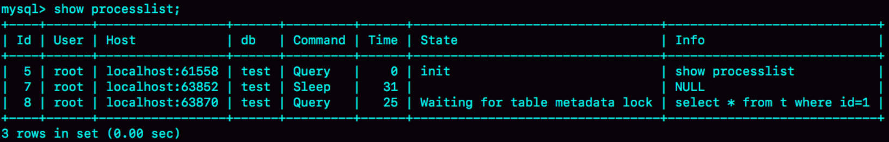

如图所示，就是使用 `show processlist` 命令查看 Waiting for table metadata lock 的示意图。

出现这个状态表示的是，现在有一个线程正在表 t 上请求或者持有 MDL 写锁，把 select 语句堵住了。

在[《全局锁和表锁 ：给表加个字段怎么有这么多阻碍？》](./mysql.45.01.006.md)中介绍过一种复现方法。但需要说明的是，那个复现过程是基于 MySQL 5.6 版本的。而 MySQL 5.7 版本修改了 MDL 的加锁策略，那种方法就不适用了。

不过，在 MySQL 5.7 版本下复现这个场景，也很容易。如下图所示。


session A 通过 `lock table` 命令持有表 t 的 MDL 写锁，而 session B 的查询需要获取 MDL 读锁。所以，session B 进入等待状态。

这类问题的处理方式，就是找到谁持有 MDL 写锁，然后把它 kill 掉。

但是，由于在 `show processlist` 的结果里面，session A 的 Command 列是“Sleep”，导致查找起来很不方便。不过有了 `performance_schema` 和 `sys` 系统库以后，就方便多了。（MySQL 启动时需要设置 `performance_schema=on`，相比于设置为 `off` 会有 10% 左右的性能损失)

通过查询 `sys.schema_table_lock_waits` 这张表，我们就可以直接找出造成阻塞的 `process id`，把这个连接用 `kill` 命令断开即可。

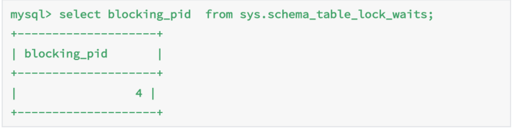

#### 等 flush

另外一种查询被堵住的情况如下。在表 t 上，执行下面的 SQL 语句：

```sql
mysql> select * from information_schema.processlist where id=1;
```

先卖个关子，如下图，查出来这个线程的状态是 Waiting for table flush，这是什么原因呢？

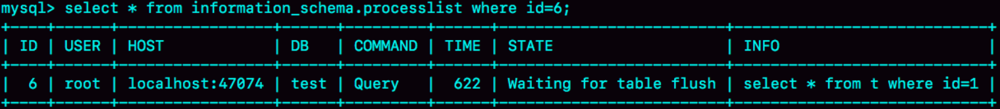

这个状态表示的是，现在有一个线程正要对表 t 做 flush 操作。MySQL 里面对表做 flush 操作的用法，一般有以下两个：

```sql
flush tables t with read lock;

flush tables with read lock;
```

这两个 flush 语句，如果指定表 t 的话，代表的是只关闭表 t；如果没有指定具体的表名，则表示关闭 MySQL 里所有打开的表。

但是正常这两个语句执行起来都很快，除非它们也被别的线程堵住了。

所以，出现 Waiting for table flush 状态的可能情况是：有一个 flush tables 命令被别的语句堵住了，然后它又堵住了我们的 select 语句。

现在，我们一起来复现一下这种情况：

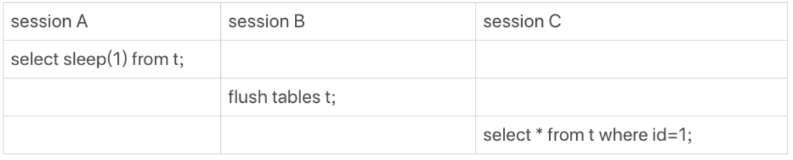

在 session A 中，故意每行都调用一次 sleep(1)，这样这个语句默认要执行 10 万秒，在这期间表 t 一直是被 session A“打开”着。然后，session B 的 flush tables t 命令再要去关闭表 t，就需要等 session A 的查询结束。这样，session C 要再次查询的话，就会被 flush 命令堵住了。

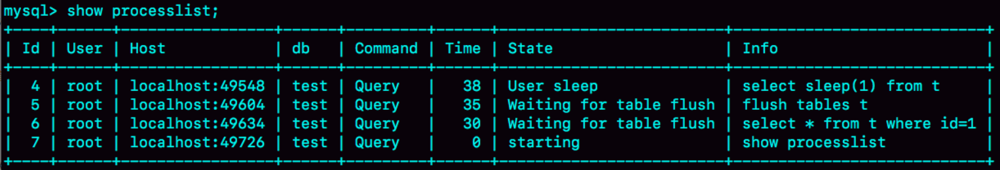

上图是这个复现步骤的 `show processlist` 结果。这个例子的排查也很简单，你看到这个 show processlist 的结果，肯定就知道应该怎么做了。

#### 等行锁

现在，经过了表级锁的考验，我们的 select 语句终于来到引擎里了。

```sql
mysql> select * from t where id=1 lock in share mode; 
```

上面这条语句在[《事务到底是隔离的还是不隔离的？》](./mysql.45.01.008.md)介绍当前读时提到过。

由于访问 `id=1` 这个记录时要加读锁，如果这时候已经有一个事务在这行记录上持有一个写锁，我们的 select 语句就会被堵住。

复现步骤和现场如下：

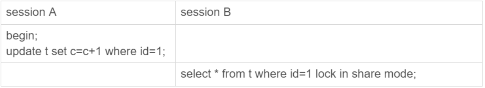

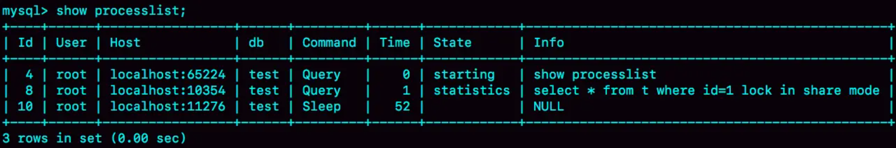

显然，session A 启动了事务，占有写锁，还不提交，是导致 session B 被堵住的原因。

这个问题并不难分析，但问题是怎么查出是谁占着这个写锁。如果你用的是 MySQL 5.7 版本，可以通过 `sys.innodb_lock_waits` 表查到。

```sql
mysql> select * from t sys.innodb_lock_waits where locked_table='`test`.`t`'\G
```

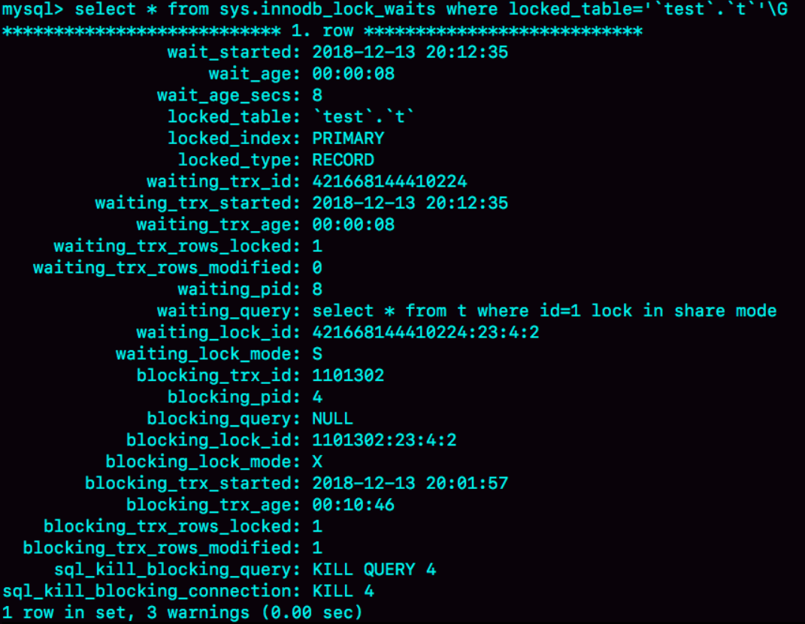

可以看到，这个信息很全，4 号线程是造成堵塞的罪魁祸首。而干掉这个罪魁祸首的方式，就是 `KILL QUERY 4` 或 `KILL 4`。

不过，这里不应该显示“`KILL QUERY 4`”。这个命令表示停止 4 号线程当前正在执行的语句，而这个方法其实是没有用的。因为占有行锁的是 `update` 语句，这个语句已经是之前执行完成了的，现在执行 `KILL QUERY`，无法让这个事务去掉 `id=1` 上的行锁。

实际上，`KILL 4` 才有效，也就是说直接断开这个连接。这里隐含的一个逻辑就是，连接被断开的时候，会自动回滚这个连接里面正在执行的线程，也就释放了 `id=1` 上的行锁。

### 第二类：查询慢

经过了重重封“锁”，再来看看一些查询慢的例子。

先来看一条简单的 SQL 语句：

```sql
mysql> select * from t where c=50000 limit 1;
```

由于字段 c 上没有索引，这个语句只能走 id 主键顺序扫描，因此需要扫描 5 万行。

作为确认可以看一下慢查询日志。注意，这里为了把所有语句记录到 `slow log` 里，要连接后先执行了 `set long_query_time=0`，将慢查询日志的时间阈值设置为 `0`。


`Rows_examined` 显示扫描了 50000 行。似乎不是很慢，11.5 毫秒就返回了，我们线上一般都配置超过 1 秒才算慢查询。

但要记住： **坏查询不一定是慢查询。** 我们这个例子里面只有 10 万行记录，数据量大起来的话，执行时间就线性涨上去了。

扫描行数多，所以执行慢，这个很好理解。但是接下来，我们再看一个只扫描一行，但是执行很慢的语句。

如下图所示，是这个例子的 `slow log`。可以看到，执行的语句是
```sql
mysql> select * from t where id=1；
```

虽然扫描行数是 1，但执行时间却长达 800 毫秒。

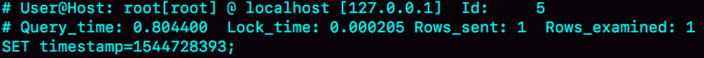

是不是有点奇怪呢，这些时间都花在哪里了？

如果把这个 `slow log` 的截图再往下拉一点可以看到下一个语句，`select * from t where id=1 lock in share mode`，执行时扫描行数也是 1 行，执行时间是 0.2 毫秒。

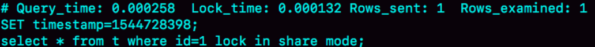

看上去是不是更奇怪了？按理说 lock in share mode 还要加锁，时间应该更长才对啊。

如下是这两个语句的执行输出结果。

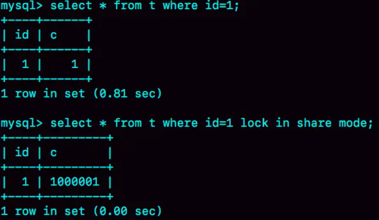

第一个语句的查询结果里 `c=1`，带 `lock in share mode` 的语句返回的是 `c=1000001`

怎么回事呢？先看复现步骤：

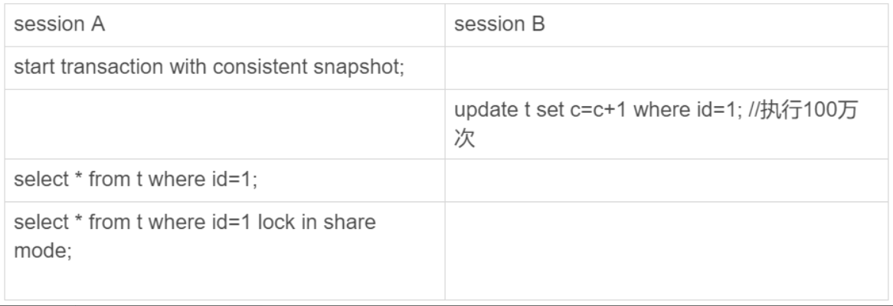

你看到了，session A 先用 `start transaction with consistent snapshot` 命令启动了一个事务，之后 session B 才开始执行 `update` 语句。session B 执行完 100 万次 update 语句后，`id=1` 这一行处于什么状态呢？如下图。

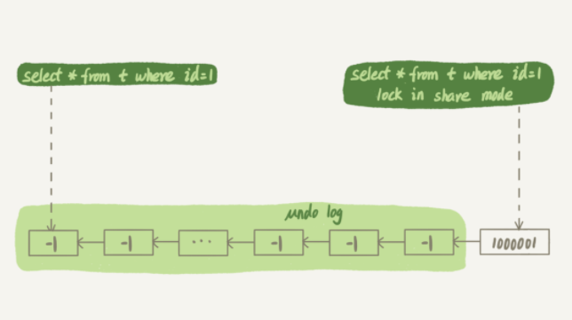

session B 更新完 100 万次，生成了 100 万个回滚日志 (`undo log`)。

带 `lock in share mode` 的 SQL 语句，是当前读，因此会直接读到 1000001 这个结果，所以速度很快；而 `select * from t where id=1` 这个语句，是一致性读，因此需要从 1000001 开始，依次执行 `undo log`，执行了 100 万次以后，才将 1 这个结果返回。

注意，`undo log` 里记录的其实是“把 2 改成 1”，“把 3 改成 2”这样的操作逻辑，画成减 1 的目的是方便看图。

### 问题：没有索引的语句什么时候加的锁？

`select * from t where id=1 lock in share mode`。由于 `id` 上有索引，所以可以直接定位到 `id=1` 这一行，因此读锁也是只加在了这一行上。但如果是下面的 SQL 语句：

```sql
begin;
select * from t where c=5 for update;
commit;
```

这个语句序列是怎么加锁的呢？加的锁又是什么时候释放呢？

这涉及到了“幻读”等内容，具体内容将在下一讲讨论。
