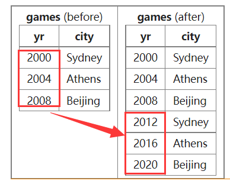

# INSERT, UPDATE, DELETE, CREATE, DROP


<!-- @import "[TOC]" {cmd="toc" depthFrom=3 depthTo=3 orderedList=false} -->

<!-- code_chunk_output -->

- [INSERT](#insert)
- [UPDATE](#update)
- [DELETE](#delete)
- [CREATE](#create)
- [DROP](#drop)

<!-- /code_chunk_output -->

细分目录：

<!-- @import "[TOC]" {cmd="toc" depthFrom=3 depthTo=6 orderedList=false} -->

<!-- code_chunk_output -->

- [INSERT](#insert)
  - [INSERT VALUES](#insert-values)
  - [INSERT SELECT](#insert-select)
- [UPDATE](#update)
- [DELETE](#delete)
- [CREATE](#create)
  - [CREATE TABLE](#create-table)
  - [CREATE VIEW](#create-view)
  - [CREATE INDEX](#create-index)
- [DROP](#drop)

<!-- /code_chunk_output -->

### INSERT

#### INSERT VALUES

The `INSERT` command is used to add a new row to a table.

```sql
INSERT INTO games(yr, city) VALUES (2012,'London')
```

- The `table` is `games`
- The column names are `yr` and `city`
- Strings in the literal values must be quoted with single quotes

#### INSERT SELECT

You can use the results of a `SELECT` statement to insert rows into another table.

```sql
INSERT INTO games(yr,city)
  SELECT yr+12, city FROM games;
```

The table games shows the year and the city hosting the Olympic Games.




### UPDATE

The `UPDATE` statement can be used to change a values in rows that already exists. In this example we move the 2012 games from London to Paris.

```sql
UPDATE games SET city='Paris' WHERE yr = 2012;
```

### DELETE

The `SELECT` statement returns results from a table. The `DELETE` statement can be used to remove rows from a table. In this example we remove the 2000 games from the table:

```sql
DELETE FROM games WHERE year=2000;
```

### CREATE

#### CREATE TABLE

The `CREATE` statement builds an empty table to hold rows. In this example the column yr is the `PRIMARY KEY`:

```sql
CREATE TABLE games
(yr   INT NOT NULL PRIMARY KEY
,city VARCHAR(20)
);
INSERT INTO games(yr,city) VALUES (2004,'Athens');
INSERT INTO games(yr,city) VALUES (2008,'Beijing');
INSERT INTO games(yr,city) VALUES (2012,'London');
SELECT * FROM games;
```

#### CREATE VIEW

The CREATE `VIEW` names a `SELECT` query. That query may be used as if it were a table in many contexts. In this example the `VIEW` `old_games` shows those games before 2006.

```sql
CREATE VIEW og AS
  SELECT yr,city FROM games
   WHERE yr<2006;
SELECT * FROM og;
```

#### CREATE INDEX

**You can create an index on a table to improve the performance of certain queries.**

- You can create an index that include one or more columns.
- There is a small performance cost in creating an index.
  - Your `SELECT` queries will run dramatically faster.
  - Your `INSERT`, `UPDATE` and `DELETE` commands will run slightly slower.
- All tables should have a `PRIMARY KEY`. This will automatically get an index
  - There is no point in creating an index that is the same as the primary key.
- A typical `SELECT .. JOIN` query involves a `FOREIGN KEY` in one table and a `PRIMARY KEY` in another.
  - You should create an index on the `FOREIGN KEY` to make the join run faster

```sql
CREATE INDEX gamesIdx ON games(city, year);
```

### DROP

You can drop a table, a view or an index. The data will be lost.

```sql
DROP VIEW old_games;
DROP INDEX gamesIdx ON games;
```
