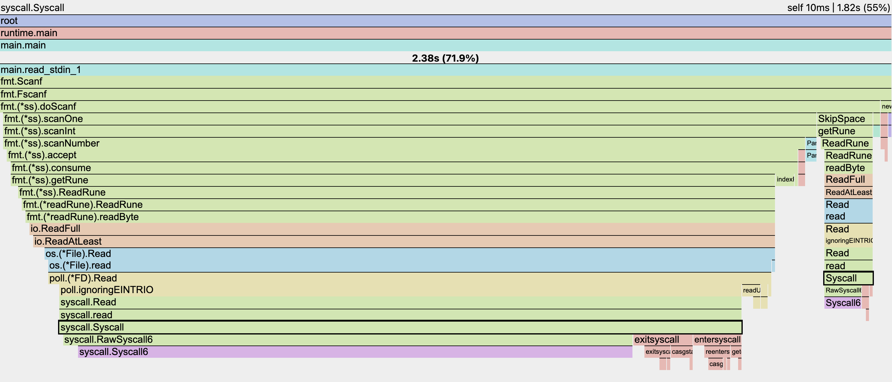
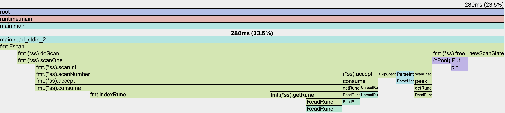
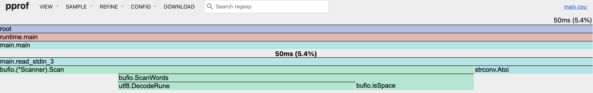
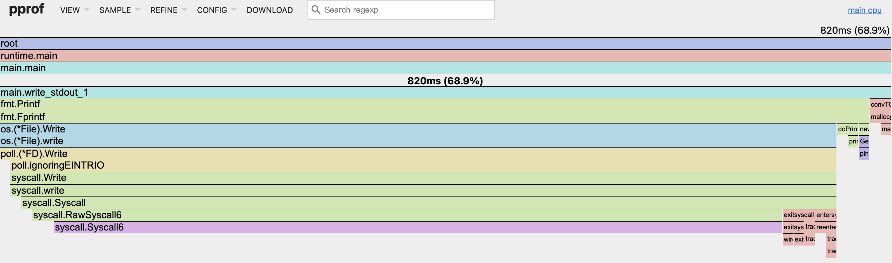
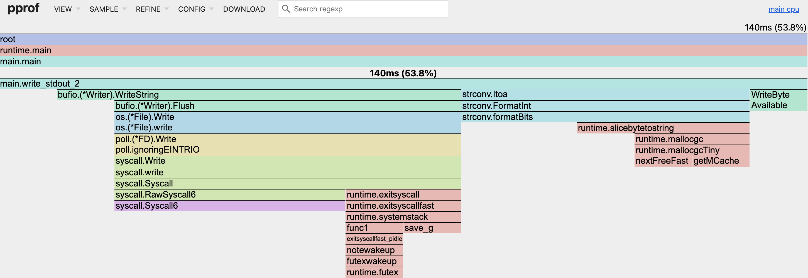

# 算法竞赛题目中 Golang IO 方法及其火焰图对比

这里不讨论过于 hacky 的方法。对 IO 速度极致要求（甚至在数学上进行优化）可参考：
- https://github.com/EndlessCheng/codeforces-go/blob/master/copypasta/io.go

> 本文讨论 `5\n1 2 3 4 5E` 这类格式的 `Stdin` 。具体对比的三种读入和两种输出如下。

```go
package main

import (
	"bufio"
	"fmt"
	"os"
	"runtime/pprof"
	"strconv"
)

func main() {
	f, _ := os.Create("3-2")
	defer f.Close()
	pprof.StartCPUProfile(f)
	defer pprof.StopCPUProfile()

	// n, a := read_stdin_1()
	// n, a := read_stdin_2()
	n, a := read_stdin_3()
	quick_sort(a, 0, n-1)
	// write_stdout_1(n, a)
	write_stdout_2(n, a)
}

// 使用 fmt.Scanf 读入
func read_stdin_1() (int, []int) {
	var n int
	fmt.Scanf("%d", &n)
	a := make([]int, n)
	for i := 0; i < n; i++ {
		fmt.Scanf("%d", &a[i])
	}
	return n, a
}

// 使用 bufio.NewReader 读入
func read_stdin_2() (int, []int) {
	in := bufio.NewReader(os.Stdin)

	var n int
	fmt.Fscan(in, &n)
	a := make([]int, n)
	for i := 0; i < n; i++ {
		fmt.Fscan(in, &a[i])
	}
	return n, a
}

// 使用 bufio.NewScanner 读入
func read_stdin_3() (int, []int) {
	scanner := bufio.NewScanner(os.Stdin)
	scanner.Split(bufio.ScanWords)

	var n int
	scanner.Scan()
	n, _ = strconv.Atoi(scanner.Text())
	a := make([]int, n)
	for i := 0; i < n; i++ {
		scanner.Scan()
		a[i], _ = strconv.Atoi(scanner.Text())
	}
	return n, a
}

// 使用 fmt.Printf 输出
func write_stdout_1(n int, a []int) {
	for i := 0; i < n; i++ {
		fmt.Printf("%d ", a[i])
	}
}

// 使用 bufio.NewWriter ，手动 Flush 输出
func write_stdout_2(n int, a []int) {
	out := bufio.NewWriter(os.Stdout)
	defer out.Flush()

	for i := 0; i < n; i++ {
		if i > 0 {
			out.WriteByte(' ')
		}
		out.WriteString(strconv.Itoa(a[i]))
	}
}
```

测试结果如下：

| read | write | time |
|:---:|:---:|:---:|
| 1 | 1 | 5265ms |
| 2 | 1 | 1435ms |
| 3 | 1 | 976ms |
| 1 | 2 | 5156ms |
| 2 | 2 | 452ms |
| 3 | 2 | 145ms |

测试平台：
- https://www.acwing.com/problem/content/787/

### 先说结论，再看火焰图

#### 1. 为什么 `bufio.NewReader(os.Stdin)` + `fmt.Fscan` 比 `fmt.Scanf` 快？

（一）每次 `fmt.Scanf` 都是一次系统调用 `Syscall` ，而 `bufio.NewReader(os.Stdin)` 是在内存中缓存了 `bufio` 的 `buf`

（二）`doScanf` 每次会去解析 `%d` ，而 `fmt.Fscan(in, &a[i])` 是根据类型的反射去直接找对对应的 Scan + Parse 函数，如下

```go
// 这里的 arg 就是我们传进来的 &n 和 &a[i]
func (s *ss) scanOne(verb rune, arg any) {
	s.buf = s.buf[:0]
	var err error
	// If the parameter has its own Scan method, use that.
	if v, ok := arg.(Scanner); ok {
		err = v.Scan(s, verb)
		if err != nil {
			if err == io.EOF {
				err = io.ErrUnexpectedEOF
			}
			s.error(err)
		}
		return
	}

	switch v := arg.(type) {
        ...
	case *int:
		*v = int(s.scanInt(verb, intBits))
        ...
```

#### 2. 为什么 `bufio.NewScanner` + `strconv.Atoi` 比 `bufio.NewReader` 快？

（一）`bufio.NewScanner` 直接使用 `scanner.Split(bufio.ScanWords)` 中的逻辑扫描输入流

（二）`strconv.Atoi` 无需做任何反射，其只实现 `string` 到 `int` 的转换。任务越细致，越好做优化

### 3. 为什么 `bufio.NewWriter` + `strconv.Itoa` 比 `fmt.Printf` 快？

（一）显而易见，有 `buf` 减少了系统调用 `Syscall` 的次数

（二）手动控制 `Flush` ，可以减少系统调用 `Syscall` 的次数

（三）`strconv.Itoa` 同理无需反射或解析 `%d`

### 来看火焰图 Flame Graph

火焰图测试数据：
1. `n = 1e6`
2. 整数取值范围：`[1, 1e9]`







如上，方法二方法三 Syscall 占比小非常多。




