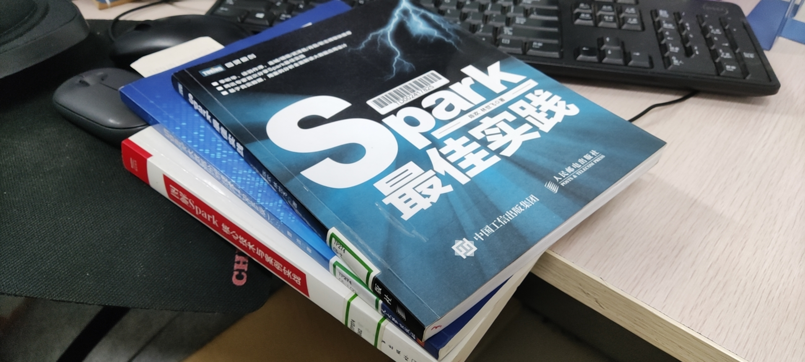
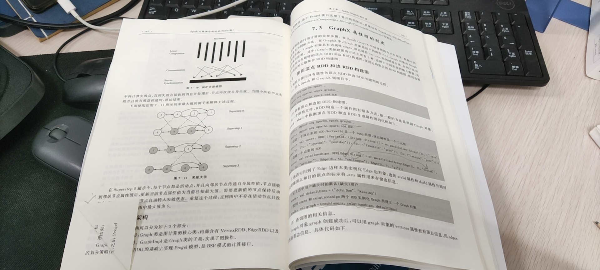
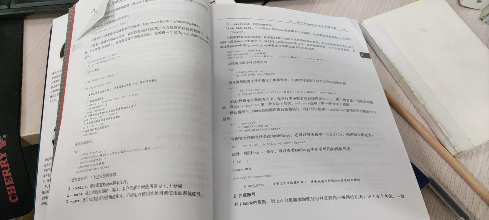

# 第一本Spark书籍阅读完成：小小总结一下

<!-- @import "[TOC]" {cmd="toc" depthFrom=3 depthTo=4 orderedList=false} -->

<!-- code_chunk_output -->

- [关于Spark借了3本书：基础、实操与原理](#关于spark借了3本书基础-实操与原理)
  - [基础类：Spark大数据分析技术（Scala版）](#基础类spark大数据分析技术scala版)
  - [实践类：Spark最佳实践](#实践类spark最佳实践)
  - [原理类：图解Spark：核心技术与案例实战](#原理类图解spark核心技术与案例实战)
- [总结一下：求质不求量，及时掉头](#总结一下求质不求量及时掉头)

<!-- /code_chunk_output -->

### 关于Spark借了3本书：基础、实操与原理

借了三本书[参考资料](../../bigdata/spark/drafts/0001参考资料.md)，正好符合我对技术类书籍的功能型三大分类：

#### 基础类：Spark大数据分析技术（Scala版）

曹洁的《Spark大数据分析技术（Scala版）》，里面的东西有悉数罗列之嫌，很像找一堆学生查资料给他编篡到一起的一本书。作者对此书的定位为“大学教材”，因此缩小了读者的预设知识面，比如：
- 在介绍 Spark 分类算法前，甚至要介绍什么是“分类学习”，甚至还会介绍什么是“机器学习”，嗯...颇有硕博论文那股八股味道了
- 「Windows环境下的Spark综合编程」...您听听这章节名字，颇有大学教材那味了没，典型的国内教材

有人会觉得，反正都是罗列，那我自己去读官方文档好不好？有必要读这本书吗？我倒觉得，这也是其优势：
- 用中文把 Spark 体系、 Scala 基础知识快速过一遍
- 里面会带到一些设计原理、设计思想方面的基本知识，有个印象，看到就是赚到，比如在讲 GraphX 时，会先介绍图结构的概念，在讲图存储模式时，会把「边分割存储模式」、「点分割存储模式」都讲一遍，然后告诉你： Spark 用的是什么

我刚刚读完这个，哪里都想记笔记，因为这书是从图书馆接的，感觉不记笔记，以后要是还不常用 Spark ，知识留不住。记了笔记，觉得以后一看就能捡起来了。

有点难搞，到底咋个记笔记方法，现在在纠结。

#### 实践类：Spark最佳实践

陈欢和林世飞的《Spark最佳实践》，腾讯人出品，我很喜欢。

我最开始也是拿起这本书来读，读几章，发现不对劲：
- 比起《Spark大数据分析技术（Scala版）》全在讲基础的 API ，这本《Spark最佳实践》上来就是如何在集群上部署、bash脚本怎写、fabric的使用...好家伙，这本书真的是为实践而生的
- 后面虽然也介绍了一些基础知识，但是没有《Spark大数据分析技术（Scala版）》基础，遂先去读了那本

#### 原理类：图解Spark：核心技术与案例实战

郭景瞻的《图解Spark：核心技术与案例实战》，我现在在纠结要不要读本书，因为很有可能，读了也白读。

想要了解一个工具的原理，在我看来，起码要把这个工具用好。起码要经历用这个工具做完整的项目、用到这个工具的大部分功能、读过这个工具的官方文档这几个过程，才能开始了解其原理。

大概看了一眼，讲的是Spark的内部实现，比如任务调度什么机制、有哪些类等等。我目前仅仅是拿 spark.mllib 做一些很菜的封装，因此暂时先不读这本了吧。

### 总结一下：求质不求量，及时掉头

本来的计划是，读完这三本书。

可是读一本已经够费力了。而且我现在还想给第一本记笔记，感觉这个是个体力活。

并且，我发现第三本不适合我现在读。因此：
- 求质不求量：不要求三本都读了
- 及时掉头：别用不显示的目标把自己卡住，甚至第二步不合适也可以先放放
