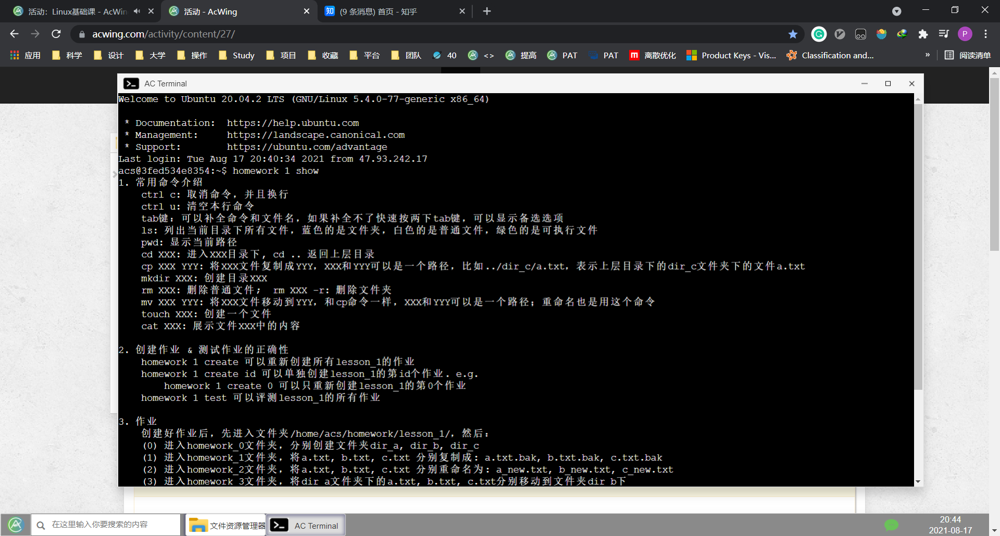

# 第一讲 常用文件管理命令

<!-- @import "[TOC]" {cmd="toc" depthFrom=3 depthTo=6 orderedList=false} -->

<!-- code_chunk_output -->

- [课程概述](#课程概述)
- [常用命令介绍](#常用命令介绍)
  - [一些笔记](#一些笔记)
- [Linux 根目录](#linux-根目录)
  - [附：Linux中“一切皆文件”](#附linux中一切皆文件)
- [创建作业&测试作业的正确性](#创建作业测试作业的正确性)

<!-- /code_chunk_output -->

### 课程概述

本课程面向未来的开发，因此不讲类似『怎么安装双系统』等等内容。

时间的话，用 AcWing 里面提供的终端就行。

### 常用命令介绍
- `ctrl c` 取消命令，并且换行
- `ctrl u` 清空本行命令
- `tab` 可以补全命令和文件名，如果补全不了快速按两下tab键，可以显示备选选项
- `ls` 列出当前目录下所有文件，蓝色的是文件夹，白色的是普通文件，绿色的是可执行文件
- `pwd` 显示当前路径
- `cd xxx` 进入`xxx`目录下，`cd ..`返回上层目录
- `cp xxx yyy`: 将`xxx`文件复制成`YYY`， `xxx`和`yyy`可以是一个路径，比如`../dir_c/a.txt`, 表示上层目录下的`dir_ c`文件夹下的文件`a. txt` 
- `mkdir xxx` 创建目录 `xxx`
- `rm xxx` 删除普通文件； `rmx xxx -r` 删除文件夹
- `mv xxx yyy` 将`xxx`文件移动到`yyy`，和`cp`命令一样，`xxx`和`yyy`可以是一个路径；重命名也是用这个命令
- `touch xxx` 创建一个文件
- `cat xxx` 展示文件`xxx`中的内容

#### 一些笔记

对于文件 `y c` 如何删除？对空格转义：`rm y\ c` 。

### Linux 根目录

参考：[Linux 系统目录结构](https://www.runoob.com/linux/linux-system-contents.html)

- **bin** bin 是 Binaries (二进制文件) 的缩写, 这个目录存放着最经常使用的命令。
- **lib** lib 是 Library(库) 的缩写这个目录里存放着系统最基本的动态连接共享库，其作用类似于 Windows 里的 DLL 文件。几乎所有的应用程序都需要用到这些共享库。

上述两个是 y总觉得有必要知道的。下面是 y总提到的，y总认为不用可以记忆。

- **etc** etc 是 Etcetera(等等) 的缩写,这个目录用来存放所有的系统管理所需要的配置文件和子目录。
- **var** var 是 variable(变量) 的缩写，这个目录中存放着在不断扩充着的东西，我们习惯将那些经常被修改的目录放在这个目录下。包括各种日志文件。（y总常用到里面的 log 日志文件）
- **home** home 是用户的主目录，在 Linux 中，每个用户都有一个自己的目录，一般该目录名是以用户的账号命名的。
- **proc** proc 是 Processes(进程) 的缩写，`/proc` 是一种伪文件系统（也即虚拟文件系统），存储的是当前内核运行状态的一系列特殊文件，这个目录是一个虚拟的目录，它是系统内存的映射，我们可以通过直接访问这个目录来获取系统信息。
  - 这个目录的内容不在硬盘上而是在内存里，我们也可以直接修改里面的某些文件，比如可以通过下面的命令来屏蔽主机的ping命令，使别人无法ping你的机器：
    - `echo 1 > /proc/sys/net/ipv4/icmp_echo_ignore_all`
  - y总：可以查看 cpu 信息：`cat /proc/cpuinfo`

#### 附：Linux中“一切皆文件”

y 总没提，但是有必要知道。

[Linux中“一切皆文件”是什么意思？ - pansz的回答 - 知乎](https://www.zhihu.com/question/422144033/answer/1499918762)：

其实是一种面向对象的设计思想。就是说将一切外设当做文件，从而可以使用针对文件的那些操作。

串口是文件，内存是文件，usb是文件，进程信息是文件，网卡是文件，建立的每个网络通讯都是文件，蓝牙设备也是文件，等等等等。

所有外设都是文件，本质上就是说他们都支持用来访问文件的那些接口，可以被当做文件来访问。这个原理与子类都能当做基类访问是一样的，就是操作系统层面的oop思想。

[Linux中“一切皆文件”是什么意思？ - 刘长元的回答 - 知乎](https://www.zhihu.com/question/422144033/answer/1497661811)：

Linux的一切皆文件是指，Linux世界中的所有、任意、一切东西都可以通过文件的方式访问、管理。

反过来说，是Linux和GNU世界定的规范，任何东西都挂在文件系统之上，即使它们不是文件，也以文件的形式来呈现。有一个很关键的点，这个一切是单向的，也即所有的东西都单向通过文件系统呈现，反向不一定可行。

比如通过新建文件的方式来创建磁盘设备是行不通的。比如我们经常会讲的进程(/proc)、设备(/dev)、Socket等等，实际上都不是文件，但是你可以以文件系统的规范来访问它，修改属主和属性。

Linux下有`lsof`命令，可以查看所有已经打开的文件，你使用`lsof -p [pid]`的方式就可以查看对应的进程都打开了什么文件，而其中的`type`字段就是表明它是什么类型，通过 `man losf` 命令你可以查看到它有下面这么多种。

### 创建作业&测试作业的正确性

- `homework 1 create` 可以重新创建所有`lesson_1`的作业
- `homework 1 create id` 可以单独创建 lesson_1` 的第 id 个作业. e.g. `homework 1 create 0` 可以只重新创建 `lesson_1` 的第0个作业
- `homework 1 test` 可以评测 `lesson_1` 的所有作业

