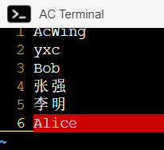

# 第一讲 常用文件管理命令

<!-- @import "[TOC]" {cmd="toc" depthFrom=3 depthTo=4 orderedList=false} -->

<!-- code_chunk_output -->

- [tmux](#tmux)
  - [tmux结构](#tmux结构)
  - [tmux基础操作](#tmux基础操作)
- [vim](#vim)
  - [vim功能概括](#vim功能概括)
  - [vim模式](#vim模式)
  - [vim操作](#vim操作)
- [作业](#作业)

<!-- /code_chunk_output -->

### tmux
基础功能概括：
- (1) 分屏。
- (2) 允许断开Terminal连接后，继续运行进程。
    
#### tmux结构

一个tmux可以包含多个session，一个session可以包含多个window，一个window可以包含多个pane。

实例：
```
tmux:
    session 0:
        window 0:
            pane 0
            pane 1
            pane 2
            ...
        window 1
        window 2
        ...
    session 1
    session 2
    ...
```

#### tmux基础操作

下面是 yls 的总结，但是我感觉网上这篇写得更好：
- [./02_tmux_转载.md](./02_tmux_转载.md)

(1) tmux：新建一个session，其中包含一个window，window中包含一个pane，pane里打开了一个shell对话框。

(2) 按下`Ctrl + a`后手指松开，然后按`%`：将当前pane左右平分成两个pane。

(3) 按下`Ctrl + a`后手指松开，然后按`"`：将当前pane上下平分成两个pane。

> 注意：Linux 默认的是 `Ctrl + b` ，这里 yls 做了改动。

(4) `Ctrl + d`：关闭当前pane；如果当前window的所有pane均已关闭，则自动关闭window；如果当前session的所有window均已关闭，则自动关闭session。

(5) 鼠标点击可以选pane。

(6) 按下`ctrl + a`后手指松开，然后按方向键：选择相邻的pane。

(7) 鼠标拖动pane之间的分割线，可以调整分割线的位置。

(8) 按住`ctrl + a`的「同时」按`方向键`，可以调整pane之间分割线的位置。

(9) 按下`ctrl + a`后手指松开，然后按`z`：将当前pane全屏/取消全屏。

(10) 按下`ctrl + a`后手指松开，然后按`d`：挂起当前session。

(11) `tmux a`：打开之前挂起的session。

(12) 按下ctrl + a后手指松开，然后按s：选择其它session。
- 方向键 —— 上：选择上一项 session/window/pane
- 方向键 —— 下：选择下一项 session/window/pane
- 方向键 —— 右：展开当前项 session/window
- 方向键 —— 左：闭合当前项 session/window

(13) 按下`Ctrl + a`后手指松开，然后按`c`：在当前session中创建一个新的window。

(14) 按下`Ctrl + a`后手指松开，然后按`w`：选择其他window，操作方法与(12)完全相同。

(15) 按下`Ctrl + a`后手指松开，然后按`PageUp`：翻阅当前pane内的内容。

(16) 鼠标滚轮：翻阅当前pane内的内容。

(17) 在tmux中选中文本时，需要按住`shift`键。

### vim
#### vim功能概括
(1) 命令行模式下的文本编辑器。

(2) 根据文件扩展名自动判别编程语言。支持代码缩进、代码高亮等功能。

(3) 使用方式：vim filename
- 如果已有该文件，则打开它。
- 如果没有该文件，则打开个一个新的文件，并命名为filename

#### vim模式
(1) 一般命令模式：默认模式。命令输入方式：类似于打游戏放技能，按不同字符，即可进行不同操作。可以复制、粘贴、删除文本等。

(2) 编辑模式：在一般命令模式里按下i，会进入编辑模式。
    按下ESC会退出编辑模式，返回到一般命令模式。

(3) 命令行模式：在一般命令模式里按下:/?三个字母中的任意一个，会进入命令行模式。命令行在最下面。可以查找、替换、保存、退出、配置编辑器等。

#### vim操作

(1) `i`：进入编辑模式

(2) `ESC`：进入一般命令模式

(3) `h 或 左箭头键`：光标向左移动一个字符

(4) `j 或 向下箭头`：光标向下移动一个字符

(5) `k 或 向上箭头`：光标向下移动一个字符

(6) `l 或 向右箭头`：光标向右移动一个字符

(7) `n<Space>：n`表示数字，按下数字后再按空格，光标会向右移动这一行的n个字符

(8) `0 或 功能键[Home]`：光标移动到本行开头

(9) `$ 或 功能键[End]`：光标移动到本行末尾

(10) `G`：光标移动到最后一行

(11) `:n 或 nG`：n为数字，光标移动到第n行

(12) `gg`：光标移动到第一行，相当于1G

(13) `n<Enter>`：n为数字，光标向下移动n行

(14) `/word`：向光标之下寻找第一个值为word的字符串。

(15) `?word`：向光标之上寻找第一个值为word的字符串。

(16) `n`：重复前一个查找操作

(17) `N`：反向重复前一个查找操作

(18) `:n1,n2s/word1/word2/g`：n1与n2为数字，在第n1行与n2行之间寻找word1这个字符串，并将该字符串替换为word2

(19) `:1,$s/word1/word2/g`：将全文的word1替换为word2

(20) `:1,$s/word1/word2/gc`：将全文的word1替换为word2，且在替换前要求用户确认。

(21) `v`：选中文本

(22) `d`：删除选中的文本

(23) `dd`: 删除当前行

(24) `y`：复制选中的文本

(25) `yy`: 复制当前行

(26) `p`: 将复制的数据在光标的下一行粘贴

(27) `u`：撤销

(28) `Ctrl + r`：取消撤销

(29) `Shift + >`：将选中的文本整体向右移动

(30) `Shift + <`：将选中的文本整体向左移动

(31) `:w` 保存

(32) `:w!` 强制保存

(33) `:q` 退出

(34) `:q!` 强制退出

(35) `:wq` 保存并退出

(36) `:set paste` 设置成粘贴模式，取消代码自动缩进

(37) `:set nopaste` 取消粘贴模式，开启代码自动缩进

(38) `:set nu` 显示行号

(39) `:set nonu` 隐藏行号

(40) `gg=G`：将全文代码格式化

(41) `:noh` 关闭查找关键词高亮

(42) `Ctrl + q`：当vim卡死时，可以取消当前正在执行的命令

异常处理：
- 每次用vim编辑文件时，会自动创建一个`.filename.swp`的临时文件。
- 如果打开某个文件时，该文件的swp文件已存在，则会报错。此时解决办法有两种：
- (1) 找到正在打开该文件的程序，并退出
- (2) 直接删掉该swp文件即可


### 作业

创建好作业后，先进入文件夹/home/acs/homework/lesson_2/，然后：

(1) 进入homework_0文件夹，创建文件names.txt，并顺次将下列姓名写入该文件，每个名字占一行。

`AcWing、yxc、Bob、张强、李明、Alice`



(2) 进入homework_1文件夹，打开problem.txt，并依次删除下列字符：
- [1] 最后一行第101个字符
- [2] 第3行第8个字符
- [3] 第1行第30个字符
- [4] 第16行第55个字符
- [5] 第9行第80个字符
- 最后保存文件并退出。

```bash
G       : 跳到最后一行
gg      : 跳到第一行
n+space : 光标跳到本行中的第n个位置，第n个位置的意思是光标在第n个字符之后
:wq     : 保存退出
```

(3) 进入 homework_2文件夹，打开problem.txt，并依次执行如下操作：
- [1] 在第1个"two"的后面添加"abc"
- [2] 在第2个"two"的前面添加"def"
- [3] 将第3个"two"后面的连续12个字符删掉
- [4] 将第4个"two"所在的行删掉
- 最后保存文件并退出。
