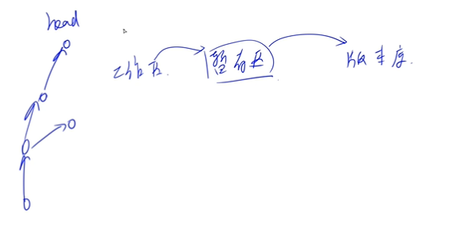
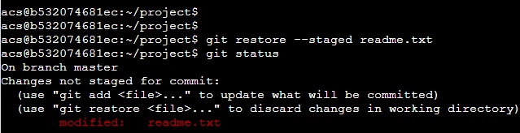

# 第五讲 git

- 作者：yxc
- 链接：https://www.acwing.com/file_system/file/content/whole/index/content/2932078/
- 来源：AcWing
- 著作权归作者所有。商业转载请联系作者获得授权，非商业转载请注明出处。

<!-- @import "[TOC]" {cmd="toc" depthFrom=3 depthTo=3 orderedList=false} -->

<!-- code_chunk_output -->

- [代码托管平台：git.acwing.com](#代码托管平台gitacwingcom)
- [讲义：各个命令介绍](#讲义各个命令介绍)
- [课堂笔记](#课堂笔记)
- [作业](#作业)

<!-- /code_chunk_output -->

细分目录：

<!-- @import "[TOC]" {cmd="toc" depthFrom=3 depthTo=4 orderedList=false} -->

<!-- code_chunk_output -->

- [代码托管平台：git.acwing.com](#代码托管平台gitacwingcom)
- [讲义：各个命令介绍](#讲义各个命令介绍)
  - [git基本概念](#git基本概念)
  - [git常用命令](#git常用命令)
- [课堂笔记](#课堂笔记)
  - [rm和restore](#rm和restore)
  - [log与回滚](#log与回滚)
- [作业](#作业)
  - [作业0](#作业0)
  - [作业1](#作业1)
  - [作业2](#作业2)
  - [作业3](#作业3)
  - [作业4](#作业4)
  - [作业5](#作业5)
  - [作业6](#作业6)
  - [作业7](#作业7)
  - [作业8](#作业8)
  - [作业9](#作业9)

<!-- /code_chunk_output -->

### 代码托管平台：git.acwing.com

[代码托管平台：git.acwing.com](代码托管平台：git.acwing.com)

### 讲义：各个命令介绍

#### git基本概念

- 工作区：仓库的目录。工作区是独立于各个分支的。
- 暂存区：数据暂时存放的区域，类似于工作区写入版本库前的缓存区。暂存区是独立于各个分支的。
- 版本库：存放所有已经提交到本地仓库的代码版本
- 版本结构：树结构，树中每个节点代表一个代码版本。

#### git常用命令

- `·`：设置全局用户名，信息记录在`~/.gitconfig`文件中
- `git config --global user.email xxx@xxx.com`：设置全局邮箱地址，信息记录在`~/.gitconfig`文件中
- `git init`：将当前目录配置成`git`仓库，信息记录在隐藏的`.git`文件夹中
- `git add XX`：将XX文件添加到暂存区
- `git add .`：将所有待加入暂存区的文件加入暂存区
- `git rm --cached XX`：将文件从仓库索引目录中删掉
- `git commit -m "给自己看的备注信息"`：将暂存区的内容提交到当前分支
- `git status`：查看仓库状态
- `git diff XX`：查看XX文件相对于暂存区修改了哪些内容
- `git log`：查看当前分支的所有版本
- `git reflog`：查看HEAD指针的移动历史（包括被回滚的版本）
- `git reset --hard HEAD^ 或 git reset --hard HEAD~`：将代码库回滚到上一个版本
- `git reset --hard HEAD^^`：往上回滚两次，以此类推
- `git reset --hard HEAD~100`：往上回滚100个版本
- `git reset --hard 版本号`：回滚到某一特定版本
- `git checkout — XX或git restore XX`：将XX文件尚未加入暂存区的修改全部撤销
- `git remote add origin git@git.acwing.com:xxx/XXX.git`：将本地仓库关联到远程仓库
- `git push -u (第一次需要-u以后不需要)`：将当前分支推送到远程仓库
- `git push origin branch_name`：将本地的某个分支推送到远程仓库
- `git clone git@git.acwing.com:xxx/XXX.git`：将远程仓库XXX下载到当前目录下
- `git checkout -b branch_name`：创建并切换到`branch_name`这个分支
- `git branch`：查看所有分支和当前所处分支
- `git checkout branch_name`：切换到`branch_name`这个分支
- `git merge branch_name`：将分支`branch_name`合并到当前分支上
- `git branch -d branch_name`：删除本地仓库的`branch_name`分支
- `git branch branch_name`：创建新分支
- `git push --set-upstream origin branch_name`：设置本地的`branch_name`分支对应远程仓库的`branch_name`分支
- `git push -d origin branch_name`：删除远程仓库的`branch_name`分支
- `git pull`：将远程仓库的当前分支与本地仓库的当前分支合并
- `git pull origin branch_name`：将远程仓库的`branch_name`分支与本地仓库的当前分支合并
- `git branch --set-upstream-to=origin/branch_name1 branch_name2`：将远程的`branch_name1`分支与本地的`branch_name2`分支对应
- `git checkout -t origin/branch_name` 将远程的`branch_name`分支拉取到本地
- `git stash`：将工作区和暂存区中尚未提交的修改存入栈中
- `git stash apply`：将栈顶存储的修改恢复到当前分支，但不删除栈顶元素
- `git stash drop`：删除栈顶存储的修改
- `git stash pop`：将栈顶存储的修改恢复到当前分支，同时删除栈顶元素
- `git stash list`：查看栈中所有元素

### 课堂笔记



git 实际上就是维护一个树结构。

#### rm和restore




`git rm --cached file` 是不再管理文件了，而 `git restore --staged file` 是将其改变从暂存区拿出来。

#### log与回滚

```bash
git log --pretty=oneline
```

`git log` 显示空结点到当前 `HEAD` 节点的版本。

`git reflog` 显示 `HEAD` 历史路径。

`git restore` 是把工作区相对于暂存区的内容修改掉了。

### 作业

注意： 本次作业的10个题目不是独立的，每个题目会依赖于前一个题目，因此评测时如果当前题目错误，则不再评测后续题目。

创建好作业后，先进入文件夹`/home/acs/homework/lesson_5/`，然后：

- (0) 在当前目录下创建文件夹`homework`，并将`homework`目录配置成`git`仓库。后续作业均在`homework`目录下操作；
- (1) 创建文件`readme.txt`，内容包含一行：`111`；
将修改提交一个`commit`；
- (2) 在`readme.txt`文件末尾新增一行：`222`；
将修改提交一个`commit`；
- (3) 创建文件夹：`problem1`和`problem2`；
创建文件`problem1/main.cpp`。文件内容为下述链接中的代码：https://www.acwing.com/problem/content/submission/code_detail/7834813/；
创建文件`problem2/main.cpp`。文件内容为下述链接中的代码：https://www.acwing.com/problem/content/submission/code_detail/7834819/；
将修改提交一个`commit`；
- (4) 删除文件夹`problem2`；
创建文件夹`problem3`；
创建文件`problem3/main.cpp`。文件内容为下述链接中的代码：https://www.acwing.com/problem/content/submission/code_detail/7834841/；
将`readme.txt`中最后一行`222`删掉，然后添加一行`333`；
将修改提交一个`commit`；
- (5) 在https://git.acwing.com/上注册账号并创建仓库，仓库名称为`homework`；
将本地`git`仓库上传到AC Git云端仓库；
- (6) 创建并切换至新分支`dev`；
在`readme.txt`文件中添加一行`444`；
将修改提交一个`commit`；
将`dev`分支推送至AC Git远程仓库；
- (7) 切换回`master`分支；
在`readme.txt`文件中添加一行`555`；
将修改提交一个`commit`；
- (8) 将`dev`分支合并到`master`分支；
手动处理冲突，使`readme`文件最终内容包含4行：`111`、`333`、`555`、`444`；
将修改提交一个`commit`；
- (9) 将`master`分支的版本库push到AC Git云端仓库；
登录`myserver`服务器（4. `ssh`作业中配置的服务器）；
创建并清空文件夹：`~/homework/lesson_5/`；
将AC Git云端仓库`clone`到`~/homework/lesson_5/`中；

#### 作业0

```bash
mkdir homework
cd homework
git init
```

#### 作业1

```bash
vim readme.txt
***
111
***
git add .
git commit -m "add readme.txt"
```

#### 作业2

```bash
vim readme.txt
***
111
222
***
git add .
git commit -m "add 222"
```

#### 作业3

```bash
mkdir problem1 problem2
cd problem1
vim main.cpp
***
#include <iostream>

using namespace std;

int main()
{
    int a, b;
    cin >> a >> b;
    cout << a + b << endl;
    return 0;
}
***
cd ../problem2
vim main.cpp
***
#include <iostream>

using namespace std;

const int N = 1010;

int n, m;
int f[N];

int main()
{
    cin >> n >> m;
    while (n -- )
    {
        int v, w;
        cin >> v >> w;
        for (int j = m; j >= v; j -- )
            f[j] = max(f[j], f[j - v] + w);
    }

    cout << f[m] << endl;

    return 0;
}
***
cd ..
git add .
git commit -m "add problem1 problem2"
```

#### 作业4

```bash
rm problem2 -r
mkdir problem3
cd problem3
vim main.cpp
***
#include <iostream>

using namespace std;

const int N = 1010;

int n, m;
int f[N];

int main()
{
    cin >> n >> m;

    while (n -- )
    {
        int v, w;
        cin >> v >> w;
        for (int j = v; j <= m; j ++ )
            f[j] = max(f[j], f[j - v] + w);
    }

    cout << f[m] << endl;
    return 0;
}
***

cd ..
vim readme.txt
***
111
333
***

git add .
git commit -m "many operations"
```

#### 作业5

本地操作为：

```bash
git remote add origin git@git.acwing.com:yxc/homework.git
git push -u origin master
```

#### 作业6

```bash
git checkout -b dev
vim readme.txt
***
111
333
444
***

git add .
git commit -m "add 444"
```

#### 作业7

```bash
git checkout master  # 切换回master分支

vim readme.txt

***
111
333
555
***

git add .
git commit -m "add 555"
```

#### 作业8

```bash
git merge dev  # 将dev分支合并到当前分支

vim readme.txt

***
111
333
555
444
***

git add .
git commit -m "fix conflicts"
```

#### 作业9

```bash
ssh myserver
cd homework
mkdir lesson_5
cd lesson_5

git clone git@git.acwing.com:yxc/homework.git
```
