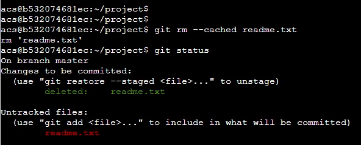

# 第三讲 shell语法

- 作者：yxc
- 链接：https://www.acwing.com/file_system/file/content/whole/index/content/2932078/
- 来源：AcWing
- 著作权归作者所有。商业转载请联系作者获得授权，非商业转载请注明出处。

<!-- @import "[TOC]" {cmd="toc" depthFrom=3 depthTo=3 orderedList=false} -->

<!-- code_chunk_output -->

- [代码托管平台：git.acwing.com](#代码托管平台gitacwingcom)
- [讲义：各个命令介绍](#讲义各个命令介绍)
- [课堂笔记](#课堂笔记)
- [作业](#作业)

<!-- /code_chunk_output -->

细分目录：

<!-- @import "[TOC]" {cmd="toc" depthFrom=3 depthTo=4 orderedList=false} -->

<!-- code_chunk_output -->

- [代码托管平台：git.acwing.com](#代码托管平台gitacwingcom)
- [讲义：各个命令介绍](#讲义各个命令介绍)
  - [git基本概念](#git基本概念)
  - [git常用命令](#git常用命令)
- [课堂笔记](#课堂笔记)
  - [rm和restore](#rm和restore)
  - [log与回滚](#log与回滚)
- [作业](#作业)

<!-- /code_chunk_output -->

### 代码托管平台：git.acwing.com

[代码托管平台：git.acwing.com](代码托管平台：git.acwing.com)

### 讲义：各个命令介绍

#### git基本概念

- 工作区：仓库的目录。工作区是独立于各个分支的。
- 暂存区：数据暂时存放的区域，类似于工作区写入版本库前的缓存区。暂存区是独立于各个分支的。
- 版本库：存放所有已经提交到本地仓库的代码版本
- 版本结构：树结构，树中每个节点代表一个代码版本。

#### git常用命令

- `·`：设置全局用户名，信息记录在`~/.gitconfig`文件中
- `git config --global user.email xxx@xxx.com`：设置全局邮箱地址，信息记录在`~/.gitconfig`文件中
- `git init`：将当前目录配置成`git`仓库，信息记录在隐藏的`.git`文件夹中
- `git add XX`：将XX文件添加到暂存区
- `git add .`：将所有待加入暂存区的文件加入暂存区
- `git rm --cached XX`：将文件从仓库索引目录中删掉
- `git commit -m "给自己看的备注信息"`：将暂存区的内容提交到当前分支
- `git status`：查看仓库状态
- `git diff XX`：查看XX文件相对于暂存区修改了哪些内容
- `git log`：查看当前分支的所有版本
- `git reflog`：查看HEAD指针的移动历史（包括被回滚的版本）
- `git reset --hard HEAD^ 或 git reset --hard HEAD~`：将代码库回滚到上一个版本
- `git reset --hard HEAD^^`：往上回滚两次，以此类推
- `git reset --hard HEAD~100`：往上回滚100个版本
- `git reset --hard 版本号`：回滚到某一特定版本
- `git checkout — XX或git restore XX`：将XX文件尚未加入暂存区的修改全部撤销
- `git remote add origin git@git.acwing.com:xxx/XXX.git`：将本地仓库关联到远程仓库
- `git push -u (第一次需要-u以后不需要)`：将当前分支推送到远程仓库
- `git push origin branch_name`：将本地的某个分支推送到远程仓库
- `git clone git@git.acwing.com:xxx/XXX.git`：将远程仓库XXX下载到当前目录下
- `git checkout -b branch_name`：创建并切换到`branch_name`这个分支
- `git branch`：查看所有分支和当前所处分支
- `git checkout branch_name`：切换到`branch_name`这个分支
- `git merge branch_name`：将分支`branch_name`合并到当前分支上
- `git branch -d branch_name`：删除本地仓库的`branch_name`分支
- `git branch branch_name`：创建新分支
- `git push --set-upstream origin branch_name`：设置本地的`branch_name`分支对应远程仓库的`branch_name`分支
- `git push -d origin branch_name`：删除远程仓库的`branch_name`分支
- `git pull`：将远程仓库的当前分支与本地仓库的当前分支合并
- `git pull origin branch_name`：将远程仓库的`branch_name`分支与本地仓库的当前分支合并
- `git branch --set-upstream-to=origin/branch_name1 branch_name2`：将远程的`branch_name1`分支与本地的`branch_name2`分支对应
- `git stash`：将工作区和暂存区中尚未提交的修改存入栈中
- `git stash apply`：将栈顶存储的修改恢复到当前分支，但不删除栈顶元素
- `git stash drop`：删除栈顶存储的修改
- `git stash pop`：将栈顶存储的修改恢复到当前分支，同时删除栈顶元素
- `git stash list`：查看栈中所有元素

### 课堂笔记


git 实际上就是维护一个树结构。

#### rm和restore




`git rm --cached file` 是不再管理文件了，而 `git restore --staged file` 是将其改变从暂存区拿出来。

#### log与回滚

```bash
git log --pretty=oneline
```

`git log` 显示空结点到当前 `HEAD` 节点的版本。

`git reflog` 显示 `HEAD` 历史路径。

`git restore` 是把工作区相对于暂存区的内容修改掉了。

### 作业
