转载自：
- 似懂非懂的Git —— 你也只会三招吗？ - FreewheelLee的文章 - 知乎 https://zhuanlan.zhihu.com/p/107686455
- 血泪教训之请不要再轻视Git —— 我在工作中是如何使用 Git 的 - FreewheelLee的文章 - 知乎 https://zhuanlan.zhihu.com/p/250493093


<!-- @import "[TOC]" {cmd="toc" depthFrom=1 depthTo=6 orderedList=false} -->

<!-- code_chunk_output -->

- [一些 git 使用场景](#一些-git-使用场景)
- [Git 的核心设计](#git-的核心设计)
  - [commit object](#commit-object)
  - [三个区：Working Tree（工作区），Stage / Index（暂存区） , Local Repo （本地仓库区）](#三个区working-tree工作区stage-index暂存区-local-repo-本地仓库区)
  - [远程仓库](#远程仓库)
- [设置 git alias](#设置-git-alias)
- [最常用的 git 指令 TOP 3](#最常用的-git-指令-top-3)
- [工作场景一：新任务（开发新特性 / 修bug）（git rebase）](#工作场景一新任务开发新特性-修buggit-rebase)
- [工作场景二：开发进行一半，需要远端主分支的最新代码](#工作场景二开发进行一半需要远端主分支的最新代码)
- [工作场景三：希望把某个分支中的某个 commit 对应的代码复制到当前分支](#工作场景三希望把某个分支中的某个-commit-对应的代码复制到当前分支)
- [使用git的一些原则](#使用git的一些原则)
  - [掌握 git 的方法](#掌握-git-的方法)

<!-- /code_chunk_output -->

### 一些 git 使用场景

你被分配到了2个独立的任务，在完成任务一的过程中由于某些因素暂停开发了（比如开发环境的某个服务器有问题，后天才能修好），你不得不去做任务二。
- 问题：那么任务一里写到一半的代码怎么保存？既然这2个任务是相互独立的，任务二的代码可以在任务一的代码基础上继续往下写吗？

你正在开发任务二的时候，同事解决了一个本地开发的性能问题，且他的代码已经被 `merge` 进了主分支（如果你是 前端玩家，可以假设 同事大幅优化了 `npm run start` 和 `webpack hot-deploy` 的速度）。
- 问题：如果你能用上同事优化过的那段代码，你的本地开发会大幅提高效率。此时你该怎么办？直接 `pull` 吗？

你在开发任务二的时候，已经写了非常多的代码，但是突然被通知中止任务二（假如这是个 新特性，产品经理决定短期时间不上了，但是将来可能还会继续开发 ）
- 问题：怎么合理地保存任务二的代码？

你的任务一开发结束了，发起 `pull request / merge request` 的时候在 `Github/Gitlab` 看到 `conflict` （文件冲突）的提示
- 问题：这是谁的责任？怎么解决？

你被分配了任务三，但是你忘记使用新分支，直接在任务一的分支上写了很多代码，部分代码甚至已经执行过 `git add` 了
- 问题：怎么恰当地把这些代码移到一个新分支上？

在开发任务中，你写了很多代码，有的 `git add` 过了，有的甚至 `git commit` 过了，后来发现有很大一部分代码是重复造轮子，于是决定删掉这些代码。
- 问题：怎么使用 `git` 优雅地撤销指定的代码 从而 保证在 `git log message` 中不留下痕迹？

### Git 的核心设计

#### commit object

你们留意过下图中最左列的那些仿佛乱码的字符串吗？

（下图是我的演示项目下 `git log --oneline` 的输出结果）

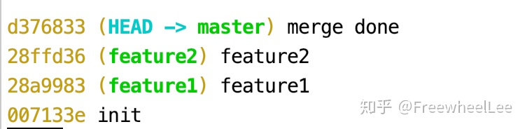

如果执行 `git log` ，还能看到“乱码”的完整体


这其实是个长度为`40`的 `Hash Value` （哈希值）， `Hash Value` 能作为识别不同内容的签名 ——也就是内容不同， `hash value` 一定不同（打 99.999999999% 的包票）

`Git log` 里的乱码其实是 `Git` 内部的 `commit object` 的 `hash value` —— `Git` 的内部使用了 4 种 `object` ： `blob` ， `tree` ， `commit` ， `tag` ，我们只要熟悉 `commit object` 的概念就行了，有兴趣的同学再去研究其他几个。

在我们每次执行

```bash
git commit -m "balabala"
```

的时候， `Git` 的内部就生成了一个 `commit object`

`Git` 的第一个核心设计 就是这一个个的 `commit object` ！

在 `Git` 的内部，只要有 `commit object` ，你的代码/文件 就有迹可循， `Git` 的几乎所有高级概念都是围绕着 `commit object` 定义的 （比如 `branch` ， `HEAD` ， `tag` ）

每次生成一个 `commit object` ，你的文件就相当于生成了一个快照 （`snapshot`），无论你的文件之后如何变化，只要通过 `git` 指令切回这个快照，一切就会恢复到此刻的模样。

此外，每次新生成的 `commit object` 都会指向前一个 `commit object` ，仿佛一根树枝往上生长。**（ 不同于 官方文档的画法，本文的所有图片中 `commit object` 之间的箭头是时间顺序 —— 早 `commit` 的指向 晚 `commit` 的 ）**

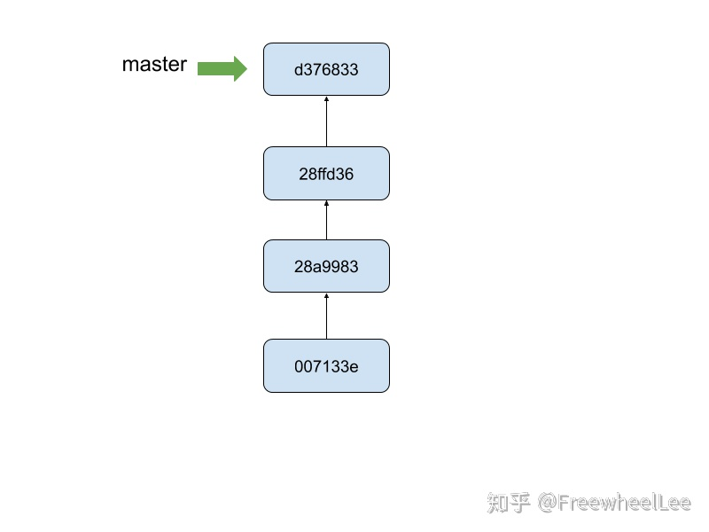

那么什么是 `branch`（分支） 呢？顾名思义， `branch` 就是让树枝长出分叉来，如下图所示。

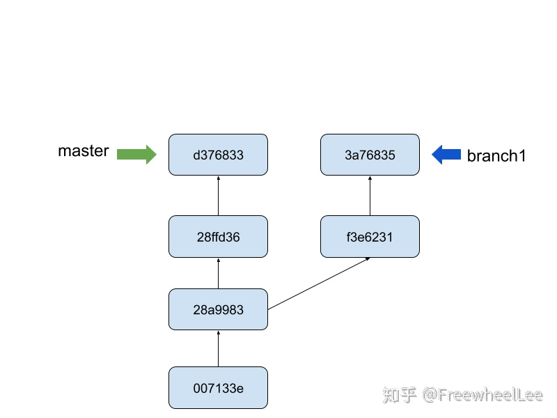

而合并分支（`merge`）实际上就是 新长出一个 `commit object` 并且让两个分支都指向它（当然文件内容会相应地融合）如下图所示。

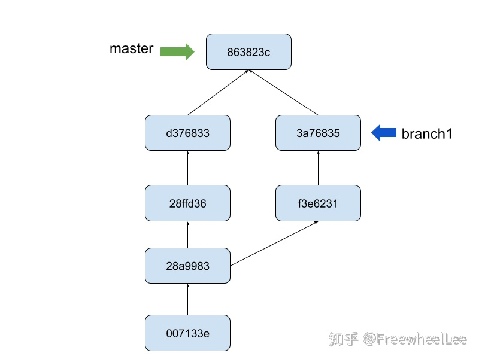

`Git` 怎么知道我当前在哪个分支？

`Git` 内部维护着 一个 `HEAD` ，它类似一个指针，永远指向当前所处的分支，比如下图说明当前在 `master` 分支


#### 三个区：Working Tree（工作区），Stage / Index（暂存区） , Local Repo （本地仓库区）

第二个核心设计 ——三个区：`Working Tree`（工作区），`Stage / Index`（暂存区） , `Local Repo` （本地仓库区）

不同的文章用词略有差别，但是意思是一样的。

以下是我们跟这三个区打交道的最常见的流程：
- 当我们对文件做修改时（增删改），文件的改动发生在 `工作区`
- 当我们执行 `git add` 时，对应的文件改动就会被送到 `暂存区`
- 当我们执行 `git commit` 时，对应的文件改动才会进入本地仓库，并且使当前的分支向前长了一个 `commit object`

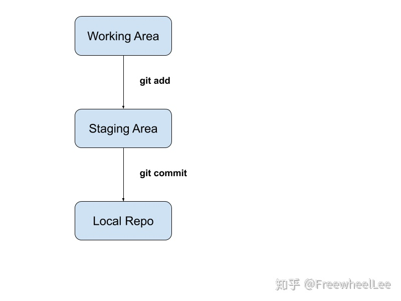

这三个区的特点：

工作区 —— 就是电脑文件系统上的项目文件所处的环境，这是最接近用户的区域，所有 新增的改动 都是先从工作区开始

暂存区 —— 顾名思义这是个暂时存放文件改动的区域，进退自如 —— 进可进入本地仓库，退可返回到工作区

本地仓库 —— 能进到本地仓库的文件改动都已经有对应的 `commit object`，因此有迹可循，是三个区中最安全的区域（不容易丢失数据）。因此我推荐尽量把有价值的文件改动 `commit` 进来，避免无意中丢失，再采用其他方法整理好代码 `push` 上远端仓库。

`Git` 的大多数指令都跟这三个区在打交道，比如 `add`, `commit`, `checkout` , `reset` 甚至是 `rebase`, `cherry-pick`，`pull` 等高级指令， 理解清楚了这三个区和它们的功能，在查阅这些 `git` 指令的文档时也就不至于云里雾里了。

#### 远程仓库

刚刚在说的都是在本地仓库，那远端仓库又是怎么回事？

这就要从 Git 的分布式特性说起了 ...... 算了，我们就不多废话，

很简单，就几点：

1. 使用 `Git` 的项目的备份无处不在 —— 你的本地仓库就是个 备份，你同事电脑上也有一个备份，远端上（`Github`, `Gitlab` ...） 也有一份备份

2. 为了管理方便，我们通常统一在 远端仓库上（`Github`, `Gitlab` ...）做分支整合和代码储存，比如
- 可以 `code review`；
- 方便`CI/CD` —— 统一从远端上拉取源代码，编译，打包最后部署
- 权限控制，比如所有人都不准直接 `git push origin master` ，只有 `admin` 能 `merge develop` 或 `master` 分支；

3. 通过远端仓库，项目协作人员方便共享代码，分工合作。

跟远端相关的 `Git` 指令，我认为最基础的就是 `fetch` 和 `push` 。

`fetch` 负责把远端分支“拿来”到本地仓库， `push` 负责把本地分支推送到远端仓库

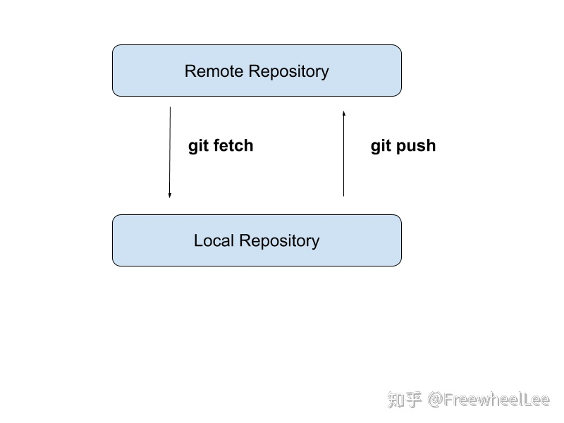

而我们常用的 `pull` 其实同时结合了 `fetch` 和 `checkout` （还有 `merge` 或者 `rebase` ），详细的请查阅 `git` 的文档。

最后附上一个特别好的图，供大家学习思考（来自：https://en.wikipedia.org/wiki/Git ）

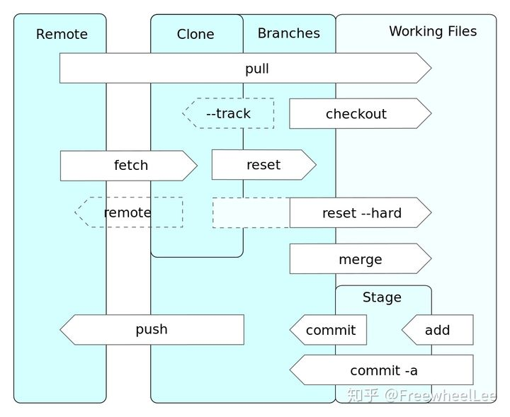

### 设置 git alias

今天索性给大家分享我在工作中是如何以最安全、最稳健、最简单的方式使用 `git` 。

```bash
git config --global alias.co checkout
git config --global alias.br branch
git config --global alias.ci commit
git config --global alias.st status
git config --global alias.unstage 'reset HEAD --'
git config --global alias.last 'log -1 HEAD'
git config --global alias.logl 'log --oneline'
```

跑完上面的指令，查看 `~/.gitconfig` 是否包含以下内容

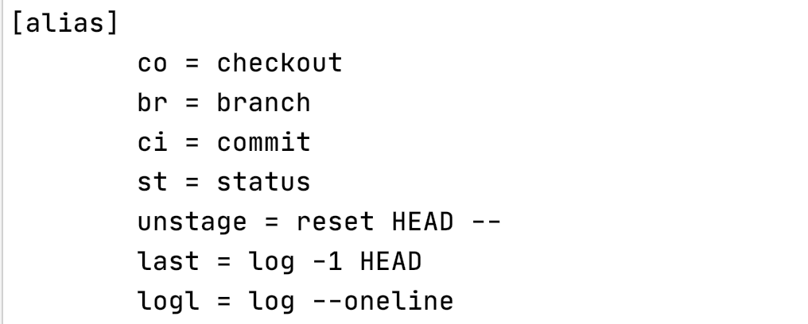

效果就是

我在命令行里输入 `git st` 就等同于 `git status` ，输入 `git ci -m "xxx"` 等同于 `git commit -m "xxx"`

### 最常用的 git 指令 TOP 3

**第一个是 `git st` （即 `git status`）**

我通常在 写完代码后、做任何`git`操作前、做复杂的`git`操作的途中（比如 `rebase`、`merge`遇到冲突时）和 做完任何`git`操作后，都会使用 `git st` 去查看当前的状态 —— 哪些文件还在工作区（还没 `git add`）、哪些文件还在暂存区（还没 `git commit`）或者 `rebase`、`merge` 的进展等。

充分、及时了解当前的 `git` 状态可以避免一些误操作

**第二个是 `git logl `（即 `git log --oneline`）**

这个指令可以打印出最近的 `commit messages` ，每条 `message` 只占一行，使界面更干净、美观。

我通常会在 切换分支的前后，拉取线上分支的前后 使用`git logl`，它能帮我根据 `commit message` 确认我当前的分支以及当前分支是否是最新的 （前提是每次 `commit` 时一定要认真填写 `commit message`）

**第三个是 git ci （即 git commit）**

`git` 之所以使用广泛，是因为它有非常优秀的设计和性能。而其中， `commit` 是 `git` 设计中的核心。

在日常开发工作中，我通常会在 写完一部分代码后，准备暂时休息前或确认某个功能/bug处理完成后 使用 `git add` 和 `git ci` 来保存代码到本地仓库。

记住：只要正确地 `commit` 了，代码就几乎永远不会丢失。（下面有更多对 `git commit` 的讨论）

### 工作场景一：新任务（开发新特性 / 修bug）（git rebase）

- `git st` 查看当前项目的状态，如果有未保存的修改，就 `git add .` 和 `git ci -m "xyz"` 保存下来
- 切换到开发主分支，假如项目的主分支叫 `develop` 就使用 `git co develop`
- 确保主分支是最新版本 `git pull origin develop`
- 创建新分支 `git co -b feat-1` (创建一个叫做 `feat-1`的新分支)
- 开始写代码
- 如果当前任务比较复杂，代码量比较多，我通常会多次使用 `git add .` 和 `git ci -m "xxx"` 保存当前代码 (记得把 `xxx` 换成更有意义的文字， 如 `git ci -m "init feature-1"` )
- 代码开发结束，整理 `commit message`
- 首先仍然是用 `git st` 确保所有代码都`commit`了（没有就 `git add` 和 `git ci` ）
- 第二步 `git logl` 查看当前分支下最近的 `commit message`，如

```
1d23813 (HEAD -> feat-1) develop feat-1 phase 3
a7e5705 develop feat-1 phase 2
2685240 init feat-1
```

假设我开发 `feat-1` 中 `commit` 了 3 次，三次的 `commit message` 如上所示。

**前面说过 `commit` 是为了防止意外丢失代码，但是在推到远端之前，最好把一次开发的 `commit` 合并成一个，避免污染远端的 `git commit message`**

因为这个例子中有3个 `commit` ，所以执行 `git rebase -i HEAD~3`

然后就会看到一个 `vim` 界面 （不熟悉 `vim` 基础操作的读者请自行查阅搜索）

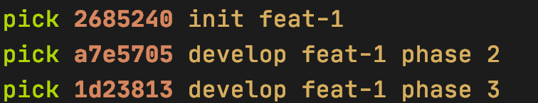

记住不要动最上面的那行，把下面几行开头的 `pick` 换成 `s` , 然后保存

这时会显示另一个 `vim` 界面

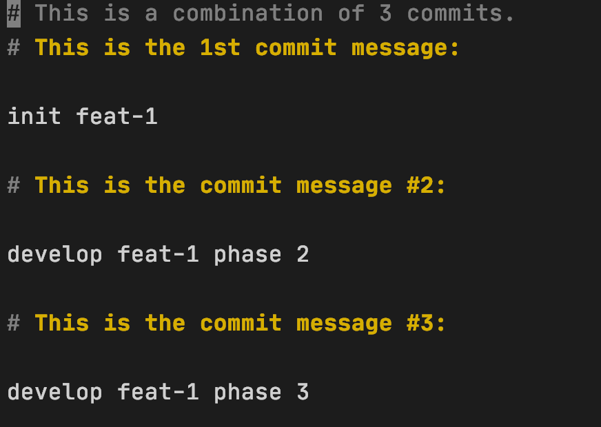

删除所有内容(`#`开头的可以忽略），然后写一句简短、准确的句子作为这次开发的 `commit message` ，如

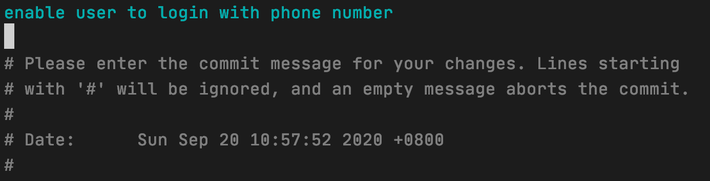

然后保存

如果成功了就能看见这么一些文字

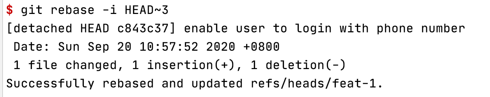

最后使用 `git logl` 确认所有这次开发中的 `commit message` 都被压缩成了一个

(这边只介绍了 `git rebase` 的最简单直接的用法，有兴趣的读者可以去阅读官方文档，了解更详细、高级的用法，如第一次 vim 界面里使用 `f` 替代 `s` 有时候更方便）

最后 `git push origin feat-1` 把本地仓库推到远端仓库

### 工作场景二：开发进行一半，需要远端主分支的最新代码

有些时候，你在本地开发某个功能，代码写到一半，某个同事将某些重要代码合进了远端的主分支（如 `develop` 分支）里。这些重要代码可能是可以极大提升本地开发效率，可能是加入了某些规范检查或者是跟你当前开发相关的代码 —— 总之需要你将那部分代码融入你当前的本地开发环境里。

这种情况下，我会
- `git st` 查看当前项目的状态，如果有未保存的修改，就 `git add .` 和 `git ci -m "xyz"` 保存下来
- `git pull --rebase origin develop ` 使用这个指令将远端的主分支以 `rebase` 的形式 “合进”当前分支
- `git logl` 查看当前分支下的 `commit message` 是否符合预期

为什么用 `--rebase` 呢？

因为这么做，可以让`git`历史最干净、整洁 —— 所有本地开发的 `commit` 都会出现在远端主分支里的 `commit` 之后；并且可以避免额外引入一次 `merge` 的 `commit`

### 工作场景三：希望把某个分支中的某个 commit 对应的代码复制到当前分支

有时我会创建一些实验性的分支，写一些实验性的代码，如果代码不可行，我可以直接废弃掉这个分支，返回原本的开发分支中；如果这些实验性代码可行，我会返回开发分支中，然后把实验性分支的那部分代码“复制”过来，具体操作如下：

- `git st` 查看当前项目的状态，如果有未保存的修改，就`git add .` 和 `git ci -m "xyz"` 保存下来
- 假设我们需要的是 `feat-1` 这个分支的某个 `commit` ，使用 `git logl feat-1` 查看最近这个分支的所有 `commit` 记录，如

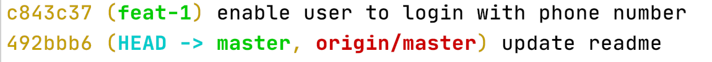

- 记下对应的 `commit` 的 `hash` 值，即开头的7个字符乱码 如上图的 `c843c37`
- 使用 `git cherry-pick c843c37` 将这个 `commit` 对应的代码复制到当前分支

另外 `git cherry-pick` 有时还可以用来救场 —— 找回“丢失”的代码，前提是能找到对应的 `commit hash` 值。

### 使用git的一些原则

- 永远记得 `git st` 和 `git logl` 来确认当前分支的状态
- 宁愿临时制造一些无用的 `commit` 来保证代码不会丢失，也不要轻信自己的记忆力
- 谨慎（最好能避免）使用 `git stash` ，极易造成代码丢失
- 认真对待、编写每次的 `commit message` —— 它们能在关键时刻救你一命
- 必要的时候可以创建一些临时的分支写实验性的代码，而不是依赖 `git reset` 撤销 `commit` —— 大多数人在 `git reset` 的时候容易犯错误

#### 掌握 git 的方法

今天主要分享了一些实用性的指令和经验，它们可以覆盖大多数普通的开发场景。

但是如果你想彻底掌握 `git` 或者 有能力去处理一些比较复杂的情况，我建议还是能进一步理解 `git` 的理念（如 为什么 `commit` 是 `git` 的核心？ 为什么有 `commit` 就不怕代码丢失？分支和 `commit` 是什么关系？有 `git commit` 为什么还有 `git add` ？`git reset` 危险在哪里 ？）
