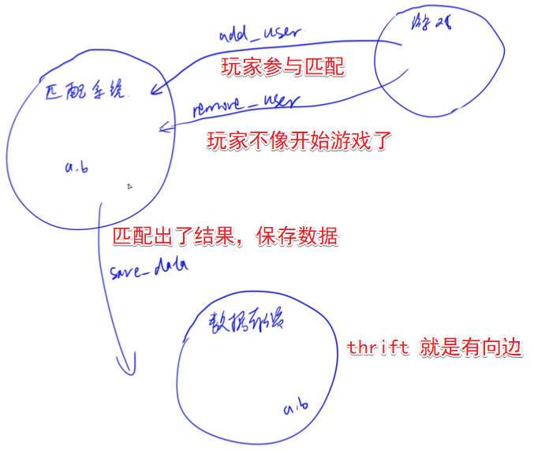

# 第六讲 thrift

- 作者：yxc
- 链接：https://www.acwing.com/file_system/file/content/whole/index/content/2991899/
- 来源：AcWing
- 著作权归作者所有。商业转载请联系作者获得授权，非商业转载请注明出处。

<!-- @import "[TOC]" {cmd="toc" depthFrom=3 depthTo=3 orderedList=false} -->

<!-- code_chunk_output -->

- [thrift教程](#thrift教程)
- [项目：游戏匹配系统](#项目游戏匹配系统)
- [作业](#作业)
- [thrift 学习总结](#thrift-学习总结)

<!-- /code_chunk_output -->

细分目录：

<!-- @import "[TOC]" {cmd="toc" depthFrom=3 depthTo=4 orderedList=false} -->

<!-- code_chunk_output -->

- [thrift教程](#thrift教程)
- [项目：游戏匹配系统](#项目游戏匹配系统)
  - [项目基本架构](#项目基本架构)
  - [thrift中保存thrift接口](#thrift中保存thrift接口)
  - [thrift生成服务端](#thrift生成服务端)
  - [thrift生成客户端](#thrift生成客户端)
  - [深化client.py](#深化clientpy)
  - [拆分服务端逻辑（线程与锁）](#拆分服务端逻辑线程与锁)
  - [多线程与总结](#多线程与总结)
- [作业](#作业)
  - [0 创建`match-server` 与 `save-client`](#0-创建match-server-与-save-client)
  - [1 创建`match-client`](#1-创建match-client)
- [thrift 学习总结](#thrift-学习总结)

<!-- /code_chunk_output -->

### thrift教程

thrift 是一种 rpc 框架。

- thrift官网：https://thrift.apache.org/
- 上课代码地址：https://git.acwing.com/yxc/thrift_lesson

这节课是做一个项目。

**大佬[小熊熊](https://www.acwing.com/user/myspace/index/97206/)的[笔记](https://git.acwing.com/fashen/thrift_learning/-/tree/master/)很细致，我已经通读，在这里搬运一下。**
- 本仓库搬运与批注地址：[link](./06_thrift.md)
- 原地址：https://git.acwing.com/fashen/thrift_learning/-/tree/master/

### 项目：游戏匹配系统

#### 项目基本架构



如上，用 `python3` 实现游戏部分， `C++` 实现 匹配部分。

代码已经有了：[../codes/thrift_lesson-master/readme.md](../codes/thrift_lesson-master/readme.md)

我们需要实现：
- 定义接口
- server
- client

#### thrift中保存thrift接口

首先定义了一个 `match.thrift` 文件。语法就参考 [https://gitbox.apache.org/repos/asf?p=thrift.git;a=blob;hb=HEAD;f=tutorial/tutorial.thrift](https://gitbox.apache.org/repos/asf?p=thrift.git;a=blob;hb=HEAD;f=tutorial/tutorial.thrift) 写下来就行。

```thrift
namespace cpp match_service

struct User {
    1: i32 id,
    2: string name,
    3: i32 score
}

service Match {

    /**
     * user: 添加的用户信息
     * info: 附加信息
     * 在匹配池中添加一个名用户
     */
    i32 add_user(1: User user, 2: string info),

    /**
     * user: 删除的用户信息
     * info: 附加信息
     * 从匹配池中删除一名用户
     */
    i32 remove_user(1: User user, 2: string info),
}
```

**经验：**
- 我们一般定义接口时，都带上 `info` 作为一个附加参数，这样以后不用更改接口，更改 `info` 就可以了
- `info` 可以是一个 `json`

#### thrift生成服务端

首先阅读文档 [https://thrift.apache.org/tutorial/cpp.html](https://thrift.apache.org/tutorial/cpp.html) ，看 CPP 接口怎么实现。

来到 `match_system/src` 目录：
```bash
thrift -r --gen cpp ../../thrift/match.thrift
```

如上就是为什么要定义 `namespace` 中 `cpp` 为 `match_service` 了：会通过 `thrift -r --gen cpp <.thrift>` 命令生成 `cpp` 文件。

然后整理一下目录结构。

在实现自己的逻辑前，先编译下，看看能不能跑通，跑通了再接着写代码。

```bash
g++ -c main.cpp match_server/*.cpp
```

然后链接：
```bash
g++ *.o -o main -lthrift
```

`-lthrift` 是辅助以 `thrift` 动态链接库。

然后 `./main` 就能运行。

#### thrift生成客户端

根据[https://thrift.apache.org/tutorial/py.html](https://thrift.apache.org/tutorial/py.html)命令：
```bash
thrift -r --gen py ../../thrift/match.thrift
```

发现现在 `game/src/match_client/match/gen-py/match_client/` 有一个可执行文件 `Match-remote` 是启动服务的文件。但是我们这边只用 `ptyhon` 做客户端实现，因此不需要这个，把这个删掉。

在 `src/` 创建一个 `client.py` ，把 [https://thrift.apache.org/tutorial/py.html](https://thrift.apache.org/tutorial/py.html) 改一下就行。

```python
from tutorial import Calculator
from tutorial.ttypes import InvalidOperation, Operation, Work

# 改为：
from match_client.match import Match
from match_client.match.ttypes import User
```

然后把没有用的都删掉。

把服务端跑起来，运行 `client.py` 就会有反应。

#### 深化client.py

参考[thrift_lesson-master/game/src/client.py](../codes/thrift_lesson-master/game/src/client.py)，通过 `stdin` 键入玩家信息。

`client.py` 就写完了。

#### 拆分服务端逻辑（线程与锁）

匹配系统应该是不断运行的，而匹配工作和写入数据库的工作应该不停循环，因此要开两个线程。

对于匹配任务，因为是单独一个线程，所以需要消费队列。

而实现消费队列需要用到锁。

锁有两个操作：
- `p` 操作，去获取一个锁
- `v` 操作，表示释放的意思

锁已经可以实现消费队列了。 C++ 中“条件变量”对锁是一个封装。

```cpp
struct MessageQueue
{
  queue<Task> q;
  mutex m;  // 锁
  condition_variable cv;  // 条件变量
} message_queue;

class MatchHandleer : virtual public MatchIf {
  public:
  MatchHandler () {

  }

  int32_t add_user(const User& user, const std::string& info) {
    ...

    // 这里 unique_lock
    // 加锁，不需要显示释放
    // 会等待 message_queue.m
    // 释放自动释放锁
    unique_lock<mutex> lck(message_queue.m);
    message_queue.q.push({user, "add"});

    return ;
  }
}
```

在消息队列里使用条件变量。

```cpp
void consume_task()
{
    while (true)
    {
        unique_lock<mutex> lck(message_queue.m);
        if (message_queue.q.empty())
        {
            // 如果是 empty
            // 则这里会导致 while (true) 死循环
            // 将导致 CPU 占用率 100%
            // 因此这用条件变量 cv
            // 将锁释放掉，一直卡在这里，直到唤醒条件变量
            // 唤醒的方式包括
            // cv.notify_all()
            // cv.notify_one() 等
            message_queue.cv.wait(lck);
        }
        else
        {
            auto task = message_queue.q.front();
            message_queue.q.pop();
            lck.unlock();

            if (task.type == "add") pool.add(task.user);
            else if (task.type == "remove") pool.remove(task.user);
        }
    }
}
```

#### 多线程与总结

y 总演示了多线程，也是从官网改吧改吧。

总结：
- y总从官网改就行
- 学到了 C++ 中锁与条件变量

### 作业

本次作业为复现课上最后一个版本的内容，课程视频地址：https://www.acwing.com/video/3479/

注意：本次作业的2个题目采用整体评测，即如果两个作业同时正确，则得100分；否则如果至少有一个作业错误，则得0分。

创建好作业后，先进入文件夹`/home/acs/homework/lesson_6/`，当前目录的文件结构如下：

```
`-- thrift_lesson
    |-- game
    |   `-- src
    |-- match_system
    |   `-- src 
    |-- readme.md
    `-- thrift
        |-- match.thrift
        `-- save.thrift
```

(0) 进入`thrift_lesson/match_system/src/`目录，用cpp实现课上的`match-server`和`save-client`逻辑。

接口文件在`thrift_lesson/thrift/`中。

实现后启动`server`，监听端口9090。

(1) 进入`thrift_lesson/game/src/`目录，用python3实现课上的`match-client`逻辑。

文件名和输入格式与课上内容相同。

#### 0 创建`match-server` 与 `save-client`

创建`match-server`：

```bash
cd thrift_lesson/match_system/src
thrift -r --gen cpp ../../thrift/match.thrift
mv gen-cpp match_server
rm match_server/Match_server.skeleton.cpp
```

创建`save-client`：

```bash
cd thrift_lesson/match_system/src
thrift -r --gen cpp ../../thrift/save.thrift
mv gen-cpp save_client
rm save_client/Save_server.skeleton.cpp
```

创建`main.cpp`，源代码在[这里](../codes/thrift_lesson-master/match_system/src/main.cpp)。

这里，还需要注意，要修改 `client.save_data()` 中的参数，以调用属于自己的接口。

```bash
homework 4 getinfo  # 看 MyServer 上我们自己的账号
md5sum  # 输入密码， Ctrl + C 看加密后的密码，取前8位
```

编译：

```bash
g++ -c main.cpp match_server/*.cpp save_client/*.cpp
```

链接：

```bash
g++ *.o -o main -lthrift -pthread
```

启动服务：

```bash
./main
```

#### 1 创建`match-client`

创建`match-client`：

```bash
cd thrift_lesson/game/src
thrift -r --gen py ../../thrift/match.thrift
mv gen-py match_client
```

创建`client.py`，内容在[这里](../codes/thrift_lesson-master/game/src/client.py)。

执行`client.py`：

```bash
python3 client.pys
```

### thrift 学习总结

通过自己动手做作业，终于理解 `thrift` 了...

学 `thrift` 前，如果我想在服务端开个服务，然后客户端去请求这个服务，我该怎么做？服务端找个框架，然后写 RESTFUL 风格的接口，再起一个 `http` 服务啊！客户端呢？客户端我就用这些 RESTFUL 的 `http` 接口呗！

OK ，我想请问， `http` 是对什么的封装？是套接字 `socket` 呀！我凭啥一直要遵守 `http` 协议呢？尤其是，我不写 `web` 服务的时候。

那我不用 `http` 协议，我客户端/服务端不同语言，难道再自己当场写一套 `socket` 协议不成？ **`thrift` 说了：你在 `socket` 层传输数据没问题，至于怎么解析，怎么跨语言，你在C/S两端用同一个 `*.thrift` 文件就成了！**

假设我现在写一个服务，其中需要传输的数据对象有 `Order { price, value ... }` ，客户端提供给服务端的接口需要有 `get(...)` 、 `remove(...)` 等等，我只需要把这个规范写成 `order.thrift` 文件，在C/S分别 `thrift -r --gen` 一下，然后分别在C/S两端用自己的语言编写函数就行了。
