> [小熊熊](https://www.acwing.com/user/myspace/index/97206/)整理thrift笔记

- [第六讲 thrift](#第六讲-thrift)
  - [简介](#简介)
  - [Thrift IDL](#thrift-idl)
  - [如何创建一个Thrift服务?](#如何创建一个thrift服务)
- [接下来写个栗子来熟悉thrift的使用](#接下来写个栗子来熟悉thrift的使用)
  - [一个游戏的匹配服务分析](#一个游戏的匹配服务分析)
    - [分析总结:](#分析总结)
  - [实现一个游戏的匹配服务](#实现一个游戏的匹配服务)
    - [①名字空间NameSpace](#名字空间namespace)
    - [②结构体struct](#结构体struct)
    - [③ 服务定义类型Service](#-服务定义类型service)
    - [④ 定义服务接口之后，先实现match-server](#-定义服务接口之后先实现match-server)
    - [⑤ 如何编译thrift生成的C++代码?](#-如何编译thrift生成的c代码)
    - [⑥ 实现match-client](#-实现match-client)
    - [⑦ 将match-client的代码改成从标准输入中获取信息](#-将match-client的代码改成从标准输入中获取信息)
    - [⑧ 完善match-server](#-完善match-server)
    - [⑨ 实现save_client](#-实现save_client)
    - [⑩ 升级match-server](#-升级match-server)
    - [⑪ 将thrift的单独Server模式改成多线程Server模式](#-将thrift的单独server模式改成多线程server模式)
    - [⑫ 添加match-server的规则](#-添加match-server的规则)
- [知识点:](#知识点)
  - [C 头文件](#c-头文件)
  - [using namespace std的作用](#using-namespace-std的作用)
  - [localhost，127.0.0.1 和 本机IP 三者的区别](#localhost127001-和-本机ip-三者的区别)
  - [端口](#端口)
  - [`#include <thread>`](#include-thread)
  - [互斥锁](#互斥锁)
  - [#include <condition_variable>](#include-condition_variable)
  - [C++中类的定义](#c中类的定义)
  - [vector的size()是无符号整数类型。](#vector的size是无符号整数类型)
  - [vector的erase()是左闭右开。](#vector的erase是左闭右开)
  - [求一个字符串的md5值。](#求一个字符串的md5值)
  - [英语知识](#英语知识)

---

# 第六讲 thrift
> 我们写一个应用时，这个应用程序并不止一个服务，而且不同的服务分配到不同服务器(或者进程)上，也就是我们常说的[微服务](https://baike.baidu.com/item/%E5%BE%AE%E6%9C%8D%E5%8A%A1/18758759?fr=aladdin) 。

## 简介
[thrift官网](https://thrift.apache.org/)
**官网教程:进入官网->Tutorial->tutorial.thrift**

**Apache Thrift** 软件框架用于可伸缩的跨语言服务开发，它将 **软件栈** 和 **代码生成引擎** 结合在一起，以构建在C++、Java、Python、PHP、Ruby、Erlang、Perl、Haskell、C#、Cocoa、JavaScript、Node.js、Smalltalk、OCaml和Delphi等语言之间高效、无缝地工作的服务。

**Thrift使用C++进行编写** ，在安装使用的时候需要安装依赖，windows安装方式见官网即可。安装方式：[thrift官网介绍安装方式](http://thrift.apache.org/docs/install/) 

```bash
thrift -version # 查看thrift版本
```

---
## Thrift IDL
Thrift 采用 IDL （ `Interface Definition Language` ）来定义通用的服务接口，然后通过Thrift提供的编译器，可以将服务接口编译成不同语言编写的代码，通过这个方式来实现跨语言的功能。

- 通过命令调用Thrift提供的编译器将服务接口编译成不同语言编写的代码。
- 这些代码又分为服务端和客户端，将所在不同进程（或服务器）的功能连接起来。

```bash
thrift -r --gen <language> <Thrift filename>
```

---
## 如何创建一个Thrift服务?

1. 定义服务接口(存放接口的文件夹就是`thrift`文件)
2. 作为服务端的服务，需要生成`server`。
3. 作为请求端的服务，需要生成`client`。

---
# 接下来写个栗子来熟悉thrift的使用

## 一个游戏的匹配服务分析

**一般情况如图所示**

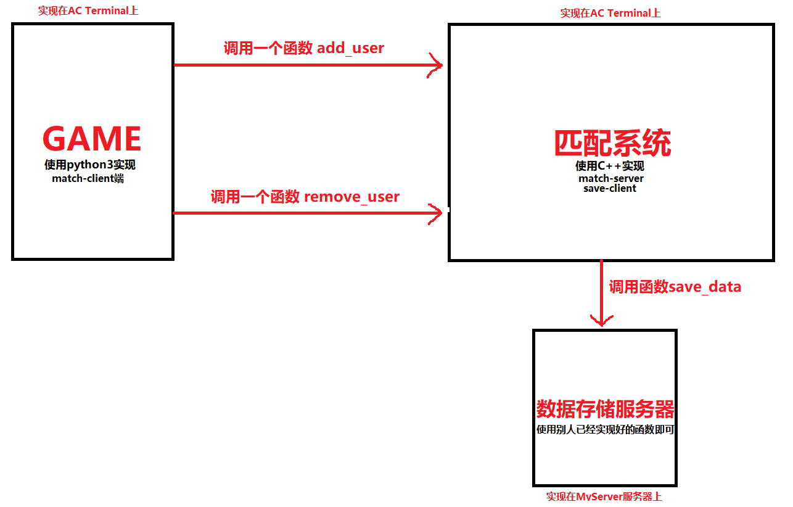 

**分析图示内容：**
- 这个游戏的功能可能运行在一个或多个服务器(或进程)上，而thrift就是将不同服务器不同语言的功能连接起来。
- 图中的三个节点(功能)是完全独立的，既可以在同一个服务器上，也可以在不同服务器上。
- 每一个节点就是一个进程，每个进程可以使用不同的语言来实现。

具体来讲：
- 在GAME节点上实现客户端通过调用匹配系统的服务端中实现的两个服务接口函数获取功能，实现跨语言跨服务的工作。
- 每个节点(功能)之间通过thrift定义的服务接口作为有向边进行连接。
弧尾所在的节点创建客户端，弧头所在的节点创建服务端。
- 匹配系统节点实现服务端，其中有一个匹配池：不断的接收玩家和删除玩家，同时根据一定的规则给每个玩家安排一局游戏。
- 匹配系统节点实现客户端，通过调用数据存储节点的服务端中实现的一个服务接口函数获取功能，实现跨语言跨服务的工作。
- 每个功能(节点)之间通过thrift定义的服务接口作为有向边进行连接。
  - 弧尾所在的节点创建客户端，弧头所在的节点创建服务端。
- 数据存储节点实现服务端。别人已经将服务接口和服务端实现好了。
- 服务接口功能介绍:
  - `add_user`：向匹配池中添加玩家。
  - `remove_user`：从匹配池中删除玩家。
  - `save_data`：将匹配信息存储起来。

**补充：**
- 有向边也称弧,边的始点称为弧尾，终点称为弧头。
- 当做项目时，可能有人已经将服务接口实现好了，即将服务端实现了，我们只需要创建客户端即可。

### 分析总结
在实现服务之前，最好先画个图分析，这样目标明确、思路清晰。

**图中的要素**

1. 不同服务作为节点
2. 每个服务是在哪个服务器上实现的
3. 每个服务通过什么语言实现
4. 服务之间通过怎样的服务接口进行连接。
5. 通过业务逻辑确认每个服务需要创建哪些服务端和客户端。

---
## 实现一个游戏的匹配服务
这里为了方便我们需要创建两个文件夹表示game节点(game)和匹配服务节点(match_system)，其实也可以放在不同的服务器上，不过条件不允许啊😉，而数据存储节点的服务端已经实现好了，只要调用服务接口实现的函数即可。

接下来创建一个thrift文件夹存储`.thrift`文件，`.thrift`文件定义服务接口。其中有两个`.thrift`文件分别表示两条有向边，一条有向边可以包含多个服务接口。

先定义服务接口。

定义添加玩家和删除玩家的两个接口。

在thrift文件夹中，创建`match.thrift`文件。然后进行接下来的内容。

---
### ①名字空间NameSpace

Thrift中的命名空间类似于C++中的`namespace`和java中的`package`，它们提供了一种组织（隔离）代码的简便方式。名字空间也可以用于解决类型定义中的名字冲突。

由于每种语言均有自己的命名空间定义方式（如:python中有`module`）, thrift允许开发者针对特定语言定义`namespace`。

简单的demo：

```thrift
namespace java com.xtxxtx.test
```

转换成

```java
package com.xtxxtx.test
```

**教程中的介绍:**

```
/**
 * Thrift files can namespace, package, or prefix their output in various
 * target languages.
 */

namespace cl tutorial
namespace cpp tutorial  
namespace d tutorial
namespace dart tutorial
namespace java tutorial
namespace php tutorial
namespace perl tutorial
namespace haxe tutorial
namespace netstd tutorial

// 匹配系统我们用 C++ 实现。
// 语法：namespace 使用的语言 空间名称
namespace cpp match_dao
```

---
### ②结构体struct
数据类型在结构体中定义。

`struct`有以下一些约束：

1. `struct`不能继承，但是可以嵌套，不能嵌套自己。(0.12.0版本可以支持嵌套自己本身)
2. 其成员都是有明确类型
3. 成员是被正整数编号过的，其中的编号使不能重复的，这个是为了在传输过程中编码使用。
4. 成员分割符可以是逗号（`,`）或是分号（`;`），而且可以混用
5. 字段会有`optional`和`required`之分和`protobuf`一样，但是如果不指定则为无类型–可以不填充该值，但是在序列化传输的时候也会序列化进去，`optional`是不填充则不序列化，`required`是必须填充也必须序列化。
6. 每个字段可以设置默认值
7. 同一文件可以定义多个`struct`，也可以定义在不同的文件，进行`include`引入。

**教程中介绍:**

```thrift
/**
 * Structs are the basic complex data structures. They are comprised of fields
 * which each have an integer identifier, a type, a symbolic name, and an
 * optional default value.
 *
 * Fields can be declared "optional", which ensures they will not be included
 * in the serialized output if they aren't set.  Note that this requires some
 * manual management in some languages.
 */
 
struct Work {
  1: i32 num1 = 0, // 默认值
  2: i32 num2, // 默认字段类型是 optional
  3: Operation op,
  4: optional string comment,
  5: required string name, // 本字段必须填充
}

// 这里我们定义结构体用来存储用户信息。其中 i32 表示 int ， string 表示字符串。
struct User {
    1: i32 id,
    2: string name,
    3: i32 score,
}
```

规则：

- 如果`required`标识的域没有赋值，Thrift将给予提示；
- 如果`optional`标识的域没有赋值，该域将不会被序列化传输；
- 如果某个`optional`标识域有缺省值而用户没有重新赋值，则该域的值一直为缺省值；
- 如果某个`optional`标识域有缺省值或者用户已经重新赋值，而不设置它的`__isset`为`true`，也不会被序列化传输。

---
### ③ 服务定义类型Service
服务的定义方法在语义上等同于面向对象语言中的接口。比如java中的接口，只是参数需要加上编号。

**教程中介绍:**
```thrift
/**
 * Ahh, now onto the cool part, defining a service. Services just need a name
 * and can optionally inherit from another service using the extends keyword.
 */
service Calculator extends shared.SharedService {

  /**
   * A method definition looks like C code. It has a return type, arguments,
   * and optionally a list of exceptions that it may throw. Note that argument
   * lists and exception lists are specified using the exact same syntax as
   * field lists in struct or exception definitions.
   */

   void ping(),

   i32 add(1:i32 num1, 2:i32 num2),

   i32 calculate(1:i32 logid, 2:Work w) throws (1:InvalidOperation ouch),

   /**
    * This method has a oneway modifier. That means the client only makes
    * a request and does not listen for any response at all. Oneway methods
    * must be void.
    */
   oneway void zip()

}

/**
  * 我们需要定义两个接口方法：`add_user()`, `remove_user()`
  * 其中`2: string info`表示额外信息。
  * 作用：以后想要更改接口时，不用更改接口，你可以直接将想传的信息传入到`info`中，
  * 然后对`info`进行序列化一个 `json` 即可。
  */
service Match {
    i32 add_user(1: User user, 2: string info),

    i32 remove_user(1: User user, 2: string info),
}
```

---
### ④ 定义服务接口之后，先实现match-server
**如何通过接口生成C++版本的服务端?**

```bash
# 通过这个命令就可以实现，不过在此之前需要做一些准备工作。
# tutorial.thrift表示从当前目录到定义接口的路径。
thrift -r --gen cpp tutorial.thrift
```

具体操作如图所示:

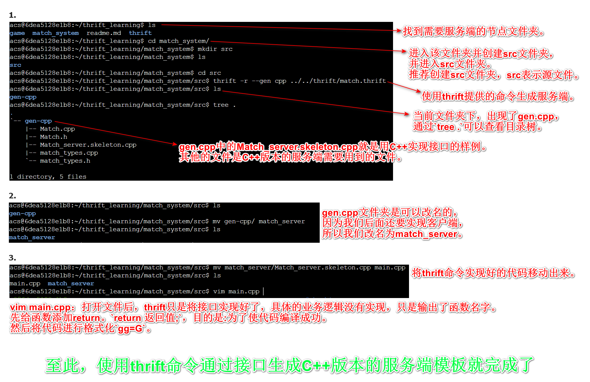 

- 做到这里我们发现：有了接口之后，通过命令就可以生成C++版本的服务端相关的代码。但是具体业务我们还是需要具体写哦!
- $\color{red}{经验：先编译成功，然后再逐步向文件中添加模块。}$

---
### ⑤ 如何编译thrift生成的C++代码?
因为 thrift 由`C++`编写，所以编译的过程与`C++`一样。

本质就是编译一堆`C++`源文件(.cpp)。

$\color{green}{C++编译过程:}$

$\color{red}{①编译}$

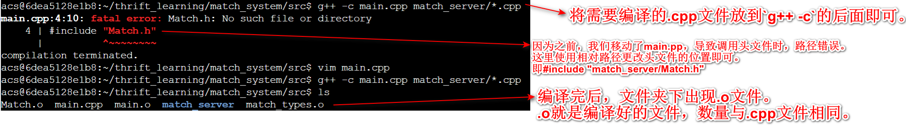 

$\color{red}{②链接}$

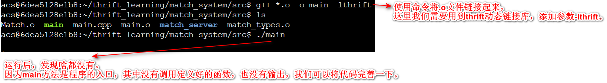 

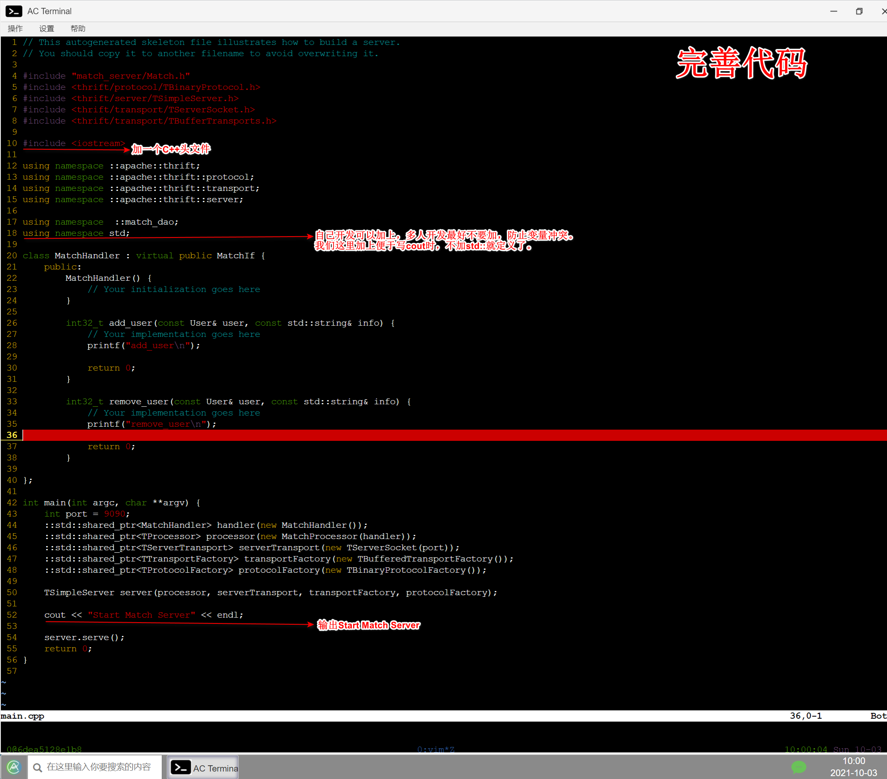 

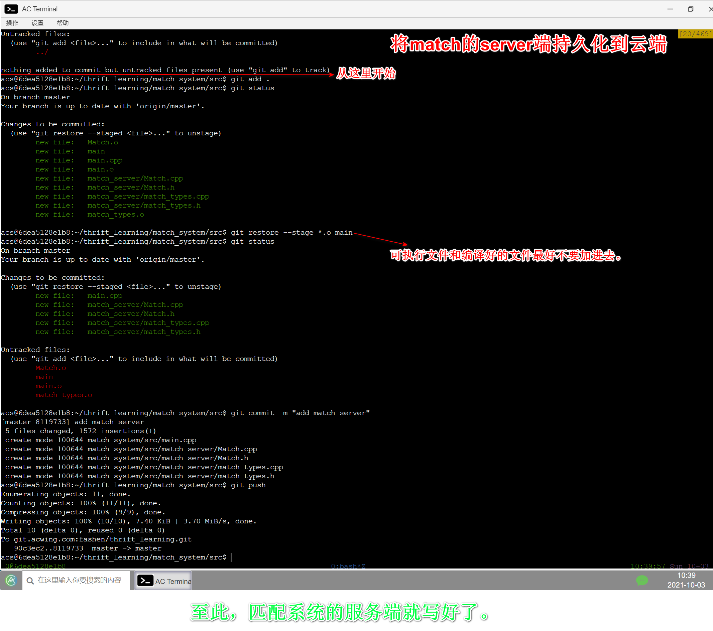 

- 好习惯：可执行文件和编译好的文件最好不要加进去，只加`.cpp`和`.h`文件。

C++编译很慢，链接很快。所以每次修改项目，重新编译时，只需要编译修改过的`.cpp`文件即可，防止编译时间过长。
即修改哪个文件就编译哪个文件。

基于这一点考虑就有了`make`和`cmake`工具。但没啥用。

```bash
# 前面加上 time 查看编译和链接的时间。
time g++ -c .cpp文件
time g++ -o .o文件 -lthrift -pthread
```

---
### ⑥ 实现match-client
```bash
# 使用该命令创建python版本的服务端，然后通过修改得到客户端。
# 这个命令python2和python3是兼容的。
thrift -r --gen py tutorial.thrift
```

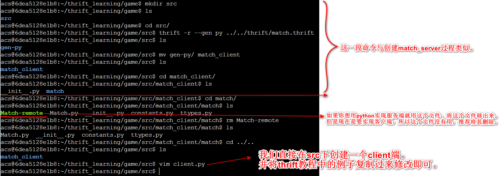

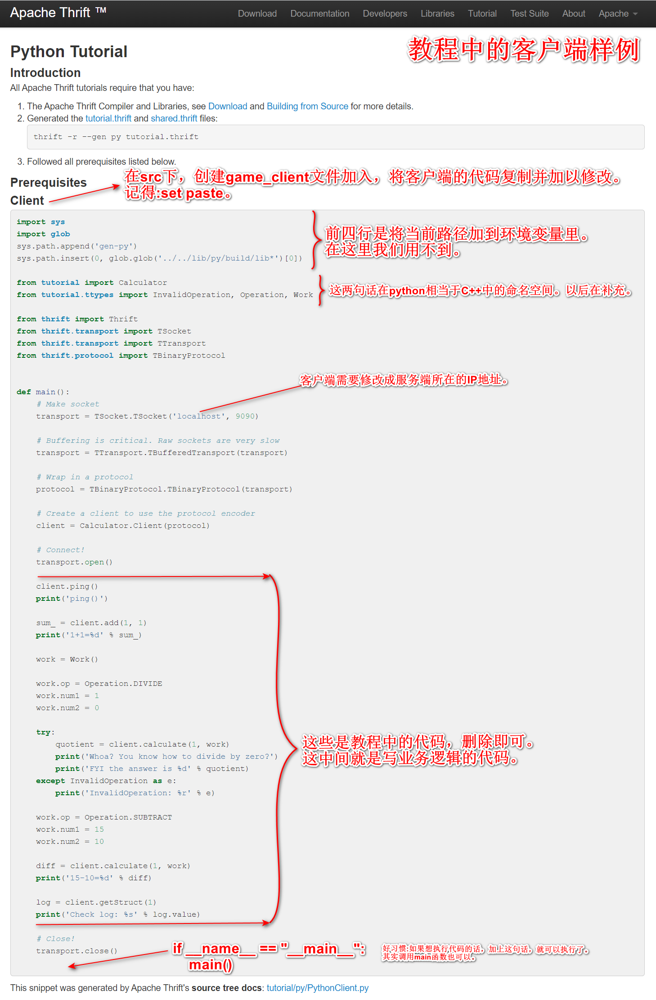

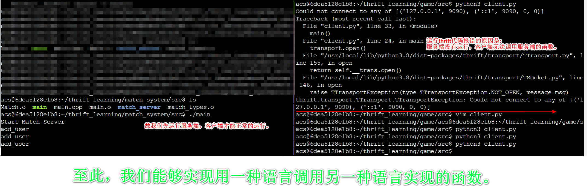

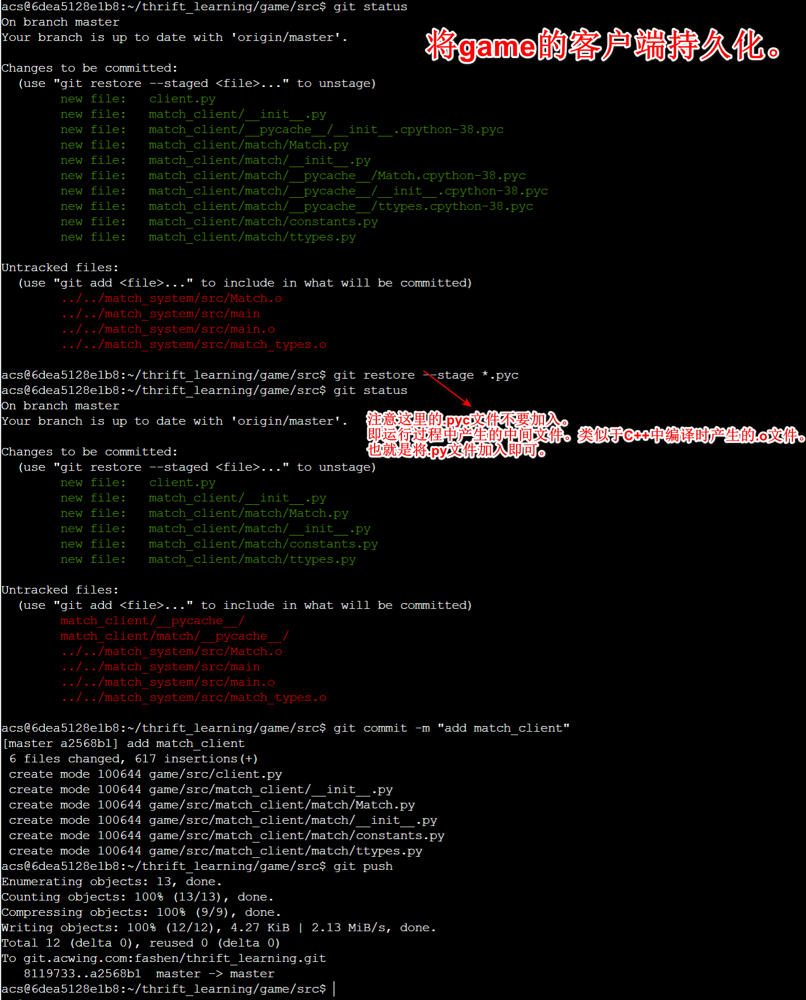 

$\color{red}{每完成一个客户(服务)端时，推荐使用git进行持久化。}$

---
> 现在client端还不是很方便。因为每次都需要运行一下代码，而且代码是写死的。

### ⑦ 将match-client的代码改成从标准输入中获取信息

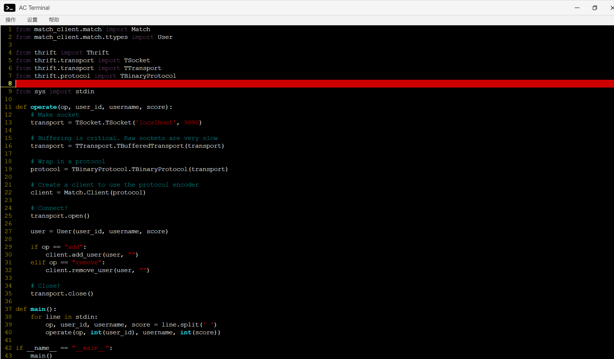 

至此， game 的 client 端就完成了。最后将其持久化作为最终版。

---
> 写server端需要分析业务模型。

需要进行监控，支持增加用户和删除用户。同时还要有一个线程去不停地进行匹配。

这个时候，我们发现需要实现两个功能，添加删除用户和匹配用户，根据微服务的概念需要开两个进程实现两个功能。

### ⑧ 完善match-server
完善server端需要并利用`C++`实现多线程。y总视频定位：[55:30](https://www.acwing.com/video/3479/)

项目代码中有注解。

编译C++时，如果你用到了线程，需要加上线程的动态链接库的参数`-pthread`。

`-lthrift`参数将所有thrift动态连接文件连接起来。

```bash
g++ *.o -o main -lthrift -pthread
```

---
### ⑨ 实现save_client
因为一个节点(功能)只能由一个`main`方法作为程序的入口，所以匹配系统中的客户端和服务端写在同一个`main`方法中。我们这里根据逻辑将其实现在一个函数中。

- 注意：复制教程中的代码时，一些细节需要更改。例如其中带`Calculator`的字段都需要更改。
- 一些`thrift`接口和服务端有人会帮我们实现，这时我们只需调用接口实现的函数即可。例如这里使用已经实现好的`save_data()`接口。

---
> 我们现在的匹配系统是傻瓜式匹配，从队头逮到两个人就匹配成功，所以需要制定一些规则进行升级。

这里我们指定分差50以内的进行匹配。

### ⑩ 升级match-server

---
> 一个线程处理输入输出，如果以后要处理并发量时，需要开多个线程处理。

### ⑪ 将thrift的单独Server模式改成多线程Server模式

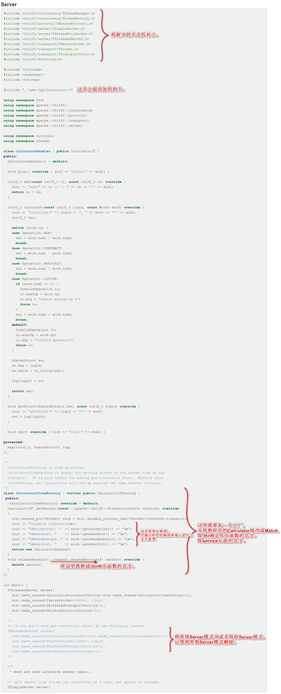 

---
### ⑫ 添加match-server的规则

匹配机制：等待时间越长，阈值越大。即匹配的范围随时间的推移而变大

故需要记录当前玩家在匹配池中等待的秒数。

至此，游戏的匹配服务就全部完成了。

---

---

---

# 知识点:
## [C 头文件](https://www.runoob.com/cprogramming/c-header-files.html) 
C 语言中 include <> 与include "" 的区别?
`#include < >`:引用的是编译器的类库路径里面的头文件。
`#include " "`:引用的是你程序目录的相对路径中的头文件，如果在程序目录没有找到引用的头文件则到编译器的类库路径的目录下找该头文件。

## [using namespace std的作用](https://baike.baidu.com/item/using%20namespace%20std/10360651?fr=aladdin)

C++标准程序库中的所有标识符都被定义于一个名为std的namespace中。 由于namespace的概念，使用C++标准程序库的任何标识符时，可以有三种选择，具体看百度百科。

但是如果加上这段代码，就不用前缀。

比如:
- `std::cout << std::endl;`加上using namespace std后，就可以写成这样`cout << endl`。
- `std::ios::sync_with_stdio(false);`加上using namespace std后，就可以写成这样`ios::sync_with_stdio(false);`。(想了解[ios::sync_with_stdio(false);](https://blog.csdn.net/weixin_51333606/article/details/116738816) 用法开这篇文章)

## localhost，127.0.0.1 和 本机IP 三者的区别

## [端口](https://baike.baidu.com/item/%E7%AB%AF%E5%8F%A3/103505?fr=aladdin)

如果把IP地址比作一间房子 ，端口就是出入这间房子的门。真正的房子只有几个门，但是一个IP地址的端口可以有65536（即：2^16）个之多！端口是通过端口号来标记的，端口号只有整数，范围是从0 到65535（2^16-1）。

同一个端口只能由一个进程来监听。所以我们一旦启动了一个服务，那么这个服务就不能在被另一个进程启动了。

服务器的端口号要与客户端的端口号相同。

---
> 每执行一个程序就是开了一个进程。每一个进程可以开一堆线程。

开多线程的开销是很小的，开多进程的开销是很大的。

## `#include <thread>`

C++中有一个thread的库，可以用来开线程。

通过定义一个变量将函数名作为参数，就能开一个线程了。

首先定义线程的操作。

并行中经典的生产者和消费者模型。

生产者、消费者是两个线程。

生产者:`add_user()`、`remove_user()`

消费者:匹配用户的功能。

生产者和消费者之间需要一个媒介。

这个媒介可以有很多种方法。比如:消费队列。

很多语言都有自己实现的消费队列，也可以自己实现消费队列。

实现消费队列，就需要用到一些锁(`mutex`)。

并行编程的基本概念:锁。

---
## 互斥锁
在编程中，引入了对象互斥锁的概念，来保证共享数据操作的完整性。每个对象都对应于一个可称为" 互斥锁" 的标记，这个标记用来保证在任一时刻，只能有一个线程访问该对象。

锁🔒有两个操作。一个`P`操作(上锁)，一个`V`操作(解锁)。

定义互斥锁:`mutex m`;

锁一般使用信号量来实现的，`mutex`其实就是一个信号量(它特殊也叫互斥量)。互斥量就是同一时间能够分给一个人，即`S=1`。

信号量S：`S=10`表示可以将信号量分给`10`个人来用。

P操作的主要动作是: 
- ①S减1； 
- ②若S减1后仍大于或等于0，则进程继续执行；  
- ③若S减1后小于0，则该进程被阻塞后放入等待该信号量的等待队列中，然后转进程调度。

V操作的主要动作是：
- ①S加1； 
- ②若相加后结果大于0，则进程继续执行； 
- ③若相加后结果小于或等于0，则从该信号的等待队列中释放一个等待进程，然后再返回原进程继续执行或转进程调度。

对于P和V都是原子操作，就是在执行P和V操作时，不会被插队。从而实现对共享变量操作的原子性。

特殊：`S=1`表示互斥量，表示同一时间，信号量只能分配给一个线程。

多线程为啥要用锁? 因为多线程可能共享一个内存空间，导致出现重复读取并修改的现象。

---
## #include <condition_variable>

---
## C++中类的定义

---
## vector的size()是无符号整数类型。

---
## vector的erase()是左闭右开。

---
## 求一个字符串的md5值。
输入命令`"md5sum"`，输入字符串回车然后`Ctrl + d`就行了。

md5加密

---
> 随着学习的深入，用到英语的地方越来越多，很多技术都是外国实现，中国的计算机技术还需要我辈去完善创新。
先从英语开始吧。每篇一记。

## 英语知识
- IDL：接口定义语言（Interface Definition Language）
- RPC：远程过程调用（Remote Procedure Call）
- client：客户，客户端

<font face="楷书" color=red>最后说一句，会了英语学编程真香，不说了，我去学英语了。</font>
