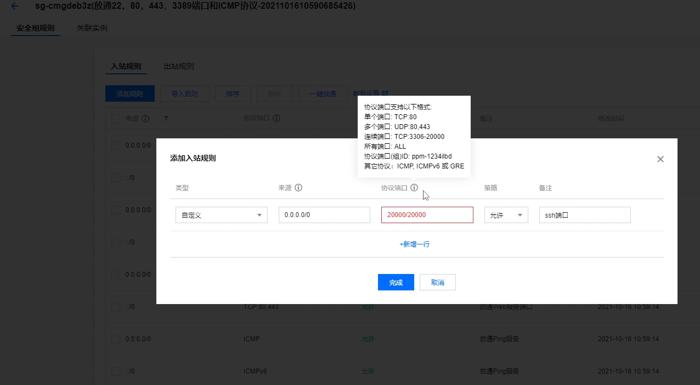
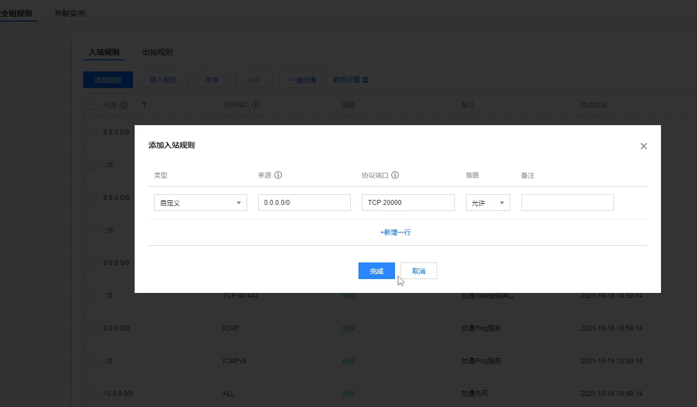

# 第八讲 租云服务器及配环境

- 作者：yxc
- 链接：https://www.acwing.com/file_system/file/content/whole/index/content/3074146/
- 来源：AcWing
- 著作权归作者所有。商业转载请联系作者获得授权，非商业转载请注明出处。

<!-- @import "[TOC]" {cmd="toc" depthFrom=3 depthTo=3 orderedList=false} -->

<!-- code_chunk_output -->

- [概述](#概述)
- [阿里云](#阿里云)
- [腾讯云](#腾讯云)
- [华为云](#华为云)
- [docker教程](#docker教程)
- [作业](#作业)

<!-- /code_chunk_output -->

细分目录：

<!-- @import "[TOC]" {cmd="toc" depthFrom=3 depthTo=4 orderedList=false} -->

<!-- code_chunk_output -->

- [概述](#概述)
- [阿里云](#阿里云)
- [腾讯云](#腾讯云)
- [华为云](#华为云)
- [docker教程](#docker教程)
  - [将当前用户添加到`docker`用户组](#将当前用户添加到docker用户组)
  - [镜像（images）](#镜像images)
  - [容器(container)](#容器container)
  - [docker实战](#docker实战)
  - [小Tips](#小tips)
- [作业](#作业)
  - [作业0：租服务器](#作业0租服务器)
  - [作业1：安装docker](#作业1安装docker)
  - [作业2：部署docker镜像，开放端口](#作业2部署docker镜像开放端口)

<!-- /code_chunk_output -->

### 概述

云平台的作用:
- 存放我们的docker容器，让计算跑在云端。
- 获得公网IP地址，让每个人可以访问到我们的服务。

任选一个云平台即可，推荐配置：
- 1核 2GB（后期可以动态扩容，前期配置低一些没关系）
网络带宽采用按量付费，最大带宽拉满即可（费用取决于用量，与最大带宽无关）
- 系统版本：ubuntu 20.04 LTS（推荐用统一版本，避免后期出现配置不兼容的问题）

`docker`安装教程地址：https://docs.docker.com/engine/install/ubuntu/

### 阿里云

地址：https://www.aliyun.com/

登录到租好的服务器。打开`Terminal`，然后：

```bash
ssh root@xxx.xxx.xxx.xxx
```

创建acs用户：

```bash
adduser acs  # 创建用户acs
usermod -aG sudo acs  # 给用户acs分配sudo权限
```

退回`Terminal`，然后配置`acs`用户的别名和免密登录，可以参考[ssh登录笔记](./04.md)。

将`Terminal`的配置传到租的服务器上：

```bash
scp .bashrc .vimrc .tmux.conf server_name:  # server_name需要换成自己配置的别名
```

然后登录自己的服务器，登录后安装`tmux`：

```bash
sudo apt-get update
sudo apt-get install tmux
```

然后打开`tmux`。（养成好习惯，所有工作都在`tmux`里进行，防止意外关闭终端后，工作进度丢失）

然后根据`docker`安装教程安装`docker`即可。

### 腾讯云

地址：https://cloud.tencent.com/

登录到租好的服务器。打开`Terminal`，然后：

```bash
ssh ubuntu@xxx.xxx.xxx.xxx  # 注意腾讯云登录的用户不是root，而是ubuntu
```

### 华为云

地址：https://www.huaweicloud.com/

登录到租好的服务器。打开`Terminal`，然后：

```bash
ssh root@xxx.xxx.xxx.xxx
```

### docker教程

#### 将当前用户添加到`docker`用户组

为了避免每次使用`docker`命令都需要加上`sudo`权限，可以将当前用户加入安装中自动创建的`docker`用户组(可以参考[官方文档](https://docs.docker.com/engine/install/linux-postinstall/))：

```bash
sudo usermod -aG docker $USER
```

#### 镜像（images）

- `docker pull ubuntu:20.04`：拉取一个镜像
- `docker images`：列出本地所有镜像
- `docker image rm ubuntu:20.04` 或 `docker rmi ubuntu:20.04`：删除镜像`ubuntu:20.04`
- `docker [container] commit CONTAINER IMAGE_NAME:TAG`：创建某个`container`的镜像
- `docker save -o ubuntu_20_04.tar ubuntu:20.04`：将镜像`ubuntu:20.04`导出到本地文件`ubuntu_20_04.tar`中
- `docker load -i ubuntu_20_04.tar`：将镜像`ubuntu:20.04`从本地文件`ubuntu_20_04.tar`中加载出来

#### 容器(container)

- `docker [container] create -it ubuntu:20.04`：利用镜像ubuntu:20.04创建一个容器。
- `docker ps -a`：查看本地的所有容器
- `docker [container] start CONTAINER`：启动容器
- `docker [container] stop CONTAINER`：停止容器
- `docker [container] restart CONTAINER`：重启容器
- `docker [contaienr] run -itd ubuntu:20.04`：创建并启动一个容器
- `docker [container] attach CONTAINER`：进入容器
- 先按`Ctrl-p`，再按`Ctrl-q`可以挂起容器
- `docker [container] exec CONTAINER COMMAND`：在容器中执行命令
- `docker [container] rm CONTAINER`：删除容器
- `docker container prune`：删除所有已停止的容器
- `docker export -o xxx.tar CONTAINER`：将容器`CONTAINER`导出到本地文件`xxx.tar`中
- `docker import xxx.tar image_name:tag`：将本地文件`xxx.tar`导入成镜像，并将镜像命名为`image_name:tag`
- `docker export/import`与`docker save/load`的区别：
  - `export/import`会丢弃历史记录和元数据信息，仅保存容器当时的快照状态
  - `save/load`会保存完整记录，体积更大
- `docker top CONTAINER`：查看某个容器内的所有进程
- `docker stats`：查看所有容器的统计信息，包括CPU、内存、存储、网络等信息
- `docker cp xxx CONTAINER:xxx` 或 `docker cp CONTAINER:xxx xxx`：在本地和容器间复制文件
- `docker rename CONTAINER1 CONTAINER2`：重命名容器
- `docker update CONTAINER --memory 500MB`：修改容器限制

#### docker实战

进入`Terminal`，然后：

```bash
scp /var/lib/acwing/docker/images/docker_lesson_1_0.tar server_name:  # 将镜像上传到自己租的云端服务器
ssh server_name  # 登录自己的云端服务器

docker load -i docker_lesson_1_0.tar  # 将镜像加载到本地
docker run -p 20000:22 --name my_docker_server -itd docker_lesson:1.0  # 创建并运行docker_lesson:1.0镜像

docker attach my_docker_server  # 进入创建的docker容器
passwd  # 设置root密码
```

去云平台控制台中修改安全组配置，放行端口`20000`。

> 如何放行端口呢？以腾讯云为例，设置服务器的 **安全组** 。





返回`Terminal`，即可通过`ssh`登录自己的`docker`容器：

```bash
ssh root@xxx.xxx.xxx.xxx -p 20000  # 将xxx.xxx.xxx.xxx替换成自己租的服务器的IP地址
```

然后，可以仿照上节课内容，创建工作账户`acs`。


最后，可以参考[ssh——ssh登录](./04.md)配置`docker`容器的别名和免密登录。

#### 小Tips

如果`apt-get`下载软件速度较慢，可以参考[清华大学开源软件镜像站](https://mirrors.tuna.tsinghua.edu.cn/help/ubuntu/)中的内容，修改软件源。

### 作业

注意： 本次作业的2个题目不是独立的，每个题目会依赖于前一个题目，因此评测时如果当前题目错误，则不再评测后续题目。

创建好作业后，先进入文件夹`/home/acs/homework/lesson_8/`，然后：

(0) 进入`homework_0`文件夹，然后：
- [1] 租一台云服务器
- [2] 配置服务器别名及免密登录
- [3] 将服务器别名写在当前目录下的`server_name.txt`文件中

(1) 进入`homework_1`文件夹，然后：
- [1] 在租好的云服务器中安装`docker`

(2) 进入`homework_2`文件夹，然后：
- [1] 将`Terminal`中的`/var/lib/acwing/docker/images/docker_lesson_1_0.tar`镜像上传到租好的服务器中
- [2] 登录到租好的服务器
- [3] 将上传的镜像提取出来
- [4] 创建该镜像的容器，设置端口映射：`20000:22`。（把本地的 20000 端口映射到 22 端口）
- [5] 去云平台控制台中修改安全组配置，放行端口`20000`。
- [6] 进入该容器，创建新账户`acs`
- [7] 返回`Terminal`。配置容器中`acs`账户的别名及免密登录。
- [8] 将别名写在当前目录下的`server_name.txt`文件中

#### 作业0：租服务器

租服务器的操作步骤[腾讯云](#腾讯云)。

```bash
cd homework/lesson_8/homework_0
echo tencent_v1 > server_name.txt
```

#### 作业1：安装docker

```bash
tmux  # 好习惯，进入tmux

sudo apt-get update

sudo apt-get install \
    apt-transport-https \
    ca-certificates \
    curl \
    gnupg \
    lsb-release

curl -fsSL https://download.docker.com/linux/ubuntu/gpg | sudo gpg --dearmor -o /usr/share/keyrings/docker-archive-keyring.gpg

echo \
"deb [arch=$(dpkg --print-architecture) signed-by=/usr/share/keyrings/docker-archive-keyring.gpg] https://download.docker.com/linux/ubuntu \
$(lsb_release -cs) stable" | sudo tee /etc/apt/sources.list.d/docker.list > /dev/null

sudo apt-get update

sudo apt-get install docker-ce docker-ce-cli containerd.io
```

最后一步在腾讯云上是真滴慢，装了清华源，`sudo apt-get update/upgrade` 都搞了，终于是没报网络握手握不上的错误，慢慢悠悠装完了。

#### 作业2：部署docker镜像，开放端口

```bash
scp /var/lib/acwing/docker/images/docker_lesson_1_0.tar tencent_v1:  # 将镜像上传到自己租的云端服务器
ssh server_name  # 登录自己的云端服务器

sudo docker load -i docker_lesson_1_0.tar  # 将镜像加载到本地
sudo docker run -p 20000:22 --name my_docker_server -itd docker_lesson:1.0  # 创建并运行docker_lesson:1.0镜像

# 去云平台放开20000端口

sudo docker attach my_docker_server  # 进入创建的docker容器
adduser acs

Ctrl-p
Ctrl-q  # 挂起容器
```

我这里需要在 `docker` 命令前加 `sudo` 。

> 现在我们相当于又有了一个服务器，可以通过 `ssh acs@地址:20000` 来访问

退回`AC Terminal`，配置别名和免密登录（对于`~/.ssh/config`再多加一条，只不过这回需要额外指出`Port`）。

```bash
cd homework/lesson_8/homework_2
echo tencent_v1_docker > server_name.txt  # tencent_v1_docker 是我 tencent_v1 中 docker 容器
```
