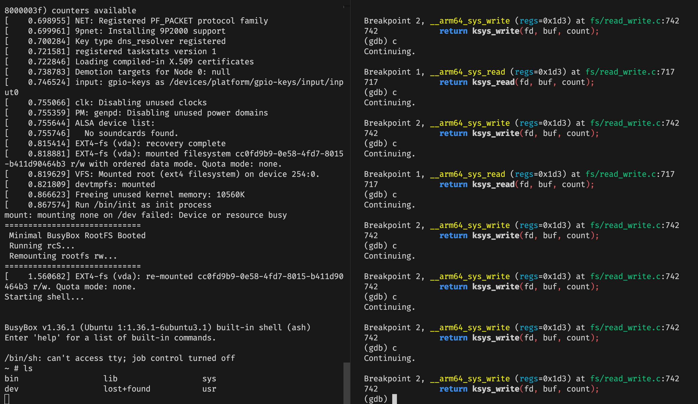
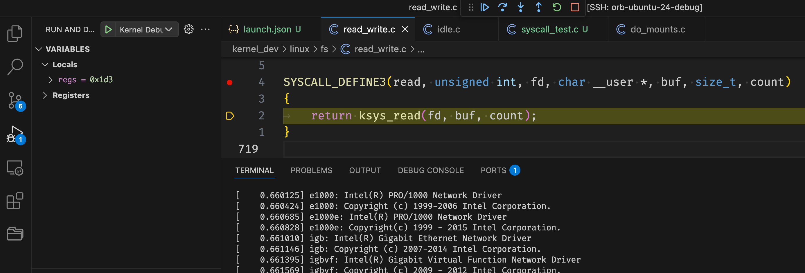

# 如何在 Mac M1 Pro 上 debug Linux Kernel | 基于 Ubuntu 24 工具链和 QEMU

在 MacOS 上直接编译 Linux Kernel 在我看来并不是一个很好的选择：
- 我不喜欢 MacOS 的第三方包管理工具 `brew`
- 我不希望在没有隔离的情况下安装一堆我不了解的工具

或者说，在 Ubuntu 上调试 Linux Kernel 才是一个更诱人的选择：
- `apt` 生态很好
- 基于 Ubuntu gcc 工具链编译 Linux Kernel 社区讨论更多，支持更完善

于是问题就变成了从哪找一台 Ubuntu ？
- 在云服务商那里以白嫖价格搞来的机器太小，大机器又觉得不值当
- 又不想白白浪费 Mac M1 Pro 的性能

[OrbStack](https://orbstack.dev/) 是一个非常好的选择。

> OrbStack is the fast, light, and easy way to run Docker containers and Linux. Develop at lightspeed with our Docker Desktop alternative.

OrbStack 是专用于 Mac 上的环境隔离工具：
- 可以无缝衔接 `docker` 命令，也可以直接创建 `linux` 虚拟机
- 其开销非常小，目前个人版是免费的
- 还有许多其他极其实用的功能，比如可以直接以 `ssh` 的形式进入虚拟机，带来类似远程开发的体验，也方便 VSCode 这类工具连接环境

下面是本文的脉络：
- 初始化 Ubuntu 开发环境
- 编译 Linux Kernel
- 基于 busybox 制作 root fs
- 启动 QEMU
- gdb 连接
- VS Code 连接

### 初始化 Ubuntu 开发环境

首先在我们的 Mac OS 上基于 OrbStack 创建 Linux 虚拟机。

```bash
✗ orb version
Version: 1.10.3 (1100300)
Commit: 2b5dd5f580d80a3d2494b7b40dde2ef46813cfc5 (v1.10.3)
✗ orb create  ubuntu:24.04 ubuntu-24-debug
```

创建地飞快。

进入虚拟机： `ssh ubuntu-24-debug@orb` 。接下来我们所有的命令都是在虚拟机中操作的。

```bash
# 先看看我们的版本
uname -a
Linux ubuntu-24-debug 6.13.7-orbstack-00283-g9d1400e7e9c6 #104 SMP Mon Mar 17 06:15:48 UTC 2025 aarch64 aarch64 aarch64 GNU/Linux

# 创建我们的 WorkDir ，下载 Linux Kernel
mkdir -p ~/debug-linux-kernel-on-qemu/kernel_dev
cd ~/debug-linux-kernel-on-qemu/kernel_dev
git clone git://git.kernel.org/pub/scm/linux/kernel/git/torvalds/linux.git

# 我们选择和 Ubuntu 一致的 6.13 版本
cd linux
git checkout v6.13
```

上面下载 linux kernel 基本是最慢的一步了。如果你的网速实在不给力，可以只下载特定的 tag 并且制定下 `max-depth` 。

接下来开始安装需要用到的工具：

```bash
sudo apt update

sudo apt install -y build-essential flex bison libssl-dev libelf-dev libncurses-dev \
                    qemu-system-aarch64 gdb dwarves busybox-static e2fsprogs bc
```

这些工具的作用分别是：
- `build-essential`: 包含编译 C/C++ 程序所需的基础工具集，如 `gcc`, `g++`, `make` 等，是编译内核的前提。
- `flex`, `bison`: 分别是词法分析器和语法分析器的生成器，内核的构建过程依赖它们来处理 Kconfig 文件和代码中的某些部分。
- `libssl-dev`: 提供 OpenSSL 库的开发文件（头文件和库），内核编译时需要用到其中的加密和证书相关功能。
- `libelf-dev`: 提供操作 ELF (Executable and Linkable Format) 文件的库和头文件，内核编译和后续生成调试信息时需要。
- `libncurses-dev`: 提供 `ncurses` 库的开发文件，用于支持基于文本的图形界面，比如 `make menuconfig`。
- `bc`: 一个基础的命令行计算器，内核构建脚本中有时会用到它进行计算。
- `qemu-system-aarch64`: QEMU 模拟器，专门用于模拟 ARM64 (aarch64) 架构的完整系统。我们将用它来运行我们编译的内核。
- `gdb`: 大名鼎鼎的 GNU 调试器（GNU Debugger），是我们用来调试内核的主要工具。
- `dwarves`: 包含 `pahole` 等工具，用于读取和分析 DWARF 调试信息。内核编译时可能需要 `pahole` 来生成 BTF (BPF Type Format) 信息，这对于 eBPF 开发和一些现代调试技术很有帮助。
- `busybox-static`: 一个包含了许多标准 Unix 工具（如 `ls`, `cat`, `mount`, `sh` 等）的单个可执行文件。这里的 `static` 版本表示它是静态链接的，不依赖外部共享库，非常适合用来构建一个最小化的根文件系统（root filesystem）。
- `e2fsprogs`: 包含用于创建、检查和维护 ext2/ext3/ext4 文件系统的工具集，比如我们后面会用到的 `mkfs.ext4`。

### 编译 Linux Kernel

编译 Linux Kernel 过程也较为简单，唯一麻烦的就是配置。

```bash
cd ~/debug-linux-kernel-on-qemu/kernel_dev/linux
make ARCH=arm64 defconfig
make ARCH=arm64 menuconfig
```

这里的 `menuconfig` 会让 console 变成可交互界面：
- 使用方向键进行移动
- 使用回车键进入子菜单，空格键选中/取消选中
- 这个 `make ARCH=arm64 menuconfig` 的核心目的是帮你修改内核配置文件 `.config`

为了方便后续调试，我们需要调整以下几个配置选项（如果找不到具体选项，可以在 `menuconfig` 界面中按 `/` 键，然后输入配置项名称，如 `CONFIG_DEBUG_INFO` 来搜索）：

- **启用调试信息:**
    - 进入 `Kernel hacking` ---> `Compile-time checks and compiler options` --->
    - 确保 `Compile the kernel with debug info` 选项被选中（显示为 `[*]`）。如果未选中（显示为 `[ ]`），按空格键切换。这将启用 `CONFIG_DEBUG_INFO=y`，让编译器在编译内核时加入 DWARF 调试符号。
    - 在同一菜单下，确保 `Provide GDB scripts for kernel debugging` 选项也被选中（`[*]`）。这将启用 `CONFIG_GDB_SCRIPTS=y`，会生成一些辅助 GDB 调试的脚本。
- **禁用 KASLR (可选但强烈推荐):**
    - 返回到 `Kernel hacking` 菜单 ---> （可能需要先退回主菜单再进入） `Processor type and features` --->
    - 找到 `Randomize the address of the kernel image (KASLR)` 选项，按空格键取消选中（确保显示为 `[ ]`）。这将设置 `CONFIG_RANDOMIZE_BASE=n`，禁用内核地址空间布局随机化（Kernel Address Space Layout Randomization, KASLR）。禁用 KASLR 后，内核每次加载到内存的基地址都是固定的，这极大地简化了在 GDB 中设置早期断点和理解内存地址的过程。
- **确保 Virtio 控制台支持:**
    - 进入 `Device Drivers` ---> `Character devices` ---> `Virtual terminal` --->
    - 确保 `Virtio console support` 被选中（显示为 `<*>` 表示编译进内核，或 `<M>` 表示编译为模块）。通常 `defconfig` 会默认选中。这是为了让内核能够通过 QEMU 的 `virtio` 串口设备 (`ttyAMA0`) 输出信息。

完成以上修改后，使用方向键移动光标到屏幕底部的 `< Save >`，按回车键确认保存配置（默认会保存到 `.config` 文件），然后反复选择 `< Exit >` 退出 `menuconfig`。

操作后记得检查 `.config` 文件中是否符合你的预期：比如看看 `CONFIG_DEBUG_INFO=y`、 `CONFIG_GDB_SCRIPTS=y` 和 `CONFIG_RANDOMIZE_BASE=n` 是否存在且设置正确。

开始编译：

```bash
make ARCH=arm64 -j8
```

这里的 `-j8` 表示使用 8 个线程并行编译，你可以根据自己机器的 CPU 核心数调整。速度非常快，我这里大概花了 10 分钟。并且在编译时一个 `WARNING` 都没有遇到，写过大型 C/C++ 项目的朋友知道这其实并不容易办到。

编译后我们会得到多个文件，对我们调试最重要的主要是两个：
- `vmlinux`: 位于内核源码根目录下。这是一个未经压缩、包含完整符号表和调试信息的 ELF 格式的内核可执行文件。`gdb` 需要加载这个文件来识别函数名、变量名、源代码行号等信息，是调试时必不可少的文件。
- `arch/arm64/boot/Image`: 这是一个经过压缩、去除了大部分调试信息、并且符合 ARM64 架构引导规范的内核镜像文件。QEMU（或真实的引导加载程序）实际加载并运行的是这个文件。它比 `vmlinux` 小得多，适合启动。

### 基于 busybox 制作 root fs

这一步是为 QEMU 虚拟机创建一个最小化的根文件系统 (root filesystem)，让内核启动后能找到基本的运行环境和 shell。这是我踩坑最久的一步。

**1. 创建临时目录和基本结构**

首先，我们需要一个临时目录来构建文件系统的内容，并在其中创建标准 Linux 目录结构。

```bash
# 回到主工作目录
cd ~/debug-linux-kernel-on-qemu

# 创建并进入 rootfs 构建目录
mkdir rootfs
cd rootfs

# 创建 Linux 基本目录结构
mkdir -p bin sbin etc proc sys dev lib usr/bin usr/sbin
```

这些目录是 Linux 系统运行所必需的，例如 `bin` 和 `sbin` 用于存放可执行命令，`etc` 用于存放配置文件，`proc` 和 `sys` 用于内核与用户空间交互，`dev` 用于存放设备文件。

**2. 引入 BusyBox**

`busybox` 将为我们的最小系统提供核心的用户态工具。

```bash
# 确认 busybox 是静态链接的（输出应包含 "statically linked"）
file /usr/bin/busybox
# /usr/bin/busybox: ELF 64-bit LSB executable, ARM aarch64, version 1 (GNU/Linux), statically linked, ... stripped

# 复制 busybox 到我们的 bin 目录
cp /usr/bin/busybox ./bin/busybox

# 使用 busybox --install 命令创建常用命令的符号链接
# -s 表示创建符号链接 (symbolic link)
./bin/busybox --install -s ./bin
```

执行 `busybox --install -s ./bin` 后，`./bin` 目录下会多出很多指向 `busybox` 的符号链接，例如 `ls`, `sh`, `mount`, `echo` 等。当内核启动后执行 `/bin/sh` 时，实际上是执行了 `busybox`，`busybox` 会根据被调用时的名称 (`sh`) 来模拟对应命令的行为。

**3. 修正 BusyBox 链接路径 (重要)**

默认的 `busybox --install` 创建的符号链接可能包含了绝对路径（如 `ash -> /path/to/rootfs/bin/busybox`）。当这个 `rootfs` 目录被制作成镜像并挂载到 QEMU 虚拟机内部时，这个绝对路径就不再有效了。我们需要的是相对链接（如 `ash -> busybox`）。

下面的脚本用于修正这个问题：

```bash
# 创建修正脚本
cat <<EOF > ../fix_busybox_path.sh
#!/bin/bash
# 进入我们 rootfs 的 bin 目录
cd ~/debug-linux-kernel-on-qemu/rootfs/bin || exit 1

echo "Fixing busybox symlinks in $(pwd)"

# 遍历 bin 目录下的所有文件/链接
for link in *; do
  # 只处理符号链接
  if [ -L "\$link" ]; then
    target=$(readlink "\$link")
    # 如果链接的目标是 busybox (可能是绝对路径或相对路径)
    if [[ "\$target" == *"busybox"* ]]; then
      # 如果链接名不是 busybox 本身
      if [ "\$link" != "busybox" ]; then
         echo "Relinking \$link -> busybox"
         # 删除旧链接
         rm -f "\$link"
         # 创建指向 busybox 的相对链接
         ln -sv busybox "\$link"
      fi
    fi
  fi
done

echo "Symlink fixing complete."
EOF

# 给脚本执行权限并运行
chmod +x ../fix_busybox_path.sh
bash ../fix_busybox_path.sh

# 回到 rootfs 目录
cd ~/debug-linux-kernel-on-qemu/rootfs
```

这个脚本会遍历 `bin` 目录下的所有符号链接，如果它们指向 `busybox`，就删除旧链接，然后创建一个新的、名为原链接名、指向 `busybox` 的相对符号链接。

**4. 创建初始化脚本 `init.d/rcS`**

内核启动后，会执行 `init` 进程（我们后面在 QEMU 参数中指定为 `/bin/init`，它会链接到 `busybox`）。`busybox init` 会寻找并执行 `/etc/init.d/rcS` 脚本来做一些系统初始化的工作。

```bash
# 创建 init.d 目录
mkdir -p etc/init.d

# 创建 rcS 文件
cat <<EOF > etc/init.d/rcS
#!/bin/sh

# 挂载必要的伪文件系统
echo "Mounting /proc, /sys, /dev..."
mount -t proc none /proc
mount -t sysfs none /sys
mount -t devtmpfs none /dev

# 打印一些启动信息
echo "============================="
echo " Minimal BusyBox RootFS Booted"
echo " Running rcS..."
echo " Remounting rootfs rw..."
echo "============================="

# 重新挂载根文件系统为可读写模式
# (虽然 QEMU append 参数里也加了 rw，但这里再确认一下)
mount -o remount,rw /

# 启动一个交互式 Shell
echo "Starting shell..."
exec /bin/sh
EOF

# 给 rcS 脚本添加执行权限
chmod +x etc/init.d/rcS
```

这个脚本主要做了几件事：
- 挂载 `/proc` (进程信息)、`/sys` (系统和设备信息)、`/dev` (设备节点) 这三个重要的虚拟文件系统。
- 重新挂载根文件系统为可读写模式 (`rw`)，允许我们在 shell 中进行修改。
- 最后通过 `exec /bin/sh` 启动一个 shell，提供用户交互界面。

**5. 创建 ext4 文件系统镜像并填充内容**

现在 `rootfs` 目录里已经有了最小系统所需的内容，我们需要把它打包成一个 QEMU 可以使用的磁盘镜像文件。

```bash
# 回到主工作目录
cd ~/debug-linux-kernel-on-qemu

# 使用 dd 创建一个 512MB 大小的空文件作为镜像文件
# bs=1M 表示块大小为 1MB, count=512 表示 512 个块
echo "Creating rootfs.img (512MB)..."
dd if=/dev/zero of=rootfs.img bs=1M count=512

# 在该镜像文件上创建 ext4 文件系统
echo "Formatting rootfs.img with ext4..."
mkfs.ext4 rootfs.img

# 创建临时挂载点
echo "Mounting rootfs.img..."
sudo mkdir -p /mnt/rootfs_mount

# 使用 loop device 将镜像文件挂载到挂载点
# 这样就可以像操作普通目录一样操作镜像文件内部了
sudo mount -o loop rootfs.img /mnt/rootfs_mount

# 将我们准备好的 rootfs 目录内容复制到挂载的镜像中
# -a 参数表示归档模式，保留文件属性、链接等
echo "Copying files to rootfs.img..."
sudo cp -a rootfs/* /mnt/rootfs_mount/

# 确保所有数据都写入磁盘(镜像文件)
echo "Syncing..."
sync

# 卸载镜像文件
echo "Unmounting rootfs.img..."
sudo umount /mnt/rootfs_mount

# 删除临时挂载点
sudo rmdir /mnt/rootfs_mount

# 删除临时的 rootfs 构建目录，因为内容已经拷到镜像里了
echo "Cleaning up temporary rootfs directory..."
rm -rf rootfs

echo "rootfs.img created successfully."
```

至此，我们已经有了一个包含最小 BusyBox 环境的 `rootfs.img` 文件，可以被 QEMU 用作虚拟硬盘了。

### 启动 QEMU

你可以直接启动 QEMU 来运行内核和我们制作的根文件系统：

```bash
qemu-system-aarch64 \
    -machine virt \
    -cpu cortex-a57 \
    -m 1G \
    -nographic \
    -kernel kernel_dev/linux/arch/arm64/boot/Image \
    -drive file=rootfs.img,format=raw,if=virtio,id=hd0 \
    -append "root=/dev/vda console=ttyAMA0 rw init=/bin/init"
```

执行后，你应该能看到内核启动日志滚动输出，最后停在 `busybox` 提供的 shell 提示符下，表示系统已成功启动：

```bash
...
[    0.695675] EXT4-fs (vda): recovery complete
[    0.696629] EXT4-fs (vda): mounted filesystem cc0fd9b9-0e58-4fd7-8015-b411d90464b3 r/w with ordered data mode. Quota mode: none.
[    0.697215] VFS: Mounted root (ext4 filesystem) on device 254:0.
[    0.699176] devtmpfs: mounted
[    0.742512] Freeing unused kernel memory: 10560K
[    0.743359] Run /bin/init as init process
mount: mounting none on /dev failed: Device or resource busy
=============================
 Minimal BusyBox RootFS Booted
 Running rcS...
 Remounting rootfs rw...
=============================
[    0.865086] EXT4-fs (vda): re-mounted cc0fd9b9-0e58-4fd7-8015-b411d90464b3 r/w. Quota mode: none.
Starting shell...


BusyBox v1.36.1 (Ubuntu 1:1.36.1-6ubuntu3.1) built-in shell (ash)
Enter 'help' for a list of built-in commands.

/bin/sh: can't access tty; job control turned off
~ # ls
bin                  lib                  sys
dev                  lost+found           usr
etc                  proc
fix_busybox_path.sh  sbin
~ # 
```

当然，为了配合后续步骤的 `gdb` 调试，我们需要以添加 `-s` 和 `-S` 选项的模式启动 QEMU：

```bash
qemu-system-aarch64 \
    -machine virt \
    -cpu cortex-a57 \
    -m 1G \
    -nographic \
    -kernel kernel_dev/linux/arch/arm64/boot/Image \
    -drive file=rootfs.img,format=raw,if=virtio,id=hd0 \
    -append "root=/dev/vda console=ttyAMA0 rw init=/bin/init" \
    -s \
    -S
```

这里的启动参数解释如下：

- `qemu-system-aarch64`: 指定使用 QEMU 来模拟 `aarch64` (ARM64) 架构的系统。
- `-machine virt`: 指定模拟的机器类型为 `virt`。这是一种为 KVM 和 QEMU 设计的通用虚拟平台，兼容性好，支持 `virtio` 等半虚拟化设备。
- `-cpu cortex-a57`: 指定模拟的 CPU 型号为 ARM `Cortex-A57`。选择具体的 CPU 型号有助于模拟更真实的硬件行为。
- `-m 1G`: 分配给虚拟机的内存大小为 1GB。
- `-nographic`: 禁止 QEMU 创建图形界面窗口。内核和系统的所有控制台输出将直接显示在当前运行 QEMU 命令的终端上。
- `-kernel kernel_dev/linux/arch/arm64/boot/Image`: 指定要加载并执行的 Linux 内核镜像文件。注意这里使用的是压缩过的 `Image` 文件，而不是 `vmlinux`。
- `-drive file=rootfs.img,format=raw,if=virtio,id=hd0`: 定义一个虚拟硬盘。
    - `file=rootfs.img`: 硬盘内容来自我们之前创建的 `rootfs.img` 文件。
    - `format=raw`: 镜像文件的格式是原始（raw）格式，即没有额外的元数据或压缩。
    - `if=virtio`: 指定硬盘接口类型为 `virtio-blk`。`virtio` 是一种半虚拟化接口标准，性能通常优于完全模拟的 IDE 或 SCSI 接口。内核需要启用对应的 `virtio` 驱动（我们编译时已确认）。
    - `id=hd0`: 为这个虚拟硬盘分配一个内部 ID `hd0`。
- `-append "..."`: 向 Linux 内核传递命令行参数，这些参数会影响内核的启动行为。
    - `root=/dev/vda`: 告诉内核根文件系统位于哪个设备上。对于 `virtio-blk` 接口，设备名通常是 `/dev/vda`, `/dev/vdb` 等。
    - `console=ttyAMA0`: 指定内核使用哪个设备作为主控制台进行输入输出。`ttyAMA0` 是 `virt` 机器模型上 PL011 UART 串口设备的标准名称。这确保了内核的 `printk` 信息能够通过 QEMU 重定向到我们的宿主机终端。
    - `rw`: 指示内核以可读写（read-write）模式挂载根文件系统。
    - `init=/bin/init`: 指定内核启动后要执行的第一个用户空间程序（PID 1）。在我们的 BusyBox 系统中，`/bin/init` 是指向 `busybox` 的符号链接，`busybox` 会执行初始化流程，包括运行 `/etc/init.d/rcS` 脚本。
- `-s`: 这是 `-gdb tcp::1234` 的简写。它使 QEMU 在启动时监听本地 TCP 端口 1234，作为一个 GDB 服务器 (gdbserver)，等待 GDB 客户端连接。
- `-S`: 指示 QEMU 在启动后立即暂停 CPU 的执行。直到有 GDB 客户端连接上来，并发送 `continue` (或 `c`) 命令后，CPU 才会开始执行第一条指令（即内核的入口点）。这对于在内核非常早期的代码路径上设置断点至关重要。

执行这条带 `-s -S` 的命令后，QEMU 不会输出任何东西，它在后台运行并等待 GDB 连接到 1234 端口。

### gdb 连接

现在 QEMU 已经在后台运行，并且因为 `-S` 参数暂停了 CPU，等待在 1234 端口。我们需要打开 **另一个** 终端窗口（同样 `ssh` 进入 Ubuntu 虚拟机），然后启动 GDB 并连接上去。

```bash
# 切换到工作目录
cd ~/debug-linux-kernel-on-qemu

# 启动 GDB，加载带有调试信息的 vmlinux 文件
# 注意：加载的是 vmlinux，而不是 QEMU 运行的 Image 文件
gdb kernel_dev/linux/vmlinux
```

进入 GDB 交互环境后，执行以下命令：

```bash
# 连接到 QEMU 启动的 gdbserver (默认监听 localhost:1234)
(gdb) target remote :1234
Remote debugging using :1234
0x0000000040000000 in ?? ()
```

连接成功后，GDB 会显示当前暂停的位置（通常是内核的入口点 `_stext`）。现在 CPU 仍然是暂停的，你可以开始设置断点。例如，我们可以在 `read` 和 `write` 系统调用的 ARM64 实现入口处设置断点：

```bash
# 设置断点在 read 系统调用函数
(gdb) b __arm64_sys_read
Breakpoint 1 at 0xffff80008030c244: file fs/read_write.c, line 717.

# 设置断点在 write 系统调用函数
(gdb) b __arm64_sys_write
Breakpoint 2 at 0xffff80008030c374: file fs/read_write.c, line 742.
```

设置好断点后，输入 `c` (continue) 命令让内核继续执行：

```bash
(gdb) c
Continuing.
```



现在，切换回运行 QEMU 的那个终端窗口，你会看到内核的启动日志开始滚动输出。当内核执行到 `read` 或 `write` 系统调用时（例如，shell 尝试读取用户输入或打印输出时），执行流会在 GDB 中暂停，并显示命中断点的信息。届时你就可以使用 GDB 的各种命令（如 `n` (next), `s` (step), `p` (print), `bt` (backtrace) 等）来检查代码和状态了。

### VS Code 连接

虽然 GDB 命令行很强大，但对于习惯了图形化界面的开发者来说，VS Code 提供了更友好的调试体验。我们可以配置 VS Code 连接到 QEMU 的 GDB 服务器。

首先，确保你的 VS Code 已经通过 Remote - SSH 扩展连接到了 OrbStack 中的 Ubuntu 虚拟机，并且打开了 `~/debug-linux-kernel-on-qemu` 这个工作目录。同时，你需要安装 Microsoft 的 C/C++ 扩展 (`ms-vscode.cpptools`)。

然后，在工作目录中创建 `.vscode/launch.json` 文件（如果不存在的话），并填入以下配置：

```json
{
    "version": "0.2.0",
    "configurations": [
        {
            "name": "Kernel Debug",
            "type": "cppdbg",
            "request": "launch",
            "program": "${workspaceFolder}/kernel_dev/linux/vmlinux",
            "miDebuggerServerAddress": "localhost:1234",
            "args": [],
            "stopAtEntry": false,
            "cwd": "${workspaceFolder}",
            "environment": [],
            "externalConsole": false,
            "logging": {
                "engineLogging": true
            },
            "MIMode": "gdb",
            "setupCommands": []
        }
    ]
}
```

这个配置的关键点解释如下：
- `"name"`: 在 VS Code 调试侧边栏显示的配置名称。
- `"type": "cppdbg"`: 表明使用 C/C++ 扩展提供的调试器。
- `"request": "launch"`: 通常用于启动程序，但当 `"miDebuggerServerAddress"` 被指定时，它实际上会执行 "attach" 操作，连接到一个已存在的 GDB 服务器。
- `"program": "${workspaceFolder}/kernel_dev/linux/vmlinux"`: 告诉 VS Code 调试器加载哪个可执行文件来获取符号和源码信息。`${workspaceFolder}` 是 VS Code 中打开的根目录，即 `~/debug-linux-kernel-on-qemu`。我们加载的是包含调试信息的 `vmlinux`。
- `"miDebuggerServerAddress": "localhost:1234"`: 这是核心配置，指示调试器连接到运行在 `localhost` (对于 VS Code 远程会话来说就是 Ubuntu 虚拟机内部) 的 1234 端口上的 GDB 服务器（由 QEMU `-s` 提供）。
- `"stopAtEntry": false"`: 我们不希望 VS Code 在连接后自动停在某个入口点，因为内核的“入口”由 QEMU 的 `-S` 控制，并且我们希望手动控制何时继续执行。
- `"cwd": "${workspaceFolder}"`: 设置调试会话的工作目录。
- `"MIMode": "gdb"`: 确认底层使用的调试器是 GDB，并使用其机器接口 (Machine Interface, MI)。
- `"setupCommands"`: 可以在这里预设一些 GDB 命令，在连接成功后自动执行，比如设置初始断点。

**使用方法:**
1. 确保 QEMU 已经以 `-s -S` 参数启动并在等待连接。
2. 在 VS Code 中，切换到 "Run and Debug" 视图 (通常是侧边栏的播放按钮图标)。
3. 从顶部的下拉菜单中选择 "Kernel Debug (Attach to QEMU)" 配置。
4. 点击绿色的播放按钮 "Start Debugging" (F5)。

VS Code 几乎可以随时打下断点，十分方便。



如果你想调试一些系统调用，可以在 Ubuntu 里用 `.c` 编译好程序，将其包裹在 root fs 里，这样你就可以在虚拟机中调试了。
