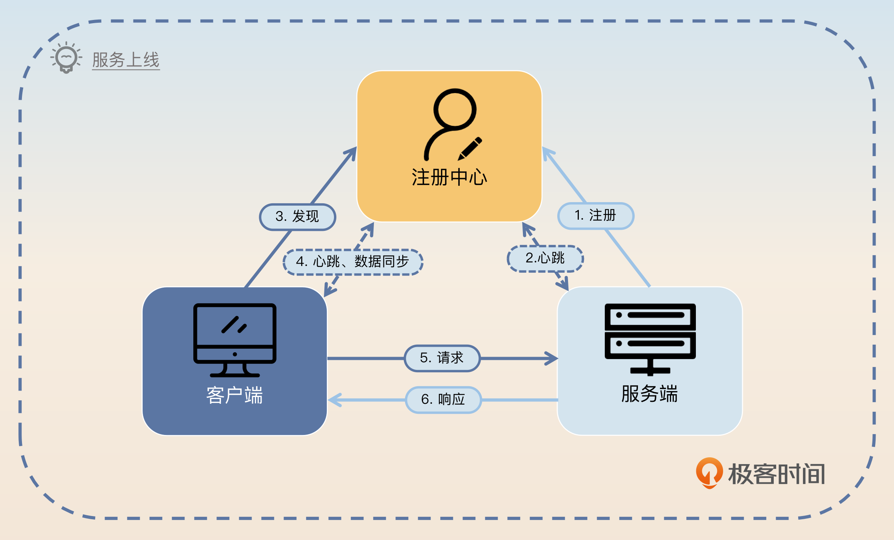
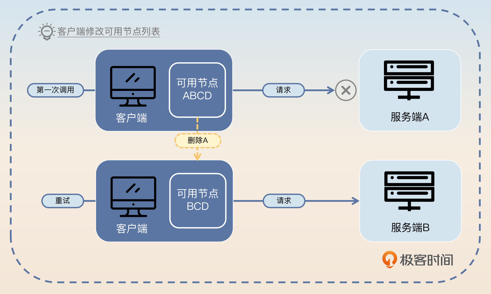
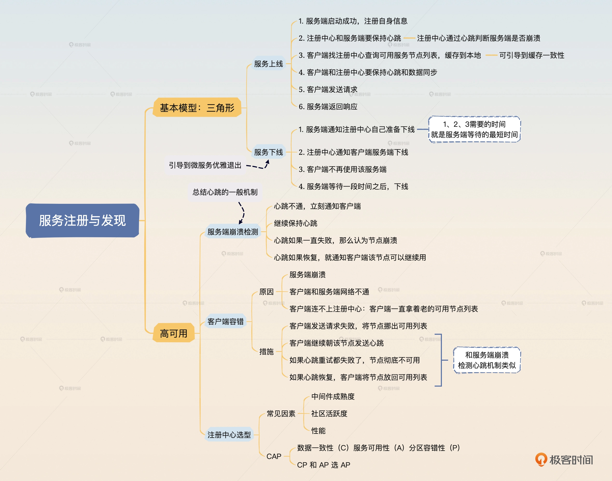

# 01 | 服务注册与发现：AP和CP，你选哪个？


<!-- @import "[TOC]" {cmd="toc" depthFrom=3 depthTo=6 orderedList=false} -->

<!-- code_chunk_output -->

- [前置知识](#前置知识)
- [面试准备](#面试准备)
- [基本模型](#基本模型)
- [高可用](#高可用)
  - [服务端崩溃检测](#服务端崩溃检测)
  - [客户端容错](#客户端容错)
  - [注册中心选型](#注册中心选型)
  - [面试思路总结](#面试思路总结)
- [深入对比：CP 型注册中心 ZooKeeper 与 etcd](#深入对比cp-型注册中心-zookeeper-与-etcd)
  - [ZooKeeper 与 etcd 的特性权衡](#zookeeper-与-etcd-的特性权衡)
- [代码示例：基于 Go 的服务注册与发现](#代码示例基于-go-的服务注册与发现)
  - [基于 ZooKeeper 的服务注册与发现 Go 实现示例](#基于-zookeeper-的服务注册与发现-go-实现示例)
  - [基于 etcd 的服务注册与发现 Go 实现示例](#基于-etcd-的服务注册与发现-go-实现示例)
- [AP vs. CP：可用性与一致性的抉择](#ap-vs-cp可用性与一致性的抉择)
  - [为什么说 ZooKeeper (和 etcd) 是 CP 的？](#为什么说-zookeeper-和-etcd-是-cp-的)
  - [Eureka/Nacos 如何做到 AP？它们舍弃了什么？](#eurekanacos-如何做到-ap它们舍弃了什么)

<!-- /code_chunk_output -->


### 前置知识

为什么我们会需要服务注册与发现呢？你设想这样一个场景，你的服务部署在不同的机房、不同的机器上，监听不同的端口。现在你的客户端收到了一个请求，要发送给服务端，那么你的客户端怎么知道哪些服务端能够处理这个请求呢？

举一个例子，你去一个陌生的城市出差，下班了想去吃个火锅，还得是重庆火锅。那么你怎么知道这个城市哪里有重庆火锅？你可能会说，我在 App 里面搜一下。那么 App 又怎么知道这里有一家重庆火锅店呢？你继续说，这肯定是商家去这个 App 注册过了呀！对，服务注册与发现模型就是这样。你扮演了客户端的角色，火锅店扮演了服务端的角色，而 App 则是扮演了我们常说的注册中心的角色。那么我们现在就容易理解基本的服务注册与发现模型了。

你可以看一下我给出的这张图，你要牢牢记住这张图还有里面的具体步骤。



1. 服务端启动的时候，需要往注册中心里注册自身的信息，主要是定位信息。
2. 注册成功之后，注册中心和服务端要保持心跳。
3. 客户端第一次发起对某个服务的调用之前，要先找注册中心获得所有可用服务节点列表，随后客户端会在本地缓存每个服务对应的可用节点列表。
4. 客户端和注册中心要保持心跳和数据同步，后续服务端有任何变动，注册中心都会通知客户端，客户端会更新本地的可用节点列表。
5. 客户端发送请求。
6. 服务端返回响应。

上面的这个步骤你可以看作是一个“正向”的步骤，而对应的反向步骤则是指服务端下线的过程。

我们还是用前面的例子来描述，一家门店准备关张不再营业了，那么它需要做一些什么？显然它需要告诉 App 自己不再营业了，那么你在平台上也就再也搜索不到它了。

所以，服务端下线的过程可以总结为 4 步。

1. 服务端通知注册中心自己准备下线了。
2. 注册中心通知客户端某个服务端下线了。
3. 客户端收到通知之后，新来的请求就不会再给该服务端发过去。
4. 服务端等待一段时间之后，暂停服务并下线。

需要注意的是，服务端必须要等待一段时间才能下线。因为从它通知注册中心自己要下线，到客户端收到通知，是有一段延时的，这段延时就是服务端要等待的最小时间。

如果你觉得这些步骤很复杂，那么我可以教你一个小技巧。 **你可以把整个模型看作是三角形，三个顶点分别是客户端、注册中心和服务端。三角形的三条边分别是客户端 - 注册中心，注册中心 - 服务端，客户端 - 服务端。而后面我们讨论的高可用方案，无非就是仔细思考三角形的任何一个顶点，或者任何一条边出问题了该怎么办。**

### 面试准备

在面试前，如果你们公司确实是使用了注册中心，那么你要弄清楚一些数据和信息。
- 你们用了什么中间件作为注册中心以及该中间件的优缺点。确保自己在回答“你为什么用某个中间价作为注册中心”的时候，能够综合这些优缺点来回答。
- 注册中心的集群规模。
- 读写 QPS（每秒查询率）。
- 机器性能，如 CPU 和内存大小。
- 最好准备一个注册中心出故障之后你排查和后续优化的案例。在讨论使用注册中心的注意事项，或者遇到过什么 Bug 的时候可以用这个案例。

如果你所在的公司没有采用微服务架构，那么你可以在 ZooKeeper 、 Nacos 或者 etcd 里面选择一个大概学习一下它们的基本特性。在面试的时候你可以用它们来解释注册中心。这样就算你没接触过服务注册与发现，但是你对此也是有相当深入的理解的。

在面试过程中，你可以尝试从这些角度把话题引到服务注册与发现这个主题上。
- 第一种情况，面试官问到了某一个可以作为注册中心的中间件。举例来说，如果你用 ZooKeeper 作为注册中心，那么如果面试官问到了 ZooKeeper，你可以主动提起你把它作为了注册中心；如果面试官问了 etcd，那么你可以主动提起 etcd 虽好，但是你用的是 ZooKeeper。这个时候面试官很有可能会继续追问你，为什么最终选择 ZooKeeper 作为注册中心，这时候说一下它的优缺点就好了。
- 还有一种情况，面试官问了你微服务高可用的问题，那么你可以把高可用的服务注册与发现作为保证整个微服务架构高可用的一个环节来叙述。

### 基本模型

一般而言，在最开始的阶段，面试官会问你“你知道服务注册与发现吗？”或者“你知道注册中心吗？”等问题，其实都是希望你回答服务注册与发现的基本模型。

那么你可以回答前置知识里面的服务上线和服务下线这两个流程的具体步骤，而后可以简单描述一下你所在公司的注册中心，也就是罗列一下你准备的那些数据和信息。基本内容说完之后，你可以先浅刷一个亮点， **关键词是注册数据。**

在说第一个步骤的时候，我提到“主要是定位信息”。既然用到了关键词“主要”，那自然有不那么主要的数据。非主要数据取决于微服务框架的功能特性。例如常见的分组功能，就是依赖于服务端在注册的时候同时注册自己的分组信息。

所以你可以用一个例子来解释，关键词是分组。

> 服务端注册的数据除了定位信息是必需的以外，剩下需要什么数据都是根据微服务框架本身的功能和业务来设计的。比如说很多微服务框架支持分组功能，那么就可以让服务端在注册的时候同时注册自己的分组信息，比如说当前节点是 VIP 节点。那么客户端在收到 VIP 请求之后就会把请求发给 VIP 节点。

这一段说完之后，你要稍微总结一下，引导面试官追问下去。

> 服务注册与发现的整个模型比较简单，不过要在实践中做到高可用还是很不容易的。

至于为什么不容易、怎么不容易你就等着面试官继续问。而高可用就是我们要刷的亮点。

### 高可用

不出所料的话，面试官就可能追问：“服务注册与发现怎么保证高可用呢？”，那么你就可以回答三个点，高可用的服务注册与发现要围绕注册服务端崩溃检测、客户端容错和注册中心选型三个方面进行。

接下来我们一个点一个点地看。

#### 服务端崩溃检测

我在基本模型里面说到在正常情况下，服务端下线都需要通知注册中心。那么万一服务端宕机了呢？比如说运维大哥不小心一脚把服务器电源线踢掉了，服务器直接停电了。在这种情况下，服务端是没办法通知注册中心的，注册中心自然也就不会通知客户端。那么客户端就会继续把请求发送给服务端，而这些请求显然都会失败。

因此为了提高可用性，需要让注册中心尽快发现服务端已经崩溃了，而后通知客户端。所以问题的关键就在于注册中心怎么判断服务端已经崩溃了？

服务端崩溃之后注册中心和服务端之间的心跳就无法继续保持了。所以你得出一个简单的结论：如果注册中心和服务端之间的心跳断了，就认为服务端已经崩溃了。

但是，如果注册中心和服务端之间的网络出现偶发性的抖动，那么心跳也会失败。此时服务端并没有真的崩溃，还活得好好的。

显然，心跳断了则服务端崩溃的判断并不能成立。这时候你可能会想到能不能多发几次心跳呢？答案是可以，但是次数越多，心跳间隔越长，注册中心断定服务端已经崩溃的时间就越长。而时间越长，就有越多请求发送给服务端。万一这个时候服务端真的崩溃了，这些请求都会失败。所以这就陷入两难境地了。 **要么是误以为服务端崩溃，要么是误以为服务端还活着。（设计的权衡）**

那么怎么走出这个窘境呢？

一方面，注册中心在和服务端进行心跳的时候失败了，就要立刻通知客户端该服务端已经不可用了，那么客户端就不会再发请求过来。

另外一方面，注册中心还要继续往服务端发心跳。如果只是偶发性的心跳失败，那么注册中心后面心跳是肯定能够连上的，这时候注册中心再通知客户端这个服务端是可用的。

不过注册中心并不是无限制发心跳直到连接上，而是发了一段时间之后发现心跳还是失败就不再发了，这意味着注册中心认定服务端彻底崩溃了。在彻底崩溃的场景下，注册中心不需要再次通知客户端，因为在之前注册中心就已经通知过了。

所以关键词就是心跳，你可以这样回答。

> 影响到可用性的另一个关键点是注册中心需要尽快发现服务端宕机。在基本模型里面，如果服务端突然宕机，那么服务端是来不及通知注册中心的。所以注册中心需要有一种检测机制，判断服务端有没有崩溃。在服务端崩溃的情况下，要及时通知客户端，不然客户端就会继续把请求发送到已经崩溃的节点上。

> 这种检测就是利用心跳来进行的。当注册中心发现和服务端的心跳失败了，那么它就应该认为服务端可能已经崩溃了，就立刻通知客户端停止使用该服务端。但是这种失败可能是偶发性的失败，比如说因为网络偶尔不稳定造成的。所以注册中心要继续保持心跳。如果几次心跳都失败了，那么就可以认为服务端已经彻底不可用了。但是如果心跳再次恢复了，那么注册中心就要再次告诉客户端这个服务端是可用的。

回答到这里，亮点已经有了，不过你还可以继续钓鱼，稍微升华一下。

> 实际上，在所有有心跳机制的分布式系统里面判断节点是否崩溃都是一个棘手的问题。比如说心跳失败了要不要继续重试，是立刻重试还是间隔重试，重试的话试几次？

> 理论上来说，在心跳失败之后如果不进行重试就直接判定服务端崩溃，那么就难以处理偶发性网络不通的问题。而如果要重试，比如说在注册中心和服务端的模型里面，重试三次，而且重试间隔是十秒钟，那么注册中心确定服务端崩溃就需要三十秒。在这三十秒内，客户端估计有成千上万的请求尝试发到崩溃的服务端，结果都失败了。

这时候，面试官很自然地就会觉得不要搞重试间隔，而是直接发起连续几次重试，这时候你就要无情地击碎这种幻想。

> 如果不考虑重试间隔的话，就难以避开偶发性的失败。比如说注册中心和服务端之间网络抖动，那么第一次心跳失败之后，你立刻重试多半也是失败的，因为此时网络很可能还是不稳定。

> 所以比较好的策略是立刻重试几次，如果都失败了就再间隔一段时间继续重试。所有的重试机制实际上也是要谨慎考虑重试次数和重试间隔的，确保在业务可以接受的范围内重试成功。不过再怎么样，从服务端崩溃到客户端知道，中间总是存在一个时间误差的，这时候就需要客户端来做容错了。

这个回答里面，最后的一句话，就是为了引出下面这个亮点：客户端容错。

#### 客户端容错

客户端容错是指尽量在注册中心或者服务端节点出现问题的时候，依旧保证请求能够发送到正确的服务端节点上。

在前一个亮点里面，你已经知道从服务端崩溃到客户端最终知道是有一段延时的。在这段延时内，客户端还是会把请求发送到已经崩溃的服务端节点上。

所以你要紧接着前面刷的亮点继续回答，关键词是换节点，也就是所谓的 failover。

> 客户端容错第一个要考虑的是如果某个服务端节点崩溃了该怎么办。在服务端节点崩溃之后，到注册中心发现，再到客户端收到通知，是存在一段延时的，这个延时是能算出来的。在这段延时内，客户端发送请求给这个服务端节点都会失败。

> 这个时候需要客户端来做一些容错。一般的策略是客户端在发现调不通之后，应该尝试换另外一个节点进行重试。如果客户端上的服务发现组件或者负载均衡器能够根据调用结果来做一些容错的话，那么它们应该要尝试将这个节点挪出可用节点列表，在短时间内不要再使用这个节点了。后面再考虑将这个节点挪回去。

在上面那段话中，我留了两个口子。第一个是延时怎么计算。

> 最坏的情况下，延时等于服务端和注册中心心跳间隔加上注册中心通知客户端的时间。大多数时候，注册中心通知客户端都是很快的，在毫秒级以内。因此可以认为服务端和注册中心的心跳间隔就是这个延时。



第二个点就是什么时候再将这个节点挪回可用列表，在上图中就是 A 什么时候会被重新放回可用列表。

显然，如果注册中心最终发现服务端崩溃，然后通知了客户端，那么客户端就不用放回去了。等到注册中心发现服务端再次恢复了，那么注册中心会通知客户端，此时客户端更新可用节点列表就可以了。

但是有一种情况是需要客户端主动检测的。这种情况就是服务端节点还活着，注册中心也还活着，唯独客户端和服务端之间的网络有问题，导致客户端调用不通。

在这种情况下，类似于注册中心和服务端心跳失败，客户端也要朝着那个疑似崩溃的服务端节点继续发送心跳。如果心跳成功了，就将节点放回可用列表。如果连续几次心跳都没有成功，那么就不用放回去了，直接认为这个节点已经崩溃了。

这个分析也适用于客户端和注册中心心跳失败的场景。很显然在这种情况下，客户端可以直接使用本地缓存的可用节点列表，而后如果调不通了则处理方式完全一样。但是不同的是，如果客户端长期连不上注册中心，那么客户端本身应该考虑整个退出。

#### 注册中心选型

注册中心选型类似于其他中间件选型，要考虑的因素非常多。比如说中间件成熟度、社区活跃度、性能等因素。相比之下，注册中心更加关注 CAP 中选 CP 还是选 AP 的问题。

- C：Consistency，数据一致性
- A：Availability，服务可用性
- P：Partition-tolerance，分区容错性
- CAP 理论告诉我们，一个分布式系统不可能同时满足数据一致性、服务可用性和分区容错性这三个基本需求，最多只能同时满足其中的两个。——来自《深入浅出分布式原理》

简单来说，选择 CP 就是选了一致性和分区容错性，而选择 AP 就相当于选了可用性和分区容错性。

看上去 P 分区容错性是肯定要选的，那么剩下的就是选 C（一致性） 还是选 A（可用性） 了。那么你要先理解在注册中心选型里面，一致性和可用性究竟哪个更加重要？标准答案是可用性，也就意味着 CP 和 AP 你应该选 AP。

前面我们讨论了客户端容错，那么显然在选择 AP 的情况下，客户端就可能拿到错误的可用节点列表。如果客户端将请求发到错误的可用节点上，就会出现错误，此时客户端自然可以执行容错，换一个可用节点重试。

所以我们要抓住关键词客户端容错进行回答。

> 在注册中心选型上，重要的是 CAP 原理中应该选择 AP，比如说 Eureka ，又或者 Nacos 启用 AP 模式。

万一你公司并没有使用 AP 模型的注册中心，比如说用了 CP 模型的 ZooKeeper，那么你就可以进一步解释，关键词是体量小。

> 我司之所以用 ZooKeeper，主要是因为我司体量小，集群规模也不大，ZooKeeper 虽然不是 AP 的，但是在这种体量下也够用了。不过我也尝试在公司内部推动看能否换一个中间件，比如说用 Nacos 的 AP 模式。

#### 面试思路总结

最后，让我们来总结一下这节课的重点内容。

这节课我们主要解决的是服务注册与发现的问题。我给出了基本的服务注册与发现模型，然后从服务端崩溃检测、客户端容错、注册中心选型三个角度来保证了服务注册与发现的高可用。其中我提到了几个关键词，分别是注册数据、分组、心跳、换节点、客户端容错、体量小。你可以从这几个关键词出发，根据自己的项目经验，梳理思路。

最后我再提醒一下，如果你觉得服务注册与发现实在难以记忆，可以把整个模型想成是一个三角形，而解决高可用问题的关键就是这个三角形任何一条边出问题了该怎么办。我非常建议你画一画这个三角形，并且手写一下你能想到的各种容错措施。



最后你来思考 2 个问题。
1. 我在客户端容错里提到这个分析也适用于注册中心崩溃，你能组织一下语言尝试回答“如果注册中心崩溃，你的系统会怎样？”这个问题吗？
2. 你可以再举出一个心跳频率、心跳重试机制对系统可用性影响的例子吗？

---

好的，我们来为你补充和深化这部分内容。你提出的问题非常关键，直指服务注册与发现模型选型的核心，即在CAP理论的指导下，我们如何在一致性（C）和可用性（A）之间做出抉择。

-----

### 深入对比：CP 型注册中心 ZooKeeper 与 etcd

在你的笔记中提到了一个很好的面试策略：当被问及 ZooKeeper 或 etcd 时，可以主动引出它们作为注册中心的应用，并阐述选型考量。为了让你能从容应对，我们来深入探讨一下这两者的优缺点，以及为什么它们都被归类为 CP 模型。

#### ZooKeeper 与 etcd 的特性权衡

当我们将 ZooKeeper 或 etcd 用作服务注册中心时，我们实际上是在利用它们作为高一致性的分布式键值存储（Key-Value Store）的能力。服务提供者将自己的地址、端口等信息作为值（Value），将一个唯一标识的服务名作为键（Key），注册到这个存储系统中。客户端则通过查询这个键来获取服务提供者的列表。

**ZooKeeper 作为注册中心的考量**

ZooKeeper 是一个历史悠久且非常成熟的分布式协调服务。它在设计之初就是为了解决分布式系统中的一致性问题的，比如分布式锁、集群管理、配置管理等。当用作注册中心时，它的优势在于其强大的 **一致性保障** 。ZooKeeper 使用 ZAB (ZooKeeper Atomic Broadcast) 协议来保证集群中各个节点数据的一致性。任何一次写入操作（服务注册、下线），都必须得到集群中超过半数节点的确认后，才能被认为是成功的。这意味着，任何时刻，客户端从任何一个 ZooKeeper 节点查询到的服务列表都是高度一致的。此外，ZooKeeper 的 **临时节点（Ephemeral Nodes）** 特性与服务注册与发现场景完美契合。服务在启动时可以注册一个临时节点，并与客户端会话绑定。当服务宕机或与 ZooKeeper 集群失联导致会话超时，这个临时节点会自动被删除。这巧妙地解决了服务端崩溃检测的问题，注册中心可以迅速地将该服务实例从可用列表中移除。

然而，ZooKeeper 的缺点也同样明显。首先是 **“写”性能瓶颈** 。由于 ZAB 协议要求半数以上节点确认，写入请求的延迟相对较高，吞吐量也有限。对于服务实例数量巨大、变更频繁的大规模微服务集群，这可能成为瓶颈。其次，它的 **客户端 API 相对复杂** ，理解和使用其 Watcher 机制（用于接收节点变更通知）需要一定的学习成本。最后，正如你笔记中提到的，它的 CP 特性决定了在网络分区发生时，如果少数派分区无法与多数派通信，那么这个少数派分区上的 ZooKeeper 节点将无法处理任何写请求（如服务注册），从而牺牲了可用性。

**etcd 作为注册中心的考量**

etcd 是一个相对更现代的分布式键值存储，由 CoreOS 开发，现在是云原生计算基金会（CNCF）的项目，也是 Kubernetes 的核心数据存储组件。与 ZooKeeper 类似，etcd 也使用强一致性协议——Raft 协议，来保证数据的一致性，因此它也是一个典型的 CP 系统。

etcd 的主要优势在于其 **简洁的 API 和更好的性能** 。它提供了简单的 HTTP/gRPC 接口，使得开发者可以轻松地对其进行读写操作，集成到各种语言和框架中都非常方便。相较于 ZooKeeper，etcd 在读写性能上通常有更好的表现，尤其是在现代硬件上。etcd 同样提供了 **租约（Lease）机制** ，可以实现与 ZooKeeper 临时节点类似的功能。服务注册时可以关联一个租约，并定期为租约“续期”（类似心跳）。如果服务宕机无法续期，租约到期后，与之关联的键值对（即服务注册信息）也会被自动删除。

etcd 的缺点在于，作为一个为强一致性设计的系统，它同样面临着 CP 模型的固有问题：在网络分区下牺牲可用性。此外，虽然其社区非常活跃，生态也日益繁荣（尤其是在云原生领域），但相较于 ZooKeeper 漫长时间里积累的稳定性和广泛应用，在某些传统企业环境中，ZooKeeper 的“老牌”地位可能更受信任。

### 代码示例：基于 Go 的服务注册与发现

为了让你有更直观的感受，我们用 Go 语言分别演示如何基于 ZooKeeper 和 etcd 实现一个最基本的服务注册与发现。

#### 基于 ZooKeeper 的服务注册与发现 Go 实现示例

首先，你需要引入 ZooKeeper 的 Go 客户端库，例如 `go-zookeeper/zk`。

```go
package main

import (
    "fmt"
    "log"
    "time"

    "github.com/go-zookeeper/zk"
)

const (
    zkServers   = "127.0.0.1:2181"
    servicePath = "/services/my-app"
    serviceAddr = "127.0.0.1:8080"
)

// ServiceRegistry 负责服务注册
func ServiceRegistry() {
    // 1. 连接 ZooKeeper
    conn, _, err := zk.Connect([]string{zkServers}, time.Second*5)
    if err != nil {
        log.Fatalf("Failed to connect to ZooKeeper: %v", err)
    }
    defer conn.Close()

    // 2. 确保基础路径存在 (持久节点)
    exists, _, err := conn.Exists(servicePath)
    if err != nil {
        log.Fatalf("Failed to check path: %v", err)
    }
    if !exists {
        // ACL (Access Control Lists) 使用开放权限
        _, err = conn.Create(servicePath, []byte(""), 0, zk.WorldACL(zk.PermAll))
        if err != nil && err != zk.ErrNodeExists {
            log.Fatalf("Failed to create service path: %v", err)
        }
    }

    // 3. 注册服务 (创建临时节点)
    // 节点路径包含服务地址，方便客户端直接解析
    nodePath := fmt.Sprintf("%s/node-", servicePath)
    // ZK 会在 nodePath 后面自动追加一个序列号，保证唯一性
    // zk.FlagEphemeral 表示这是一个临时节点
    registeredPath, err := conn.CreateProtectedEphemeralSequential(nodePath, []byte(serviceAddr), zk.WorldACL(zk.PermAll))
    if err != nil {
        log.Fatalf("Failed to register service: %v", err)
    }
    log.Printf("Service registered successfully at path: %s", registeredPath)

    // 保持程序运行，模拟服务在线。程序退出时，连接关闭，临时节点会自动删除。
    select {}
}

// ServiceDiscovery 负责服务发现
func ServiceDiscovery() {
    conn, _, err := zk.Connect([]string{zkServers}, time.Second*5)
    if err != nil {
        log.Fatalf("Failed to connect to ZooKeeper: %v", err)
    }
    defer conn.Close()

    // 1. 获取服务下的所有子节点 (即所有可用的服务实例)
    // ChildrenW 会设置一个 Watcher，当子节点列表发生变化时，会通知 channel
    children, _, eventChan, err := conn.ChildrenW(servicePath)
    if err != nil {
        log.Fatalf("Failed to discover services: %v", err)
    }
    log.Printf("Discovered services: %v", children)

    // 2. 循环监听节点变化
    for {
        event := <-eventChan
        if event.Type == zk.EventNodeChildrenChanged {
            log.Println("Service list changed, re-discovering...")
            // 重新获取并设置新的 Watcher
            newChildren, _, newEventChan, err := conn.ChildrenW(servicePath)
            if err != nil {
                log.Printf("Error during re-discovery: %v", err)
                continue
            }
            eventChan = newEventChan // 更新 channel 以便下次监听
            log.Printf("New discovered services: %v", newChildren)
            // 在实际应用中，这里会更新客户端本地的服务列表缓存
        }
    }
}

// 注意: 在实际运行中，注册和发现应在不同的进程或 Goroutine 中执行。
// func main() {
//     go ServiceRegistry()
//     ServiceDiscovery()
// }
```

#### 基于 etcd 的服务注册与发现 Go 实现示例

对于 etcd，你需要引入 `go.etcd.io/etcd/client/v3` 库。

```go
package main

import (
    "context"
    "fmt"
    "log"
    "time"

    clientv3 "go.etcd.io/etcd/client/v3"
)

const (
    etcdEndpoints = "127.0.0.1:2379"
    servicePrefix = "/services/my-app/"
    serviceAddr   = "127.0.0.1:8081"
    leaseTTL      = 10 // 租约 TTL (秒)
)

// ServiceRegistry 负责服务注册
func ServiceRegistry() {
    // 1. 创建 etcd 客户端
    cli, err := clientv3.New(clientv3.Config{
        Endpoints:   []string{etcdEndpoints},
        DialTimeout: 5 * time.Second,
    })
    if err != nil {
        log.Fatalf("Failed to connect to etcd: %v", err)
    }
    defer cli.Close()

    // 2. 创建一个租约
    lease, err := cli.Grant(context.Background(), leaseTTL)
    if err != nil {
        log.Fatalf("Failed to create lease: %v", err)
    }

    // 3. 注册服务 (将 key-value 与租约绑定)
    key := servicePrefix + serviceAddr
    _, err = cli.Put(context.Background(), key, serviceAddr, clientv3.WithLease(lease.ID))
    if err != nil {
        log.Fatalf("Failed to register service: %v", err)
    }
    log.Printf("Service registered successfully with key: %s", key)

    // 4. 定期为租约续期 (心跳)
    keepAliveChan, err := cli.KeepAlive(context.Background(), lease.ID)
    if err != nil {
        log.Fatalf("Failed to set up keep-alive: %v", err)
    }

    for {
        ka := <-keepAliveChan
        log.Printf("Lease keep-alive ttl:%d", ka.TTL)
    }
    // 当程序崩溃或无法连接 etcd，续期停止，租约到期后 key 会被自动删除。
}

// ServiceDiscovery 负责服务发现
func ServiceDiscovery() {
    cli, err := clientv3.New(clientv3.Config{
        Endpoints:   []string{etcdEndpoints},
        DialTimeout: 5 * time.Second,
    })
    if err != nil {
        log.Fatalf("Failed to connect to etcd: %v", err)
    }
    defer cli.Close()

    // 1. 首次获取服务列表
    resp, err := cli.Get(context.Background(), servicePrefix, clientv3.WithPrefix())
    if err != nil {
        log.Fatalf("Failed to discover services: %v", err)
    }
    
    serviceList := make(map[string]string)
    for _, kv := range resp.Kvs {
        serviceList[string(kv.Key)] = string(kv.Value)
    }
    log.Printf("Initial discovered services: %v", serviceList)


    // 2. 监听服务前缀的变化
    watchChan := cli.Watch(context.Background(), servicePrefix, clientv3.WithPrefix())
    for watchResp := range watchChan {
        for _, event := range watchResp.Events {
            switch event.Type {
            case clientv3.EventTypePut: // 新增或修改
                log.Printf("Service UP: Key=%s, Value=%s", string(event.Kv.Key), string(event.Kv.Value))
                serviceList[string(event.Kv.Key)] = string(event.Kv.Value)
            case clientv3.EventTypeDelete: // 删除
                log.Printf("Service DOWN: Key=%s", string(event.Kv.Key))
                delete(serviceList, string(event.Kv.Key))
            }
            // 在实际应用中，这里会更新客户端本地的服务列表缓存
            log.Printf("Current service list: %v", serviceList)
        }
    }
}

// 注意: 在实际运行中，注册和发现应在不同的进程或 Goroutine 中执行。
// func main() {
//     go ServiceRegistry()
//     ServiceDiscovery()
// }
```

### AP vs. CP：可用性与一致性的抉择

现在我们来回答你第二个更深层次的问题：为什么 ZooKeeper 是 CP 的，而 Eureka/Nacos 如何做到 AP，它们又为此付出了什么代价？

#### 为什么说 ZooKeeper (和 etcd) 是 CP 的？

正如前面提到的，ZooKeeper 和 etcd 都基于强一致性协议（ZAB/Raft）。这些协议的核心思想是 **“少数服从多数”** 。一个集群（通常由奇数个节点组成，如3、5、7个）必须有超过半数的节点（即法定人数，Quorum）正常工作并相互通信，才能对外提供 **写服务** 。

想象一个有5个节点的 ZooKeeper 集群。它需要至少 `(5/2) + 1 = 3` 个节点存活且互联，才能选举出 Leader 并处理写请求（如服务注册）。现在，假设发生了网络分区，集群被分割成两部分：一个分区有3个节点（多数派），另一个有2个节点（少数派）。

- **多数派分区 (3个节点)** ：它们依然满足 Quorum，可以选举出 Leader，继续处理读写请求。一切正常。
- **少数派分区 (2个节点)** ：它们无法达到3个节点的 Quorum 要求，因此无法选举出 Leader。这个分区内的节点会拒绝所有的写请求。它们或许可以提供读服务（返回分区前的数据），但无法注册新服务或更新服务状态。

这就是 **牺牲可用性（Availability）来保证一致性（Consistency）** 的典型体现。系统宁愿在少数派分区里“罢工”（不可用），也绝不允许出现数据不一致的情况（比如两个分区都接受服务注册，导致数据分裂）。对于客户端而言，如果它连接到了少数派分区的节点，它会发现注册中心“不可用”了。

你说“我司体量小，集群规模也不大，ZooKeeper 虽然不是 AP 的，在这种体量下也够用了”，这句话是非常精准和务实的。它的意思是：

1.  **体量小** ：服务实例数量和变更不频繁，ZooKeeper 的写性能瓶颈不突出。
2.  **集群规模不大** ：运维复杂度可控，并且发生网络分区的概率相对较低。即使发生分区，因为节点少，恢复起来也比较快。
3.  **够用** ：在这种场景下，ZooKeeper 提供的强一致性和可靠性带来的好处，超过了其在极端情况下（网络分区）牺牲可用性带来的风险。系统可以容忍在罕见的分区故障期间短暂的服务注册中断。

#### Eureka/Nacos 如何做到 AP？它们舍弃了什么？

与 ZooKeeper/etcd 的哲学不同，Eureka 和 Nacos（AP 模式）认为，对于服务发现这个场景， **可用性比一致性更重要** 。它们的逻辑是：即使注册中心的数据在短时间内有少许不一致（比如多了一个本该下线的服务，或少了一个刚刚上线的服务），也比整个注册中心不可用要好。客户端的容错机制（如重试、熔断）可以处理这种短暂的不一致，但如果注册中心直接拒绝服务，客户端将无能为力。

**Eureka 的 AP 实现：对等复制与自我保护**

Eureka 的设计哲学非常独特，它没有 Leader 的概念，每个节点都是对等的（Peer-to-Peer）。

1.  **信息复制** ：当一个服务实例向某个 Eureka 节点注册时，该节点会接受注册，然后 **尽力而为（Best Effort）** 地将这个信息复制给它所知道的其他对等节点。它不会等待其他节点确认，注册操作会立刻返回成功。
2.  **分区容忍** ：如果发生网络分区，比如5个节点分成了 `3+2` 两个区。分区内的服务实例仍然可以向各自区域内的 Eureka 节点注册。这两个分区的 Eureka 节点都会接受注册，并且都能独立对外提供服务发现。此时，连接到分区一的客户端看到的是分区一的服务列表，连接到分区二的客户端看到的是分区二的服务列表。 **数据出现不一致了。**
3.  **自我保护机制（Self-Preservation Mode）** ：这是 Eureka 实现 AP 的精髓。正常情况下，Eureka 节点会期望在一定时间内（例如每分钟）收到大量服务实例的心跳。如果它发现心跳续约的比例在短时间内低于某个阈值（例如低于85%），它就会进入“自我保护模式”。此时，它会认为这是网络问题，而不是服务实例真的都死掉了。在这种模式下， **它不会剔除任何过期的服务实例** 。它会继续提供当前已有的服务列表，即使这些服务可能已经宕机。

**舍弃了什么？**

很明显，Eureka **舍弃了强一致性（C）** 。

- 在网络分区期间，不同分区的客户端看到的服务列表是不同的。
- 在自我保护模式下，客户端可能会获取到一个包含已宕机节点的“过时”的服务列表。

这个设计的代价由客户端来承担。客户端必须要有相应的容错机制，比如在调用失败后能够自动重试另一个节点。但 Eureka 的设计者认为，返回一个可能包含“坏”节点的列表，也比因为网络抖动而返回一个空列表要好得多。

**Nacos 的 AP 实现：Distro 协议**

Nacos 更加灵活，它同时支持 CP（基于 Raft）和 AP（基于自研的 Distro 协议）两种模式。在 AP 模式下，它的工作方式与 Eureka 类似，但实现细节不同。

1.  **写本地并异步同步** ：当节点收到写请求（注册服务）时，它会立即在本地接受并写入，然后异步地将数据同步给集群中的其他节点。它不要求多数派确认。
2.  **分区容忍** ：在网络分区时，不同分区的 Nacos 节点都可以独立接受服务注册，对外提供服务。这同样会导致数据在不同分区之间出现不一致。
3.  **健康检查** ：Nacos 维护了服务实例的健康状态。在 AP 模式下，一个实例是否健康只由其所在的 Nacos 节点负责判断。即使这个实例在整个集群视图中暂时“不一致”，它仍然可以被其所在分区的客户端发现和使用。

**舍弃了什么？**

与 Eureka 一样，Nacos 的 AP 模式也 **舍弃了强一致性** 。客户端可能会从不同的 Nacos 节点获取到不一致的服务列表。一个刚刚注册的服务可能需要一点时间才能被所有客户端发现；一个刚刚下线的服务也可能在短时间内仍然被客户端认为是可用的。

**总结：AP 与 CP 的核心权衡**

- **选择 CP (ZooKeeper, etcd, Nacos-CP)** ：你得到了 **强一致性** 。任何时刻，所有客户端看到的都是同样的服务列表。代价是在网络分区等极端故障下，系统可能会 **牺牲可用性** ，导致服务无法注册或发现。这适合对数据一致性要求极高，且能容忍短暂服务中断的场景。
- **选择 AP (Eureka, Nacos-AP)** ：你得到了 **高可用性** 。即使在网络分区下，注册中心也能持续提供服务。代价是 **牺牲了一致性** ，客户端可能会在短时间内拿到过时或不完整的数据。这要求客户端必须具备健壮的容错能力。对于绝大多数微服务应用来说，服务发现的短暂不一致是可以接受的，因此 AP 模型通常是更优的选择。

希望这些补充的章节能够帮你更透彻地理解服务注册与发现中的这些核心概念，让你在面试中更加游刃有余。
