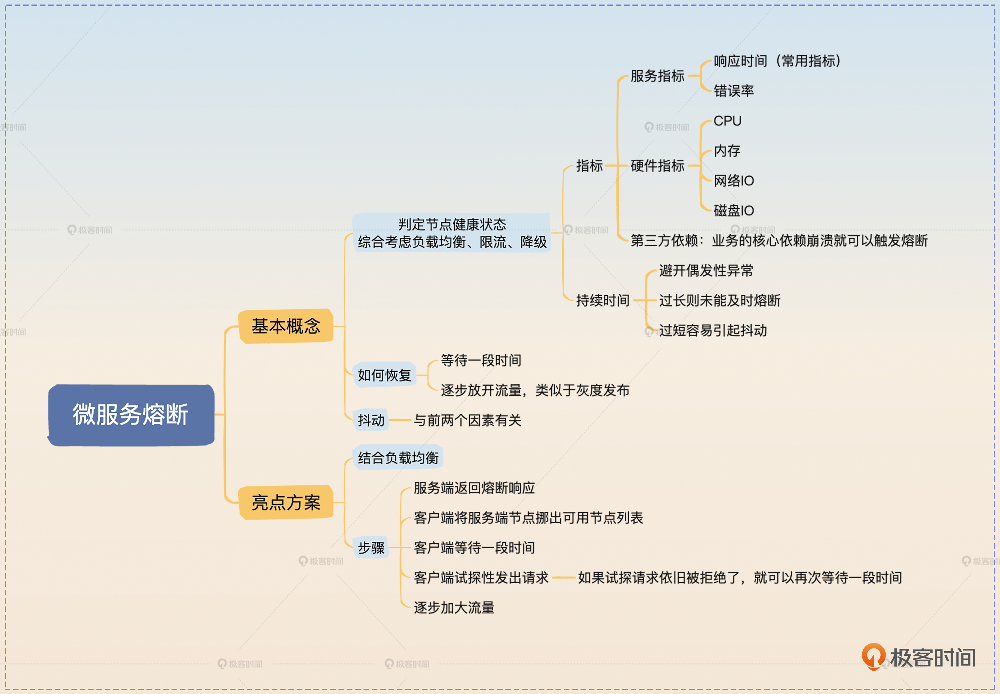

# 03 | 熔断：熔断-恢复-熔断-恢复，抖来抖去怎么办？

<!-- @import "[TOC]" {cmd="toc" depthFrom=3 depthTo=6 orderedList=false} -->

<!-- code_chunk_output -->

- [前置知识](#前置知识)
  - [判定服务的健康状态](#判定服务的健康状态)
  - [服务恢复正常](#服务恢复正常)
- [面试准备](#面试准备)
  - [基本思路](#基本思路)
  - [亮点方案](#亮点方案)
  - [面试思路总结](#面试思路总结)

<!-- /code_chunk_output -->

### 前置知识

熔断在微服务架构里面是指当微服务本身出现问题的时候，它会拒绝新的请求，直到微服务恢复。

服务端明明返回了错误的响应，怎么还说熔断提高了系统的可用性呢？答案就是熔断可以给服务端恢复的机会。试想这么一个场景，CPU 使用率已经 100% 了，服务端因此触发了熔断。那么拒绝了新来的请求之后，服务端的 CPU 使用率就会在一段时间内降到 100% 以内。

回到熔断的基本定义上来，我们可以提炼出两个点进一步讨论。
1. 怎么判断微服务出现了问题？
2. 怎么知道微服务恢复了？

接下来我们要讨论的亮点也是围绕这两个方面来进行的。

#### 判定服务的健康状态

第一个问题，判断微服务是否出现了问题，它有点儿像我们在负载均衡里面讨论的动态算法。本质上也是要求你根据自己的业务来选择一些指标，代表这个服务器的健康程度。比如说一般可以考虑使用响应时间、错误率。

不管选择什么指标，都要考虑两个因素：一是阈值如何选择；二是超过阈值之后，要不要持续一段时间才触发熔断。

比如我们把响应时间作为指标，那么响应时间超过多少应该触发熔断呢？这是根据业务来决定的。比如说如果业务对响应时间的要求是在 1s 以内，那么你的阈值就可以设定在 1s，或者稍高一点，留点容错的余地也可以。

那么如果你的产品经理没跟你说这个业务对响应时间的要求，你就可以根据它的整体响应时间设定一个阈值，原则上阈值应该明显超过正常响应时间。比如你经过一段时间的观测之后，发现这个服务的 99 线是 1s，那么你可以考虑将熔断阈值设定为 1.2s。

那么是不是响应时间一旦超过了阈值就立刻熔断呢？一般也不是，而是要求响应时间超过一段时间之后才触发熔断。这主要是出于两个考虑，一个是响应时间可能是偶发性地突然增长；另外一个则是防止抖动。防止抖动这个问题后面我会和你进一步讨论。

那么这个“一段时间”究竟有多长，很大程度上就依赖个人经验了。如果时间过短，可能会频繁触发熔断，然后又恢复，再熔断，再恢复……反过来，如果时间过长，那就可能会导致该触发熔断的时候迟迟没有触发。

你可以根据经验来设定一个值，比如说三十秒或者一分钟。

当然最简单的做法就是超过阈值就直接触发熔断，但是采取这种策略就要更加小心抖动问题。

#### 服务恢复正常

第二个问题，一个服务熔断之后要考虑恢复。比如说如果我们判断一个服务响应时间过长，进入了熔断状态。那么十分钟过后，已接收的请求已经被处理完了，即服务恢复正常了，那么它就要退出熔断状态，继续接收新请求。

因此在触发熔断之后，就要考虑检测服务是否已经恢复正常。

很可惜，这方面微服务框架都做得比较差。大多数情况下就是触发熔断之后保持一段时间，比如说一分钟，一分钟之后就认为服务已经恢复正常，继续处理新请求。

不过这里就涉及到我前面多次提到的抖动问题了。所谓抖动就是服务频繁地在正常 - 熔断两个状态之间切换。

引起抖动的原因是多样的，比如说前面提到的一旦超过阈值就进入熔断状态，或者我们这里说的恢复策略不当也会引起抖动。再比如刚刚我们提到的“一分钟后就认为服务已经恢复正常，继续处理新请求”就容易引发抖动问题。

你试想一下，如果本身熔断是高并发引起的。那么在一分钟后，并发依旧很高，这时候你一旦直接恢复正常，然后高并发的流量打过来，服务是不是又会触发熔断？

而要解决这个抖动问题，就需要在恢复之后控制住流量。比如说按照 10%、20%、30%……逐步递增，而不是立刻恢复 100% 的流量。

显然你能够看出来这种做法还是不够好。因为在这种逐步放开流量的措施下，依旧有请求因为熔断不会被处理。那么一个自然的想法就是，能不能让客户端来控制这个流量？简单来说就是服务端触发熔断之后，客户端就直接不再请求这个节点了，而是换一个节点。等到恢复了之后，客户端再逐步对这个节点放开流量。

当然可以，这也是我给出的亮点方案。

### 面试准备

这些就是关于熔断你要了解的基础知识，不过如果你想要彻底掌握，还需要把这些知识点和实际工作联系在一起。所以我建议你在面试之前，要弄清楚你所在的公司有没有用熔断来治理微服务。如果有，那么你需要进一步弄清楚下面这些情况。
1. 你们公司是怎么判断微服务出现故障的？比如说错误率、响应时间等等。
2. 你们公司是怎么判断微服务已经从故障中恢复过来的？
3。 在判断微服务已经恢复过来之后，有没有采取什么措施来防止抖动的问题？

关于熔断最佳的面试策略是把它作为你构建一个高可用微服务架构的一环。例如你在介绍某一个微服务项目的时候可以这样说。

> 这是一个高可用的微服务系统，为了保证它的可用性，我采取了限流、降级、熔断等措施。

此外，如果面试官问到服务治理以及提高系统可用性的方法之类的问题，你也可以用熔断来回答。又或者面试官问到了限流或者降级，那么你就可以尝试把话题引到熔断上面。此外，如果面试官问到某个服务崩溃了怎么办？这个问题相当于是在问怎么提高可用性防止服务崩溃，以及万一服务真崩溃了你也要有措施防止拖累别的服务，那么熔断就是一个可用的手段。

如果你现在有时间，在学完这节课的内容之后，就可以尝试在公司内部落地一下熔断，并且可以试试我给你的亮点方案，来加深印象以及对细节的把控。

#### 基本思路

当面试官问“你有没有用过熔断”或者“怎么保障微服务可用性”的时候，你就可以介绍你使用的熔断。但是要根据我在前置知识里面的提示，你在面试的时候要说清楚什么时候判定服务需要触发熔断，为什么选用这个指标。

假如说你准备用响应时间来作为指标，那么你可以这么回答，关键词是持续超过阈值。

> 为了保障微服务的可用性，我在我的核心服务里面接入了熔断。针对不同的服务，我设计了不同的微服务熔断策略。

> 比如说最简单的熔断策略就是根据响应时间来进行。当响应时间超过阈值一段时间之后就会触发熔断。我一般会根据业务情况来选择这个阈值，例如，如果产品经理要求响应时间是 1s，那么我会把阈值设定在 1.2s。如果响应时间超过 1.2s，并且持续三十秒，就会触发熔断。在触发熔断的情况下，新请求会被拒绝，而已有的请求还是会被继续处理，直到服务恢复正常。

这里面试官就可能有很多种问法，但是我在前置知识里面都讨论到了。虽然他的问题可能千奇百怪，不过万变不离这几问。
1. 这阈值还可以怎么确定？那么你就回答还可以根据观测到的响应时间数据来确定。
2. 这个持续三十秒是如何计算出来的？这个问题其实可以坦白回答是基于个人经验，然后你解释一下过长或者过短的弊端就可以了。
3. 为什么多了 0.2s？那么你可以解释是留了余地，防止偶发性的响应时间变长的情况。
4. 怎么判断服务已经恢复正常了？那么你可以回答等待一段固定的时间，然后尝试逐渐放开流量。

如果你在实践中根据自己的业务特征选用了一些比较罕见的指标，或者你设计的触发熔断的条件比较有特色，那么也可以用自己的实际方案。

这里我给你另外一个微创新的方案，关键词是缓存崩溃。

> 我还设计过一个很有趣的熔断方案。我的一个接口并发很高，对缓存的依赖度非常严重。所以我的熔断策略是要是缓存不可用，比如说 Redis 崩溃了，那么我就会触发熔断。这里如果我不熔断的话，请求会因为 Redis 崩溃而全部落到 MySQL 上，基本上会压垮 MySQL。

> 在触发熔断之后，我会额外开启一个线程（如果是 Go 就换成 Goroutine）持续不断地 ping Redis。如果 Redis 恢复了，那么我就会退出熔断状态，新来的请求就不会被拒绝了。

这里我用 Redis 来作为例子，你可以将 Redis 替换为 MemCache 之类的，甚至你还可以将缓存替换成你业务上任何一个关键的第三方依赖。

这个方案里面我还留了一些可以引导的点。
- 缓存问题：在这里我提到了 Redis 失效，这种情况类似于缓存雪崩，那么你很自然地就可以把话题引导到如何处理缓存击穿、穿透、雪崩这些经典问题上。
- 高可用 MySQL：我在这里使用的是熔断来保护 MySQL，类似地，你也可以考虑用限流来保护 MySQL。

最后我提到了退出熔断状态，如果面试官了解抖动问题，那么他就肯定会追问“你是一次性放开全部流量吗？”，那么你就可以阐述抖动的问题，然后总结一下。

> 我这种逐步放开流量的方案其实还是有缺陷的，还有一些更加高级的做法，但是需要负载均衡来配合。

这个总结就是你留下的鱼饵，为了引出下面我给你展示的亮点方案。

#### 亮点方案

前面的基本思路如果你能答好，差不多也能通过跟熔断有关的面试了，而且有不小的概率能够给面试官留下你技术很不错的印象。但是你还可以进一步展示你在服务治理和服务可用性保证上的独到见解。这就需要用到下面我要给你讲的综合了负载均衡算法和熔断措施的方案了。

这个方案很简单，在落地的时候也不是很难。

我在讲抖动与恢复的时候提到，恢复的时候可以逐步放开流量。那么你是否注意到，这个放开流量是在服务端处理的，也就是说服务端还是收到了 100% 的流量，只不过只有部分流量会被放过去并且被正常处理。

那么一个自然的想法就是为什么不直接让客户端来控制这个流量呢？

进一步结合我在负载均衡里面谈到的根据调用结果来调整负载均衡策略的讨论，是不是可以让客户端也采用这种负载均衡策略？答案是可以的。

整体流程：
1. 服务端在触发熔断的时候，会返回一个代表熔断的错误。
2. 客户端在收到这个错误之后，就会把这个服务端节点暂时挪出可用节点列表。后续所有的新请求都不会再打到这个触发了熔断的服务端节点上了。
3. 客户端在等待一段时间后，逐步放开流量。
5. 如果服务端正常处理了新来的请求，那么客户端就加大流量。
5. 如果服务端再次返回了熔断响应，那么客户端就会再一次将这个节点挪出可用列表。
6. 如此循环，直到服务端完全恢复正常，客户端也正常发送请求到该服务端节点。

那么这里你就可以这样回答，关键词是负载均衡。

> 整体思路是利用负载均衡来控制流量。如果一个服务端节点触发了熔断，那么客户端在做负载均衡的时候就可以将这个节点挪出可用列表，后续请求会发给别的节点。在经过一段时间之后，客户端可以尝试发请求给该节点。如果该节点正确处理了，那客户端就可以加大流量。否则客户端就要再一次等待一段时间。

到这里你还可以自己杠自己一下，就是万一所有可用节点都触发熔断了，应该怎么办？你就可以这样来说。

> 这个方案是需要兜底的，比如说如果因为某些原因数据库出问题，导致某个服务所有的节点都触发了熔断，那么客户端就完全没有可用节点了。不过这个问题本身熔断解决不了，负载均衡也解决不了，只能通过监控告警之后人手工介入处理了。

#### 面试思路总结

这节课我们主要解决的是熔断问题。我们讨论了熔断的基本概念，怎么判定服务是否熔断，以及熔断后如何恢复的问题。其中的难点是抖动的问题，为了防止抖动，我们需要合理判定节点的健康状况，在恢复期间尽可能等待一段时间，然后逐步放开流量。

最后我给出了一个综合运用负载均衡和熔断的方案，重点在于客户端控制流量，并根据服务端节点的状况来操作可用节点列表。你在学习的时候注意把亮点方案和前面学习的负载均衡内容结合在一起，同时我也非常建议你在实际工作中尝试应用一下熔断，让它来保护你的系统，提高系统可用性。

同样地，我也整理这节课的思维导图，你可以参考。

除了熔断相关知识，这节课我还希望你学会综合运用各种技术手段来设计精巧的方案。在这里我给出了一个负载均衡 + 熔断的方案，后续你也可以看到更多这个技巧的应用。

最后我再强调一下，熔断面试的最好方案是把它作为你构建高可用微服务的一环，也就是说，你可以认为前面讨论的负载均衡，还有接下来要讨论的限流、降级、隔离等措施，都是你整个高可用方案的一环。
