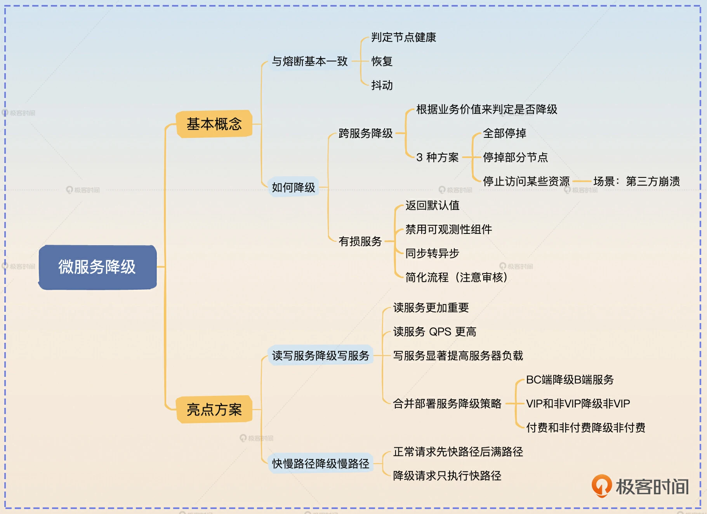

# 04 | 降级：为什么每次大促的时候总是要把退款之类的服务停掉？

<!-- @import "[TOC]" {cmd="toc" depthFrom=3 depthTo=6 orderedList=false} -->

<!-- code_chunk_output -->

- [前置知识](#前置知识)
  - [降级与熔断](#降级与熔断)
  - [如何降级？](#如何降级)
- [面试准备](#面试准备)
  - [基本思路](#基本思路)
- [亮点方案](#亮点方案)
  - [读写服务降级写服务](#读写服务降级写服务)
  - [快慢路径降级慢路径](#快慢路径降级慢路径)

<!-- /code_chunk_output -->

### 前置知识

如果用一句俏皮话来形容降级，那就是“凑合过呗，还能离咋的。”就比如在双十一之类的大促高峰，平台是会关闭一些服务的，比如退款服务。

这就是降级的典型应用，不过它是一种手动的跨服务降级。你可能会觉得困惑，这为什么也算是降级呢？这是因为对于整个系统来说，它提供了一部分服务，但是没有提供另外一部分服务，所以它在整个系统层面上是降级的。

这种降级的好处有两方面。一方面是腾出了服务器资源，可以给订单服务或者支付服务；另外一方面是减少了对公共组件的压力，比如说减少了对数据库的写入压力。

不过如果仅仅是针对退款服务而言，那么你也可以认为退款服务是整个熔断了。

#### 降级与熔断

事实上，降级和熔断非常像。熔断重点讨论的两个点，降级也有讨论。
* 如何判定服务健康，在降级中则是判定一个服务要不要降级。
* 降级之后怎么恢复，也是要考虑抖动的问题。

所以在一些场景下，你既可以用熔断，也可以用降级。比如说在响应时间超过阈值之后，你可以考虑选择熔断，完全不提供服务；你也可以考虑降级，提供有损服务。

原则上来说，是应该优先考虑使用降级的。然而有些服务是无法降级的，尤其是写服务。例如你从前端接收数据，然后写到数据库，这种场景是无法降级的。另外，如果你希望系统负载尽快降低，那么熔断要优于降级。

从具体实践上来说，降级可以玩出的花样要比熔断多很多。毕竟熔断是彻底不提供服务，而降级则是尽量提供服务。所以怎么降就有很多千奇百怪的做法了。

#### 如何降级？

怎么降这个问题的答案又可以分成两大类。
- 跨服务降级，当资源不够的时候可以暂停某些服务，将腾出来的资源给其他更加重要、更加核心的服务使用。我这里提到的大促暂停退款服务就是跨服务降级的例子。这种策略的要点是必须知道一个服务比另外一个服务更有业务价值，或者更加重要。
- 本服务提供有损服务，例如各大 App 的首页都会有降级的策略。在没有触发降级的时候，App 首页是针对你个人用户画像的个性化推荐。而在触发了降级之后，则可能是使用榜单数据，或者使用一个运营提前配置好的静态页面。这种策略的要点是你得知道你的服务调用者能够接受什么程度的有损。

跨服务降级的措施是很粗暴的，常见的做法有三个。
- 整个服务停掉，例如前面提到的停掉退款服务。
- 停掉服务的部分节点，例如十个节点，停掉其中五个节点，这五个节点被挪作他用。
- 停止访问某些资源。例如日志中心压力很大的时候，发信号给某些不重要的服务，让它们停止上传日志，只在本地保存日志。

而针对服务本身，也有一些常见的降级思路。
- 返回默认值，这算是最简单的一种状况。禁用可观测性组件，正常来说在业务里面都充斥了各种各样的埋点。这些埋点本身其实是会带来消耗的，所以在性能达到瓶颈的时候，就可以考虑停用，或者降低采样率。
- 同步转异步，即正常情况下，服务收到请求之后会立刻处理。但是在降级的情况下，服务在收到请求之后只会返回一个代表“已接收”的响应。后续服务会异步地开启线程来处理，或者依赖于定时任务来处理。
- 简化流程，如果你处理一个请求需要很多步骤，后续如果有一些步骤不关键的话，可以考虑不执行，或者异步执行。例如在内容生产平台，一般新内容要被推送到推荐系统里面。那么在降级的情况下你可以不推，而后可以考虑异步推送过去，也可以考虑等系统恢复之后再推送过去。

### 面试准备

在面试前，你需要了解清楚你所在公司使用降级的情况。
- 如果你所在公司有 App、网站之类的产品，那么去了解一下在首页、核心页面有没有采取降级措施。如果采用了降级，那么降级前后的逻辑是什么样的。
- 提前了解你所在公司有没有使用降级来保护系统。如果有，那么你需要了解清楚什么情况下会触发降级，降级后的逻辑是怎样的，以及怎样从降级中恢复过来。

这些降级的东西可能你没做过，不过你只需要了解清楚每一种降级的前因后果即可。

如果你维护的服务没有使用任何降级措施，那么你可以考虑为这些服务接入降级措施。这样做不仅可以给你的 KPI 或者 OKR 添上一笔，还能让你在实践过程中加深对降级的理解，掌握更多的细节。

你的最佳面试策略是把降级作为构建高可用微服务架构的一个措施，例如在项目介绍中说：

> A 系统是我们公司的核心系统，而我的主要职责是保障该系统的高可用。为了达到这一个目标，我综合运用了熔断、降级、隔离等措施。

等面试官询问某个具体措施的时候再详细解答。

知己知彼，方能百战不殆。当面试官问哪些问题时我们可以用降级来回答呢？
- 你是否了解服务治理？
- 如何提高系统的可用性？
- 如果系统负载很高该怎么办？
- 依赖的下游服务或者下游中间件崩溃了怎么办？

这些问题是不是很熟悉，其实我们已经在熔断里面聊过了。就像我上节课说的，这些知识之间是相通的，任何优秀的方案都是这些内容的完美整合。所以这些问题你同样可以用降级来回答。

同时为了展示亮点，你需要记住后面我给出的两个方案：读写服务降级写服务和快慢路径降级慢路径。我非常建议你参考这两个方案的思路，基于自己的实际业务情况设计自己独有的降级面试案例。

#### 基本思路

如果面试官问到了降级，或者说你将话题引导到了降级，那么你可以先介绍降级的基本概念，同时可以举前面我们提到的大促和 App 首页的例子。如果你之前没有和面试官聊过熔断，那么你可以在这里补充熔断里面讨论判断服务健康的要点，然后结合自己公司内部使用降级的例子，或者即便不是自己亲手落地但是自己也了解详情的案例。

> 我在公司也用了降级来保护我维护的服务。举例来说，正常情况下我的服务都会全量采集各种监控指标。那么在系统触及性能瓶颈的时候，我就会调整采集的比率。甚至在关键的时候，我会直接停用掉所有的指标采集，将资源集中在提供服务上。

我在这里给你的示例比较简单，你可以考虑换成我在前面提到的其他降级思路。当然，如果你在公司内部本身就使用了降级的话，那么使用自己的案例会更好。讲完一个案例之后，你可以进一步总结常规的降级思路，也就是我在前置知识里面列举出来的。 套路是一样的，这里我就不再赘述了。

我前面列举出来的这些措施你不一定都用过，那么万一面试官问到其中一个，你不了解细节的话，你可以大方承认这就是听说过的措施，并没有实际落地。毕竟，技术行业乱七八糟、千奇百怪的解决思路数不胜数，不一定非得都亲手实践过。

紧接着，还有一个关键问题——抖动，千万别忘记参考熔断中的话术提一下。而后你可以将熔断与降级结合，总结升华一下。

> 总的来说，在任何的故障处理里面，都要考虑恢复策略会不会引起抖动问题。

总结是必不可少的，任何总结都代表你对问题更加抽象、更加深层次的认知。

### 亮点方案

到这一步，从理论上来说你基本上已经答得很好，唯一美中不足的就是案例过于简单。所以这里我给你准备了两个比较好的案例，你可以参考。这两个案例你都可以根据你所在公司的实际情况进行调整，用真实的服务来替代我这里使用的服务。

#### 读写服务降级写服务

这个案例的基本思路是如果你的某个服务是同时提供了读服务和写服务，并且读服务明显比写服务更加重要，那么这时候你就可以考虑降级写服务。

假如说现在我有一个针对商家的服务，商家调用这些 API 来录入一些数据，比如他们门店的基本信息，上传一些门店图片等。同时我还有一个针对 C 端普通用户的服务，这个服务就是把商家录入的数据展示在商家门店的首页上。所以你可以看到在这个场景下，读服务 QPS 更高，也更加重要。

那么如果这两个服务是一起部署的，在需要降级的时候，就可以考虑将针对商家的写服务停掉，将资源都腾出来给针对 C 端用户的读服务。

所以你可以介绍这个方案，关键词是降级写服务。

> 我在公司维护了一个服务，它的接口可以分成两类：一类是给 B 端商家使用的录入数据的接口，另外一类是给 C 端用户展示这些录入的数据。所以从重要性上来说，读服务要比写服务重要得多，而且读服务也是一个高并发的服务。

> 于是我接入了一个跨服务的降级策略。当我发现读服务的响应时间超过了阈值的时候，或者响应时间开始显著上升的时候，我就会将针对 B 端商家用户的服务临时停掉，腾出来的资源都给 C 端用户使用。对于 B 端用户来说，他们这个阶段是没有办法修改已经录入的数据的。但是这并不是一个特别大的问题。当 C 端接口的响应时间恢复正常之后，会自动恢复 B 端商家接口，商家又可以修改或者录入数据了。

同时你可以考虑从对数据库性能影响的角度来进一步解释降级写服务的优点。

> 虽然整体来说写服务 QPS 占比很低，但是对于数据库来说，一次写请求对性能的压力要远比一次读请求大。所以暂停了写服务之后，数据库的负载能够减轻不少。

除了这种 B 端录入 C 端查询的场景，还有很多类似的场景也适用。
- 在内容生产平台，作者生产内容，C 端用户查看生产的内容。那么在资源不足的情况下可以考虑停掉内容生产端的服务，只保留 C 端用户查看内容的功能。
- 如果你的用户分成普通用户和 VIP 用户，那么你也可以考虑停掉给普通用户的服务。甚至，如果一个服务既提供给普通用户，也提供给 VIP 用户，你可以考虑将普通用户请求拒绝掉，只服务 VIP 用户。

如果你负责的业务也有其他类似的场景，那么你可以将里面的商家服务和 C 端服务换成你自己的服务。

在讲完这一个方案之后，你要稍微总结一下，在理论层面上拔高一下。

> 这个方案就是典型的跨服务降级。跨服务降级可以在大部分合并部署的服务里面使用，一般的原则就是 B、C 端合并部署降级 B 端；付费服务和非付费服务降级非付费服务。当然也可以根据自己的业务价值，将这些部署在同一个节点上的服务分成三六九等。而后在触发降级的时候从不重要的服务开始降级，将资源调配给重要服务。

有时候面试官可能会问怎么确定一个服务的业务价值，又或者你可以自己引出这个话题，关键词就是赚钱。

> 判断一个服务的业务价值最简单的方法就是问产品经理，产品经理自然是清楚什么东西带来了多少业务价值。又或者根据公司的主要营收来源确定服务的业务价值，越是能赚钱的就越重要。唯一的例外是跟合规相关的。比如说内容审核，它不仅不赚钱，还是一块巨大的成本支出。但是不管怎么降级，内容审核是绝对不敢降级的，不然就等着被请去喝茶交代问题吧。

这里我们还可以进一步展示亮点，让人感觉你对微服务框架有很深研究。

> 关键词就是跨节点。不过这种跨服务降级都是只能降级处在同一个节点的不同服务。而如果服务本身就分布在不同节点上的话，是比较难设计这种降级方案的。比如说大促时关闭退款服务这种，就需要人手工介入。

> 从理论上来说，网关其实是可以考虑支持这种跨节点的服务降级的。假如说我们有 A、B 两个服务，A 比 B 更加有业务价值。那么在 A 服务所需资源不足的时候，网关可以考虑停掉 B 的一部分节点，而后在这些节点上部署 A 服务。对于 B 服务来说，它只剩下一部分节点，所以也算是被降级了。很可惜，大部分网关的降级设计都没考虑过这种跨服务降级的功能。 

> 微服务框架做得就更差了。大部分微服务框架提供的降级功能都是针对本服务的，比如说在触发降级的时候返回一个默认值。

最后对网关的评价可能会让面试官将话题引向网关，所以你要在对面试网关内容有把握的情况下再说。

#### 快慢路径降级慢路径

我在熔断里面提到了一个例子，即如果 Redis 崩溃了，那么就可以直接触发熔断。这种做法主要是为了保护数据库，防止 Redis 崩溃把所有的请求都直接落到数据库上，把数据库打崩。

你也可以考虑使用降级来保护这个缓存 - 数据库结构。正常来说，你使用缓存基本上都是先从缓存里面读数据，如果缓存里面没有数据，就从数据库中读取。

那么在触发降级的情况下，你可以考虑只从缓存里面读取。如果缓存里面没有数据，那么就直接返回，而不会再去数据库里读取。这样可以保证在缓存里面有数据的那部分请求可以得到正常处理，也就是提供了有损服务。

这种降级方案背后的逻辑也很简单。如果完全不考虑从数据库里取数据，那么你的性能瓶颈就完全取决于缓存或者说 Redis，那么服务能够撑住的 QPS 会非常高。

但是，如果缓存不命中的时候要去数据库取数据，那么服务的性能会衰退得非常快，即极少数缓存未命中的请求会占据大部分的系统资源。

所以你可以这样回答，关键词是只查缓存。

> 我还用过另外一个降级方案。正常来说在我的业务里面，就是查询缓存，如果缓存有数据，那么就直接返回。如果缓存没有，那么就需要去数据库查询。如果此时系统的并发非常高，那么我就会采取降级策略，将请求标记为降级请求。降级请求只会查询缓存，而不会查询数据库。如果缓存没有，那就直接返回错误。这样能够有效防止因为少部分请求缓存未命中而占据大量系统资源，导致系统吞吐量下降和响应时间显著升高。

同样地，你也需要总结拔高一下，关键词是快慢路径。

> 这种思路其实可以在很多微服务里面应用。如果一个服务可以分成快路径和慢路径两种逻辑，那么在降级之前就可以先走快路径，再走慢路径。而触发了降级之后，就只允许走快路径。在前面的例子里面，从缓存里加载数据就是快路径，从数据库里面加载数据就是慢路径。

> 慢路径还可以是发起服务调用或者复杂计算。比如说一个服务快路径是直接查询缓存，而慢路径可能是发起很多微服务调用，拿到所有响应之后一起计算，算出来一个结果并缓存起来。那么在降级的时候，可以有效提高吞吐量。不过这种吞吐量是有损的，毕竟部分请求如果没有在缓存中找到数据，那么就会直接返回失败响应。

很自然地，你的关键服务都应该有类似的降级措施。当任何下游崩溃，或者第三方中间件崩溃，你都可以不再调用这些崩溃的下游服务或中间件，以确保提供有损服务。

如果你选择这个作为亮点方案的话，那么自然就可以将话题引导到缓存的使用上来，你就可以使用课程后面缓存相关的内容来阐述了。

## #面试思路

总结这一节课我们已经讨论清楚了降级的基本概念、常见做法。

降级和熔断是很像的，它也要考虑判定服务健康，如何恢复以及怎么降级。你需要记住的是从系统整体上看，你可以考虑跨服务降级，例如大促的时候关闭退款服务。针对单一服务，也可以考虑提供有损服务。

那么不管是跨服务降级还是提供有损服务，根源都在于你要识别出来，一部分比另外一部分更加重要。这样你就可以牺牲不那么重要的部分来保障更加重要的部分。

最后我给出了两个亮点方案：读写服务降级写服务，快慢路径降级慢路径。你可以把这两个方案记下来，也可以根据自己的业务特征来设计类似的降级方案。

思考题
- 我在前面讲了一个读写服务降级写服务的例子，那么你觉得写服务内部可以考虑降级吗？比如说我的写服务是写多个数据源，那我可以降级为只写一个数据源吗？
- 这节课我还解释了一下熔断和降级的联系和区别，那么你是怎么看待这两者的关系的？你能举一些可以降级或者只能熔断的服务的例子吗？欢迎你把你的答案分享在评论区，也欢迎你把这节课分享给需要的朋友，我们下节课再见！
