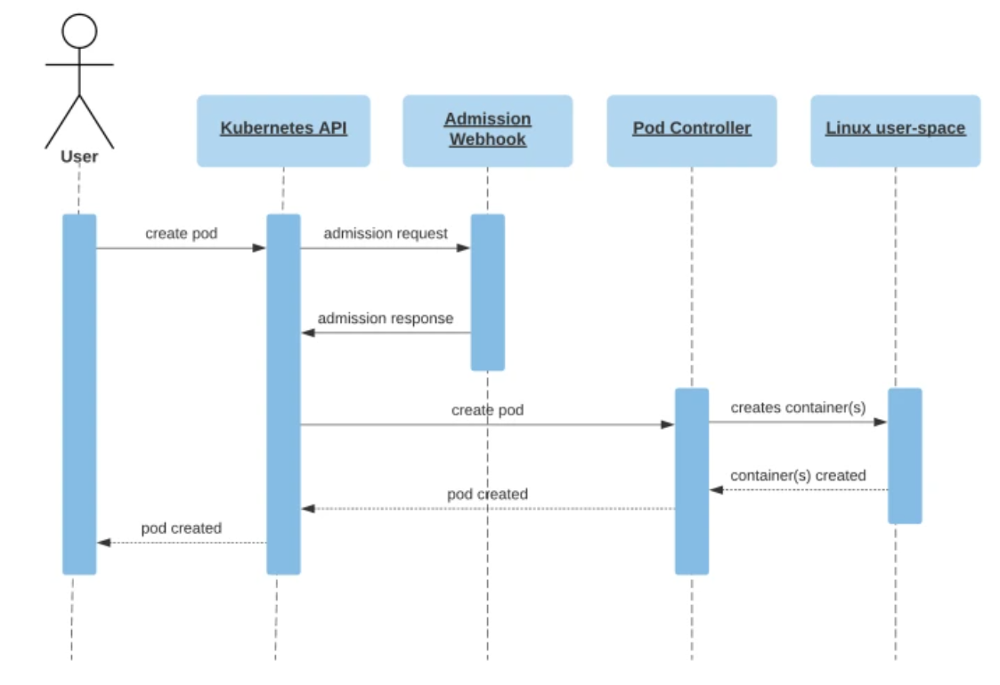

# k8s 的 webhook 经验

<!-- @import "[TOC]" {cmd="toc" depthFrom=3 depthTo=6 orderedList=false} -->

<!-- code_chunk_output -->

- [Admission Webhooks 概述](#admission-webhooks-概述)
- [开发 webhook 的流程](#开发-webhook-的流程)
- [如何给 webhook 配置 TLS 协议以及 openssl 生成自签名证书](#如何给-webhook-配置-tls-协议以及-openssl-生成自签名证书)

<!-- /code_chunk_output -->

需要开发 k8s webhook 插件。

### Admission Webhooks 概述

[What are admission webhooks?](https://kubernetes.io/docs/reference/access-authn-authz/extensible-admission-controllers/):
> Admission webhooks are HTTP callbacks that receive admission requests and do something with them. You can define two types of admission webhooks, validating admission webhook and mutating admission webhook. Mutating admission webhooks are invoked first, and can modify objects sent to the API server to enforce custom defaults. After all object modifications are complete, and after the incoming object is validated by the API server, validating admission webhooks are invoked and can reject requests to enforce custom policies.

如其名字，就是钩子函数。申请一个 pod 时，在这个请求到达 Pod Controller 前 webhook 帮我们修改或者检验一个 pod 的具体申请。



Note that users usually create deployments, jobs, or other higher-level objects which result in pods being created and follow the same flow as pictured. For a more in-depth explanation, see [A Guide to Kubernetes Admission Controllers](https://kubernetes.io/blog/2019/03/21/a-guide-to-kubernetes-admission-controllers/) on the Kubernetes blog.

关于 pod 请求对象，文档：
- https://kubernetes.io/docs/reference/access-authn-authz/extensible-admission-controllers/#request
- https://github.com/slackhq/simple-admission-webhook/blob/main/pkg/validation/validation.go

对于 validation 我们的 webhook 服务返回的 json 如下：

```json
{
 "kind": "AdmissionReview",
 "apiVersion": "admission.k8s.io/v1",
 "response": {
   "uid": "9e8992f7-5761-4a27-a7b0-501b0d61c7f6",
   "allowed": false,
   "status": {
     "message": "pod name contains \"offensive\"",
     "code": 403
   }
 }
}
```

对于 mutation 我们的 webhook 服务返回的 json 如下：

```json
{
  "apiVersion": "admission.k8s.io/v1",
  "kind": "AdmissionReview",
  "response": {
    "uid": "<value from request.uid>",
    "allowed": true,
    "patchType": "JSONPatch",
    "patch": "eyJvcCI6ImFkZCIsInBhdGgiOiIvc3BlYy9jb250YWluZXJzLzAvZW52IiwidmFsdWUiOlt7Im5hbWUiOiJLVUJFIiwidmFsdWUiOiJ0cnVlIn1dfQ=="
  }
}
```

Where `patch` is a base 64 encoded JSON patch:

```json
{"op":"add","path":"/spec/containers/0/env","value":[{"name":"KUBE","value":"true"}]}
```

### 开发 webhook 的流程

可参考：
- [marcel-dempers / docker-development-youtube-series](https://github.com/marcel-dempers/docker-development-youtube-series/tree/master/kubernetes/admissioncontrollers/introduction)
- [slackhq / simple-kubernetes-webhook](https://github.com/slackhq/simple-kubernetes-webhook)
- [A Simple Kubernetes Admission Webhook](https://slack.engineering/simple-kubernetes-webhook/)

具体开发流程我开发完项目再来复盘。

### 如何给 webhook 配置 TLS 协议以及 openssl 生成自签名证书

The Kubernetes API server will only use HTTPS to communicate with admission webhooks. To support HTTPS, we need a TLS certificate. You can either get a TLS certificate from an externally trusted Certificate Authority (CA), or [mint your own](https://github.com/slackhq/simple-kubernetes-webhook/blob/main/dev/gen-certs.sh) and save the CA bundle for the next section. Make sure that the SubjectAltName (SAN) is set to the service hostname (which contains the deployment name and the namespace) such as `simple-kubernetes-webhook.default.svc`.

在这里踩了不少坑。我这里采用的是 `openssl` 生成 self-signed TLS 证书。

目前觉得很重要的是 TLS 协议的注意事项：
- [kubernetes.io: Generate Certificates Manually](https://kubernetes.io/docs/tasks/administer-cluster/certificates/)
- [New Kubernetes Cluster: remote error: tls: bad certificate](https://devops.stackexchange.com/questions/1765/new-kubernetes-cluster-remote-error-tls-bad-certificate)
- [How to Create Self-Signed Certificates using OpenSSL](https://devopscube.com/create-self-signed-certificates-openssl/)

如下是机构认证的 SSL/TLS 证书签发流程。


作为对比，如下是 self-signed 证书的签发流程。


其实区别只有：用于加密的证书的 `root CA` 和对应的 `key` 是 self-signed 自己生成的。

总结一下：
- `root CA` 放在客户端（浏览器里可能已经有了官方的类似 `root CA` 的东西，所以不需要手动防机构签发的证书）
- 我们的服务中应用 `自己的私钥 + CSR配置 + root CA` 生成的证书

在 k8s 里为什么要创建证书？（引用 k8s in action 原文）
- 以 Ingress 为例，当客户端创建到 Ingress 控制器的 TLS 连接时，控制器将中止 TLS 连接
- 客户端和控制器之间的通信是加密的，而控制器和后端 pod 之间的通信则不是
- 运行在 pod 上的应用程序不需要支持 TLS 。例如，如果 pod 运行 web 服务器，则它只能接收 HTTP 通信，并让 Ingress 控制器负责处理与 TLS 相关的所有内容
- 要使控制器能够这样做，需要将证书和私钥附加到 Ingress ，这两个必需资源存储在 Secret 中

如下是 self-signed 生成的脚本。

```bash
# 参考 https://devopscube.com/create-self-signed-certificates-openssl/
# 生成 root CA
openssl req \
  -new -nodes -x509 \
  -days $expiration_days \
  -keyout root-ca.key \
  -out root-ca.cert \
  -subj "你的信息"

# 生成 ssl/tls 证书
openssl genrsa -out tls.key 2048
# 好了，基于 root-ca 签发一下这个 tls.key
# （生成 tls.cert ）
open req -new -key tls.key -subj "/CN=$MASTER_IP_OR_MASTER_ADDRESS" \
  | openssl x509 -days $expiration_days -req -CA -root-ca.key \
    -CAcreateserial -out tls.cert -exfile csr.conf -extensions req_ext
# 这里注意，这个 csr.conf 尤为重要！
```

根据 [kubernetes.io: Generate Certificates Manually](https://kubernetes.io/docs/tasks/administer-cluster/certificates/) 和 [How to Create Self-Signed Certificates using OpenSSL](https://devopscube.com/create-self-signed-certificates-openssl/) ， **这里最重要的是告诉 `openssl` 这个证书用于哪里的哪个机构。** （ Create a certificate signing request (CSR) with a private key. A CSR contains details about location, organization, and FQDN (Fully Qualified Domain Name). ）

你在将 `tls.key` 信息发送给 `tls.cert` 的时候，一定要注意 `/CN=$MASTER_IP_OR_MASTER_ADDRESS` 的信息应该与如下 `csr.conf` 的信息一致。

```
[ req ]
default_bits = 2048
prompt = no
default_md = sha256
req_extensions = req_ext
distinguished_name = dn

[ dn ]
C = US
ST = California
L = San Fransisco
O = MLopsHub
OU = MlopsHub Dev
CN = $MASTER_IP_OR_MASTER_ADDRESS  # 这个!!!

[ req_ext ]
subjectAltName = @alt_names

[ alt_names ]
DNS.1 = $MASTER_IP_OR_MASTER_ADDRESS
DNS.2 = *.demo.mlopshub.com
IP.1 = 192.168.1.5
IP.2 = 192.168.1.6
```

**由于在 k8s 中， webhook 属于内网通信，因此 `$MASTER_IP_OR_MASTER_ADDRESS` 使用 k8s 内部的虚拟地址即可。这里可以是 `abc.namespace.svc.cluster.local` 。** 其中 `abc` 是 webhook 对应的服务名字， `namespace` 是服务所在的命名空间，大部分时候，因为是内网通信，所以 `cluster.local` 也可以省略。

好了，剩下的就比较简单：

```bash
# 给集群添加 secret
kubectl -n 命名空间 create secret tls 名字 \
  --cert tls.cert \
  --key  tls.key
# 部署 webhook 前，将 root-ca.cert 信息交给 webhook 文件
# 可以这样
ca_pem_b64="$(openssl base64 -A <"${secret_dir}/ca.crt")"
# 然后把 ca_pem_b64 的值放到 webhook.yaml 的
# webhook[].clientConfig.caBundle 对应的值里
# 之后再部署其他的服务、服务对应的 deployment 即可
```

此外，还可以参考 [slackhq / simple-kubernetes-webhook](https://github.com/slackhq/simple-kubernetes-webhook) ，这个写得很简洁：

```bash
#!/bin/bash

openssl genrsa -out ca.key 2048

openssl req -new -x509 -days 365 -key ca.key \
  -subj "/C=AU/CN=simple-kubernetes-webhook"\
  -out ca.crt

openssl req -newkey rsa:2048 -nodes -keyout server.key \
  -subj "/C=AU/CN=simple-kubernetes-webhook" \
  -out server.csr

openssl x509 -req \
  -extfile <(printf "subjectAltName=DNS:simple-kubernetes-webhook.default.svc") \
  -days 365 \
  -in server.csr \
  -CA ca.crt -CAkey ca.key -CAcreateserial \
  -out server.crt

echo
echo ">> Generating kube secrets..."
kubectl create secret tls simple-kubernetes-webhook-tls \
  --cert=server.crt \
  --key=server.key \
  --dry-run=client -o yaml \
  > ./manifests/webhook/webhook.tls.secret.yaml

echo
echo ">> MutatingWebhookConfiguration caBundle:"
cat ca.crt | base64 | fold

rm ca.crt ca.key ca.srl server.crt server.csr server.key
```
