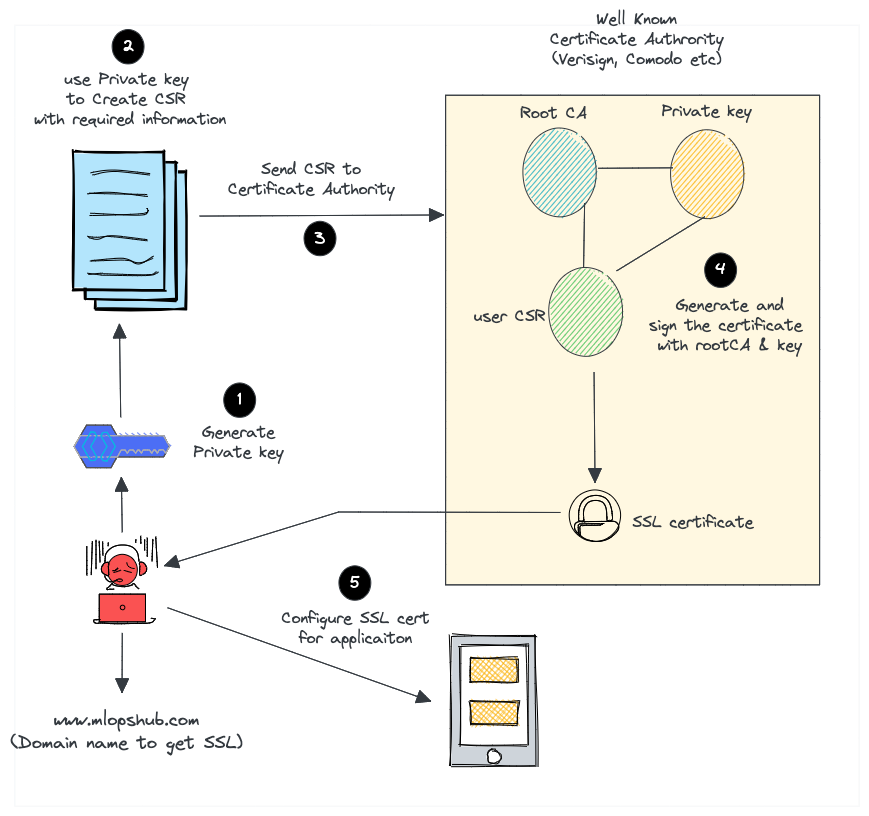
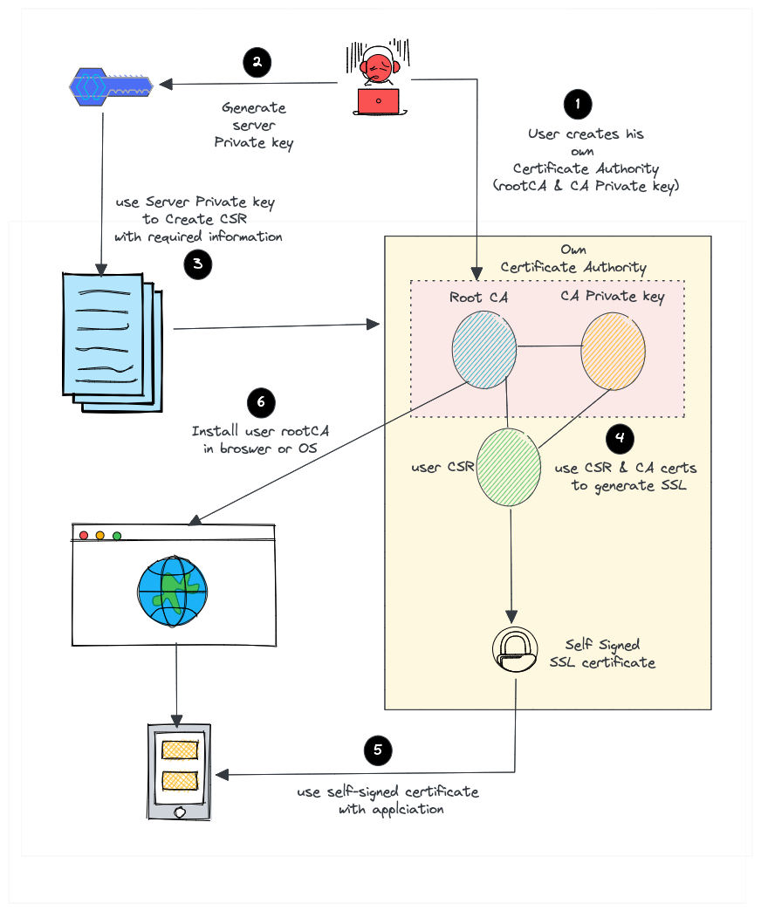

# k8s 的 webhook 经验

<!-- @import "[TOC]" {cmd="toc" depthFrom=3 depthTo=6 orderedList=false} -->

<!-- code_chunk_output -->

- [开发 webhook 的流程](#开发-webhook-的流程)
- [如何给 webhook 配置 TLS 协议以及 openssl 生成自签名证书](#如何给-webhook-配置-tls-协议以及-openssl-生成自签名证书)

<!-- /code_chunk_output -->

需要开发 k8s webhook 插件。

### 开发 webhook 的流程

可参考：
- [marcel-dempers / docker-development-youtube-series](https://github.com/marcel-dempers/docker-development-youtube-series/tree/master/kubernetes/admissioncontrollers/introduction)

具体开发流程我开发完项目再来复盘。

### 如何给 webhook 配置 TLS 协议以及 openssl 生成自签名证书

在这里踩了不少坑。我这里采用的是 `openssl` 生成 self-signed TLS 证书。

目前觉得很重要的是 TLS 协议的注意事项：
- [kubernetes.io: Generate Certificates Manually](https://kubernetes.io/docs/tasks/administer-cluster/certificates/)
- [New Kubernetes Cluster: remote error: tls: bad certificate](https://devops.stackexchange.com/questions/1765/new-kubernetes-cluster-remote-error-tls-bad-certificate)
- [How to Create Self-Signed Certificates using OpenSSL](https://devopscube.com/create-self-signed-certificates-openssl/)

如下是机构认证的 SSL/TLS 证书签发流程。



作为对比，如下是 self-signed 证书的签发流程。



其实区别只有：用于加密的证书的 `root CA` 和对应的 `key` 是 self-signed 自己生成的。

总结一下：
- `root CA` 放在客户端（浏览器里可能已经有了官方的类似 `root CA` 的东西，所以不需要手动防机构签发的证书）
- 我们的服务中应用 `自己的私钥 + CSR配置 + root CA` 生成的证书

在 k8s 里为什么要创建证书？（引用 k8s in action 原文）
- 以 Ingress 为例，当客户端创建到 Ingress 控制器的 TLS 连接时，控制器将中止 TLS 连接
- 客户端和控制器之间的通信是加密的，而控制器和后端 pod 之间的通信则不是
- 运行在 pod 上的应用程序不需要支持 TLS 。例如，如果 pod 运行 web 服务器，则它只能接收 HTTP 通信，并让 Ingress 控制器负责处理与 TLS 相关的所有内容
- 要使控制器能够这样做，需要将证书和私钥附加到 Ingress ，这两个必需资源存储在 Secret 中

如下是 self-signed 生成的脚本。

```bash
# 参考 https://devopscube.com/create-self-signed-certificates-openssl/
# 生成 root CA
openssl req \
  -new -nodes -x509 \
  -days $expiration_days \
  -keyout root-ca.key \
  -out root-ca.cert \
  -subj "你的信息"

# 生成 ssl/tls 证书
openssl genrsa -out tls.key 2048
# 好了，基于 root-ca 签发一下这个 tls.key
# （生成 tls.cert ）
open req -new -key tls.key -subj "/CN=$MASTER_IP_OR_MASTER_ADDRESS" \
  | openssl x509 -days $expiration_days -req -CA -root-ca.key \
    -CAcreateserial -out tls.cert -exfile csr.conf -extensions req_ext
# 这里注意，这个 csr.conf 尤为重要！
```

根据 [kubernetes.io: Generate Certificates Manually](https://kubernetes.io/docs/tasks/administer-cluster/certificates/) 和 [How to Create Self-Signed Certificates using OpenSSL](https://devopscube.com/create-self-signed-certificates-openssl/) ， **这里最重要的是告诉 `openssl` 这个证书用于哪里的哪个机构。** （ Create a certificate signing request (CSR) with a private key. A CSR contains details about location, organization, and FQDN (Fully Qualified Domain Name). ）

你在将 `tls.key` 信息发送给 `tls.cert` 的时候，一定要注意 `/CN=$MASTER_IP_OR_MASTER_ADDRESS` 的信息应该与如下 `csr.conf` 的信息一致。

```
[ req ]
default_bits = 2048
prompt = no
default_md = sha256
req_extensions = req_ext
distinguished_name = dn

[ dn ]
C = US
ST = California
L = San Fransisco
O = MLopsHub
OU = MlopsHub Dev
CN = $MASTER_IP_OR_MASTER_ADDRESS  # 这个!!!

[ req_ext ]
subjectAltName = @alt_names

[ alt_names ]
DNS.1 = $MASTER_IP_OR_MASTER_ADDRESS
DNS.2 = *.demo.mlopshub.com
IP.1 = 192.168.1.5
IP.2 = 192.168.1.6
```

**由于在 k8s 中， webhook 属于内网通信，因此 `$MASTER_IP_OR_MASTER_ADDRESS` 使用 k8s 内部的虚拟地址即可。这里可以是 `abc.namespace.svc.cluster.local` 。** 其中 `abc` 是 webhook 对应的服务名字， `namespace` 是服务所在的命名空间，大部分时候，因为是内网通信，所以 `cluster.local` 也可以省略。

好了，剩下的就比较简单：

```bash
# 给集群添加 secret
kubectl -n 命名空间 create secret tls 名字 \
  --cert tls.cert \
  --key  tls.key
# 部署 webhook 前，将 root-ca.cert 信息交给 webhook 文件
# 可以这样
ca_pem_b64="$(openssl base64 -A <"${secret_dir}/ca.crt")"
# 然后把 ca_pem_b64 的值放到 webhook.yaml 的
# webhook[].clientConfig.caBundle 对应的值里
# 之后再不是其他的服务、服务对应的 deployment 即可
```
