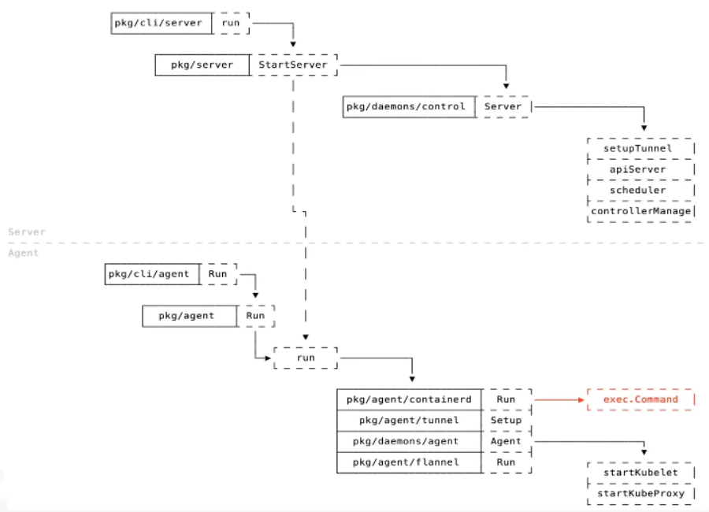

# 认识 k3s ：基本高可用架构以及在 multipass 里模拟场景

<!-- @import "[TOC]" {cmd="toc" depthFrom=3 depthTo=6 orderedList=false} -->

<!-- code_chunk_output -->

- [k3s 亮点](#k3s-亮点)
- [初始 k3s （如何查看 k3s 启动？）](#初始-k3s-如何查看-k3s-启动)
- [k3s 代码组织架构](#k3s-代码组织架构)
  - [k3s 实例：查看 k3s 进程（使用 multipass 虚拟机）](#k3s-实例查看-k3s-进程使用-multipass-虚拟机)
  - [k3s 如何保证高可用?（单/多点架构外接数据库或 server 内置 Dqlite ，依靠 kine）](#k3s-如何保证高可用单多点架构外接数据库或-server-内置-dqlite-依靠-kine)

<!-- /code_chunk_output -->

参考：
- [从0到1基础入门 全面了解k3s](https://www.bilibili.com/video/BV1g7411G7By)
- https://k3s.io/
- https://docs.rancher.cn/docs/k3s/quick-start/_index 含国内镜像资源
- [从0到1基础入门 全面了解k3s](https://www.bilibili.com/video/BV1g7411G7By)
- [k3s高可用架构、Containerd](https://www.bilibili.com/video/BV197411c759)
- [01.从0到1基础入门-全面了解k3s.pdf](../resources/01.从0到1基础入门-全面了解k3s.pdf)
- [02.核心架构全掌握-k3s进阶探索(一).pdf](../resources/02.核心架构全掌握-k3s进阶探索(一).pdf)

### k3s 亮点

相比 k8s ， k3s 降低了通用性（比如由于历史原因保留了很多驱动）、删除了冗余的 API 、使用单进程架构简化部署（将很多进程改为 go 协程）。

k3s 默认使用 Containerd 而非 Docker 。

### 初始 k3s （如何查看 k3s 启动？）

我最终还是用的 Azure ，这样下载 github 文件在一瞬间完成。

```bash
(base) PiperLiu1998@rlco-promo:~$ curl -sfL https://get.k3s.io | sh -
[INFO]  Finding release for channel stable
[INFO]  Using v1.23.6+k3s1 as release
[INFO]  Downloading hash https://github.com/k3s-io/k3s/releases/download/v1.23.6+k3s1/sha256sum-amd64.txt
[INFO]  Downloading binary https://github.com/k3s-io/k3s/releases/download/v1.23.6+k3s1/k3s
[INFO]  Verifying binary download
[INFO]  Installing k3s to /usr/local/bin/k3s
[INFO]  Skipping installation of SELinux RPM
[INFO]  Creating /usr/local/bin/kubectl symlink to k3s
[INFO]  Creating /usr/local/bin/crictl symlink to k3s
[INFO]  Creating /usr/local/bin/ctr symlink to k3s
[INFO]  Creating killall script /usr/local/bin/k3s-killall.sh
[INFO]  Creating uninstall script /usr/local/bin/k3s-uninstall.sh
[INFO]  env: Creating environment file /etc/systemd/system/k3s.service.env
[INFO]  systemd: Creating service file /etc/systemd/system/k3s.service
[INFO]  systemd: Enabling k3s unit
Created symlink /etc/systemd/system/multi-user.target.wants/k3s.service → /etc/systemd/system/k3s.service.
[INFO]  systemd: Starting k3s

# sudo k3s kubectl get node
(base) PiperLiu1998@rlco-promo:~$ sudo k3s kubectl get node
NAME         STATUS   ROLES                  AGE   VERSION
rlco-promo   Ready    control-plane,master   73s   v1.23.6+k3s1
# sudo kubectl get ns
(base) PiperLiu1998@rlco-promo:~$ sudo kubectl get ns
NAME              STATUS   AGE
default           Active   99s
kube-system       Active   99s
kube-public       Active   99s
kube-node-lease   Active   99s
(base) PiperLiu1998@rlco-promo:~$
```

如何判定 k3s 是否启动？

```bash
# 可以看日志
tail -f /var/log/syslog

# 看 k3s 核心组件
kubectl get all -n kube-system
```

### k3s 代码组织架构



如上， Angent 的 containerd 会启动一个 `exec.Command` 作为自己的子进程（ Containerd 是一个独立的进程 ）。

为什么有 StartServer 直接用虚线连到 run ？如果我们 k3s server 启动时也会作为一个 node ，如果 disable server （不应用 `run` ）则会成为一个裸的 server 。

k3s 轻量简单是因为：
- 删除旧的非必要的代码
- 打包需要运行的组件到一个进程内
- 使用 Containerd 作为容器运行时
- 引入 SQLite 作为可选的存储源

k3s 分为 k3s server 和 k3s agent：
- k3s server 只有一个进程体
- k3s agnet 分为两个进程体，其中一个是 Contrainerd，负责管理运行容器

- k3s 代码组织结构分析参考： [k3s的单进程模式如何运行整个K8S服务](https://mp.weixin.qq.com/s/1o9X0Dlv2WhUS6iC9P-KQA)
- k3s 部署参考： [Just 5分钟！使用k3s部署轻量Kubernetes集群快速教程](https://mp.weixin.qq.com/s/V-VyWrCZux5WXxD__QpEWQ)
- k3s 为何轻量： [刚刚GA的k3s究竟是什么？](https://mp.weixin.qq.com/s/5aprEfYSWJyVoW4trDp4Hw)

#### k3s 实例：查看 k3s 进程（使用 multipass 虚拟机）

首先安装 multipass 虚拟机，来模拟多台机器。

```bash
azureuser@StdUbuntu:~$ sudo snap install multipass
2022-06-17T03:22:18Z INFO Waiting for automatic snapd restart...
multipass 1.9.2 from Canonical✓ installed
azureuser@StdUbuntu:~$ multipass version
multipass   1.9.2
multipassd  1.9.2
```

如下是一台 server 、一台 agent 的实例。我们这里的思路是，获取 server 中 k3s server 的 pid ，依据这个 pid 可以查看一些其他内容，如 server 中 k3s server 的进程树、线程等。

```bash
s/k3s/setup                                                                                                                                                                                                 
➜ # view k3s server process                                                                                                                                                                                 
                                                                                                                                                                                                            
s/k3s/setup                                                                                                                                                                                                 
➜ multipass list                                                                                                                                                                                            
Name                    State             IPv4             Image                                                                                                                                            
k3s-a                   Running           192.168.64.6     Ubuntu 18.04 LTS                                                                                                                                 
k3s-s                   Running           192.168.64.5     Ubuntu 18.04 LTS                                                                                                                                 
                                                                                                                                                                                                            
s/k3s/setup                                                                                                                                                                                                 
➜ # k3s-s                                                                                                                                                                                                   
                                                                                                                                                                                                            
s/k3s/setup                                                                                                                                                                                                 
➜ ## view the process of k3s server                                                                                                                                                                         
multipass exec k3s-s -- sh -c "ps -ef | grep [k]3s"                                                                                                                                                         
root      1789     1  3 15:09 ?        00:01:22 /usr/local/bin/k3s server --disable-agent                                                                                                                   
                                                                                                                                                                                                            
s/k3s/setup                                                                                                                                                                                                 
➜ ## get the process id of k3s server                                                                                                                                                                       
s_pid=$(multipass exec k3s-s -- sh -c "ps -ef | grep [k]3s" | awk '{printf $2}')                                                                                                                            
                                                                                                                                                                                                            
s/k3s/setup                                                                                                                                                                                                 
➜ echo $s_pid                                                                                                                                                                                               
1789                                                                                                                                                                                                        
                                                                                                                                                                                                            
s/k3s/setup                                                                                                                                                                                                 
➜ ## view the process tree of k3s server                                                                                                                                                                    
multipass exec k3s-s -- sh -c "pstree -p -aT ${s_pid}"                                                                                                                                                      
k3s-server,1789 server --disable-agent                                                                                                                                                                      
                                                                                                                                                                                                            
s/k3s/setup                                                                                                                                                                                                 
➜ ## view the threads of k3s server                                                                                                                                                                         
multipass exec k3s-s -- sh -c "ps -T ${s_pid}"                                                                                                                                                              
  PID  SPID TTY      STAT   TIME COMMAND                                                                                                                                                                    
 1789  1789 ?        Ssl    0:01 /usr/local/bin/k3s server --disable-agent                                                                                                                                  
 1789  1794 ?        Ssl    0:17 /usr/local/bin/k3s server --disable-agent                                                                                                                                  
 1789  1795 ?        Ssl    0:03 /usr/local/bin/k3s server --disable-agent                                                                                                                                  
 1789  1796 ?        Ssl    0:00 /usr/local/bin/k3s server --disable-agent                                                                                                                                  
 1789  1797 ?        Ssl    0:00 /usr/local/bin/k3s server --disable-agent                                                                                                                                  
 1789  1801 ?        Ssl    0:19 /usr/local/bin/k3s server --disable-agent                                                                                                                                  
 1789  1802 ?        Ssl    0:14 /usr/local/bin/k3s server --disable-agent                                                                                                                                  
 1789  1809 ?        Ssl    0:00 /usr/local/bin/k3s server --disable-agent                                                                                                                                  
 1789  1811 ?        Ssl    0:16 /usr/local/bin/k3s server --disable-agent                                                                                                                                  
 1789  1812 ?        Ssl    0:00 /usr/local/bin/k3s server --disable-agent                                                                                                                                  
 1789  1813 ?        Ssl    0:10 /usr/local/bin/k3s server --disable-agent                                                                                                                                  
 1789  1814 ?        Ssl    0:00 /usr/local/bin/k3s server --disable-agent
```

此外还可以通过 netstat 查看 k3s server 的 port 。

注意到， k3s server 的端口是 6443 ，而 6444 主要是给 api server 用的。

```bash
s/k3s/setup                                                                                                                                                                                                 
➜ ## view the ports of k3s server                                                                                                                                                                           
multipass exec k3s-s -- sh -c "sudo netstat -ntlp | grep [k]3s"                                                                                                                                             
tcp        0      0 127.0.0.1:6444          0.0.0.0:*               LISTEN      1789/k3s                                                                                                                    
tcp6       0      0 :::10251                :::*                    LISTEN      1789/k3s                                                                                                                    
tcp6       0      0 :::6443                 :::*                    LISTEN      1789/k3s                                                                                                                    
tcp6       0      0 :::10252                :::*                    LISTEN      1789/k3s                                                                                                                    
                                                                                                                                                                                                            
s/k3s/setup                                                                                                                                                                                                 
➜ # 6443(k3s server),  6444(api-server)
```

然后可以来查看一下 k3s agent 的进程相关内容。

```bash
s/k3s/setup                                                                                                                                                                                                 
➜ # view k3s agent process                                                                                                                                                                                  
                                                                                                                                                                                                            
s/k3s/setup                                                                                                                                                                                                 
➜ ## view the process of k3s agent                                                                                                                                                                          
multipass exec k3s-a -- sh -c "ps -ef | grep '[k]3s agent'"                                                                                                                                                 
root      1817     1  1 15:15 ?        00:00:21 /usr/local/bin/k3s agent                                                                                                                                    
                                                                                                                                                                                                            
s/k3s/setup                                                                                                                                                                                                 
➜ ## get the process id of k3s agent                                                                                                                                                                        
a_pid=$(multipass exec k3s-a -- sh -c "ps -ef | grep '[k]3s agent'" | awk '{printf $2}')                                                                                                                    
                                                                                                                                                                                                            
s/k3s/setup                                                                                                                                                                                                 
➜ echo $a_pid                                                                                                                                                                                               
1817                                                                                                                                                                                                        
                                                                                                                                                                                                            
s/k3s/setup                                                                                                                                                                                                 
➜ ## view the process tree of k3s agent                                                                                                                                                                     
multipass exec k3s-a -- sh -c "pstree -p -aT ${a_pid}"                                                                                                                                                      
k3s-agent,1817 agent                                                                                                                                                                                        
  └─containerd,1845 -c /var/lib/rancher/k3s/agent/etc/containerd/config.toml -a /run/k3s/containerd/containerd.sock --state /run/k3s/containerd --root /var/lib/rancher/k3s/agent/containerd                
                                                                                                                                                                                                            
s/k3s/setup                                                                                                                                                                                                 
➜ ## view the ports of k3s agent                                                                                                                                                                            
multipass exec k3s-a -- sh -c "sudo netstat -ntlp | grep [k]3s"                                                                                                                                             
tcp        0      0 127.0.0.1:10248         0.0.0.0:*               LISTEN      1817/k3s                                                                                                                    
tcp        0      0 127.0.0.1:10249         0.0.0.0:*               LISTEN      1817/k3s                                                                                                                    
tcp        0      0 127.0.0.1:44361         0.0.0.0:*               LISTEN      1817/k3s                                                                                                                    
tcp        0      0 127.0.0.1:10256         0.0.0.0:*               LISTEN      1817/k3s                                                                                                                    
tcp6       0      0 :::10250                :::*                    LISTEN      1817/k3s                                                                                                                    
```

#### k3s 如何保证高可用?（单/多点架构外接数据库或 server 内置 Dqlite ，依靠 kine）


外置数据库在 k3s server 内用 [kine](https://github.com/k3s-io/kine) 模块实现数据的转存（ Kine is an etcdshim that translates etcd API to sqlite, Postgres, Mysql, and dqlite ）。

外置数据库。但也会带来局限性：
- 需要额外的资源支持
- 需要运维人员进行维护
- 可能面临不可用情况

因此，是否可以给 k3s 应用分布式数据库？

了解一下 SQLite ：
- 不是独立的进程，而是 c 编写的库文件
- 在 k3s 中利用 c-go 可以直接调用

基于 SQLite 有了 Dqlite ：
- 也是软件库，而非独立进程， c 编写
- 分布式一致： C-Raft 实现
- 兼容 SQLite


这里模拟了一个外界数据库、多点架构的例子 https://asciinema.org/a/OFaQIHuye4AU5QBaEgzUFq9ql
- 在本地的 docker 起一个 mysql 作为外部数据库
- 在本地的做两个 multipass 虚拟机作为两台 server
- 在本地的 docker 起一个 nigix 作为 4l 负载

