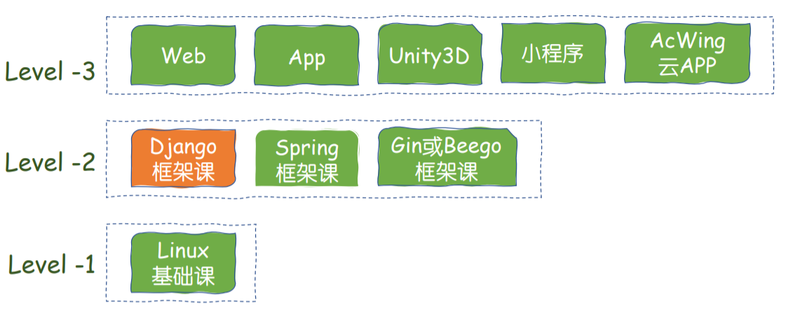

# 课程概论和Python3语法

- 作者：yxc
- 链接：https://www.acwing.com/file_system/file/content/whole/index/content/3091867/
- 来源：AcWing
- 著作权归作者所有。商业转载请联系作者获得授权，非商业转载请注明出处。

<!-- @import "[TOC]" {cmd="toc" depthFrom=3 depthTo=3 orderedList=false} -->

<!-- code_chunk_output -->

- [课程体系](#课程体系)
- [Django简介](#django简介)
- [实战项目](#实战项目)
- [开发环境](#开发环境)
- [Python3语法](#python3语法)

<!-- /code_chunk_output -->

细分目录：

<!-- @import "[TOC]" {cmd="toc" depthFrom=3 depthTo=4 orderedList=false} -->

<!-- code_chunk_output -->

- [课程体系](#课程体系)
- [Django简介](#django简介)
- [实战项目](#实战项目)
- [开发环境](#开发环境)
- [Python3语法](#python3语法)

<!-- /code_chunk_output -->

### 课程体系

不管自己有没有经验，听听 y 总课总是没错的，牛逼。开森。

### Django简介

`Django`是后起之秀，近些年越来越流行，`Youtube`（月活20亿+）、`Instagram`（月活10亿+）等公司采用了`Django`框架。

可以作为Web、App、小程序、AcWing云端App（AC APP）等各种项目的后端。

`Django`优势：
- 开发效率高，生态完善，有官方社区长期支持
- 运行效率高（常见误区：`python`运行效率低，所以`python`写的应用运行效率低）
- 项目运行效率瓶颈有很多，比如：数据库查询、网络带宽/延迟、硬盘读写速度等，这些与框架关系不大。
- 计算密集型的模块可以用`C/C++`实现，然后编译成动态链接库再`import`进来。
- 计算密集型的微服务可以通过`thrift`等工具对接，微服务的`Server`端代码可以用`C/C++`语言实现。
- 有很多工具可以将`Python`代码翻译成`C/C++`，比如`Cython`、`Pypy`。AcWing 题库中的不少题目，会发现`Python3`比`Java`还快一些。
- 既适合大公司，也适合个人开发者，平均开发一个Web/AC App只需要半个月到一个月。

### 实战项目

课程中会开发一款支持在线联机对战的简易版吃鸡游戏，前后端分离，前端支持AC APP端和Web端。

功能包括：
- 游戏菜单、游戏设置：熟悉`http`协议
- 存储对局信息、账户信息：熟悉数据库操作
- 在`Redis`中存储每局对战状态：熟悉内存数据库操作
- 在线聊天室、实时移动、实时放技能：熟悉`websocket`协议
- 在线匹配系统：熟悉`thrift`和微服务
- 配置`nginx`：熟悉`nginx`部署云服务

### 开发环境

- 完全无需配置本地环境。利用`AC Terminal`直接在云端开发，使用工具：`vim`、`tmux`等。不推荐在本地开发
  - 本项目会涉及多台服务器间的网络通信，如果在本地开发，未来不方便调试和部署。
  - 在本地开发无法统一开发环境，部分`python`包在`windows`系统上安装困难。
- 需要租一台具有公网IP的云服务器，并安装`docker`。
  - 服务器配置无要求
  - 后期可以利用`docker`随意迁移
- 在`AC Terminal`的`/var/lib/acwing/docker/images/`目录下给大家提供统一的课程`docker`镜像。
  - 标准化开发环境，避免未来出现软件版本不兼容。
  - 省去配环境的环节。
- 使用`AC Git`管理项目代码。
  - 方便回滚代码

### Python3语法

- 教学工具：[AC Terminal](https://www.acwing.com/file_system/file/content/whole/index/content/2543025/)。
- [python官方教程](https://docs.python.org/zh-cn/3/tutorial/index.html)。

**Python3 我已经...读了很多文档了，写了很多相对高阶的文章了...很熟很熟了，没必要再记笔记了。**

