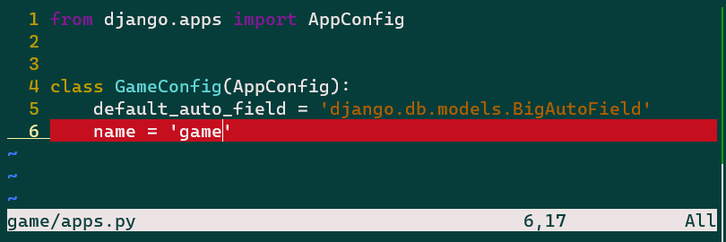
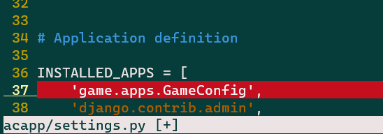
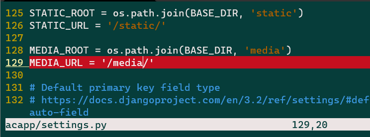
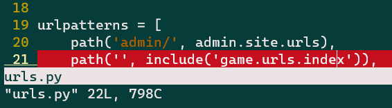
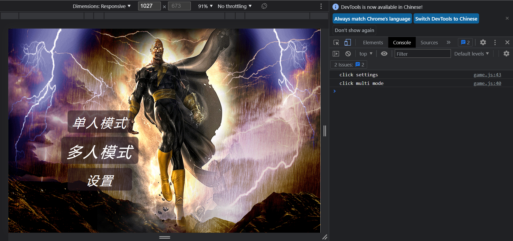

# 创建菜单界面（Django基础）

- 作者：yxc
- 链接：https://www.acwing.com/file_system/file/content/whole/index/content/3199626/
- 来源：AcWing
- 著作权归作者所有。商业转载请联系作者获得授权，非商业转载请注明出处。

<!-- @import "[TOC]" {cmd="toc" depthFrom=3 depthTo=3 orderedList=false} -->

<!-- code_chunk_output -->

- [项目结构与素材](#项目结构与素材)
- [操作路径记录](#操作路径记录)
- [总结](#总结)

<!-- /code_chunk_output -->

细分目录：

<!-- @import "[TOC]" {cmd="toc" depthFrom=3 depthTo=4 orderedList=false} -->

<!-- code_chunk_output -->

- [项目结构与素材](#项目结构与素材)
  - [项目系统设计](#项目系统设计)
  - [项目文件结构](#项目文件结构)
  - [本节课用到的素材地址](#本节课用到的素材地址)
- [操作路径记录](#操作路径记录)
  - [首先整理项目结构](#首先整理项目结构)
  - [修改全局配置](#修改全局配置)
  - [js打包](#js打包)
  - [html结构](#html结构)
  - [初始化 JavaScript](#初始化-javascript)
  - [写 views 和 urls](#写-views-和-urls)
  - [配置完成，开始写js渲染函数](#配置完成开始写js渲染函数)
- [总结](#总结)

<!-- /code_chunk_output -->

### 项目结构与素材

#### 项目系统设计

- `menu`：菜单页面
- `playground`：游戏界面
- `settings`：设置界面

#### 项目文件结构
- `templates`目录：管理`html`文件
- `urls`目录：管理路由，即链接与函数的对应关系
- `views`目录：管理`http`函数（我认为是负责返回 `http` 渲染内容）
- `models`目录：管理数据库数据
- `static`目录：管理静态文件，比如：
  - `css`：对象的格式，比如位置、长宽、颜色、背景、字体大小等
  - `js`：对象的逻辑，比如对象的创建与销毁、事件函数、移动、变色等
  - `image`：图片
  - `audio`：声音
  - …
- `consumers`目录：管理`websocket`函数

#### 本节课用到的素材地址

- [背景图片](https://gimg2.baidu.com/image_search/src=http%3A%2F%2Finews.gtimg.com%2Fnewsapp_match%2F0%2F11156556256%2F0.jpg&refer=http%3A%2F%2Finews.gtimg.com&app=2002&size=f9999,10000&q=a80&n=0&g=0n&fmt=jpeg)
  - 下载方式：`wget --output-document=自定义图片名称 图片地址`
- `jquery`库：
  - `<link rel="stylesheet" href="https://cdn.acwing.com/static/jquery-ui-dist/jquery-ui.min.css">`
  - `<script src="https://cdn.acwing.com/static/jquery/js/jquery-3.3.1.min.js"></script>`

### 操作路径记录

**我的 git 仓库：**
- https://git.acwing.com/PiperLiu/acapp

**访问：**
- http://49.232.99.41:8000/

#### 首先整理项目结构

我们在 `python` 中调用 `import urls.xxx` 时，`urls.py` 还是 `urls` 作为一个 `moudle` （文件夹）都可以。

这里为了防止 `urls.py` 和 `views.py` 太冗长，因此删掉单个文件，改用 `moudle` 。如果是 `moudle` 的话，需要有 `__init__.py` 帮助 `python` 解释器认定这个文件夹是一个 `moudle` 。

```bash
acs:~/acapp$ cd game/
acs:~/acapp/game$ rm views.py
acs:~/acapp/game$ rm urls.py
acs:~/acapp/game$ mkdir views urls
```

`models` 同理。

```bash
acs:~/acapp/game$ rm models.py
acs:~/acapp/game$ mkdir models
```

建立 `__init__.py` 。

```bash
acs:~/acapp/game$ touch urls/__init__.py
acs:~/acapp/game$ touch models/__init__.py
acs:~/acapp/game$ touch views/__init__.py
```

此外建立 `static` 管理静态资源。

#### 修改全局配置

##### 设置时区

在 `acapp/settings.py` ：

```
-TIME_ZONE = 'UTC'
+TIME_ZONE = 'Asia/Shanghai'
```

##### 把自己的app加到settings



如上，我们在 `settings` 里加入。



##### 设置静态文件



如上都可以存放静态文件，一般来讲， y 总：
- 在 `static` 存放开发者静态文件
- 在 `media` 存放用户静态文件

```bash
acs:~/acapp/game$ cd static/
acs:~/acapp/game/static$ ls
acs:~/acapp/game/static$ mkdir css js image
acs:~/acapp/game/static$ cd image/
acs:~/acapp/game/static/image$ mkdir menu playground settings
acs:~/acapp/game/static/image$ ls
menu  playground  settings
```

用 `wget` 在 Linux 中下载。

```bash
acs:~/acapp/game/static/image/menu$ wget --output-document=background.gif https://gimg2.baidu.com/image_search/src=http%3A%2F%2Finews.gtimg.com%2Fnewsapp_match%2F0%2F11156556256%2F0.jpg&refer=http%3A%2F%2Finews.gtimg.com&app=2002&size=f9999,10000&q=a80&n=0&g=0n&fmt=jpeg
[1] 507
[2] 508
[3] 509
[4] 510
[5] 511
[6] 512
[7] 513
acs:~/acapp/game/static/image/menu$
Redirecting output to 'wget-log'.

[1]   Done                    wget --output-document=background.gif https://gimg2.baidu.com/image_search/src=http%3A%2F%2Finews.gtimg.com%2Fnewsapp_match%2F0%2F11156556256%2F0.jpg
[2]   Done                    refer=http%3A%2F%2Finews.gtimg.com
[3]   Done                    app=2002
[4]   Done                    size=f9999,10000
[5]   Done                    q=a80
[6]-  Done                    n=0
[7]+  Done                    g=0n
acs:~/acapp/game/static/image/menu$ ls
background.gif  wget-log
acs:~/acapp/game/static/image/menu$ rm wget-log
```

现在直接在
```
<你的域名/ip>:<端口号>/static/image/menu/background.gif
```
就可以访问你的图片。

#### js打包

一些关于 `js` 和 `css` 的讲解我就不详细记录了😅

其中，把 `src` 中 `js` 打包成 `dist` ，防止并行加载 `js` 造成的效果损失。

这里 y总 用 `shell` 打包属实有点猛。

在 `scripts/compress_game_js.sh` 中：

```bash
#! /bin/bash

JS_PATH=/home/acs/acapp/game/static/js/
JS_PATH_DIST=${JS_PATH}dist/
JS_PATH_SRC=${JS_PATH}src/

find $JS_PATH_SRC -type f -name '*.js' | sort | xargs cat > ${JS_PATH_DIST}game.js
```

```bash
acs:~/acapp$ mkdir scripts
acs:~/acapp$ vim compress_game_js.sh
acs:~/acapp$ chmod +x compress_game_js.sh
```

#### html结构

```bash
acs:~/acapp/game$ ls
__init__.py  admin.py  migrations  static    urls
__pycache__  apps.py   models      tests.py  views
acs:~/acapp/game$ mkdir templates
acs:~/acapp/game$ cd templates/
acs:~/acapp/game/templates$ mkdir multiends
acs:~/acapp/game/templates$ ls
multiends
acs:~/acapp/game/templates$ mkdir menu playground settings
```

`vim multiends/web.html`：

```html


<head>
    <link rel="stylesheet" href="https://cdn.acwing.com/static/jquery-ui-dist/jquery-ui.min.css">
    <script src="https://cdn.acwing.com/static/jquery/js/jquery-3.3.1.min.js"></script>
    <link rel="stylesheet" href="">
    <script src=""></script>
</head>

<body style="margin: 0">
    <div id="ac_game_12345678"></div>
    <script>
        $(document).ready(function(){
            let ac_game = new AcGame("ac_game_12345678");
        });
    </script>
</body>
```

- 这里用了 Django 语法糖 `` 、 `` 、 `` 加载静态文件
- 未来的界面都是在 `js` 中 `AcGame` 渲染的（这样就在前端渲染，不给服务器压力）

#### 初始化 JavaScript

```bash
acs:~/acapp/game/static$ cd js
acs:~/acapp/game/static/js$ ls
acs:~/acapp/game/static/js$ mkdir src dist
acs:~/acapp/game/static/js/src$ 
acs:~/acapp/game/static/js/src$ mkdir menu playground settings
acs:~/acapp/game/static/js/src$ vim zbase.js
```

为啥叫 `zbase.js` ？
- y总习惯
- 因为是拿 `shell` 根据字典序打包的，所以为了把 `zbase.js` 放在最后...

`/home/acs/acapp/game/static/js/src/zbase.js`：
```bash
class AcGame {
    constructor(id) {
        this.id = id;
        this.$ac_game = $('#' + id);
        this.menu = new AcGameMenu(this);
        this.playground = new AcGamePlayground(this);

        this.start();
    }

    start() {
    }
}
```

#### 写 views 和 urls

之后写 `views` 用于返回给客户端静态资源。

```bash
acs:~/acapp/game$ cd views/
acs:~/acapp/game/views$ ls
__init__.py
acs:~/acapp/game/views$ mkdir menu playground settings
acs:~/acapp/game/views$ cd menu/
acs:~/acapp/game/views/menu$ touch __init__.py
acs:~/acapp/game/views/menu$ cd ..
acs:~/acapp/game/views$ touch playground/__init__.py settings/__init__.py
acs:~/acapp/game/views$ tree
.
|-- __init__.py
|-- menu
|   `-- __init__.py
|-- playground
|   `-- __init__.py
`-- settings
    `-- __init__.py

3 directories, 4 files
acs:~/acapp/game/views$ vim index.py
```

`vim index.py`：
```python
from django.shortcuts import render


def index(request):
    return render(request, "multiends/web.html")
```

```bash
acs:~/acapp/game/views$ cd ..
acs:~/acapp/game$ cd urls/
acs:~/acapp/game/urls$ ls
__init__.py  __pycache__
acs:~/acapp/game/urls$ mkdir menu playground settings
acs:~/acapp/game/urls$ touch playground/__init__.py settings/__init__.py menu/__init__.py
acs:~/acapp/game/urls$ vim index.py
```

`vim index.py`：
```bash
from django.urls import path, include
from game.views.index import index


urlpatterns = [
    path("", index, name="index"),
    path("menu/", include("game.urls.menu.index")),
    path("playground/", include("game.urls.playground.index")),
    path("settings/", include("game.urls.settings.index")),
]
```

为了将 `menu.index` 、 `playground.index` 与 `settings.index` 引入，我们需要在相应模块创建 `index.py` 。

都是一个样子：
```python
from django.urls import path, include


urlpatterns = [
]
```

```bash
acs:~/acapp/game/urls/settings$ vim index.py
acs:~/acapp/game/urls/settings$ cd ..
acs:~/acapp/game/urls$ cp settings/index.py menu/index.py
acs:~/acapp/game/urls$ cp settings/index.py playground/index.py
acs:~/acapp/game/urls$ ls
__init__.py  __pycache__  index.py  menu  playground  settings
acs:~/acapp/game/urls$ tree
.
|-- __init__.py
|-- __pycache__
|   `-- __init__.cpython-38.pyc
|-- index.py
|-- menu
|   |-- __init__.py
|   `-- index.py
|-- playground
|   |-- __init__.py
|   `-- index.py
`-- settings
    |-- __init__.py
    `-- index.py

4 directories, 9 files
acs:~/acapp/game/urls$
```

然后去修改全局 urls 。



**至此，项目结构配置完成。**

#### 配置完成，开始写js渲染函数

```bash
acs:~/acapp/game/static/js/src$ cd menu/
acs:~/acapp/game/static/js/src/menu$ vim zbase.js
```

`zbase.js`：
```js
class AcGameMenu {
    constructor(root) {
        this.root = root;
        this.$menu = $(`
<div class="ac-game-menu">
    <div class="ac-game-menu-field">
        <div class="ac-game-menu-field-item ac-game-menu-field-item-single-mode">
            单人模式
        </div>
        <br>
        <div class="ac-game-menu-field-item ac-game-menu-field-item-multi-mode">
            多人模式
        </div>
        <br>
        <div class="ac-game-menu-field-item ac-game-menu-field-item-settings">
            设置
        </div>
    </div>
</div>
`);
        this.root.$ac_game.append(this.$menu);
        this.$single_mode = this.$menu.find('.ac-game-menu-field-item-single-mode');
        this.$multi_mode = this.$menu.find('.ac-game-menu-field-item-multi-mode');
        this.$settings = this.$menu.find('.ac-game-menu-field-item-settings');

        this.start();
    }

    start() {
        this.add_listening_events();
    }

    add_listening_events() {
        let outer = this;
        this.$single_mode.click(function(){
            outer.hide();
            outer.root.playground.show();
        });
        this.$multi_mode.click(function(){
            console.log("click multi mode");
        });
        this.$settings.click(function(){
            console.log("click settings");
        });
    }

    show() {  // 显示menu界面
        this.$menu.show();
    }

    hide() {  // 关闭menu界面
        this.$menu.hide();
    }
}
```

渲染 `playground` 对象。

```bash
acs:~/acapp/game/static/js/src/playground$ ll
total 8
drwxrwxr-x 2 acs acs 4096 Nov  3 15:32 ./
drwxrwxr-x 5 acs acs 4096 Nov  3 16:12 ../
acs:~/acapp/game/static/js/src/playground$ vim zbase.js
```

`~/acapp/game/static/js/src/playground/zbase.js`：
```js
class AcGamePlayground {
    constructor(root) {
        this.root = root;
        this.$playground = $(`<div>游戏界面</div>`);

        this.hide();
        this.root.$ac_game.append(this.$playground);

        this.start();
    }

    start() {
    }

    show() {  // 打开playground界面
        this.$playground.show();
    }

    hide() {  // 关闭playground界面
        this.$playground.hide();
    }
}
```

##### 写一下css

```bash
acs:~/acapp/game/static/js/src/menu$ cd ..
acs:~/acapp/game/static/js/src$ cd ..
acs:~/acapp/game/static/js$ cd ..
acs:~/acapp/game/static$ l
css/  image/  js/
acs:~/acapp/game/static$ cd css/
acs:~/acapp/game/static/css$ ls
game.css
acs:~/acapp/game/static/css$ vim game.css
```

`game.css`：
```css
.ac-game-menu {
    width: 100%;
    height: 100%;
    background-image: url("/static/image/menu/background.gif");
    background-size: 100% 100%;
    user-select: none;
}

.ac-game-menu-field {
    width: 20vw;
    position: relative;
    top: 40vh;
    left: 19vw;
}

.ac-game-menu-field-item {
    color: white;
    height: 7vh;
    width: 18vw;
    font-size: 6vh;
    font-style: italic;
    padding: 2vh;
    text-align: center;
    background-color: rgba(39,21,28, 0.6);
    border-radius: 10px;
    letter-spacing: 0.5vw;
    cursor: pointer;
}

.ac-game-menu-field-item:hover {
    transform: scale(1.2);
    transition: 100ms;
}
```

在测试前，别忘了运行脚本，把 `src` 打包到 `dist` 里。

```bash
acs:~/acapp$ scripts/compress_game_js.sh
```



### 总结

前端主要是用 `jQuery` ，页面用 `js` 在客户端渲染。路由等内容还是用 `Django` 在控制。
