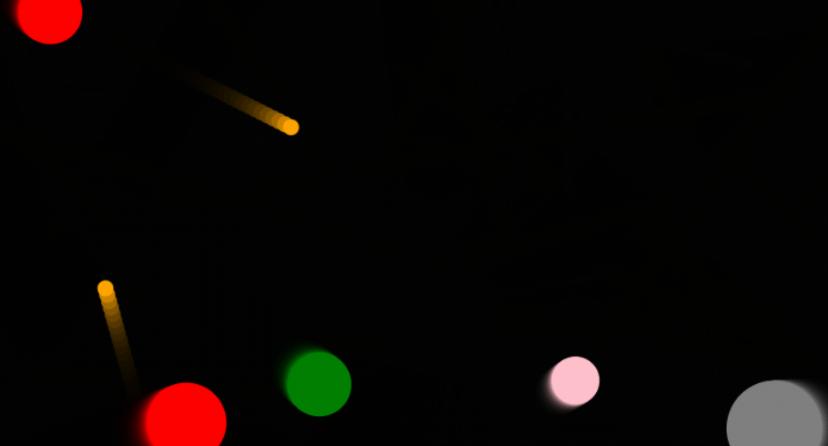

# 创建游戏界面（js制作游戏）

- 作者：yxc
- 链接：https://www.acwing.com/activity/content/72/
- B站：https://www.bilibili.com/video/BV11q4y1g7eD
- 来源：AcWing
- 著作权归作者所有。商业转载请联系作者获得授权，非商业转载请注明出处。

<!-- @import "[TOC]" {cmd="toc" depthFrom=3 depthTo=3 orderedList=false} -->

<!-- code_chunk_output -->

- [个人心得](#个人心得)
- [课程概述](#课程概述)

<!-- /code_chunk_output -->

细分目录：

<!-- @import "[TOC]" {cmd="toc" depthFrom=3 depthTo=4 orderedList=false} -->

<!-- code_chunk_output -->

- [个人心得](#个人心得)
  - [将 js/dist 放入 .gitignore](#将-jsdist-放入-gitignore)
  - [似乎存在一个 bug](#似乎存在一个-bug)
- [课程概述](#课程概述)
  - [将js改成模块化引用](#将js改成模块化引用)
  - [搭建 playground 骨架](#搭建-playground-骨架)
  - [游戏第一步，简易引擎](#游戏第一步简易引擎)
  - [游戏第二步，开发](#游戏第二步开发)

<!-- /code_chunk_output -->

### 个人心得

代码：
- https://git.acwing.com/PiperLiu/acapp

展示：
- http://49.232.99.41:8000/

#### 将 js/dist 放入 .gitignore

```git
**/__pycache__
*.swp

# 编译或打包后文件不应被 git
# 应该将编译/打包方法写在 README 中
game/static/js/dist/*
```

个人认为（或者说个人习惯），编译或打包后文件不应被 `git` ，因为不是源代码或配置文件。应该将编译/打包方法写在 `README` 中，让开发者自行编译/打包。

#### 似乎存在一个 bug



如上，玩家死亡后还可以发射火球。

我建立了一个 [issue](https://git.acwing.com/PiperLiu/acapp/-/issues/1) 。在 y 总那也提了一个 [issue](https://git.acwing.com/yxc/acapp/-/issues/1) 。

以及一个 [pr](https://git.acwing.com/PiperLiu/acapp/-/merge_requests/1/diffs?commit_id=484ff5ac1eb4b94f54851b8239e36331059d6c4e) 。

解决思路是，在 `on_destroy()` 时解除事件监听绑定。这就是需要在绑定时记录这些监听。

`game/static/js/src/playground/player/zbase.js` 原来是：

```js
class Player extends AcGameObject {
    constructor(playground, x, y, radius, color, speed, is_me) {
        super();
        this.playground = playground;
        this.ctx = this.playground.game_map.ctx;
        this.x = x;
        this.y = y;
        this.vx = 0;
        this.vy = 0;
        this.damage_x = 0;
        this.damage_y = 0;
        this.damage_speed = 0;
        this.move_length = 0;
        this.radius = radius;
        this.color = color;
        this.speed = speed;
        this.is_me = is_me;
        this.eps = 0.1;
        this.friction = 0.9;
        this.spent_time = 0;

        this.cur_skill = null;
    }

    start() {
        if (this.is_me) {
            this.add_listening_events();
        } else {
            let tx = Math.random() * this.playground.width;
            let ty = Math.random() * this.playground.height;
            this.move_to(tx, ty);
        }
    }

    add_listening_events() {
        let outer = this;
        this.playground.game_map.$canvas.on("contextmenu", function() {
            return false;
        });
        this.playground.game_map.$canvas.mousedown(function(e) {
            if (e.which === 3) {
                outer.move_to(e.clientX, e.clientY);
            } else if (e.which === 1) {
                if (outer.cur_skill === "fireball") {
                    outer.shoot_fireball(e.clientX, e.clientY);
                }

                outer.cur_skill = null;
            }
        });

        $(window).keydown(function(e) {
            if (e.which === 81) {  // q
                outer.cur_skill = "fireball";
                return false;
            }
        });
    }

    shoot_fireball(tx, ty) {
        let x = this.x, y = this.y;
        let radius = this.playground.height * 0.01;
        let angle = Math.atan2(ty - this.y, tx - this.x);
        let vx = Math.cos(angle), vy = Math.sin(angle);
        let color = "orange";
        let speed = this.playground.height * 0.5;
        let move_length = this.playground.height * 1;
        new FireBall(this.playground, this, x, y, radius, vx, vy, color, speed, move_length, this.playground.height * 0.01);
    }

    get_dist(x1, y1, x2, y2) {
        let dx = x1 - x2;
        let dy = y1 - y2;
        return Math.sqrt(dx * dx + dy * dy);
    }

    move_to(tx, ty) {
        this.move_length = this.get_dist(this.x, this.y, tx, ty);
        let angle = Math.atan2(ty - this.y, tx - this.x);
        this.vx = Math.cos(angle);
        this.vy = Math.sin(angle);
    }

    is_attacked(angle, damage) {
        for (let i = 0; i < 20 + Math.random() * 10; i ++ ) {
            let x = this.x, y = this.y;
            let radius = this.radius * Math.random() * 0.1;
            let angle = Math.PI * 2 * Math.random();
            let vx = Math.cos(angle), vy = Math.sin(angle);
            let color = this.color;
            let speed = this.speed * 10;
            let move_length = this.radius * Math.random() * 5;
            new Particle(this.playground, x, y, radius, vx, vy, color, speed, move_length);
        }
        this.radius -= damage;
        if (this.radius < 10) {
            this.destroy();
            return false;
        }
        this.damage_x = Math.cos(angle);
        this.damage_y = Math.sin(angle);
        this.damage_speed = damage * 100;
        this.speed *= 0.8;
    }

    update() {
        this.spent_time += this.timedelta / 1000;
        if (!this.is_me && this.spent_time > 4 && Math.random() < 1 / 300.0) {
            let player = this.playground.players[Math.floor(Math.random() * this.playground.players.length)];
            let tx = player.x + player.speed * this.vx * this.timedelta / 1000 * 0.3;
            let ty = player.y + player.speed * this.vy * this.timedelta / 1000 * 0.3;
            this.shoot_fireball(tx, ty);
        }

        if (this.damage_speed > 10) {
            this.vx = this.vy = 0;
            this.move_length = 0;
            this.x += this.damage_x * this.damage_speed * this.timedelta / 1000;
            this.y += this.damage_y * this.damage_speed * this.timedelta / 1000;
            this.damage_speed *= this.friction;
        } else {
            if (this.move_length < this.eps) {
                this.move_length = 0;
                this.vx = this.vy = 0;
                if (!this.is_me) {
                    let tx = Math.random() * this.playground.width;
                    let ty = Math.random() * this.playground.height;
                    this.move_to(tx, ty);
                }
            } else {
                let moved = Math.min(this.move_length, this.speed * this.timedelta / 1000);
                this.x += this.vx * moved;
                this.y += this.vy * moved;
                this.move_length -= moved;
            }
        }
        this.render();
    }

    render() {
        this.ctx.beginPath();
        this.ctx.arc(this.x, this.y, this.radius, 0, Math.PI * 2, false);
        this.ctx.fillStyle = this.color;
        this.ctx.fill();
    }

    on_destroy() {
        for (let i = 0; i < this.playground.players.length; i ++ ) {
            if (this.playground.players[i] === this) {
                this.playground.players.splice(i, 1);
            }
        }
    }
}
```

我修改的后：
```js
class Player extends AcGameObject {
    constructor(playground, x, y, radius, color, speed, is_me) {
        super();
        this.playground = playground;
        this.ctx = this.playground.game_map.ctx;
        this.x = x;
        this.y = y;
        this.vx = 0;
        this.vy = 0;
        this.damage_x = 0;
        this.damage_y = 0;
        this.damage_speed = 0;
        this.move_length = 0;
        this.radius = radius;
        this.color = color;
        this.speed = speed;
        this.is_me = is_me;
        this.eps = 0.1;
        this.friction = 0.9;
        this.spent_time = 0;

        this.cur_skill = null;

        this.unbinded_funcs = []
    }

    start() {
        if (this.is_me) {
            this.add_listening_events();
        } else {
            let tx = Math.random() * this.playground.width;
            let ty = Math.random() * this.playground.height;
            this.move_to(tx, ty);
        }
    }

    add_listening_events() {
        let outer = this;
        this.playground.game_map.$canvas.on("contextmenu", function () {
            return false;
        });

        let canvas_mousedown = function (e) {
            if (e.which === 3) {
                outer.move_to(e.clientX, e.clientY);
            } else if (e.which === 1) {
                if (outer.cur_skill === "fireball") {
                    outer.shoot_fireball(e.clientX, e.clientY);
                }

                outer.cur_skill = null;
            }
        }
        this.playground.game_map.$canvas.mousedown(canvas_mousedown);
        let unbind_canvas_mousedown = () => {
            this.playground.game_map.$canvas.unbind('mousedown', canvas_mousedown)
        }
        this.unbinded_funcs.push(unbind_canvas_mousedown)

        let window_keydown_q = function (e) {
            if (e.which === 81) {  // q
                outer.cur_skill = "fireball";
                return false;
            }
        }
        $(window).keydown(window_keydown_q);
        let unbind_window_keydown_q = () => {
            $(window).unbind('keydown', window_keydown_q)
        }
        this.unbinded_funcs.push(unbind_window_keydown_q)
    }

    shoot_fireball(tx, ty) {
        let x = this.x, y = this.y;
        let radius = this.playground.height * 0.01;
        let angle = Math.atan2(ty - this.y, tx - this.x);
        let vx = Math.cos(angle), vy = Math.sin(angle);
        let color = "orange";
        let speed = this.playground.height * 0.5;
        let move_length = this.playground.height * 1;
        new FireBall(this.playground, this, x, y, radius, vx, vy, color, speed, move_length, this.playground.height * 0.01);
    }

    get_dist(x1, y1, x2, y2) {
        let dx = x1 - x2;
        let dy = y1 - y2;
        return Math.sqrt(dx * dx + dy * dy);
    }

    move_to(tx, ty) {
        this.move_length = this.get_dist(this.x, this.y, tx, ty);
        let angle = Math.atan2(ty - this.y, tx - this.x);
        this.vx = Math.cos(angle);
        this.vy = Math.sin(angle);
    }

    is_attacked(angle, damage) {
        for (let i = 0; i < 20 + Math.random() * 10; i++) {
            let x = this.x, y = this.y;
            let radius = this.radius * Math.random() * 0.1;
            let angle = Math.PI * 2 * Math.random();
            let vx = Math.cos(angle), vy = Math.sin(angle);
            let color = this.color;
            let speed = this.speed * 10;
            let move_length = this.radius * Math.random() * 5;
            new Particle(this.playground, x, y, radius, vx, vy, color, speed, move_length);
        }
        this.radius -= damage;
        if (this.radius < 10) {
            this.destroy();
            return false;
        }
        this.damage_x = Math.cos(angle);
        this.damage_y = Math.sin(angle);
        this.damage_speed = damage * 100;
        this.speed *= 0.8;
    }

    update() {
        this.spent_time += this.timedelta / 1000;
        if (!this.is_me && this.spent_time > 4 && Math.random() < 1 / 300.0) {
            let player = this.playground.players[Math.floor(Math.random() * this.playground.players.length)];
            let tx = player.x + player.speed * this.vx * this.timedelta / 1000 * 0.3;
            let ty = player.y + player.speed * this.vy * this.timedelta / 1000 * 0.3;
            this.shoot_fireball(tx, ty);
        }

        if (this.damage_speed > 10) {
            this.vx = this.vy = 0;
            this.move_length = 0;
            this.x += this.damage_x * this.damage_speed * this.timedelta / 1000;
            this.y += this.damage_y * this.damage_speed * this.timedelta / 1000;
            this.damage_speed *= this.friction;
        } else {
            if (this.move_length < this.eps) {
                this.move_length = 0;
                this.vx = this.vy = 0;
                if (!this.is_me) {
                    let tx = Math.random() * this.playground.width;
                    let ty = Math.random() * this.playground.height;
                    this.move_to(tx, ty);
                }
            } else {
                let moved = Math.min(this.move_length, this.speed * this.timedelta / 1000);
                this.x += this.vx * moved;
                this.y += this.vy * moved;
                this.move_length -= moved;
            }
        }
        this.render();
    }

    render() {
        this.ctx.beginPath();
        this.ctx.arc(this.x, this.y, this.radius, 0, Math.PI * 2, false);
        this.ctx.fillStyle = this.color;
        this.ctx.fill();
    }

    on_destroy() {
        for (let i = 0; i < this.unbinded_funcs.length; i ++) {
            this.unbinded_funcs[i]()
        }
        this.unbinded_funcs = []

        for (let i = 0; i < this.playground.players.length; i++) {
            if (this.playground.players[i] === this) {
                this.playground.players.splice(i, 1);
            }
        }
    }
}
```

### 课程概述

#### 将js改成模块化引用

在 ES6 之前（ ES6 可以理解为 `JavaScript` 版本），我们不能直接像 `Python` 一样 `import` ，需要依靠 `RequireJS` 或者 `seaJS` 。

现在各大浏览器都很好地支持 ES6 了，因此这里我们和 y 总把引用方式改成了 `import` 。（这里 y 总做出改动估计是为了以后上打包工具 `webpack` 做铺垫？）

因此这里 `acapp/game/templates/multiends/web.html` 由

```html


<head>
    <link rel="stylesheet" href="https://cdn.acwing.com/static/jquery-ui-dist/jquery-ui.min.css">
    <script src="https://cdn.acwing.com/static/jquery/js/jquery-3.3.1.min.js"></script>
    <link rel="stylesheet" href="">
    <script src=""></script>
</head>

<body style="margin: 0">
    <div id="ac_game_12345678"></div>
    <script>
        $(document).ready(function(){
            let ac_game = new AcGame("ac_game_12345678");
        });
    </script>
</body>
```

改为

```html


<head>
    <link rel="stylesheet" href="https://cdn.acwing.com/static/jquery-ui-dist/jquery-ui.min.css">
    <script src="https://cdn.acwing.com/static/jquery/js/jquery-3.3.1.min.js"></script>
    <link rel="stylesheet" href="">
</head>

<body style="margin: 0">
    <div id="ac_game_12345678"></div>
    <script type="module">
        import { AcGame } from ""
        $(document).ready(function(){
            let ac_game = new AcGame("ac_game_12345678");
        });
    </script>
</body>
```

然后注意，我们需要让 `AcGame` 对象暴露（`export`）出来，给别的 `js` 文件 `import` 。

`game/static/js/src/zbase.js`：

```js
export class AcGame {
    constructor(id) {
        this.id = id;
        this.$ac_game = $('#' + id);
        // this.menu = new AcGameMenu(this);  // 这节课先忽略页面
        this.playground = new AcGamePlayground(this);

        this.start();
    }

    start() {
    }
}
```

#### 搭建 playground 骨架

`game/static/js/src/playground/zbase.js`

```js
class AcGamePlayground {
    constructor(root) {
        this.root = root;
        this.$playground = $(`<div class="ac-game-playground"></div>`);

        // this.hide();  // 本节课注释掉
        this.root.$ac_game.append(this.$playground);
```

更改 `css` 。

```css
.ac-game-playground {
    width: 100%;
    height: 100%;
    user-select: none;
}
```

#### 游戏第一步，简易引擎

`game/static/js/src/playground/ac_game_object/zbase.js`

总的思路就是，我们制作游戏是基于快速运算和渲染的，因此我们创建一个基类 `AcGameObject` 配合上述行为。

```js
let AC_GAME_OBJECTS = [];

class AcGameObject {
    constructor() {
        AC_GAME_OBJECTS.push(this);

        this.has_called_start = false;  // 是否执行过start函数
        this.timedelta = 0;  // 当前帧距离上一帧的时间间隔
    }

    ...
}
```

设置全局 `AC_GAME_OBJECTS` 列表以及为了通过时间渲染（不同浏览器渲染帧数不同，因此为了兼容多人游戏必须通过时间做渲染运算而非帧）给每个实例设置 `has_called_start` 和 `timedelta` 很巧妙。

我们刷新 `AC_GAME_OBJECTS` 中的对象就好，如下。

```js
let last_timestamp;
let AC_GAME_ANIMATION = function (timestamp) {
    for (let i = 0; i < AC_GAME_OBJECTS.length; i++) {
        let obj = AC_GAME_OBJECTS[i];
        if (!obj.has_called_start) {
            obj.start();
            obj.has_called_start = true;
        } else {
            obj.timedelta = timestamp - last_timestamp;
            obj.update();
        }
    }
    last_timestamp = timestamp;

    requestAnimationFrame(AC_GAME_ANIMATION);
}


requestAnimationFrame(AC_GAME_ANIMATION);
```

#### 游戏第二步，开发

给 `playground` 再细分，方便开发。

```
.
|-- ac_game_object
|   `-- zbase.js
|-- game_map
|   `-- zbase.js
|-- particle
|   `-- zbase.js
|-- player
|   `-- zbase.js
|-- skill
|   `-- fireball
|       `-- zbase.js
`-- zbase.js
```

这里不详记 `canvas`相关 API 。

